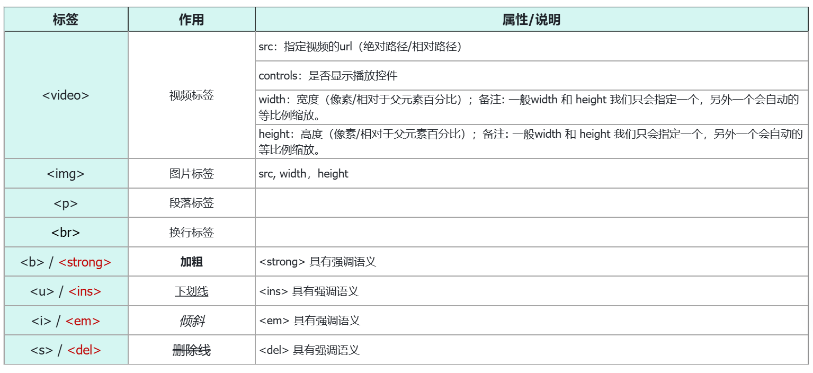
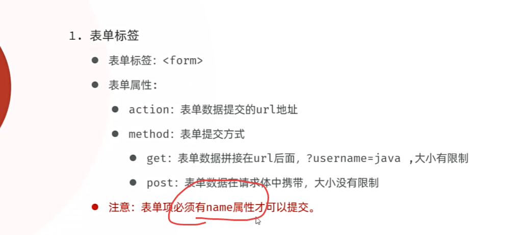
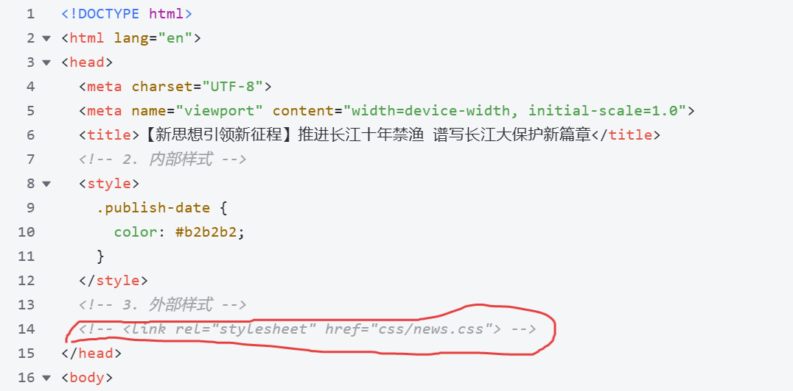
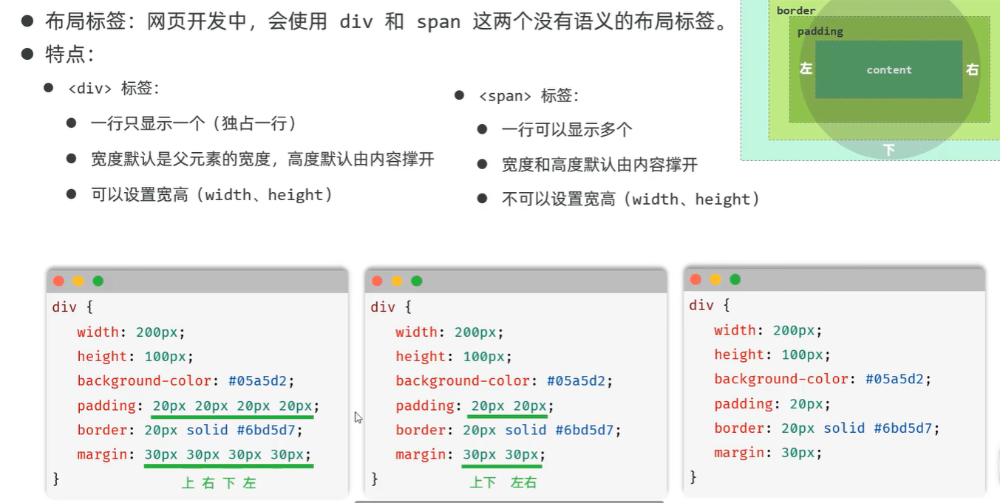

## HTML

### 标签

1. 标题标签

h1为一级标题，字体也是最大的 ； h6为六级标题，字体是最小的。

HTML标签是预定义好的，不能随意定义，也就以为着，标题标签就只有这六个，没有 <h7>

2. 超链接`<a>`

属性：

- href: 指定资源访问的url
- target: 指定在何处打开资源链接
  - _self: 默认值，在当前页面打开
  - _blank: 在空白页面打开

3. `<span>`

无意义，通常配合css使用

4. 常用标签



5. 在HTML页面中，我们在代码中录入空格、<、> 这些符号的时候，是没有对应的效果的，因为浏览器并不能准确的识别，此时，我们就需要通过字符实体来表示空格，<, > 。常见符号的字符实体如下：

| 字符实体              | 属性/说明 |
| --------------------- | --------- |
| `&nbsp;`              | 空格      |
| `&lt;`-->less than    | <         |
| `&gt;`-->greater than | >         |

### 表单标签



==表单也可以当做盒子调整边距==

#### 表单项标签

在一个表单中，可以存在很多的表单项，而虽然表单项的形式各式各样，但是表单项的标签其实就只有三个，分别是：

- `<input>`: 表单项 , 通过type属性控制输入形式。

| type取值                 | 描述                                 |
| ------------------------ | ------------------------------------ |
| text                     | 默认值，定义单行的输入字段           |
| password                 | 定义密码字段                         |
| radio                    | 定义单选按钮                         |
| checkbox                 | 定义复选框                           |
| file                     | 定义文件上传按钮                     |
| date/time/datetime-local | 定义日期/时间/日期时间               |
| number                   | 定义数字输入框                       |
| email                    | 定义邮件输入框                       |
| hidden                   | 定义隐藏域                           |
| submit / reset / button  | 定义提交按钮 / 重置按钮 / 可点击按钮 |

- `<select>`: 定义下拉列表, `<option>` 定义列表项
- `<textarea>`: 文本域

属性：

- value：表单项提交的==值==，建议提交数字

- name：表单项提交的==变量名==。同一组单选或复选，必须name相同

`<lable>`标签包裹一个表单项，可以使用户点击文字就触发单选或多选

### 表格标签

| 标签      | 描述                                |
| --------- | ----------------------------------- |
| `<table>` | 定义表格整体                        |
| `<thead>` | 用于定义表格头部(可选)              |
| `<tbody>` | 定义表格中的主体部分(可选)          |
| `<tr>`    | 表格的行，可以包裹多个` <td>，<th>` |
| `<td>`    | 表格单元格(普通)，可以包裹内容      |
| `<th>`    | 表头单元格                          |

## CSS

### CSS引入方式

那在HTML的文件中，我们如何来编写CSS样式呢，此时就涉及到CSS的三种引入方式。

具体有3种引入方式，语法如下表格所示：

| 名称     | 语法描述                                                | 示例                                          |
| -------- | ------------------------------------------------------- | --------------------------------------------- |
| 行内样式 | 在标签内使用style属性，属性值是css属性键值对。          | `<h1 style="xxx:xxx;">中国新闻网</h1>`        |
| 内部样式 | 定义`<style>`标签，在标签内部定义css样式。              | `<style> h1 {...} </style>`                   |
| 外部样式 | 定义==单标签==`<link>`标签，通过href属性引入外部css文件 | `<link rel="stylesheet" href="css/news.css">` |

对于上述3种引入方式，企业开发的使用情况如下：

- **行内样式：**会出现大量的代码冗余，不方便后期的维护，所以不常用（常配合JS使用）。
- **内部样式：**通过定义css选择器，让样式作用于当前页面的指定的标签上。（可以写在页面任何位置，但通常约定写在head标签中）
- **外部样式：**html和css实现了完全的分离，企业开发常用方式。
  - css文件中不含`<style>`
  - 直接在`<head>`内使用`<link>`，不用写`<style>`




### 颜色表示方式

在前端程序开发中，颜色的表示方式常见的有如下三种：

| 表示方式       | 属性值           | 说明                                                  | 取值                                        |
| -------------- | ---------------- | ----------------------------------------------------- | ------------------------------------------- |
| 关键字         | 颜色英文单词     | red、green、blue                                      | red、green、blue...                         |
| rgb表示法      | rgb(r, g, b)     | 红绿蓝三原色，每项取值范围：0-255                     | rgb(0,0,0)、rgb(255,255,255)、rgb(255,0,0)  |
| rgba表示法     | rgba(r, g, b, a) | 红绿蓝三原色，a表示透明度，取值：0-1-->**越低越透明** | rgb(0,0,0,0.3)、rgb(255,255,255,0.5)        |
| 十六进制表示法 | #rrggbb          | #开头，将数字转换成十六进制表示                       | #000000、#ff0000、#cccccc，简写：#000、#ccc |


### CSS选择器

顾名思义：选择器是选取需设置样式的元素（标签），但是我们根据业务场景不同，选择的标签的需求也是多种多样的，所以选择器有很多种。

**选择器通用语法如下**：

```CSS
选择器名   {
    css样式名：css样式值;
    css样式名：css样式值;
}
```

而我们是做后台开发的，所以对于css选择器，我们只学习常见的这几种：


- id是一个元素的唯一标识，如果想要单独为一个元素设计样式，则为元素设置一个id-->id是字符串，不是数字

- 优先级：行内样式>id选择器>类选择器>元素选择器

### 盒子模型

##### 介绍

- 盒子：页面中所有的元素（标签），都可以看做是一个 盒子，由盒子将页面中的元素包含在一个矩形区域内，通过盒子的视角更方便的进行页面布局。
- 盒子模型组成：内容区域（content）、内边距区域（padding）、边框区域（border）、外边距区域（margin）。


盒子的大小，其实就包括三个部分： border、padding、content，而margin外边距是不包括在盒子之内的。



- width、height:

  - 默认情况下，==定义的高宽的是content==

  - 若要使高宽指向其他区域，用样式`box-sizing`

- 边距：属性名+位置，如margin-top
  - auto:一般是居中

==表单也可以当做盒子调整边距==

### flex弹性布局


## 注意事项

1. src用绝对磁盘路径`D:/xxx`时，无法用实时服务器显示，需要用默认浏览器。网络路径无影响
2. 相对路径
   - ./：当前目录，可省略
   - ../：上一级目录

3. alt+p 唤醒ai辅助功能，不能有敏感词