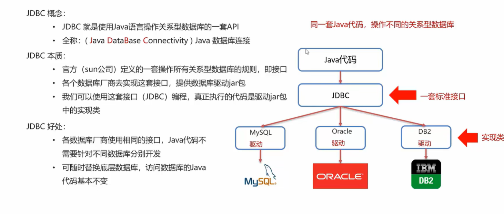
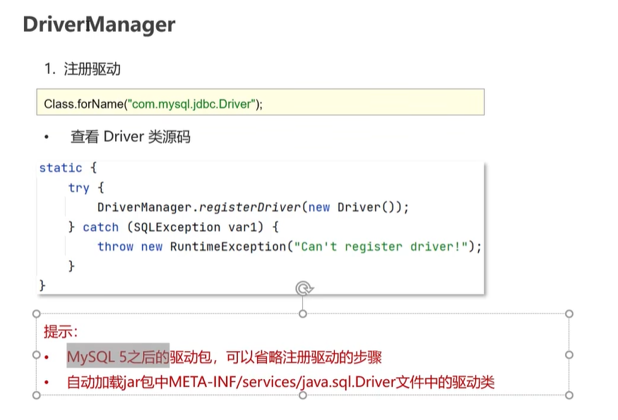
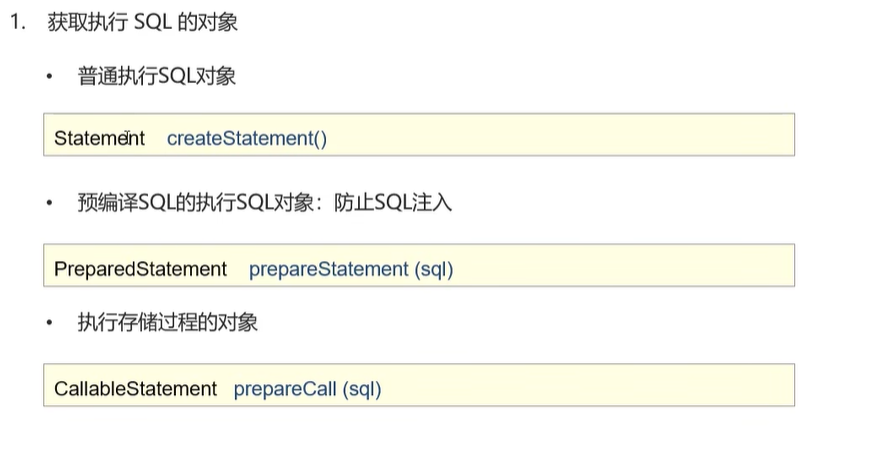
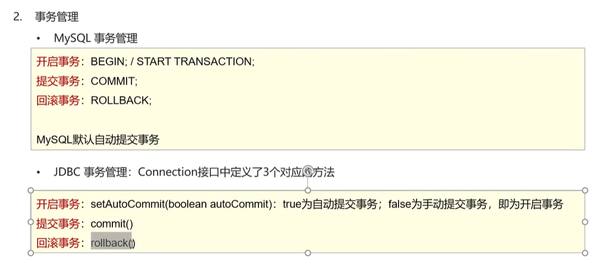
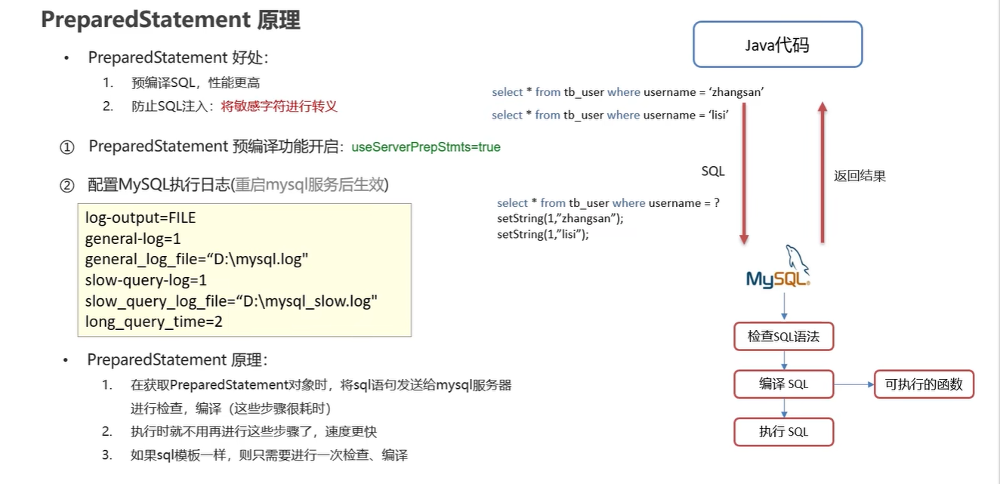
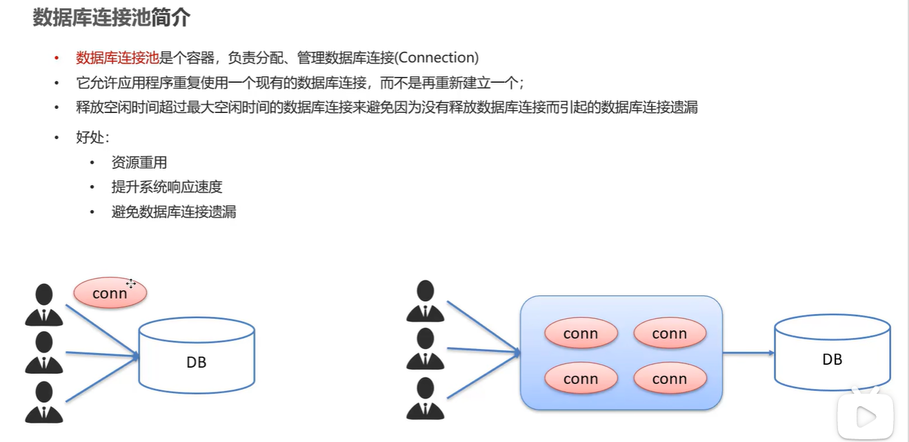
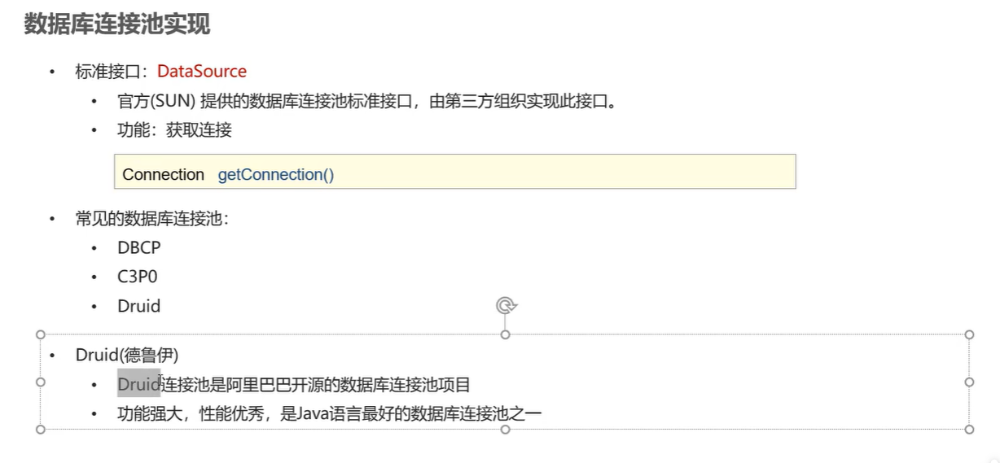

## JDBC简介




## 步骤


## api详解

### DriverManager

驱动管理类

作用：

1. 注册驱动

   

2. 获取连接

   url:要写到==数据库==

   


### Connection

与数据库的连接/会话

1. 获取 执行sql的对象

   

2. 事务管理

   

   用异常处理机制完成事务的回滚

   ```java
   try {
       // 开启事务
       conn.setAutoCommit(false);
       // 执行sql
       int count1 = stmt.executeUpdate(sql1); // 受影响的行数
       // 处理结果
       System.out.println(count1);
   
       // 执行sql
       int count2 = stmt.executeUpdate(sql2); // 受影响的行数
       // 处理结果
       System.out.println(count2);
   
       // 提交事务
       conn.commit();
   } catch (Exception throwables) {
       // 回滚事务
       conn.rollback();
       throwables.printStackTrace();
   }
   ```

   

### Statement

执行sql语句

**方法**：

- `int executeUpdate(sql)`：执行DML、DDL语句

  返回值：

  (1) DML语句影响的行数-->通过是否大于0，判断成功、失败

  (2) DDL语句执行后，执行成功也可能返回0

- `ResultSet executeQuery(sql)`：执行DQL语句

  返回值：ResultSet结果集对象

### ResultSet

封装了DQL查询语句的结果

**获取查询结果**：

- `boolean next()`：将光标从当前位置向前移动一行并判断该行是否为有效行-->游标默认指向数据行的上一行

  返回值：

  - `true`：有效行，当前行有数据
  - `false`：无效行，当前行没有数据

- `xxx getXxx(String/int arg)`：获取数据

  - `xxx`：数据类型，如：`int getInt(参数)`；`String getString(参数)`
  - 参数：
    - `int`：列的编号，==从1开始==
    - `String`：列的名称

常见用法：

```java
//循环判断游标是否为最后一行末尾
while(rs.next()){
	//获取数据
	int id = rs.getInt(1);
	String name = rs.getString(2);
	double money = rs.getDoublt(3);
	
	System.out.println(id + "," + name + "," + money);
}
```

### PreparedStatement

==接口==，表示预编译的sql对象

SQL注入：通过操作输入来修改事先定义好的SQL语句，用以达到执行代码对服务器进行攻击的方法。

**作用**：

1. 预编译SQL语句并执行，效率更高
1. 预防SQL注入问题：将敏感字符进行转义


**如何预防sql注入：**

`setString()`遇到 ‘ 会转义，`' or '1' = '1` 会转义为 `\' or \'1\' = \'1`

```java
//登录逻辑
@Test
public void testResultSet() throws Exception {
    // 获取连接：如果连接的是本机mysql并且端口是默认的 3306 可以简化书写
    String url = "jdbc:mysql:///db1?useSSL=false";
    String username = "root";
    String password = "1234";
    Connection conn = DriverManager.getConnection(url, username, password);

    // 接收用户输入 用户名和密码：
    String name = "zhangsan";
    String pwd = "123";

    String sql = "select * from tb_user where username = '" + name + "' and password = '" + pwd + "'";

    // 获取stmt对象
    Statement stmt = conn.createStatement();

    // 执行sql
    ResultSet rs = stmt.executeQuery(sql);

    // 判断登录是否成功
    if(rs.next()){
        System.out.println("登录成功~");
    }else{
        System.out.println("登录失败~");
    }
    
    //释放资源
    rs.close();
    stmt.close();
    conn.close();
}
```


sql注入：

```java
password = ' or '1' = '1;

//原本
sql = "select * from tb_user where username = '" + name + "' and password = '" + pwd + "'";
//sql注入后
sql = "select * from tb_user where username = '' and password = '' or '1' = '1'";

//and比or先执行
//sql执行时，where后的条件一定为true
select * from tb_user where username = '' and password = '' or '1' = '1'
```

**预编译原理**

预编译功能默认关闭

- 首先配置mysql执行文件my.ini，在最后加入图片所示代码
- 然后在获取Connection对象时，参数url后加`&useServerPreStmt=ture`




### 总结

Connection,Statement,PreparedStatement,Result都需要释放对象


## 数据库连接池

数据库连接遗漏：某个连接被一直占用，以至于数据库长时间没有可用连接



释放空闲时间超过最大空闲时间的连接，来避免因为没有释放连接而引起的数据库连接遗漏

- 客户端获取到Connection对象了，但是Connection对象并没有去访问数据库(处于空闲)，数据库连接池发现Connection对象的空闲时间 > 连接池中预设的最大空闲时间，此时数据库连接池就会自动释放掉这个连接对象




**Druid使用步骤：**

```java
// 1. 导入jar包
// 2. 定义配置文件

// 3. 加载配置文件
Properties prop = new Properties();
prop.load(new FileInputStream("jdbc-demo/src/druid.properties"));

// 4. 获取连接池对象
DataSource dataSource = DruidDataSourceFactory.createDataSource(prop);

// 5. 获取数据库连接 Connection
Connection connection = dataSource.getConnection();
System.out.println(connection);
```

配置文件：

```properties
# 配置文件properties
driverClassName=com.mysql.jdbc.Driver
url=jdbc:mysql:///db1?useSSL=false&useServerPrepStmts=true
username=root
password=1234
# 初始化连接数量
initialSize=5
# 最大连接数
maxActive=10
# 最大等待时间
maxWait=3000
```

