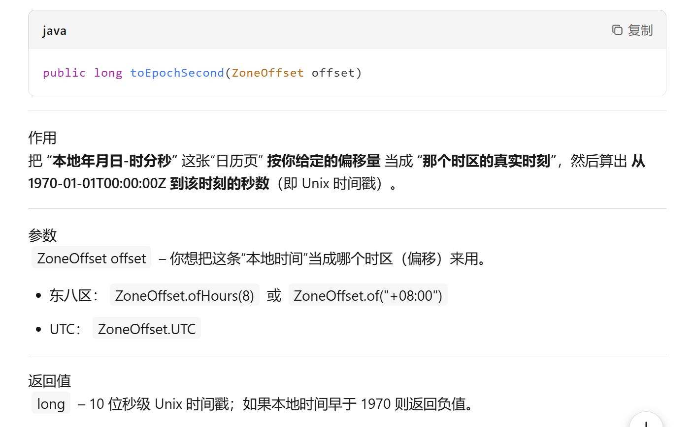
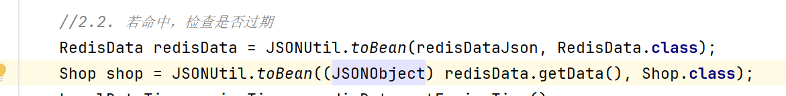
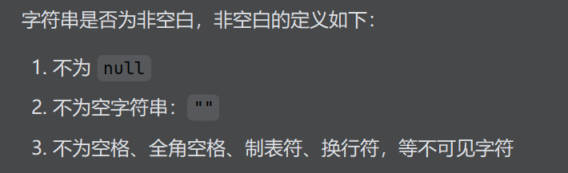

### TimeUnit

- 时间单位的换算
- TimeUnit.MINUTES表示分钟
- TimeUnit.toSeconds(TimeUnit time)：将时间转换为秒


### LocalDataTime

静态方法

- now().plusSeconds(TimeUnit time)：在当前时间基础上加一些时间
- of()：生成特定时间的时间对象

普通方法

- long  toEpochSecond(时区)：计算时间戳。将LocalDateTime对象转换为long类型的秒数



==时间戳== ：从某个公认起点到某一时刻所经过秒/毫秒数

==时间起点无时区，各时区时间戳不一致，获取时间戳时必须指定时区==


### Hutool

#### BeanUtil

- beanToMap：将对象转为map。
  - 可以指定转换方式，如long类型的属性转为map中的string类型
- fillBeanWithMap：将map转为bean
- copyProperties：将对象转为dto


#### RandomUtil

- randomNumbers：生成随机数，可以指定位数
- randomString


#### JSONUtil

- toBean（json,类的类型）：将json转为bean

  - 第一个参数时String或==JSONObject==类型

    

  

- toJsonStr：将bean转为json


#### BooleanUtil

- isTrue：判断参数是否为true-->参数可能为null


#### UUID

UUID有多个，这里时hutool包中的UUID

- randomUUID.toString(true)：可以将UUID转为String并去掉`_`


### StrUtil

- isBlank：判断是字符串是否为空或null
- isNotBlank：




### Function

`Function<T, R>` 是一个**函数式接口**，表示一个**接收一个参数并返回一个结果的函数**。

- `T`：输入参数的类型  
- `R`：返回结果的类型

---

#### 核心方法

```java
R apply(T t);
```

这是 `Function` 的唯一抽象方法，**接收一个参数，返回一个结果**。

---

####  示例代码

```java
import java.util.function.Function;

public class Main {
    public static void main(String[] args) {
        Function<Integer, String> intToString = i -> "Number: " + i;

        String result = intToString.apply(42);
        System.out.println(result);  // 输出：Number: 42
    }
}
```

---

#### 常用默认方法（链式操作）

| 方法名                     | 说明                            |
| -------------------------- | ------------------------------- |
| `andThen(Function after)`  | 先执行当前函数，再执行 `after`  |
| `compose(Function before)` | 先执行 `before`，再执行当前函数 |

#### 示例：

```java
Function<Integer, Integer> multiply = x -> x * 2;
Function<Integer, Integer> add = x -> x + 3;

Function<Integer, Integer> combined = multiply.andThen(add);
System.out.println(combined.apply(5));  // 输出：13
```

####  总结

Function<T, R>` 是 Java 中用于表示“**一个参数进，一个结果出**”的函数式接口，是 Lambda 表达式和方法引用的核心载体之一。


### `Class<T>`

`Class<T>` 是 Java 反射机制的核心入口，**表示“运行中的类型信息”**。每一个 `.java` 文件被编译成 `.class` 字节码后，JVM 在加载它时都会生成一个 **唯一的 `Class<T>` 对象**，用来封装这个类型的**元数据**（字段、方法、构造器、注解、泛型签名等）。

---

####  1. 获取 `Class<T>` 对象的 4 种方式

```java
// 1. 类字面量（最简洁，编译期检查）
Class<String> c1 = String.class;

// 2. 实例.getClass()
String s = "hello";
Class<?> c2 = s.getClass();

// 3. Class.forName(全限定名)（运行时动态加载）
Class<?> c3 = Class.forName("java.lang.String");

// 4. 类加载器加载（很少用）
Class<?> c4 = ClassLoader.getSystemClassLoader().loadClass("java.lang.String");
```

---

#### 2. 常用 API 速览

| 分类         | 关键方法                                                     | 说明                                 |
| ------------ | ------------------------------------------------------------ | ------------------------------------ |
| **名称信息** | `getName()` / `getSimpleName()` / `getCanonicalName()`       | 全限定名、简名、规范名               |
| **类型判断** | `isInterface()` / `isEnum()` / `isArray()` / `isPrimitive()` / `isAnnotation()` | 运行期类型判别                       |
| **继承关系** | `getSuperclass()` / `getInterfaces()`                        | 父类、直接接口                       |
| **构造器**   | `getConstructor(Class...)` / `getDeclaredConstructor(...)`   | 公有空参、任意修饰符                 |
| **方法**     | `getMethod(name, paramTypes)` / `getDeclaredMethod(...)`     | 公有/全部方法                        |
| **字段**     | `getField(name)` / `getDeclaredField(name)`                  | 公有/全部字段                        |
| **注解**     | `getAnnotation(Anno.class)` / `getDeclaredAnnotations()`     | 类、字段、方法上的注解               |
| **泛型**     | `getTypeParameters()` / `getGenericSuperclass()`             | 泛型参数、父类泛型实参               |
| **实例化**   | `clazz.getDeclaredConstructor().newInstance()`               | 默认构造器创建对象（JDK9+ 推荐方式） |

---

#### 3. 泛型 `<T>` 的作用

`Class<T>` 中的泛型参数 **在编译期提供类型安全**，避免强制转换。

```java
// 无泛型，返回 Object
Class<?> raw = Class.forName("java.util.ArrayList");
Object obj = raw.getDeclaredConstructor().newInstance();

// 有泛型，返回具体类型
Class<ArrayList<String>> clazz = ArrayList.class;
ArrayList<String> list = clazz.getDeclaredConstructor().newInstance();
```

---

#### 4. 典型应用场景

1. **反射实例化对象**（Spring、MyBatis 等框架）
2. **运行时动态加载驱动**（JDBC 的 `Class.forName("com.mysql.cj.jdbc.Driver")`）
3. **获取泛型实参**（泛型抽象 DAO、Gson 反序列化）
4. **注解处理器**（扫描带 `@Controller` 的类）
5. **序列化/拷贝工具**（Apache Commons BeanUtils、Jackson）

---

#### 5. 小例子：反射调用私有方法

```java
public class Secret {
    private String echo(String msg) { return "Secret: " + msg; }
}

Class<Secret> clazz = Secret.class;
Secret obj = clazz.getDeclaredConstructor().newInstance();

Method m = clazz.getDeclaredMethod("echo", String.class);
m.setAccessible(true);          // 压制 Java 语言访问检查
String result = (String) m.invoke(obj, "hello");
System.out.println(result);     // Secret: hello
```

---

#### 6. 总结

`Class<T>` 是 Java 的“类型身份证”，**运行时唯一**、**反射入口**、**泛型安全**，框架与高级库都离不开它。
