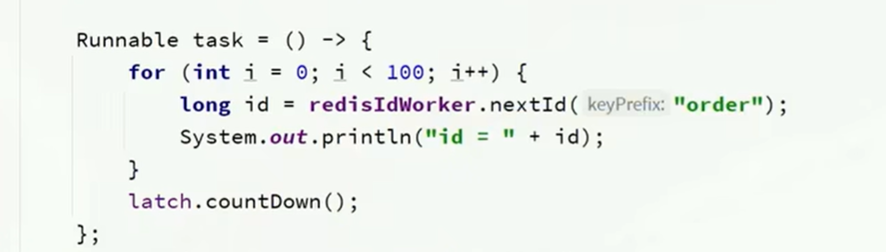

1. Result的字段若为null,则不传递到前端；但' '传递
1. lambda表达式相当于一个匿名内部类的对象实例，可以赋值

3. ctrl + h 可以调出类的继承关系
4. ctrl + shift + u 转为大写
5. springboot提供ClassPathResource类访问资源路径，该类代表resource目录
6. Collections.singleletonList(T o) ：将o转为单元素的集合