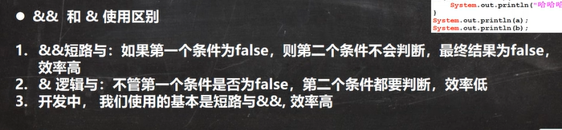
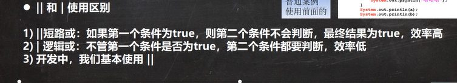
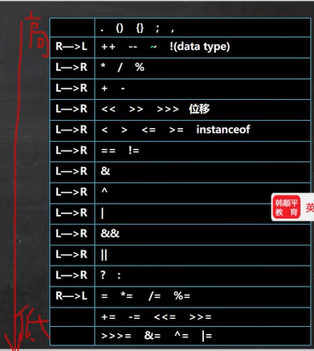
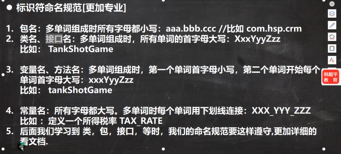
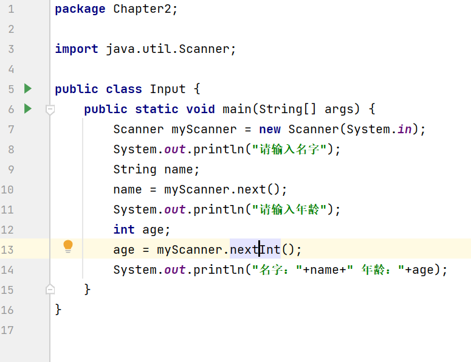
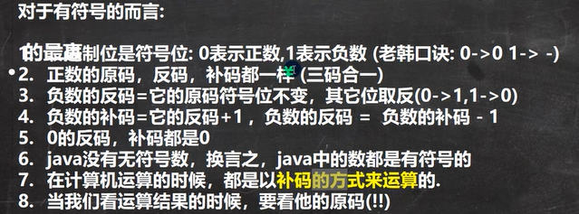
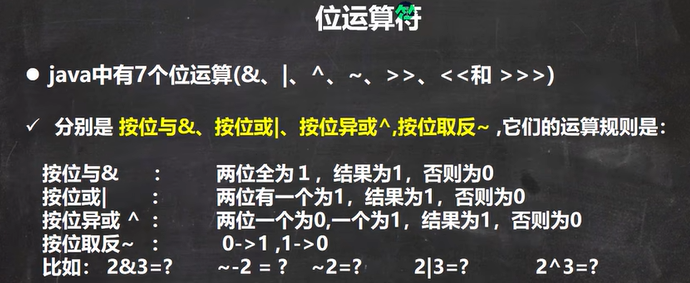
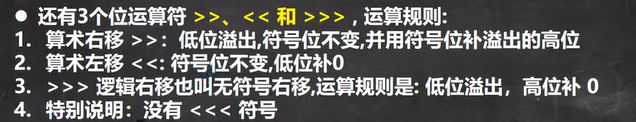

# 第二章 运算符(ArithmeticOperator)

## 1. 算术运算符

1. / :  
   
   - 10/4=2  
   - 10.0/4=2.5  

2. %: a%b=a-(a/b)*b,<mark>当a是小数时，a%b=a-(int)a/b * b</mark>  
   
   - 10%3=1  
   - -10%3=-1  
   - 10%(-3)=1  

3. ++、--  
   
   - 前++，先自增，再运算；后++，现运算，再自增  
   
   - **下述代码很重要**  
     
     ```java
      int i = 1;       
      i = i++;//规则使用临时变量，(1)temp=i++;(2)i=temp;  
      System.out.println(i);//1              
      int i = 1;  
      i = ++i;//(1)temp=++i;(2)i=temp;       
      System.out.println(i)//2       
     ```

## 2. 逻辑运算符

1. 短路与 &&,短路或 ||,取反 !  
2. 逻辑与 &，逻辑或 |，逻辑异或 ^ 


  

## 3. 赋值运算符

- =,+=,...  
- 赋值运算符从右往左运行(先执行右侧，在执行左侧) int num=a+b+c;  
- 复合赋值运算符会进行类型转换  
  
## 4.  三元运算符
1. 基本语法：条件表达式?表达式1:表达式2;  
   - 如果条件表达式为true，则表达式1；否则，表达式2  

## 5. 运算符优先级

  

## 6. 标识符命名规范

1. 凡是自己命名的都是标识符  
      

## 7. 键盘输入

- <mark>用空格可以同时接收两组数据</mark>  
- 步骤  
  1. 导入该类的所在包 java.util.*-->java.util.Scanner) 
  2. 创建该类的对象  
  3. 调用里面的功能  
       
- Scanner的具体方法看[api](https://www.matools.com/api/java11)  
- **接收字符**：scanner.next().charAt(0)  

## 8. 进制

1. 二进制以0b或0B开头  
2. 八进制以0开头  
3. 十六进制以0x或0X开头  
4. 进制转换  
        

## 9. 原码、反码、补码

- **负数的原码变补码或补码变原码，都是按位取反，末尾加1**  
    

## 10. 位运算符

- 对常量的==补码==运算
- 三码转换时符号位不变   
- **^时对补码的符号位一起变**  
      
  
