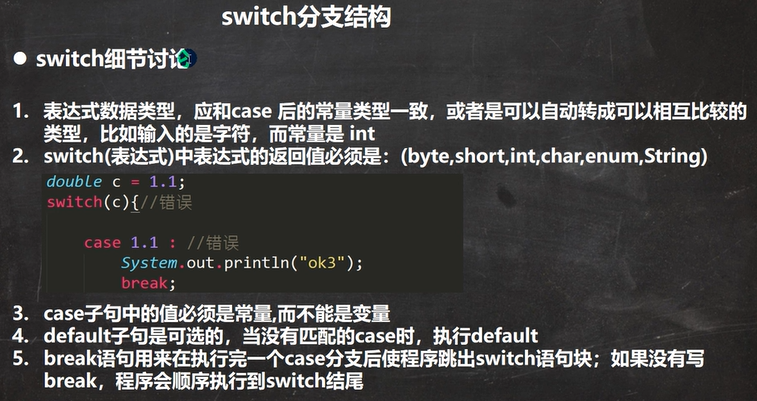
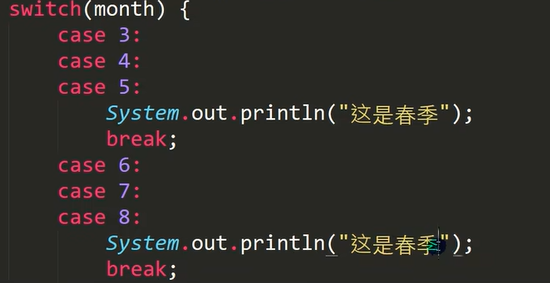

# 第三章 控制结构

## 1.  分支控制

1. if-else  

```java
//单分支  
if(条件表达式（返回boolean）){}  

//双分支  
if(){  
}else{   } 

//多分支  
if(){  
}else if(){}
... 
else{   }

```

2. switch  

```java
swich(表达式(结果是一个值，不是boolean)){  
      case 常量1:   
          语句块1;   
          break;  
      ... 
      default:
          语句块;   
          break;
} 
```

  

- 穿透    
    

## 2. 循环控制

1. for循环  
   
   `for(循环变量初始化;循环条件;循环变量迭代){}`  

2. while循环  
   
   ```java
   while(循环条件){  
   }  
   ```
   
3. do-while循环  
   
   ```java
   do{
   }while(循环条件);  
   ```

## 3. break,continue

1. break  
   
   - 终止语句块的执行  

2. continue  
   
   - 结束本次循环，继续执行下一次循环
