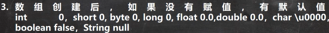
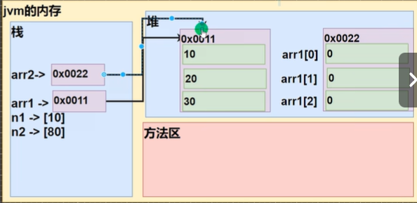
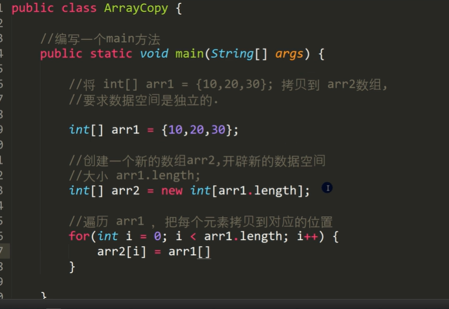
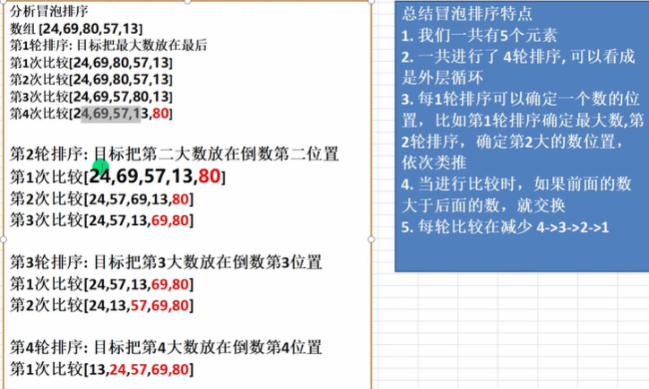

# 第四章 数组（array）

<mark>***用变量初始化数组合法，变量必须在使用之前被赋值***</mark>  

---

## 1. 数组

1. 数组是引用数据类型  

2. 数组初始化  
   
   ```java
   //初始化  
   数据类型[] 数组名 = new 数据类型[大小];  
   数据类型 数组名[] = new 数据类型[大小];  
   //静态初始化  
   数据类型[] 数组名 = {元素值1,...}  
   数据类型 数组名[] = {元素值1,...}  
   double[] hens = {3,2,5,6,3.4};  
   //动态初始化  
   //1.先声明数组 2.创建数组  
   int a[]或int[] a;  
   a = new int[10]      ```  
   ```

3. 通过数组名[下标]来访问数组的元素，**下标从0开始**  

4. 数组名.length-->数组的大小  

5. <mark>数组</mark>有默认值  
     

6. **数组赋值机制**  
- 基本数据类型是<mark>值传递</mark>  

- 数组默认是<mark>引用传递</mark>，赋的是地址(数组赋给数组)  
    
  
- 数组值传递

    

## 2. 排序

冒泡排序  
  

## 3. 二维数组

1. `int[行][列] arr = {{},{},...}`  

2. 二维数组的每个元素是一维数组  

   - arr.length代表二维数组的<mark>行数</mark>（元素）  

   - arr[i]表示二维数组的第i+1个元素  

   - arr[i].length表示对应的每个一维数组的长度  

3. 遍历二维数组  

   ```java
   for(int i =0; i < arr.length; i++){}
        //1.arr[i]表示二维数组的第i+1个元素    
        //2.arr[i].length表示对应的每个一维数组的长度  
       for(int j = 0; j < arr[i].length; j++){
       }   
   }
   ```

4. 初始化  

   - 每个一位数组的大小可以不同  
   - int[] x,y[]-->x一维数组，y二维数组  

   ```java
      //初始化
    数据类型[][] 数组名 = new 数据类型[大小][];  
    数据类型 数组名[][] = new 数据类型[大小][];  
   
    //静态初始化  
    数据类型[][] 数组名 = {{},...}       
    数据类型 数组名[][] = {{},...}  
   
    //动态初始化  
    //1.先声明数组 2.创建数组  
    int a[][]或int[][] a;  
    a = new int[10][4]   
   
     //动态初始化-列不确定  
     //1        
    //2 2        
    //3 3 3        
    int[][] arr = new int[3][];        
    for( int i = 0; i < arr.length; i++){            
         //给每个一位数组开空间，否则 arr[i]为null  
         arr[i] = new int[i+1];  
         //遍历一维数组，给每个元素赋值  
         for( int j = 0; j < arr[i].length; j++){
                    arr[i][j] = i +1;
                }
        } 
   ```
