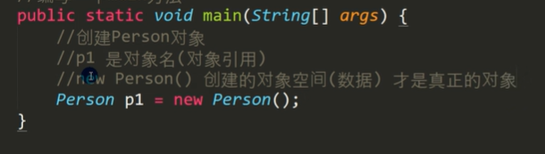
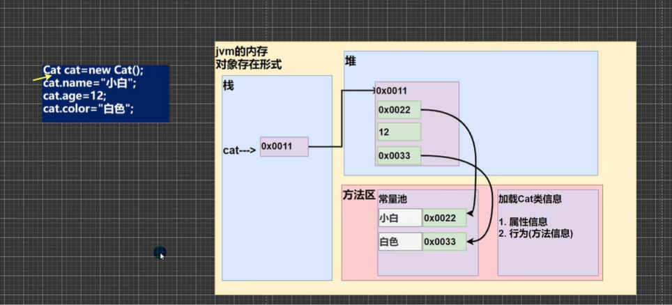
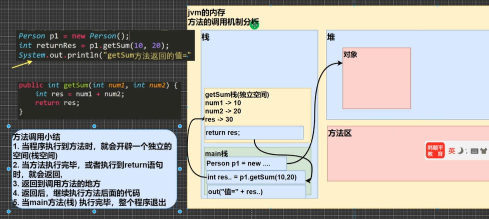
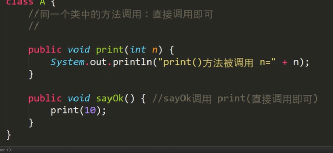
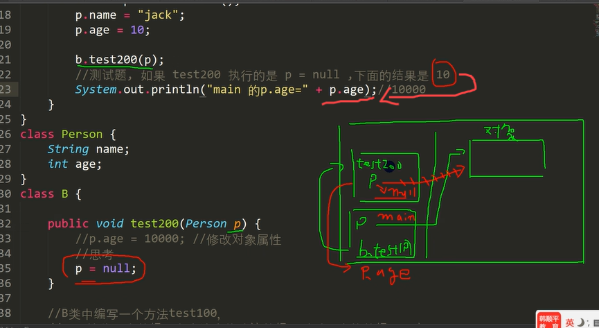
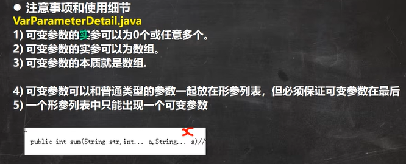
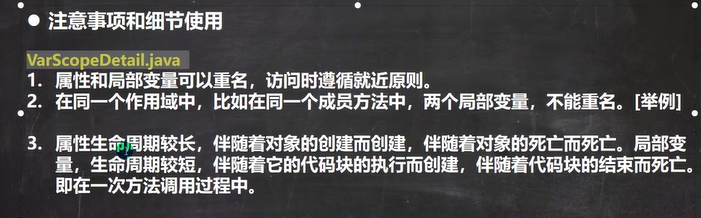
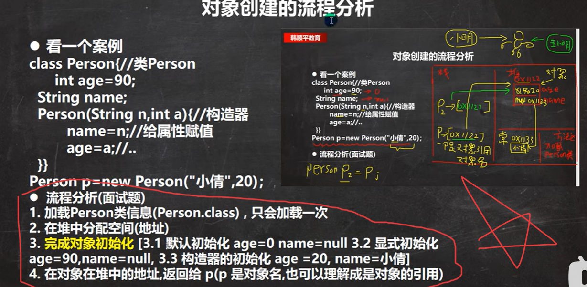
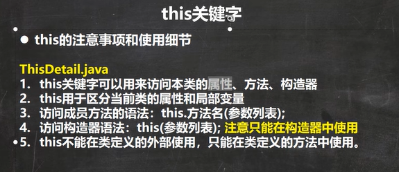

# 第五章 类与对象

***object[对象]***  

***

## 1. 属性

- 属性、成员变量、字段[field]  
- 定义语法： `访问修饰符 属性类型 属性名`  

## 2. 对象

1. 创建对象

```java
//先声明，再创建  
Cat cat;
cat = new Cat(); 

//直接创建
Cat cat = new Cat()
```
    2. 对象和引用名的区别  

  

    3. 访问属性语法： `对象名.属性名`  

4. **对象在内存中的存在形式**  

   - 基本类型属性存储在堆  
   - 引用类型属性地址存储在堆，实际存储在方法区  
          

5. **对象创建过程**  

        

## 3. 方法

### 1. 方法调用机制

  

- 方法执行完后，产生的栈空间销毁  

### 2. 方法的定义

```java
访问修饰符 返回数据类型 方法名(形参,...){  
    语句;  
    return 返回值;  
}
```

### 3. 方法之间相互调用细节

- 同一类中的方法，直接调用    
    
- 跨类调用时，需通过对象名调用  

### 4. 成员方法传参机制

- 基本数据类型：传值  
- 引用数据类型：传地址  
- 例题：结果是10，栈中test200中p=null,但main中p不为null,扔指向堆中的对象  
     

- 成员方法返回引用数据类型时，同样传地址

### 5. 方法递归调用[recursion]

阶乘  

```java
 int factorial(int n){
     if(n==1)
     	return 1;
     else return factorinal(n-1)*n;
 }
```

### 7. 方法重载[OverLoad]

方法同名   

- 参数列表不同-->参数类型，顺序，个数[不包括参数名]  

- 返回类型无要求

### 8. 可变参数

- java允许同一个类中多个同名同功能但参数个数不同的方法，封装为一个方法  

- 基本语法： `访问修饰符 返回类型 方法名(数据类型... 形参名)`     

- 可变参数当做数组使用  
  
  - 例：  

```java
//求和  
public int sum(int... nums){  
    int res = 0;   
    for(int i = 0; i < nums.length; i++){      
        res += num[i];   
        return res;   
    }
}
```

- 使用细节:    
  **当实参为数组时，直接将数组地址赋给可变参数**，因为可变参数本质为数组  
    

### 9. 作用域 scope[范围，作用域]

- 变量的作用域为定义它的代码块中  
- 全局变量[属性]可以不赋值,可以直接使用，因为有默认值；局部变量必须赋值后才能使用，因为没有默认值  

  

### 10. 构造器/构造方法

若没有定义构造器，则自动生成一个默认无参构造器；一旦定义了构造器，则不可使用默认构造器  

### 11. 类的创建流程分析

  

### 12. this关键字

代表当前对象，方便构造器的定义


