# 包

- 声明当前类所在的包： `package 包名`-->语句在类的最上面  

- 包的命名  
  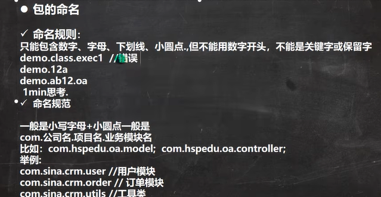  

- 导入包： `import 包名`  

- 导入包中的类 `import 包名.类名` 或 `import 包名.*`-->表示引入包内所有的类，不建议使用    
  
  

# 访问修饰符

  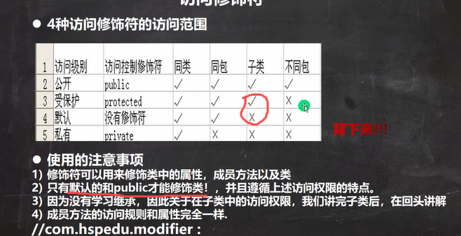  

- 默认修饰符的属性和方法可以在同一个包中的子类访问，但不能在不同包的子类中访问-->即默认修饰符只允许在同一个包内访问
  
  

# 封装[encapsulation]

1. 封装的步骤    
   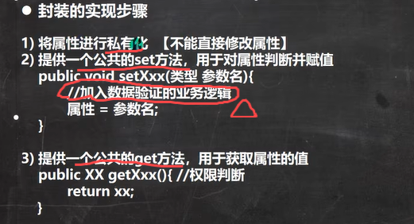  
   
   - alt + insert直接生成set,get方法  
   - 若想在构造器中进行数据检验，可以在构造器内调用set方法
     
     

# 继承[extend]

```java
class 子类 extends 父类{
}
```

## 继承细节

1. 子类会自动拥有父类定义的属性和方法，非私有的属性和方法可以在子类直接访问，但私有属性和方法不能在子类直接访问，要通过父类的公共方法访问

2. 子类必须调用父类的构造器，完成父类的初始化

3. 当创建子类对象时，不管使用子类的哪个构造器，默认情况下总会调用父类的无参构造器。如果父类没有提供无参构造器，则必须在子类的构造器中用super去指定使用父类的某个构造器完成对父类的初始化工作

4. super()和this()都只能放在构造器<mark>第一行</mark>，因此两个方法**不能共存**在一个构造器-->this() 是在一个构造方法里调用<mark>本类</mark>其他构造方法的语句;super() 是在子类构造方法里调用<mark>父类</mark>构造方法的语句。

5. 所有类都是Object类的子类-->ctrl+h可以看到类的继承关系

6. 父类构造器的调用不限于直接父类，将一直向上追溯到Object类

7. 子类最多只能<mark>继承一个</mark>父类，即java中的单继承机制

## 继承本质

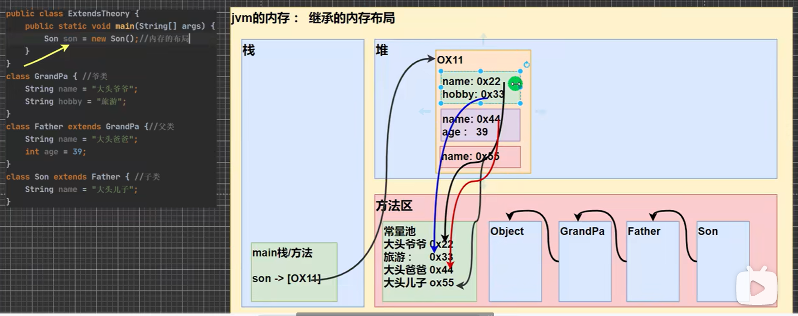

- 方法区和堆都是<mark>先加载父类，再加载子类</mark>

- 堆中父类和子类单独分配一块空间，因此父类属性和子类属性可同名

## 属性/方法访问规则

1. 首先看子类（本身）是否有该属性

2. 如果子类有这个属性，且可以访问，则返回信息-->若不能访问，则报错

3. 如果子类没有这个属性，就看父类有没有这个属性

4. 如果父类有这个属性，且可以访问，则返回信息

5. 如果父类没有该属性，就按规则3继续找上级子类，直到Object
   
   

# super关键字

super代表父类的引用，用于访问父类的属性、方法、构造器（不能访问私有成员）

## 调用语法

1. 访问父类属性： `super.属性名;`
2. 访问父类方法： `super.方法名(参数列表);`
3. 访问父类构造器： `super(参数列表);`-->只能放在构造器第一句，且只能出现一次

## 细节

1. 如果子类和父类中的成员重名时，为了访问父类的成员，必须通过super；如果没有重名，使用super、this、直接访问是一样的

2. super的访问不限于直接父类，如果爷爷类和本类有同名的成员，也可以用super去访问爷爷类的成员；如果多个基类中都有同名的成员，使用super访问遵循就近原则

## super和this的区别

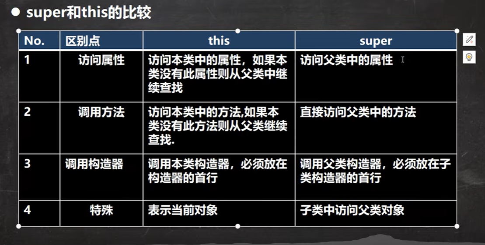

# 方法重写/覆盖(override)

1. 方法覆盖：子类有一个方法，和父类的某个方法的名称、返回类型、参数一样，那么我们就说子类的这个方法覆盖了父类的方法

2. 调用： `@Override`-->可以不写，但建议写

## 细节

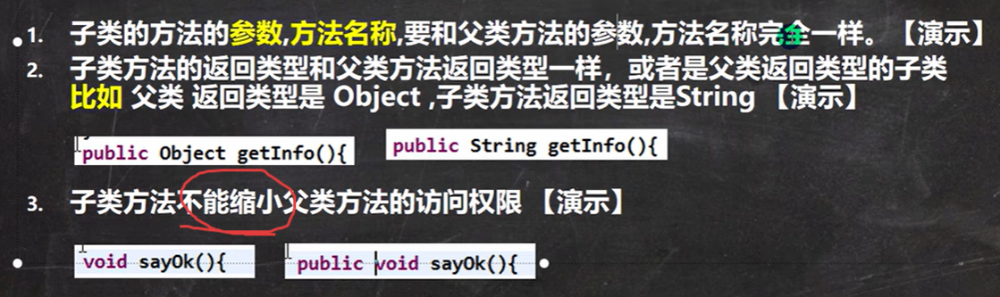

访问权限：public > protected > 默认 > private

## 方法重写和重载的区别

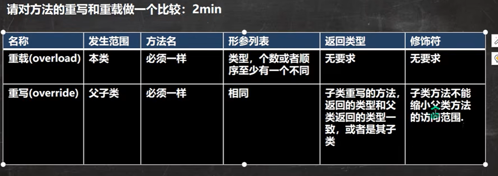

# 多态

- 方法或对象具有多种形态，即多态

- 前提：两个对象（类）存在继承关系

## 向上转型

1. 本质：父类的引用可以指向子类的对象--><mark>向上转型 </mark>

2. 语法： `父类类型 引用名 = new 子类类型();`

3. 特点：编译类型看左边，运行类型看右边

**细节**

1. 可以调用父类的所有成员，但需遵守访问权限

2. 不能调用子类的特有==成员==，包括属性和方法-->调用那些成员，是由<mark>编译类型</mark>来决定的

3. 最终的运行效果（方法）要看子类的具体实现-->看运行类型

## 向下转型

1. 语法： `子类类型 引用名 = (子类类型) 父类引用`

2. 只能强转父类的<mark>引用</mark>（对象名），不能强转父类的对象（本体）

3. 要求父类的引用的运行类型必须与当前目标类型相同

4. 向下转型后，可以调用子类类型中所有的成员

## 多态细节

<mark>方法看运行类型，属性看编译类型</mark>   

内存地址 == 运行类型

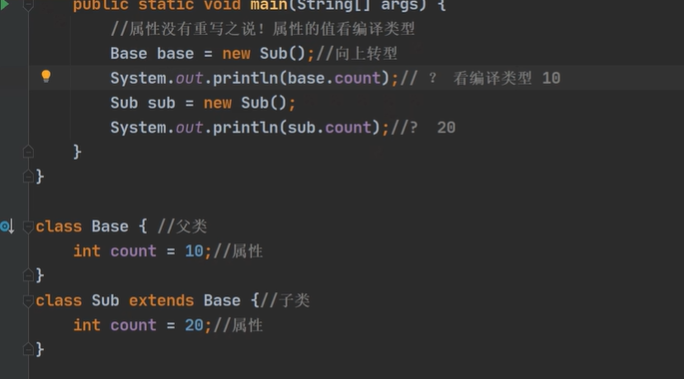

## instanceof 比较操作符

用于判断对象的<mark>运行类型</mark>是否为XX类型或XX类型的**子类型**，bollean类型 `对象名 instanceof 类名`

## java的动态绑定机制

1. 解释：当调用对象<mark>方法</mark>时，该方法会和该对象的内存地址/<mark>运行类型</mark>绑定

2. 当调用该对象的属性时，没有动态绑定机制，哪里声明，哪里使用

```java
class A{
    int i = 10;
    int sum(){
        return getI() + 10;
    }
    int sum1(){
        return i + 10;
    }
    int getI(){
        return i;
    }
}

class B extends A{
    int i = 20;
    int getI(){
        return i;
    }
}

public class Main{
    public static void main(String[] args){
        A a = new B();
        System.out.println(a.sum());//getI()动态绑定，为运行类型B的getI()-->20+10
        System.out.println(a.sum1());//i没有动态绑定，为所调用方法sum1()所在类A的i-->10+10
    }
}
```

## 多态的应用

### 多态数组

1. 定义：数组的定义类型为父类类型，里面保存的实际元素类型为子类类型

2. 多态数组中元素类型不同时，通过 `对象名 instanceof 类名` 判断元素类型，然后<mark>向下转型</mark>，进而调用不同子类型的特有方法

### 多态参数

方法定义的形参类型为父类类型，实参类型允许为子类类型


# Object类详解

方法概要：

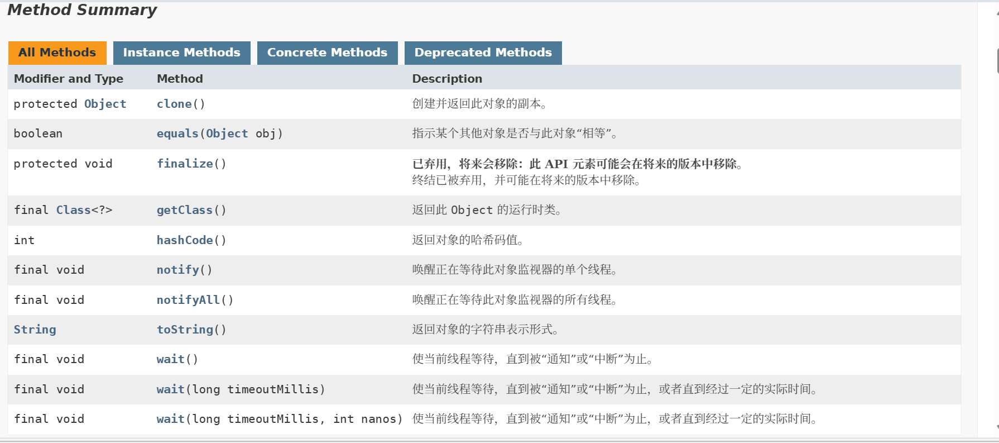

## equals方法

1. == 是一个比较运算符，既可以判断基本类型，又可以判断引用类型
- 如果判断基本类型，判断的是值是否相等

- 如果判断引用类型，判断的是地址是否相等，即判定是否为同一对象
2. equals:只能判断引用类型
- 默认判断的是地址是否相等，子类中往往重写该方法，用于判断内容是否相等

## hashCode方法

返回哈希码值（int类型）

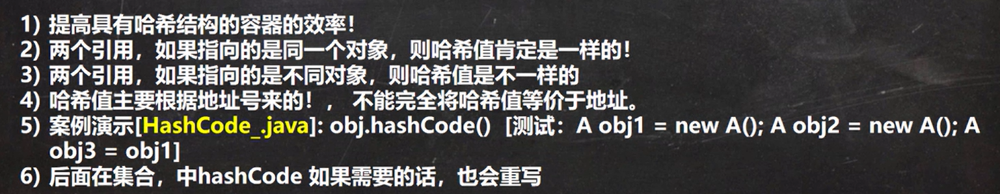

## toString方法

返回该对象的字符串表示

- 默认返回：全类名（包名+类名）+@+哈希值的十六进制

- 重写toString方法，打印对象或拼接对象时，都会自动调用该对象的toString形式

- 当直接输出一个对象时，toString方法会被默认调用--> `System.out.println(对象名)`
  
  

# 断点调试

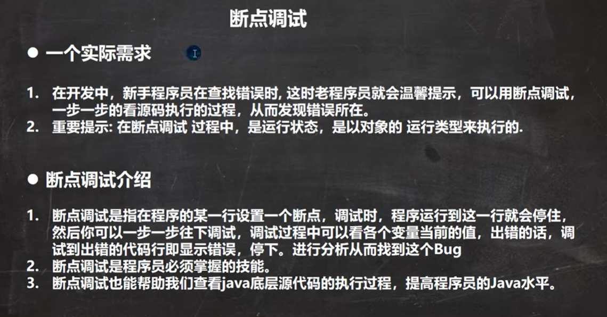

快捷键：

F7(跳入方法内)  

F8(跳过，即逐行执行代码) 

shfit+F8(跳出) 

F9(resume：恢复程序,执行到下一个断点)
