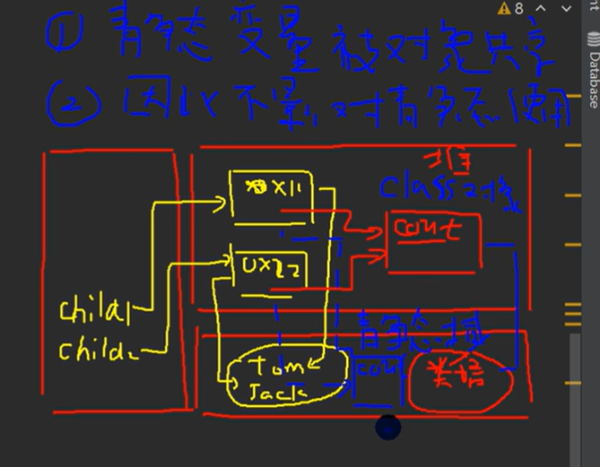
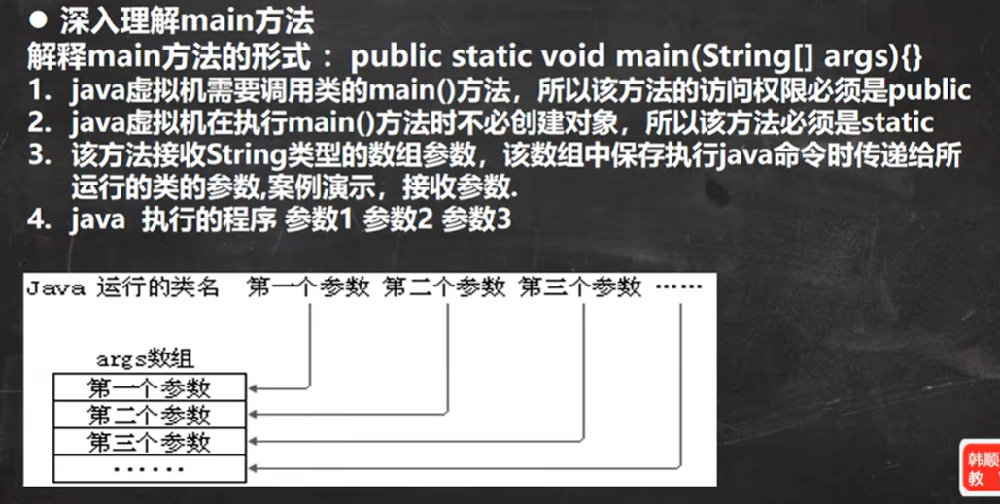
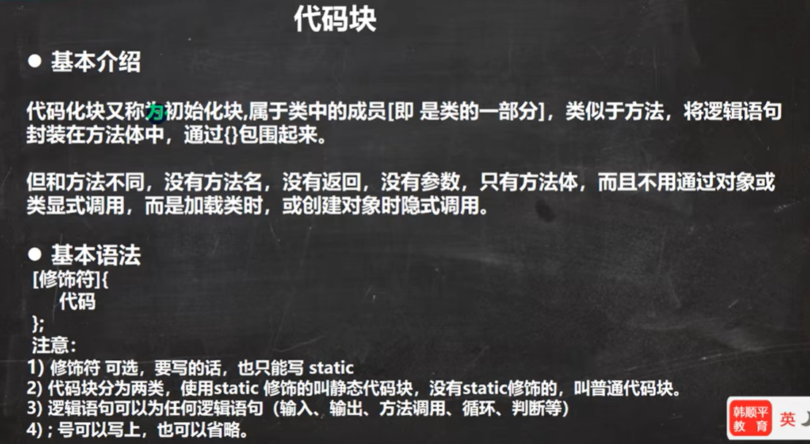
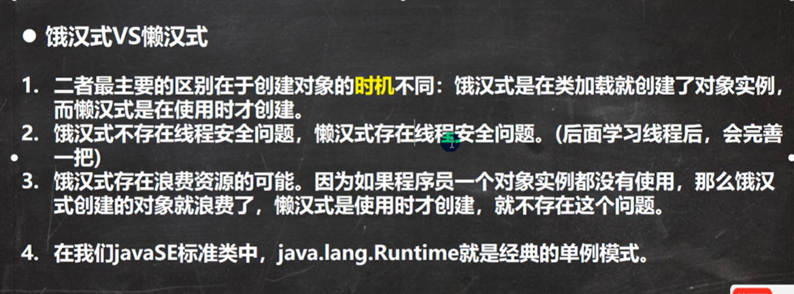
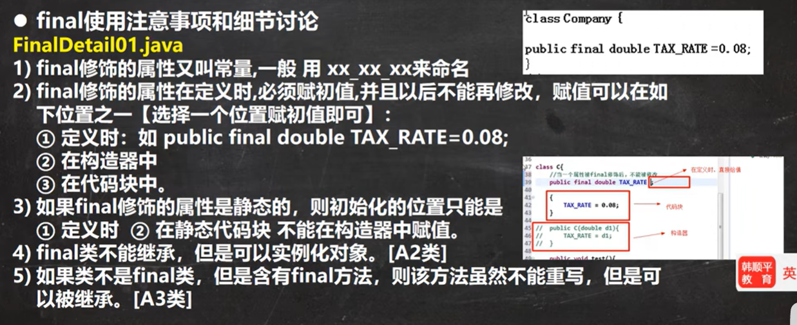
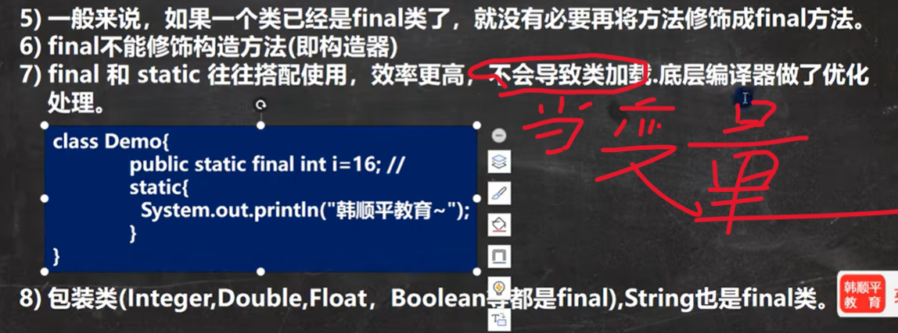
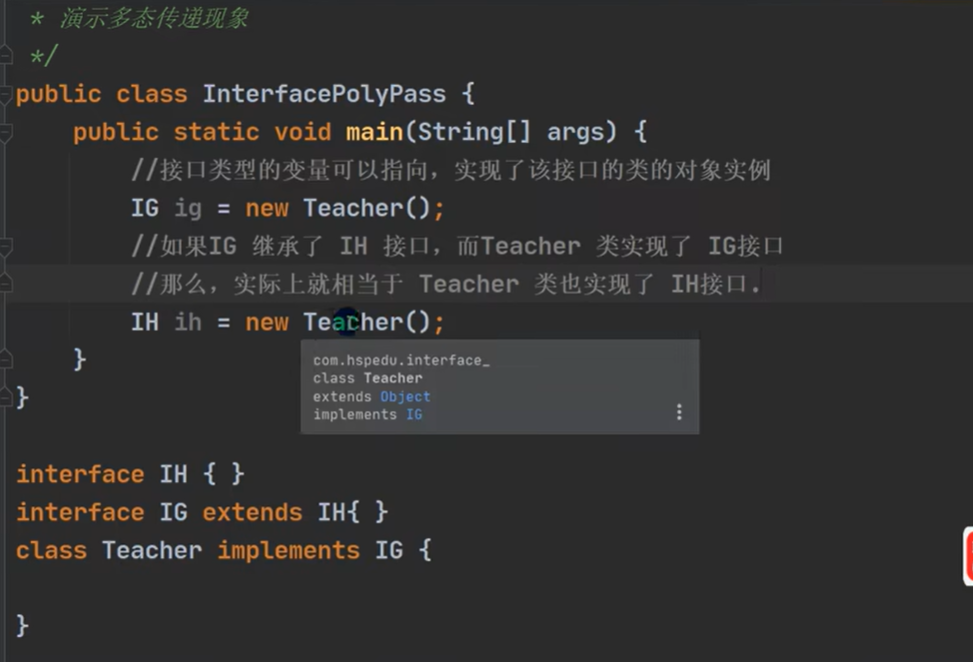
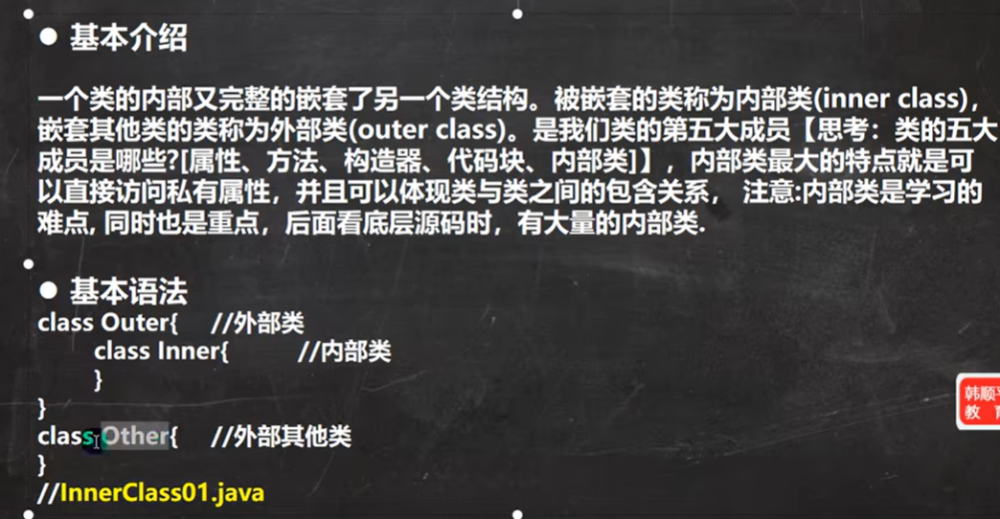
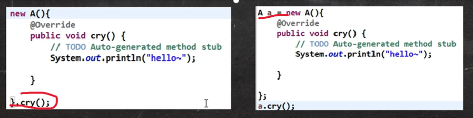

# 类变量和类方法

## 类变量

用 `static` 修饰（静态），被该类的所有对象共享

- 语法： `访问修饰符 static 数据类型 变量名` 

- 访问类变量： `类名.类变量名` 或 `对象名.类名`

- 静态变量在<mark>类加载</mark>时就生成了

- JDK7以后，静态变量存储在堆中;之前存储在方法区的静态域中



## 类方法

<mark>语法和访问基本与类变量相同</mark>

- 无this参数
- 静态方法不可以访问本类的非静态成员，可以访问静态成员。--> main方法无法调用本类的非静态成员
- 要想访问非静态方法，要先在方法中创建对象，再调用
  
  

# main方法详解



# 代码块



**代码块的好处：**

* 相当于另外一种形式的构造器（对构造器的补充机制），可以进行初始化操作

* 场景：如果多个构造器中都有重复的语句，可以抽取到初始化块中，提高代码的重用性 --> <mark>代码块调用的顺序优先于构造器</mark>
  
  

**代码块使用注意事项和细节讨论:**

1. static 代码块也叫<mark>静态代码块</mark>，作用就是对类进行初始化，而且它随着<mark>类的加载</mark>而执行，并且只会执行一次。如果是<mark>普通代码块</mark>，每创建一个对象，就执行一次。

2. **<mark>类什么时候被加载</mark>**
   ① 创建对象实例时 (new)
   ② 创建子类对象实例，父类也会被加载
   ③ 使用类的静态成员时 (静态属性，静态方法)

3. 普通的代码块，在创建对象实例时，会被<mark>隐式的调用</mark>。被创建一次，就会调用一次。如果只是使用类的静态成员时，普通代码块并不会执行。  

4. 创建一个对象时，在一个类中调用顺序是：(重点，难点) :  
   ① 调用静态代码块和静态属性初始化 (注意：静态代码块和静态属性初始化调用的优先级一样，如果有多个静态代码块和多个静态变量初始化，则按他们定义的顺序调用)  
   ② 调用普通代码块和普通属性的初始化 (注意：普通代码块和普通属性初始化调用的优先级一样，如果有多个普通代码块和多个普通属性初始化，则按定义顺序调用)  
   ③ 调用构造方法。

5. 构造方法 (构造器) 的最前面其实隐含了 super () 和 调用普通代码块。而静态相关的代码块和属性的初始化在类加载时执行完毕，因此是优先于构造器和普通代码块执行的

6. 我们看一下创建一个子类时 (继承关系)，他们的静态代码块，静态属性初始化，普通代码块，普通属性初始化，构造方法的调用顺序如下:  
   ① 父类的静态代码块和静态属性 (优先级一样，按定义顺序执行)  
   ② 子类的静态代码块和静态属性 (优先级一样，按定义顺序执行)  
   ③ 父类的<mark>普通代码块和普通属性初始化</mark> (优先级一样，按定义顺序执行)  --> **默认初始化，显式初始化，构造器初始化**
   ④ 父类的构造方法  
   ⑤ 子类的普通代码块和普通属性初始化 (优先级一样，按定义顺序执行)  
   ⑥ 子类的构造方法 

7. 静态代码块只能直接<mark>调用静态成员 </mark>(静态属性和静态方法)，普通代码块可以调用任意成员。
   
   

# 单例设计模式

***static经典应用***

******

采取一定的方法保证在整个软件系统中，对某个类只能存在一个对象实例，并且该类只提供一个取得其对象实例的方法

## 饿汉式

没使用实例,但类加载也创建实例

步骤：

1. 构造器私有化-->防止new

2. 类的内部创建对象

3. 向外暴露一个静态公共方法，getInstance

```java
class GirlFriend {
    private String name;
    private static final GirlFriend gf = new GirlFriend("小红");

    private GirlFriend(String name) {
        this.name = name;
    }

    public static GirlFriend getInstance() {
        return gf;
    }

    public String getName() {
        return name;
    }
}
```

## 懒汉式

不使用实例就不创建实例

```java
class GirlFriend{//只能有一个女朋友
    private String name;

    //static:保证只创建一个对象,并可以在静态方法getInstace中调用
    private static GirlFriend gf

    //构造器私有化
    private GirlFriend(String name){
        this.name = name;
    }

    //静态方法，获取实例
    public static GirlFriend getInstace{
        if(gf == null)
            gf =  = new GirlFriend("小红");
        return gf;
    }
}
```

## 对比



# final关键字

final 可以修饰类、属性、方法和局部变量.  

- <mark>final修饰数组时，其指向的地址不能修改，但数组元素的值可以修改</mark>-->引用数据类型，类似类

**使用final的场景:**

1. 当不希望类被**继承**时，可以用 final 修饰.
2. 当不希望父类的某个方法被子类**覆盖** / 重写 (override) 时，可以用 final 关键字修饰。
3. 当不希望类的的某个属性的值被修改，可以用 final 修饰.
4. 当不希望某个局部变量被修改，可以使用 final 修饰

**使用细节:**

==可以在构造器初始化==





# 抽象类

当一个类中存在抽象方法（<mark>无方法体</mark>）时，需要将该类声明为抽象类（可以有实现的方法）

语法： `访问修饰符 abstract 类名` 和 `访问修饰符 abstract 返回类型 方法名(参数列表);` 

**细节**

1. 抽象类不能实例化

2. 抽象类不一定要包含abstact方法

3. 一旦类包含了abstact方法，那么这个类必须声明为abstract

4. abstract只能修饰类和方法，不能修饰其他

5. 抽象类可以有任意成员【抽象类还是类】

6. **抽象方法不能有方法体**

7. 如果一个类继承了抽象类，那它必须**实现**抽象类的所有抽象方法，除非它自己也声明为abstract类

8. <mark>abstract不能和final或static或private一起用（后三者不能重写）</mark>
   
   

# 接口

1. 接口：给出一些抽象方法封装到一起，到某个类要使用时，再根据具体情况把这些方法写出来。

2. 语法： 
   
   ```java
   interface 接口名{
       //属性
       //方法
   }
   
   class 类名 implements 接口{
       //自己的属性和方法
       //实现的接口抽象方法
   }
   ```

3. jdk7.0前，所有方法都是抽象方法

4. jdk8.0后，接口可以有默认方法（default关键字修饰）和静态方法的实现
   

**细节：**

1. 接口不能被实例化

2. 接口中所有方法和属性都是public，接口中的抽象方法可以不用abstract修饰--><mark>public和abstract都可省略</mark>

3. 普通类实现接口，必须将该接口的所以方法都实现；抽象类实现接口，可以<mark>不实现</mark>接口的方法

4. 一个类可以同时<mark>实现多个接口</mark>

5. 接口的属性只能是final,并且是<mark> `public static final` </mark>修饰符，因为接口不可单独加载-->该修饰符可省略

6. 属性的访问方式： `接口名.属性名` ， `实现类.属性名` 和 `实现类的对象名.属性名`

7. 接口不能继承类，但可以<mark>继承多个接口</mark>，例： `interface A extends B,C{}`-->==**接口不考虑java的单继承机制**==

8. 接口的修饰符和类一致，只能为<mark>public或默认</mark>

9. 接口与类相同，都有多态的性质，即向上转型（多态数组，多态参数）

10. 接口的多态传递：  
    
    

# 内部类



## 内部类的分类

- 定义在外部类的局部位置上（比如方法内）：
1. 局部内部类（有类名）

2. 匿名内部类（无类名）
- 定义在外部类的成员位置上：
1. 成员内部类（没有static）

2. 静态内部类（有static）
   
   

## 局部内部类

定义在外部类的局部位置（方法/代码块中），有类名

**细节：**

1. 可以<mark>直接访问</mark>外部类的所有成员，包含<mark>私有</mark>的
2. <mark>不能添加访问修饰符</mark>但是可以使用 <mark>final </mark>修饰局部内部类。因为局部内部类是局部变量，局部变量不能用访问修饰符，但可以使用 final
3. 作用域：仅仅在定义它的方法或代码块中。
4. 局部内部类 ---访问 --->外部类的成员，访问方式：直接访问
5. 外部类 ---访问---> 局部内部类的成员，访问方式：在<mark>作用域</mark>中创建对象，再访问
6. 外部其他类 ---不能访问---> 局部内部类（因为 局部内部类地位是一个局部变量）
7. 如果外部类和局部内部类的成员重名时，默认遵循就近原则，如果想访问外部类的成员，则可以使用 `外部类名.this.成员` -->this代表当前类的<mark>对象</mark>, `外部类名.this` 是外部类的对象，其地址与在外部其他类中调用它的对象的<mark>地址相同</mark>
   
   

## 匿名内部类

定义在外部类的局部位置（方法/代码块中），没有类名

*  匿名内部类的使用 (重要！！！！！！！)  
  
  1. 本质是类，同时还是一个对象
  
  2. 内部类
  
  3. 该类没有名字（其实有，系统自动分配）

**细节：**

1. 匿名内部类的基本语法  
   
   ```java
   //实现接口B的匿名内部类
   接口B 对象名 = new 接口{//-->创建类的同时，返回对象地址
       类体
   }
   
   //继承类A的匿名内部类
   类A 对象名 =  new 类A(参数列表){//-->参数列表为类A的构造器参数
       类体
   };
   ```

2. 匿名内部类只能使用一次，但它所创建的对象可以多次调用

3. 匿名内部类的运行类型为新创建的匿名内部类，不是实现/继承 的 类/接口

4. 匿名内部类同时也是对象，可以直接调用



5. 可以直接访问外部类的所有成员，包含私有的

6. 不能添加访问修饰符，因为它的地位就是一个局部变量。

7. 作用域：仅仅在定义它的方法或代码块中 

8. 匿名内部类---访问---->外部类成员[访问方式：<mark>直接访问</mark>]

9. 外部其他类 ---不能访问---> 匿名内部类（因为 匿名内部类地位是一个局部变量）

10. 如果外部类和匿名内部类内部类的成员重名时，默认遵循就近原则，如果想访问外部类的成员，则可以使用 `外部类名.this. 成员`
    
    

**使用场景：**

- 直接做方法参数

```java
interface AA {
    public void cry();
}

public class Main{
    public static void show(AA a) {
        a.cry();
    }

    public static void main(String[] atgs){
        show(new AA() {
            public void cry() {
                System.out.println("AA cry");
            }
        }); 
    }
}
```


## 成员内部类

成员内部类是定义在外部类的成员位置，并且没有 static 修饰。

**细节：**

1. 可以<mark>直接访问</mark>外部类的所有成员，包含私有的

2. 可以添加任意访问修饰符 (public、protected、默认、private), 因为它的地位就是一个成员。

3. 作用域：和外部类的其他成员一样，为整个类体  

4. 成员内部类 ---- 访问 -----> 外部类 (比如：属性) [访问方式：直接访问] 

5. 外部类 ---- 访问 -----> 内部类 [访问方式：创建对象，再访问],<mark>私有成员</mark>也可以访问

6. 外部其他类 ---- 访问 -----> 成员内部类

```java
//第一种方式
Outer outer = new Outer();
Outer.Inner inner = outer.new Inner();

//第二种方式
Outer.Inner inner = new Outer().new Inner();

//第三种方式，在外部类中，编写一个方法，可以返回Inner对象
Outer.Inner innerInstance = outer.getInstance();
```

7. 如果外部类和成员内部类的成员重名时，默认遵循就近原则，如果想访问外部类的成员，则可以使用 `外部类名.this. 成员`
8. 当外部类的==main方法==访问成员内部类时，语法 <mark>`Inner inner = new Outer().new Inner();`</mark>
   
   

## 静态内部类

静态内部类是定义在外部类的成员位置，并且有 static 修饰

**细节：**

1. 可以<mark>直接访问</mark>外部类的所有<mark>静态</mark>成员，包含私有的，但不能直接访问非静态成员
2. 可以添加任意访问修饰符 (public、protected、默认、private), 因为它的地位就是一个成员。
3. 作用域：同其他的成员，为整个类体
4. 静态内部类 ---- 访问 -----> 外部类 (比如：静态属性) [访问方式：直接访问所有静态成员]
5. 外部类 ---- 访问 -----> 静态内部类 访问方式：创建对象，再访问
6. 外部其他类 ---- 访问 -----> 静态内部类，同成员内部类相同
7. 如果外部类和静态内部类的成员重名时，默认遵循就近原则，如果想访问外部类的成员，则可以使用<mark> `外部类名. 成员`</mark>-->因为访问的是静态成员，所以<mark>无this</mark>
