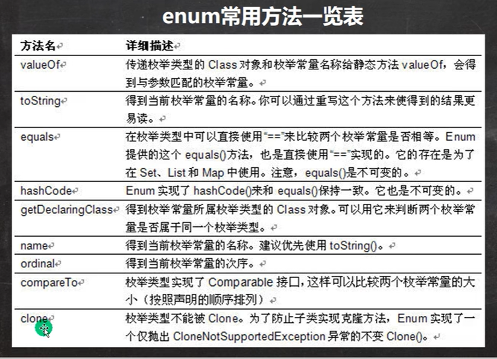
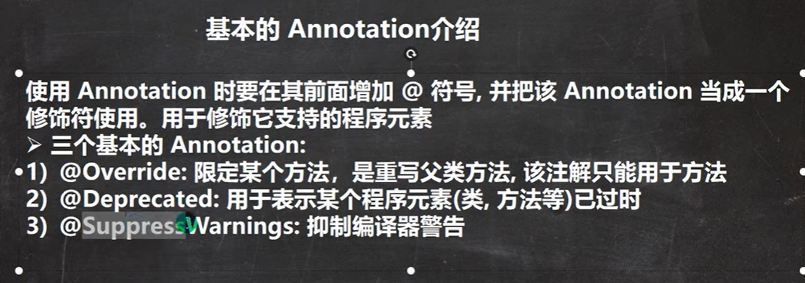
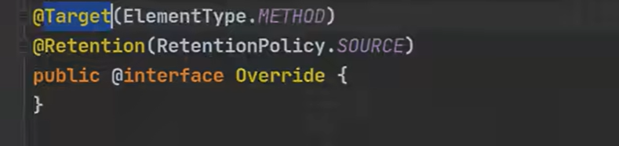
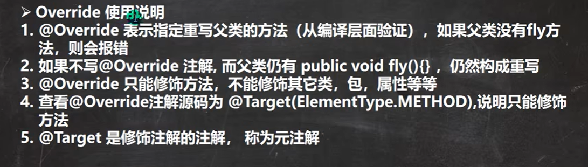
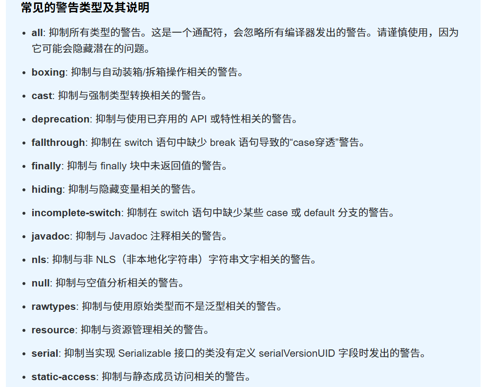
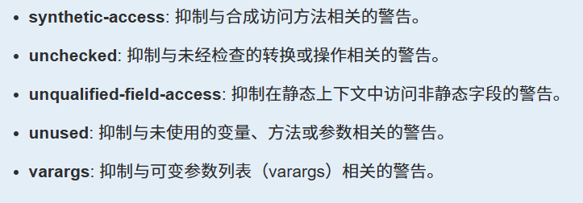

# 枚举

1. 枚举是一组常量的集合

2. 属于一种类，类名只包含一组有限的特定对象
   
   

# 自定义类实现枚举

1. 构造器私有化-->防止创建其他对象

2. 本类内部创建一组对象，修饰符为 ==`public final static`==

3. 可以提供get方法，但不能提供set方法
   
   

# enum关键字实现枚举

```java
enum Season{
    SPRING("春天", "温暖"), WINTER("冬天", "寒冷");

    private String name;
    private String desc;

    private Season(String name, String desc){
        this.name = name;
        this.desc = desc;
    }
}
```

**细节**

1. enum 代替 class 修饰类

2. enum类默认继承Enum类，且为 final 类型

3. 语法: `常量对象名(参数列表);` ，调用： `enum类名 对象名 = enum类名.常量对象名`

4. 如果使用无参构造器 创建 枚举对象，则实参列表和小括号都可以省略

5. 当有多个枚举对象时，使用 "," 间隔，最后有一个分号结尾-->不能分行

6. 枚举对象必须放在枚举类的行首
   
   

## enum类方法



#### toString()

Enum类已重写，返回当前对象名

#### ordinal()

从0开始排序

#### values() 静态

<mark>返回一个所定义枚举类类型的数组</mark>，含有定义的所有的常量对象

java编译器会自动在enum类中插入values方法，在Enum类中无法查阅

#### valueOf() 静态

将字符串转化为枚举对象，要求字符串必须为已有常量名，否则报异常

例： `Season season = Season.valueOf("SPRING");`

#### compareTo()

比较两个枚举常量（按照声明的次序）


## enum实现接口

1. 使用enum关键字后，就不能在继承其他类了，因为java为单继承机制，而enum会隐式继承Enum类

2. 枚举类可以实现接口
   
   

# 增强for循环

```java
for(数组元素类型 i : 数组名){//一起从数组中取出数据，赋给i

}
```


# JDK内置的基本注解类型



`@interface` 表示注解类，相当于 `class`

## @Override

@Override源码：





## @Deprecated

表示所修饰已过时，不在推荐使用，但仍可使用

使用后会出现删除线，如 ~~a.h()~~

## @SuppressWarnings

当我们不希望看到警告时，可以使用该注解抑制编译器的警告

使用： `@SupressWarnings({""})` -->可以直接写all,抑制所有警告

**参数**






# 元注解

对注解进行注解，了解即可


元注解的种类 

1. Retention // 指定注解的作用范围，三种 SOURCE,CLASS,RUNTIME
2. Target // 指定注解可以在哪些地方使用
3. Documented // 指定该注解是否会在 javadoc 体现
4. Inherited // 子类会继承父类注解
