## 1 包装类

将基本数据类型变成包装类后，可以调用某些方法或作为某些方法的参数

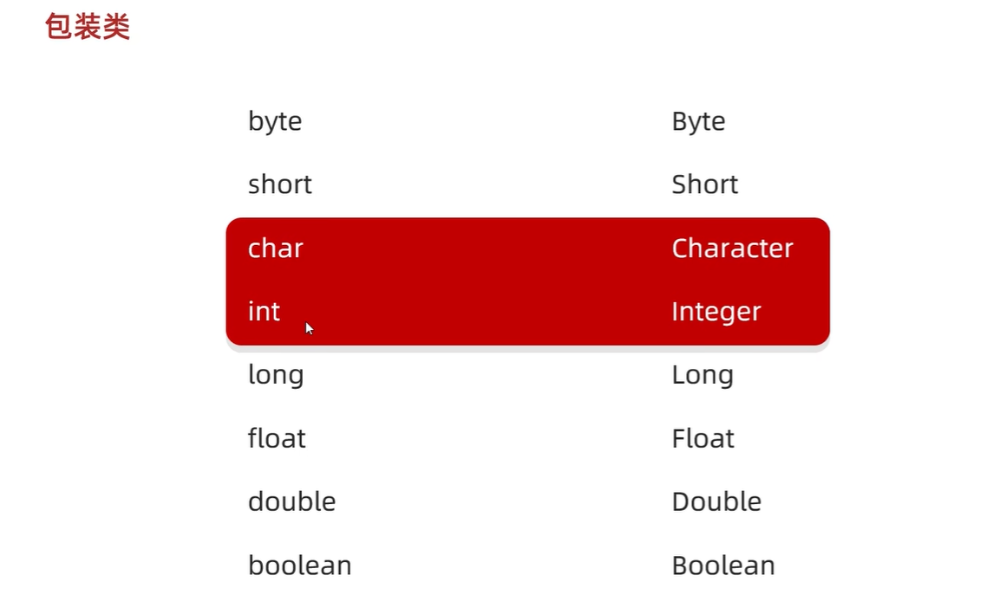


### 1.1 装箱与拆箱

- jdk5之前是手动装箱和拆箱，jdk5后自动装箱

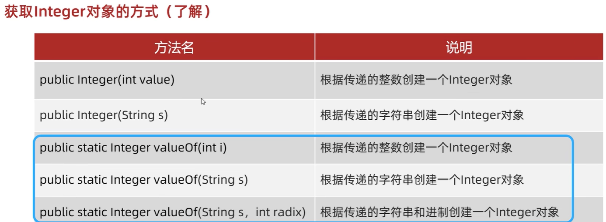

<mark>务必注意自动装箱和拆箱的底层逻辑</mark>

```java
int n1 = 100;
//手动装箱
Integer integer = new Integer(n1);//方法1
Integer integer = Integer.valueOf(n1);//方法2

//手动拆箱 Integer->int
int i = integer.intValue();

//jdk5之后，自动装箱和拆箱
Integer integer = n1;//自动装箱，底层用的Integer.valueOf()
int n2 = integer;//自动拆箱,底层用的integer.intValue()
```

#### 1.1.1 两种创建对象的区别

- valueOf()将-128~127提前创建好了对象。用了后不会创建新的，而是返回已创建的对象
- new 每一次都会创建新的对象

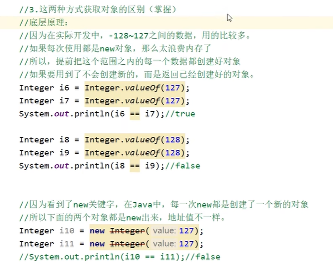

#### 1.1.2 包装类如何计算

- 以前
  - 把对象进行拆箱，变成基本数据类型
  - 计算
  - 再装箱
- JDK5时，自动装箱和自动拆箱：故包装类和基本数据类型可以看做一个东西
  - "= =" ：**只要有基本数据类型，即基本数据类型和包装==类判==断时，判断的是<mark>值</mark>是否为相同**

**例题：**

注意：<mark>三元运算符是一个整体，会把精度提升到最高</mark>

包装类对象相当于所对应的基本数据类型的值，可以进行运算。因为toString()被重写了-->包装类对象可以==直接输出==，输出结果为所对应基本类型的值

```java
//练习一
Object obj1 = true? new Integer(1): new Double(2.0);
System.out.println(obj1);//输出1.0

//练习二
Object obj2;
if(ture)
    obj2 = new Integer(1);
else
    obj = new Double(2.0);
System.out.println(obj2);//输出1
```

### 1.2 成员方法

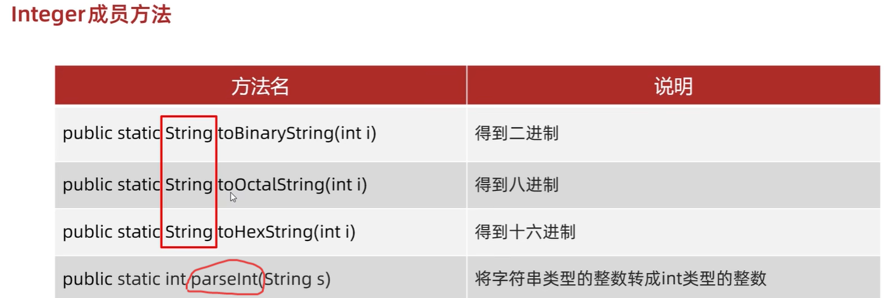

#### 1.2.1 包装类和String类型的相互转换

```java
//包装类(Integer)->String
Integer i1 = 100;
//方式1
String str1 = i1 + "";
//方法2
String str2 = i1.toString();
//方法3
String str3 = String.valueOf(i1);

//String->包装类(Integer)
String str4 = "123456"
//方法1
Integer i2 = Integer.parseInt(str4);//使用到自动装箱
//方法2
Integer i3 = new Integer(str4);//构造器
```

- 包装类有非常多的方法，用的时候查api或idea的类图

### 1.3面试题

第一题：

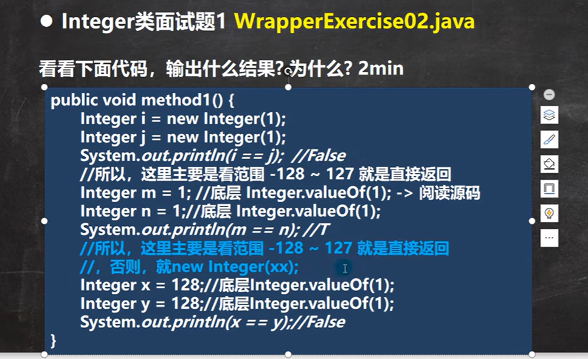

`Integer.valueOf()` 返回一个Integer类型的静态常量，即 `final static`,故返回的为同一个对象（地址相同）

"= =" ：只要有基本数据类型，即基本数据类型和包装==类判==断时，判断的是<mark>值</mark>是否为相同

```java
Integer integer = 1;
int i = 1;
System.out.println(integer == i);//Ture
```


## 2 String

1. String 对象用于保存字符串，也就是一组字符序列  

2. "jack" 字符串常量，双引号括起的字符序列  

3. 字符串的字符使用 Unicode 字符编码，一个字符 (不区分字母还是汉字) 占两个字节

4. String 类有很多构造器，构造器的重载  
   
   ```java
   //常用的有
   String s1 = new String ();
   String s2 = new String (String original);
   String s3 = new String (char [] a);
   String s4 = new String (char [] a,int startIndex,int count);
   String s5 = new String (byte [] b);
   ```

5. String 类实现了接口 **Serializable**[String 可以串行化：可以在网络传输]，接口 **Comparable** [String 对象可以比较大小]，接口**CharSequence**[继承value]

6. String 是 final 类，不能被其他的类继承  

7. String 有属性 `private final charvalue []; ` 用于存放字符串内容

8. 一定要注意：==value 是一个final类型==，不可以修改：即value不能指向新的地址，但是单个字符内容是可以变化

### 2.1 创建String对象的方式

方式一：直接赋值  `String s = "hsp";`

方式二：调用构造器 `String s2 = new String("hsp");`

方式三：`String str = String.valueOf();` -->底层是调用传入参数的toString方法，将其转成字符串

**区别**

1. 方式一：先从常量池查看是否有"hsp"数据空间，如果有，直接指向；如果没有则重新创建，然后指向。==s最终指向的是常量池的空间地址==

2. 方式二：先在堆中创建空间，里面维护了value属性，指向常量池的hsp空间。如果常量池没有"hsp"，重新创建，如果有，直接通过value指向。==最终指向的是堆中的空间地址。==

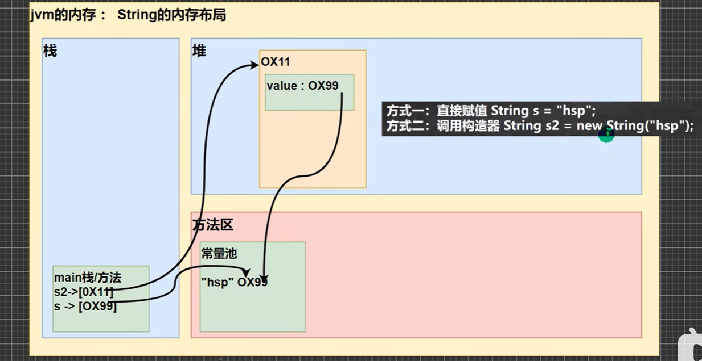

例题：

```java
String s1 = "123";
String s2 = "123";
System.out.println(s1.equals(s2));//True
System.out.println(s1 == s2);//True
```

### 2.2 String对象特性

1. String是一个final类，代表不可变的字符序列

2. 字符串是不可变的。一个字符串对象一旦被分配，其内容是不可变的.

   如果对一个已赋值的String对象再次赋值，会==指向新的对象==，而不是更改原本所指向的对象

**例题**

```java
//题1
String a = "hello" + "abc";//只创建一个对象，编译器会优化为 String a = "helloabc",a直接指向常量池
/*
编译器会判断创建的常量池对象是否有引用指向
*/

//题2
String a = "hello";
String b = "abc";
String c = a + b;//3个对象，c 指向堆中的对象
/*
1. 先创建一个 StringBuilder sb = StringBuilder()
2. 执行 sb.append("hello");
3. sb.append("abc");
4. String c = sb.toString()-->toString返回new String(value, 0, count)
最后其实是 c 指向堆中的对象(String) value[] -> 池中 "helloabc" 
*/
```

题3:

**输出：hsp and have!!!**

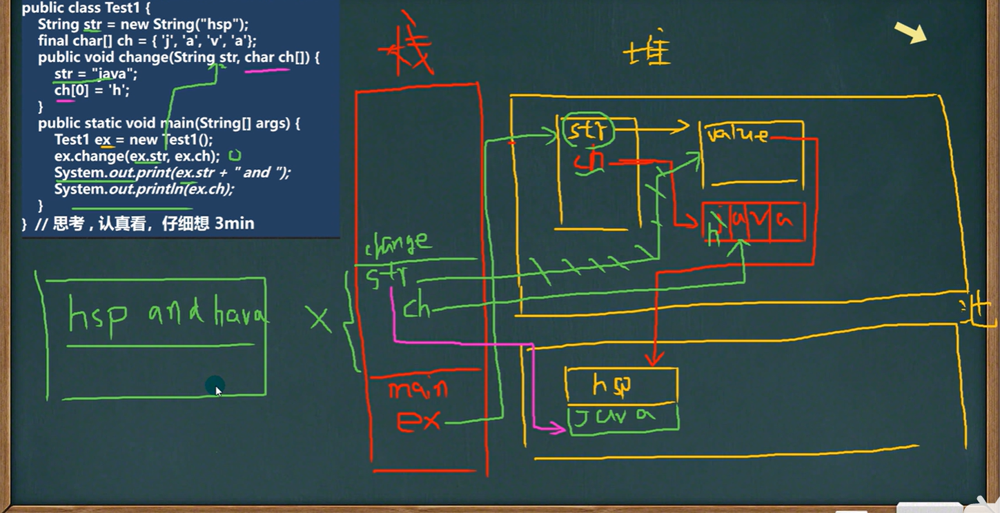

### 2.3 String常用方法

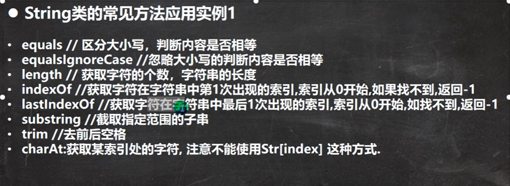

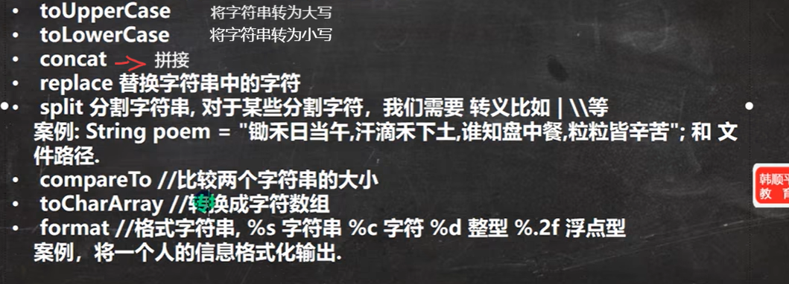

- format():==静态==，第一个参数是自定义的格式，用法类似于c语言的println()

  占位符： `%.2f` 代表保留小数点后两位小数，四舍五入

  ```java
  String str1 = String.fomat("我的名字是%s,年龄是%d",name,age);
  String s = "我的名字是%s,年龄是%d";
  String str2 = String.fomat(s,name,age)
  ```

  


## 3 StringBuffer

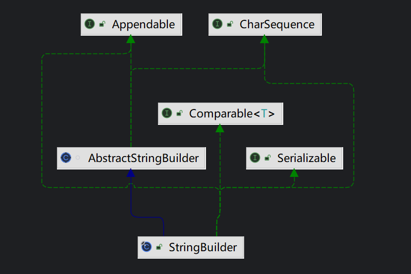

1. 可变字符串，继承了==AbstractString**Builder**==-->继承了char[] value
3. StringBuffer 的直接父类 是 AbstractStringBuilder
4. StringBuffer 实现了 Serializable，即 StringBuffer 的对象可以串行化
5. StringBuffer 对象的字符序列存放在父类中 AbstractStringBuilder 的属性 char [] value中(不是 final)。==**该value本身以及所指向的数组**都是存放在堆中的==-->==常量存储在常量池，变量存储在堆中==
6. StringBuffer 是一个 final 类，不能被继承
7. 因为 StringBuffer 字符内容储存在 char [] value，所有在变化 (增加 / 删除) 不用每次都更换地址 (即不是每次创建新对象)，所以效率高于 String-->当value指向的空间满时，重新创建更大的空间，拷贝后，value指向新空间


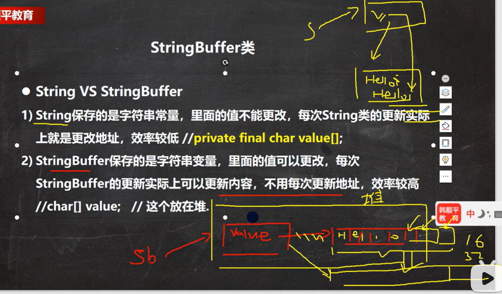

右上角为String,value所指向的空间在常量池；

右下角为StringBuffer,value本身以及所指向的数组都是存放在堆中的

### 3.1 构造函数

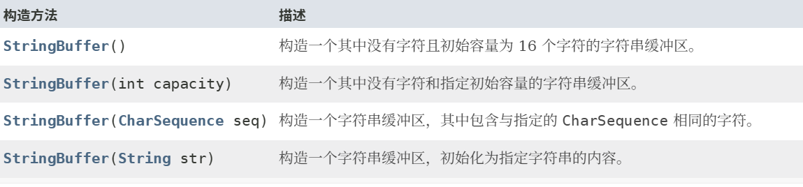

### 3.2 String和StringBuffer的转换

```java
//String->StringBuffer
String str = "123";
//方法1
StringBuffer sb = new StringBuffer(str);
//方法2
StringBuffer sb = new StringBuffer();
sb.append(str);

//StringBuffer->String
//方法1
String str1 = sb.toString();
//方法2
String str1 = new String(sb);
```

### 3.3 常用方法


- delete(),replace()的范围为**[start,end)**

- ==replace()替换的子字符串长度不一定要和目标字符串相同==

- **insert()**:指定索引位置插入**字符串**，==原索引位置的内容后移==

## 4 StringBuilder

StringBuilder和StringBuffer继承和实现的类和接口一致

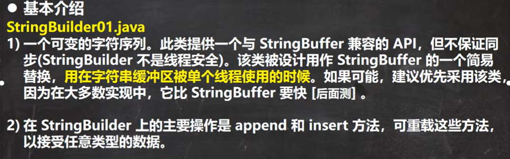


## 5 三种字符串的对比

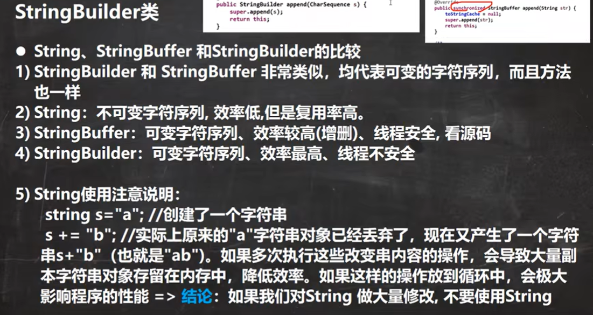


## 6 Math

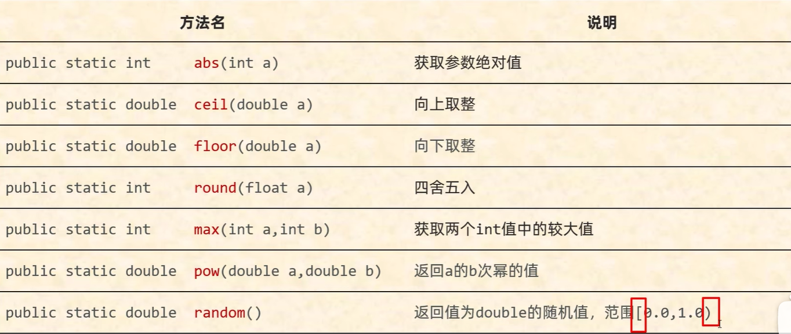

## 7 时间类

**时间的单位换算**

- 1秒 = 1000毫秒
- 1毫秒 = 1000微秒
- 1微秒 = 1000纳秒

**中国标准时间**：世界标准时间 + 8小时-->通常系统自己加

### 7.1 JDK7之前的时间类

#### 7.1.1 Date

```java
//获取系统时间
//这里的Date类是在java.util包
//默认输出的日期格式是国外的方式，因此通常需要对格式进行转换

//1.如何创建Date对象
Date d1 = new Date(); //获取当前系统时间
Date d2 = new Date(9234567); //通过指定毫秒数得到时间：从时间原点开始x毫秒后的时间
System.out.println("当前日期=" + d1);

//2.设置/修改毫秒值
d2.setTime(1000L)//将d2的时间修改为1000毫秒
    
//3.获取某个时间对应的毫秒数：用于时间的比较
System.out.println(d1.getTime()); 
```

#### 7.1.2 SimpleDateFormat

- 格式化：把时间变成我们喜欢的格式  Date-->String
- 解析：把字符串形式的时间变成Date对象  String-->Date

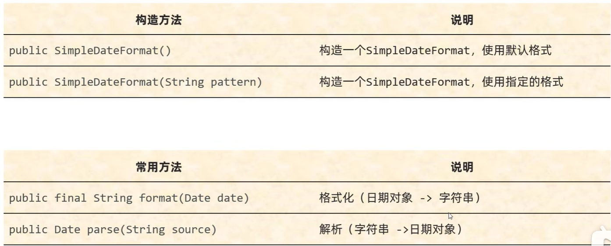

使用parse()时，创建SimpleDateFormat对象的格式要与字符串的格式一致

**常用格式**：

具体查api


```java
//1. 创建 SimpleDateFormat对象，可以指定相应的格式
//2. 这里的格式使用的字母是规定好，不能乱写
Date d1 = new Date();
SimpleDateFormat sdf = new SimpleDateFormat("yyyy年MM月dd日 hh:mm:ss E");
String format = sdf.format(d1); // format:将日期转换成指定格式的字符串
System.out.println("当前日期=" + format);

//1. 可以把一个格式化的String 转成对应的 Date
//2. 得到Date 仍然在输出时，还是按照国外的形式，如果希望指定格式输出，需要转换
//3. 在把String -> Date， 使用的 sdf 格式需要和你给的String的格式一样，否则会抛出转换异常
String s = "1996年01月01日 10:20:30 星期一";
Date parse = sdf.parse(s);
System.out.println("parse=" + sdf.format(parse));
```


#### 7.1.3 Calendar

Calendar是**抽象类**，且构造器是私有化的

##### 构造方法：

用getInstance()获取实例

- 会根据系统的不同时区来获取不同的日历对象

- 会把时间中的纪元，年，月，日，时，分，秒，星期等放到一个数组中
- ==月份的范围为0-11==-->月份+1
- 星期几(DAY_OF_WEEK)：在外国，==周日是一周中的第一天==-->1（周日）,2（周一）,3,4,5,6,7

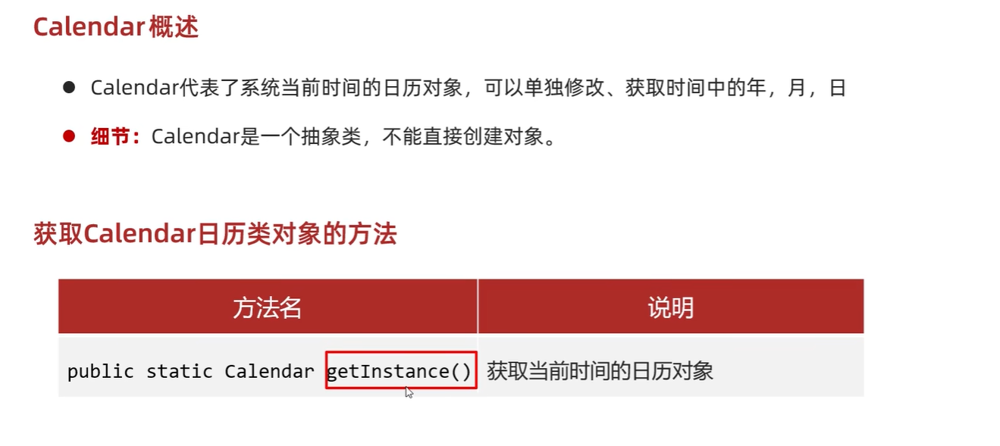

##### 常用方法：

常量查api

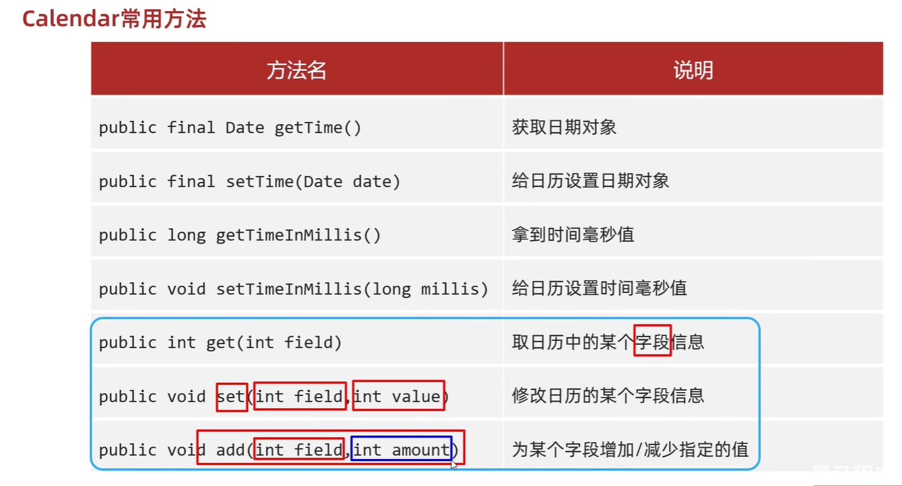


```java
//1. Calendar是一个抽象类，并且构造器是private
//2. 可以通过 getInstance() 来获取实例
//3. 提供大量的方法和字段提供给程序员
//4. Calendar没有提供对应的格式化的类，因此需要程序员自己组合来输出（灵活）
//5. 如果我们需要按照24小时进制来获取时间， Calendar.HOUR-->Calendar.HOUR_OF_DAY

//1.创建日历类对象
Calendar c = Calendar.getInstance(); //比较简单，自由
System.out.println("c=" + c);

//2.获取日历对象的某个日历字段
System.out.println("年: " + c.get(Calendar.YEAR));
// 这里为什么要 + 1，因为Calendar 返回月时候，是按照 0 开始编号
System.out.println("月: " + (c.get(Calendar.MONTH) + 1));
System.out.println("日: " + c.get(Calendar.DAY_OF_MONTH));
System.out.println("小时: " + c.get(Calendar.HOUR));
System.out.println("分钟: " + c.get(Calendar.MINUTE));
System.out.println("秒: " + c.get(Calendar.SECOND));

//3.Calendar 没有专门的格式化方法，所以需要程序员自己来组合显示
System.out.println(c.get(Calendar.YEAR) + "年" + (c.get(Calendar.MONTH) + 1) + "月" + c.get(Calendar.DAY_OF_MONTH) + "日");
```


### 7.2 JDK8新增的时间类

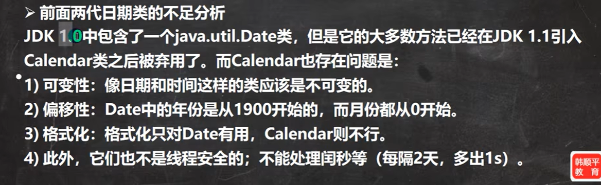

**JDK8新增的时间类**

时间日期对象都是不可变的，解决了线程安全的问题

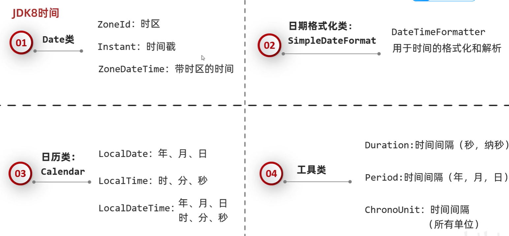

#### 7.2.1 Date类

##### 7.2.1.1 ZoneId:时区

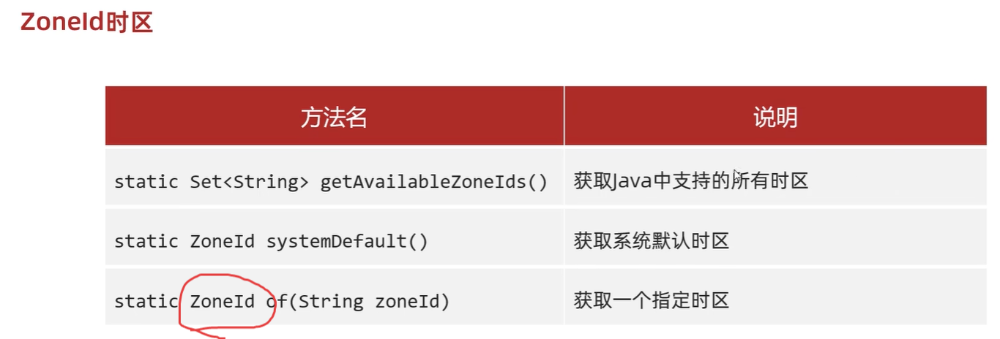

##### 7.2.1.2 Instant:时间戳


##### 7.2.1.3 ZoneDateTime:带时区的时间

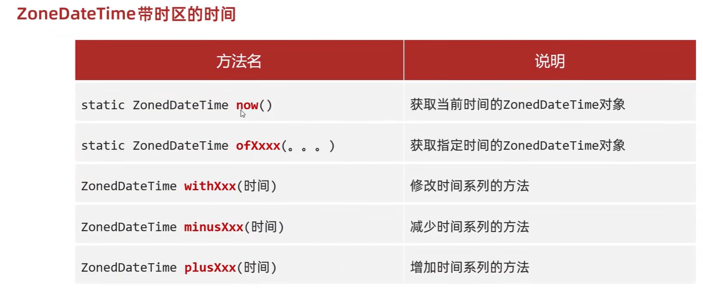

#### 7.2.2 日期格式化类

**DateTimeFormatter**

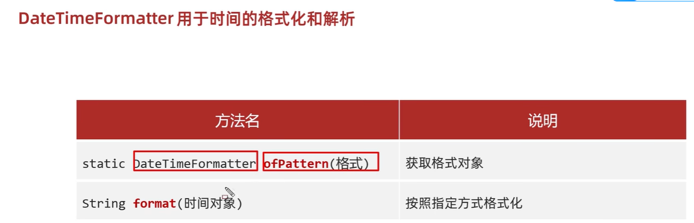

#### 7.2.3 日历类

**LocalDate,LocalTime,LocaDateTime**

==月份为1~12==

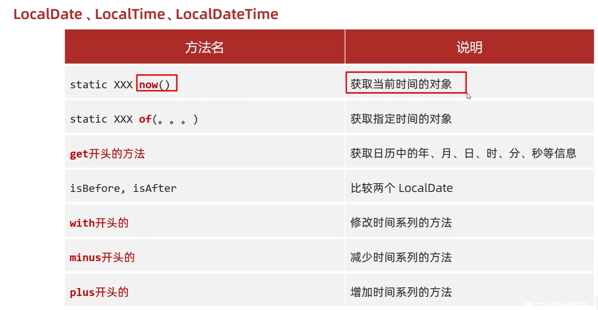

**对象的转换**

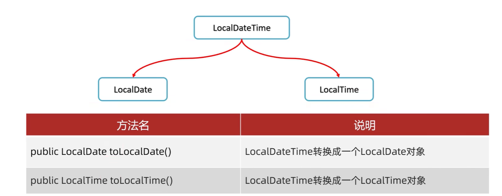


#### 7.2.4 工具类

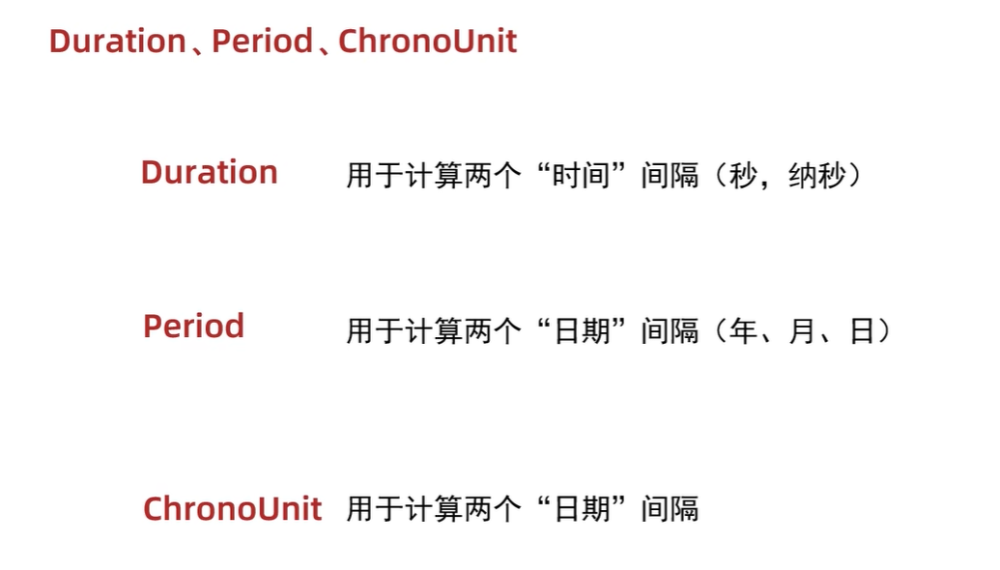


## 8 System

**静态**

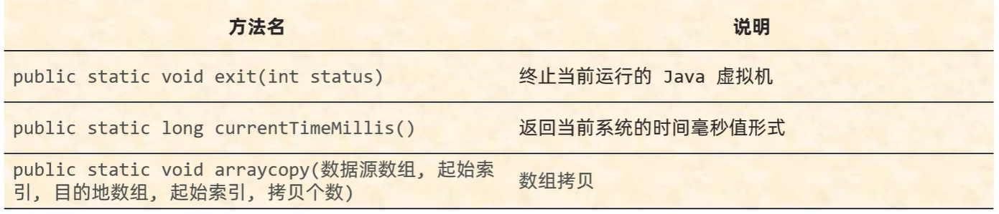


## 9 Arrays

用来操作数组的工具类，不用创建对象，全是静态方法

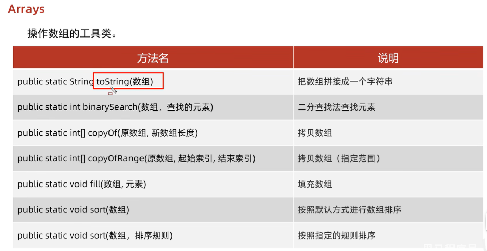

- `binarySearch()`:

  - 数组有序
  - 如果查找的元素真实存在，返回索引
  - 若不存在，返回 ==- x - 1== --> - 1是为了区分索引0，设插入点索引为x

- `copyOf()`

  - 若新数组的长度小于原数组，会==部分拷贝==
  - 若等于，会完全拷贝
  - 若大于，会补上==默认初始值==

- `copyOfRange()`

  - [m,n==)==

- `fill()`

  - 数组中的每个值都替换成所要填充的元素

- `sort()`

  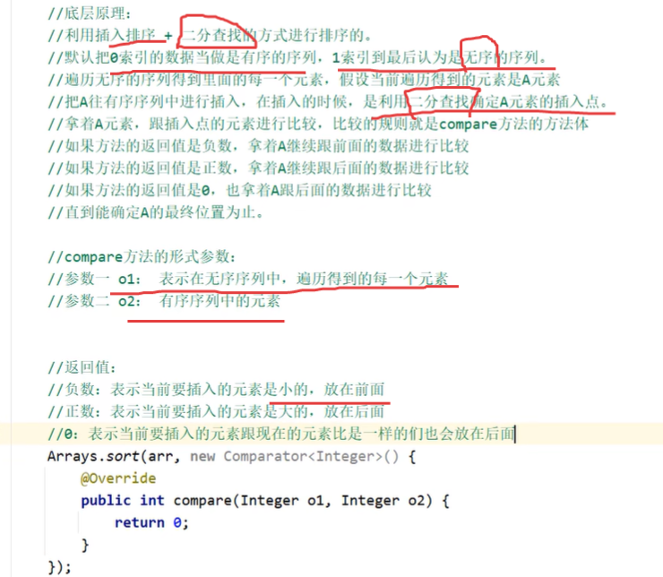

## 10 BigInteger,BigDecimal

**BigInteger**：保存比较大的整型-->创建对象和调用函数时的参数都要转换为字符串

**BigDecimal：**保存精度更高的浮点数

**常用方法**：

1. add()：加
2. subtract()：减
3. multiply()：乘
4. divide()：除-->对于BigDecimal，如果除不尽则会抛出异常，需指定精度

### 10.1 BigInteger

对象一旦创建，记录的值不能发生改变

BigInteger实际有极限，但通常认为无限

#### 构造函数：

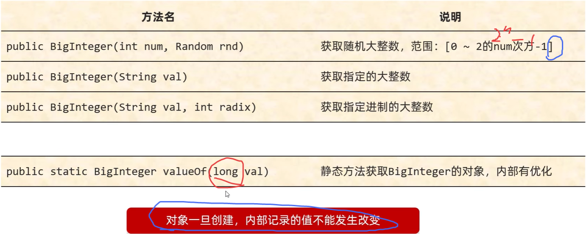

- 获取指定进制大整数

  - 字符串中的数字必须是整数
  - 字符串中的数字必须与进制符合

- valueOf()

  - 能表示的范围比较小，在long的范围内

  - 在内部对常用的数字：-16 ~ 16 进行了优化。

    提前把==-16 ~ 16== 在BigInteger中事先创建好BigInteger的对象，如果多次获取不会重新创建新的

    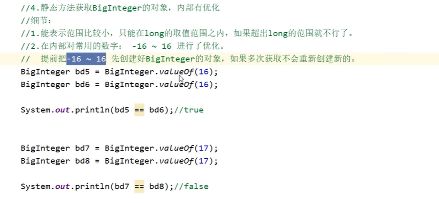

  - 对象一旦创建，记录的值不能发生改变。加减乘除则是创建新的对象

#### 常用方法

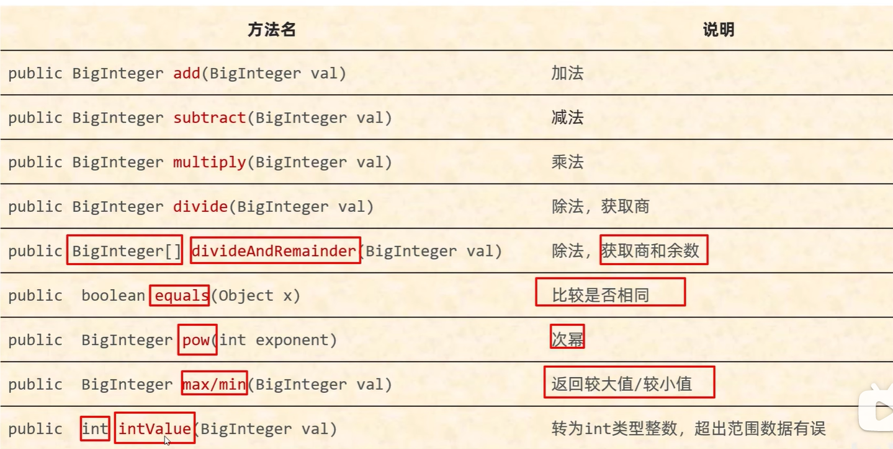

#### 底层存储方式

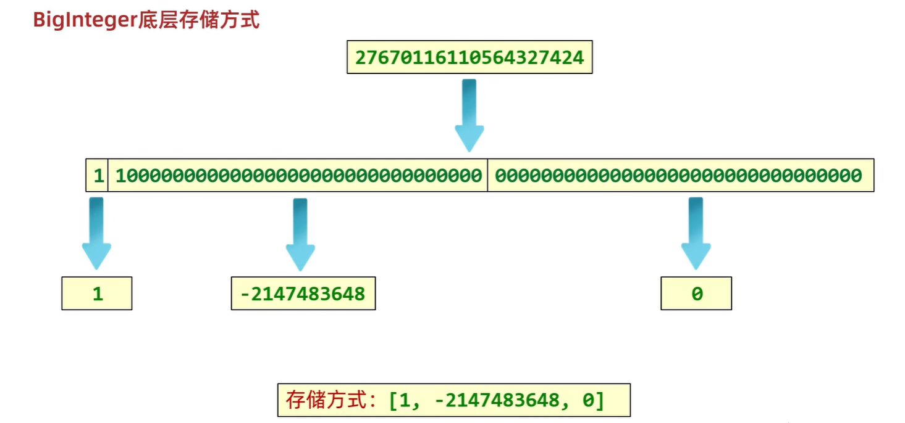

### 10.2 BigDecimal

- 用于小数的精确计算
- 用来表示精度更大的小数

==对象一旦创建，记录的值不能发生改变==

#### 构造方法

```java
//构造方法获取BigDecimal对象
    public BigDecimal(double val)//这种方式有可能不精确，不建议使用
    public BigDecimal(String val)//精确

//静态方法获取BigDecimal对象
    public static BigDecimal valueOf(double val)//精确
```

-  如果要表示的数字不大，没有超出double的取值范围，建议使用静态方法
- 如果要表示的数字比较大，超出了double的取值范围，建议使用构造方法
- 如果我们传递的是0~10之间的整数，包含0，包含10，那么方法会返回已经创建好的对象，不会重新new

#### 常用方法

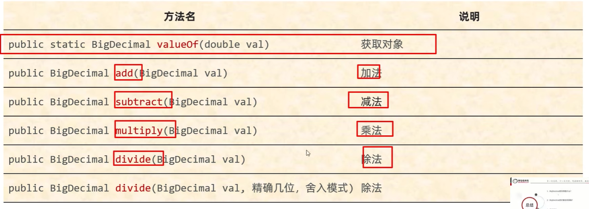

#### 底层存储方式

按字符存储

==负号存储==，正号不存

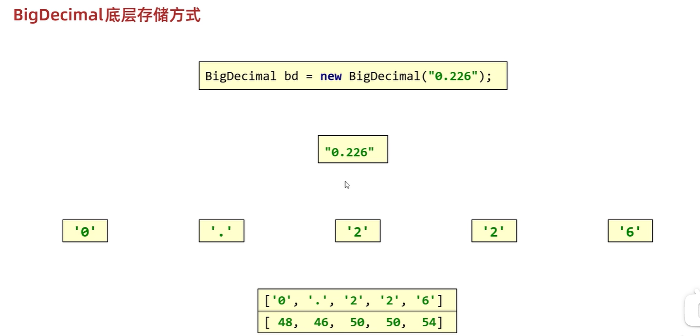

## 11 Runtime

Runtime表示当前虚拟机的运行环境

构造方法私有化，只能通过 `getRuntime()` 获取对象

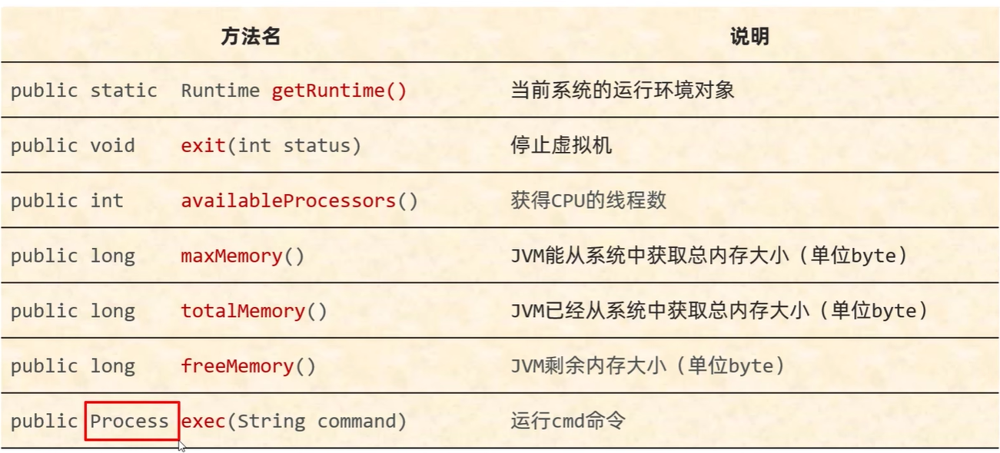

exec():

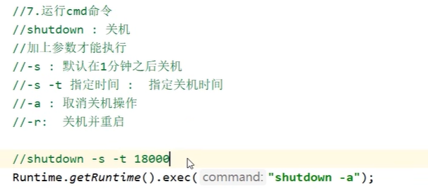


## 12 Object

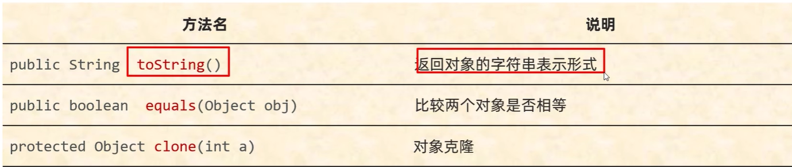

### 12.1 equals()

默认用 == ,需重写

### 12.2 对象克隆

将A对象的属性值完全拷贝给B对象

**对象克隆的分类：**

深克隆和浅克隆，默认浅克隆

#### 12.2.1 浅克隆：

​	不管对象内部的属性是基本数据类型还是引用数据类型，都完全拷贝过来 

​	基本数据类型拷贝过来的是具体的数据，引用数据类型拷贝过来的是地址值。

​	==Object类默认的是浅克隆==-->深克隆需重新clone()


#### 12.2.2 深克隆：

​	==重新clone()==

​	基本数据类型拷贝过来

​	**字符串复用**: B对象的String对象地址和A对象的String对象相同。字符串除了 new, 其他都是指向常量池中的字符串

​	引用数据类型会重新创建新的对象，然后将地址赋给所克隆出的新对象


## 13 对象工具类 Objects

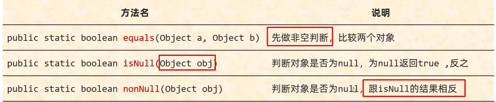

### 13.1 equals()

==底层调用的是参数重写后的equals()==

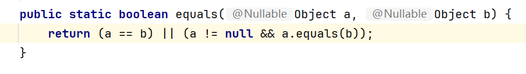


## 14 正则表达式 regex

- 校验字符串是否满足规则
- 在一段文本中查找满足要求的内容

以前的方式

思想：==现将异常情况过滤==

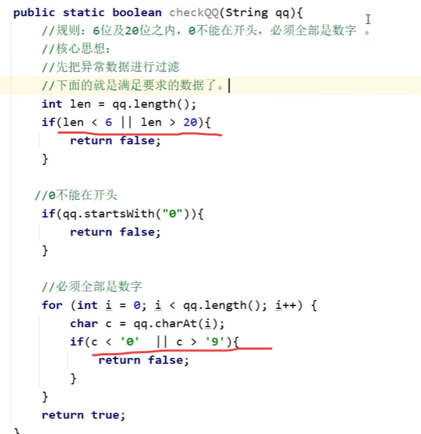

#### 14.1 规则

​	==在Pattern内查==

​	通过String对象的match()调用


- 一个[]只匹配一个字符，若多个字符，则写多个[]

- 若&&写成&，则只代表一个&符号而已，无其他含义
- “-”在[]内表示范围，在外面表示符号
- (?i)表示忽略后方的大小写

- 使用预定义字符时，要转义-->两个\\相当于一个\,如表示“ .”则是“\ \ .”

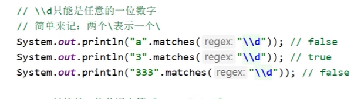

**小结**

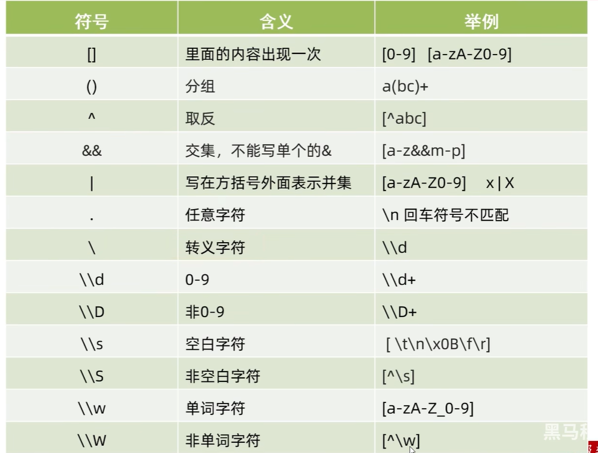

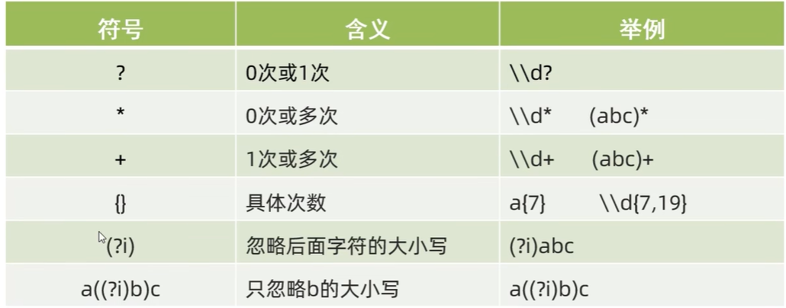

#### 14.2 爬虫

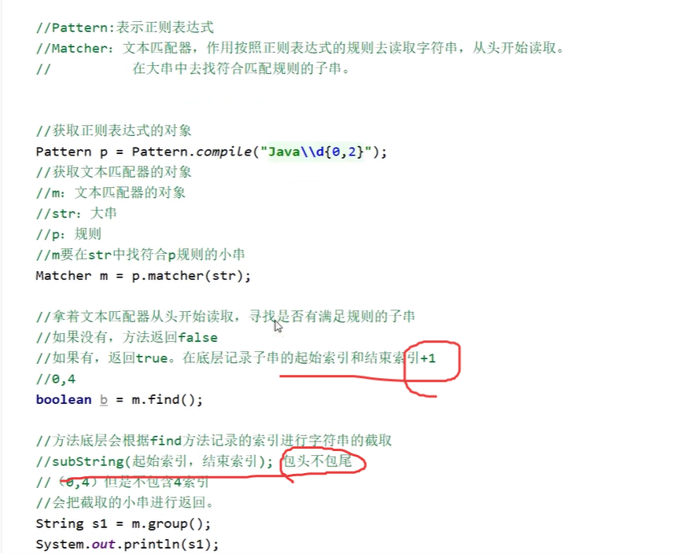

**优化：**

```java
//获取正则表达式的对象
Pattern p = Pattern.compile("正则表达式");
//获取文本匹配器的对象
Matcher m = p.matcher(str);//str为所要爬取的字符串
//拿着文本匹配器从头开始读取，读到一个就停
while(m.find()){
    //group()根据find()记录的索引进行字符串的截取（包头不包尾）
    //group()的int参数代表获取正则表达式的第几组（0：全部，1：第一组...）
    String s = m.group();
    System.out.println(s);
}
```

##### 14.2.1 带条件爬取

题目：

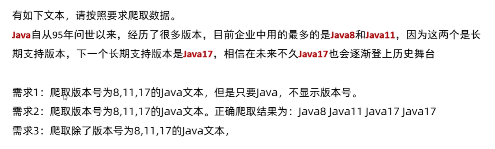

```java
//需求1
//?代表前面的数据(?i)Java
//=表示在java后要跟随的数据，但在爬取时只获取前半部分
String regex1 = "((?i)Java)(?=8|11|17)";

//需求2
//:表示java后要追随的数据，爬取时获取全部
String regex1 = "((?i)Java)(?:8|11|17)";//1
String regex1 = "((?i)Java)(8|11|17)";//2

//需求3
//!表示去除
String regex1 = "((?i)Java)(?!8|11|17)";
```

##### 14.2.2 贪婪爬取和非贪婪爬取

- 贪婪爬取：在爬取数据时尽可能==多==获取数据

- 非贪婪爬取：在爬取数据时尽可能==少==获取数据

java中默认贪婪爬取

如果我们在数量词+、 * 的后面加上?，则为非贪婪爬取

#### 14.3 正则表达式在字符串中的应用

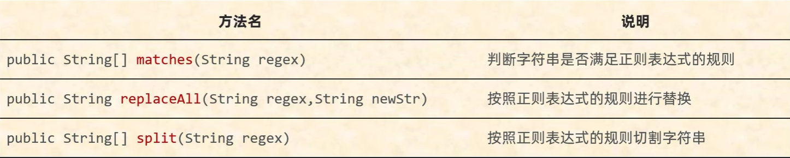

#### 14.4 分组

分组就是()


##### 14.4.1 捕获分组

后续还要继续使用本组数据

- \ \ 组号：表示在正则表达式==中==，把第x组的==内容==（不是正则表达式的内容，而是==字符串的内容==）再拿出来用一次
- $组号：表示在正则表达式==外==，把第x组的==内容==再拿出来用一次

**例题：**

判断一个字符串的某部分==是否一致==

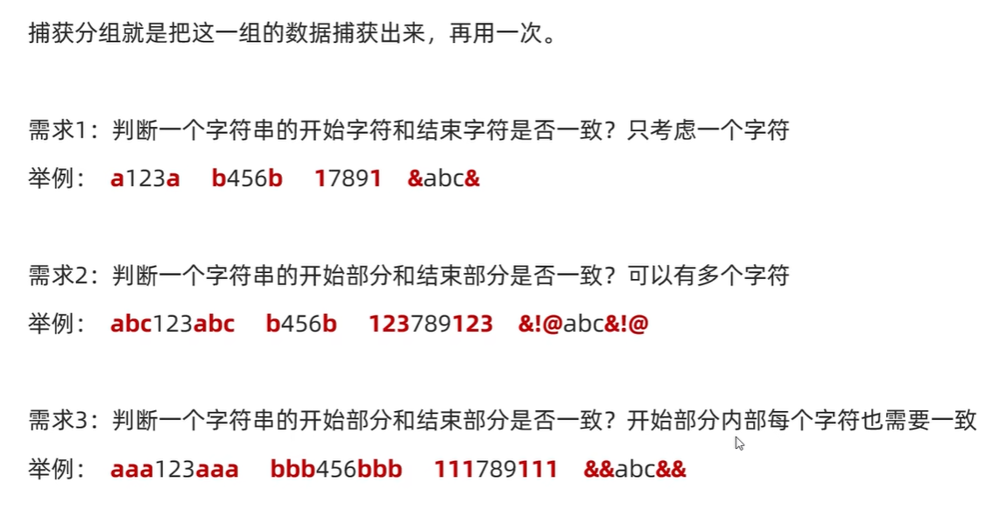

```java
//需求1
String regex = "(.).+\\1";

//需求2
String regex = "(.+).+\\1";

//需求3
String regex = "((.)\\2*).+\\1"
    
//需求：
//将字符串：我要学学编编编编程程程程程程程
//替换为：我要学编程*/
String s = "我要学学编编编编程程程程程程程";
String result = s.replaceAll("(.)\\1+","$1");//$1,将在正则表达式外，把第x组的内容再拿出来用一次
```

##### 14.4.2 非捕获分组

分组之后不需要再用本组数据，仅仅是把数据括起来

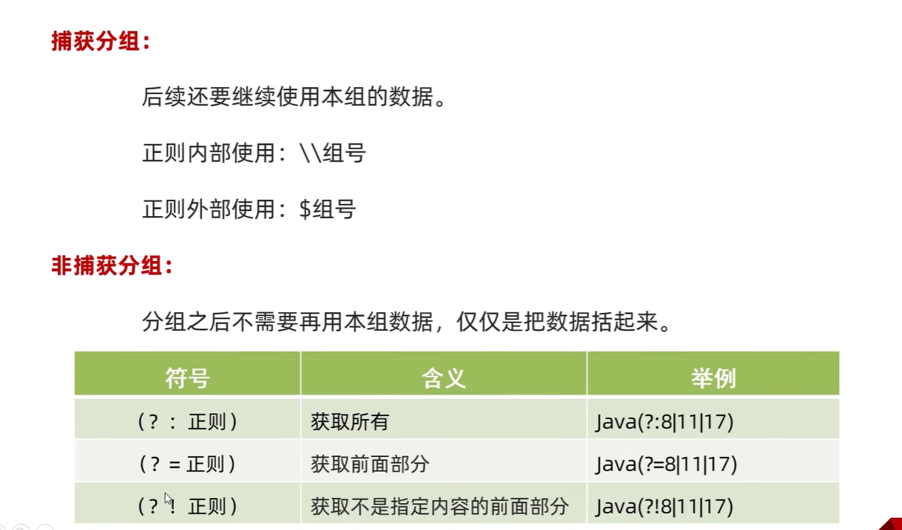


## 15 Lambda表达式

只能用于==函数式接口==，而不是抽象类

替换==匿名内部类==

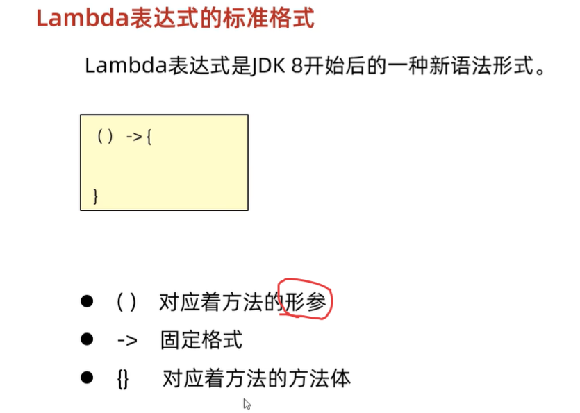

**格式**


**lambda的省略规则：**

可推倒，可省略

1. 参数类型可以省略不写。
2. 如果只有一个参数，参数类型可以省略，同时()也可以省略。
3. 如果Lambda表达式的==方法体==只有一行，大括号，**分号**，==return==可以省略不写，需要==同时省略==。

