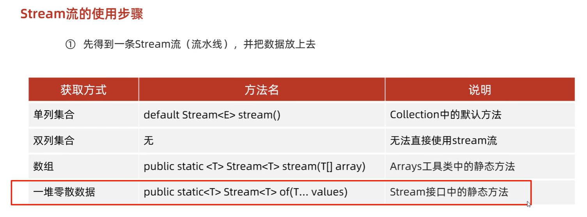
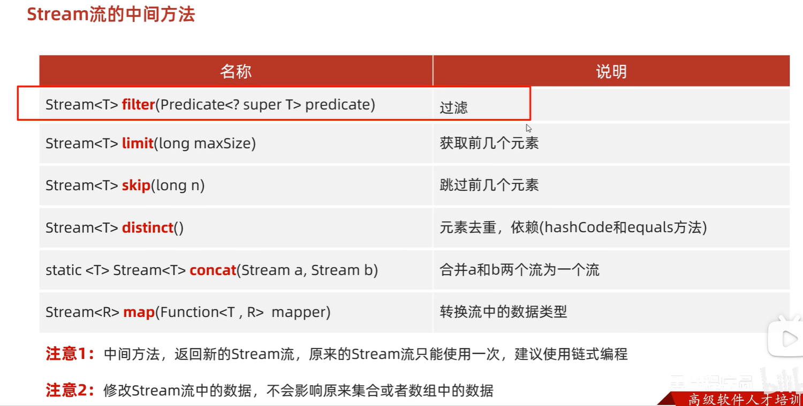

## 1.不可变集合

是一个长度不可变，内容也无法修改的集合

### 1.3 不可变集合分类

* 不可变的list集合
* 不可变的set集合
  * 创建不可变集合时，必须保证元素唯一，否则报错

* 不可变的map集合

### 1.4 不可变的list和Set集合

```java
//list
List<String> list = List.of("张三", "李四", "王五", "赵六");
//Set
Set<String> set = Set.of("张三", "张三", "李四", "王五", "赵六");
```

### 1.6 不可变的Map集合

- 键是不能重复的
- Map里面的of方法，参数是有上限的，最多只能传递20个参数，10个键值对
  - 相邻的两个参数，前一个为键，后一个为值
- 如果我们要传递多个键值对对象，数量大于10个，在Map接口中还有一个方法
  - `static <K, V> Map<K, V> ofEntries(Entry<? extends K, ? extends V>... entries)`
  - `static <K, V> Map<K, V> copyOf(Map<? extends K, ? extends V> map) `:jdk10之后才有，底层是`ofEntries()`

#### 1.6.1：键值对个数小于等于10

```java
//一旦创建完毕之后，是无法进行修改的，在下面的代码中，只能进行查询操作
Map<String, String> map = Map.of("张三", "南京", "张三", "北京", "王五", "上海",
                "赵六", "广州", "孙七", "深圳", "周八", "杭州",
                "吴九", "宁波", "郑十", "苏州", "刘一", "无锡",
                "陈二", "嘉兴");

```

#### 1.6.2：键值对个数大于10

```java
public class ImmutableDemo4 {
    public static void main(String[] args) {

        /*
            创建Map的不可变集合,键值对的数量超过10个
        */

        //1.创建一个普通的Map集合
        HashMap<String, String> hm = new HashMap<>();
        hm.put("张三", "南京");
        hm.put("李四", "北京");
        hm.put("王五", "上海");
        hm.put("赵六", "北京");
        hm.put("孙七", "深圳");
        hm.put("周八", "杭州");
        hm.put("吴九", "宁波");
        hm.put("郑十", "苏州");
        hm.put("刘一", "无锡");
        hm.put("陈二", "嘉兴");
        hm.put("aaa", "111");

        //2.利用上面的数据来获取一个不可变的集合

        //(1)使用ofEntry()
        //获取到所有的键值对对象（Entry对象）
        Set<Map.Entry<String, String>> entries = hm.entrySet();
        //把entries变成一个数组
        Map.Entry[] arr1 = new Map.Entry[0];//创建一个长度为0的数组，确保toArray 一定会重新创建一条“刚好够长”的新数组
        //toArray方法在底层会比较集合的长度跟数组的长度两者的大小
        //如果集合的长度 > 数组的长度 ：数据在数组中放不下，此时会根据实际数据的个数，重新创建数组
        //如果集合的长度 <= 数组的长度：数据在数组中放的下，此时不会创建新的数组，而是直接用
        Map.Entry[] arr2 = entries.toArray(arr1);
        //不可变的map集合
        Map map = Map.ofEntries(arr2);

		//(1)的简洁写法
        Map<Object, Object> map = Map.ofEntries(hm.entrySet().toArray(new Map.Entry[0]));

        //(2)使用copyOf()-->底层是(1)的简洁写法
        Map<String, String> map = Map.copyOf(hm);//从可变集合变为不可变集合
        map.put("bbb","222");
    }
}
```

## 2.Stream流

Stream流的好处

- 直接阅读代码的字面意思即可完美展示无关逻辑方式的语义：获取流、过滤姓张、过滤长度为3、逐一打印
- Stream流把真正的函数式编程风格引入到Java中
- 代码简洁

### 2.2Stream流的常见生成方式

- Stream流的三类方法

  - 获取Stream流
    - 创建一条流水线,并把数据放到流水线上准备进行操作
  - 中间方法
    - 流水线上的操作
    - 一次操作完毕之后,还可以继续进行其他操作
  - 终结方法
    - 一个Stream流只能有一个终结方法
    - 是流水线上的最后一个操作

- 生成Stream流的方式

  

  Stream流的of()不能传递基本数据类型的数组

  代码演示

  ```java
  public class StreamDemo {
      public static void main(String[] args) {
          //Collection体系的集合可以使用默认方法stream()生成流
          List<String> list = new ArrayList<String>();
          Stream<String> listStream = list.stream();
  
          Set<String> set = new HashSet<String>();
          Stream<String> setStream = set.stream();
  
          //Map体系的集合间接的生成流
          Map<String,Integer> map = new HashMap<String, Integer>();
          Stream<String> keyStream = map.keySet().stream();
          Stream<Integer> valueStream = map.values().stream();
          Stream<Map.Entry<String, Integer>> entryStream = map.entrySet().stream();
  
          //数组可以通过Arrays中的静态方法stream生成流
          String[] strArray = {"hello","world","java"};
          Stream<String> strArrayStream = Arrays.stream(strArray);
        
        	//同种数据类型的多个数据可以通过Stream接口的静态方法of(T... values)生成流
          Stream<String> strArrayStream2 = Stream.of("hello", "world", "java");
          Stream<Integer> intStream = Stream.of(10, 20, 30);
      }
  }
  ```


### 2.3Stream流中间操作方法

- 概念

  中间操作的意思是,执行完此方法之后,Stream流依然可以继续执行其他操作

- 常见方法



`sorted()`： `Stream<T> sorted(Comparator<? super T> comparator);`:排序

- filter代码演示

  ```java
  public class MyStream3 {
      public static void main(String[] args) {
  //        Stream<T> filter(Predicate predicate)：过滤
  //        Predicate接口中的方法	boolean test(T t)：对给定的参数进行判断，返回一个布尔值
  
          ArrayList<String> list = new ArrayList<>();
          list.add("张三丰");
          list.add("张无忌");
          list.add("张翠山");
          list.add("王二麻子");
          list.add("张良");
          list.add("谢广坤");
  
          //filter方法获取流中的 每一个数据.
          //而test方法中的s,就依次表示流中的每一个数据.
          //我们只要在test方法中对s进行判断就可以了.
          //如果判断的结果为true,则当前的数据留下
          //如果判断的结果为false,则当前数据就不要.
  //        list.stream().filter(
  //                new Predicate<String>() {
  //                    @Override
  //                    public boolean test(String s) {
  //                        boolean result = s.startsWith("张");
  //                        return result;
  //                    }
  //                }
  //        ).forEach(s-> System.out.println(s));
  
          //因为Predicate接口中只有一个抽象方法test
          //所以我们可以使用lambda表达式来简化
  //        list.stream().filter(
  //                (String s)->{
  //                    boolean result = s.startsWith("张");
  //                        return result;
  //                }
  //        ).forEach(s-> System.out.println(s));
  
          list.stream().filter(s ->s.startsWith("张")).forEach(s-> System.out.println(s));
  
      }
  }
  ```

- limit&skip代码演示

  ```java
  public class StreamDemo02 {
      public static void main(String[] args) {
          //创建一个集合，存储多个字符串元素
          ArrayList<String> list = new ArrayList<String>();
  
          list.add("林青霞");
          list.add("张曼玉");
          list.add("王祖贤");
          list.add("柳岩");
          list.add("张敏");
          list.add("张无忌");
  
          //需求1：取前3个数据在控制台输出
          list.stream().limit(3).forEach(s-> System.out.println(s));
          System.out.println("--------");
  
          //需求2：跳过3个元素，把剩下的元素在控制台输出
          list.stream().skip(3).forEach(s-> System.out.println(s));
          System.out.println("--------");
  
          //需求3：跳过2个元素，把剩下的元素中前2个在控制台输出
          list.stream().skip(2).limit(2).forEach(s-> System.out.println(s));
      }
  }
  ```

- concat&distinct代码演示

  ```java
  public class StreamDemo03 {
      public static void main(String[] args) {
          //创建一个集合，存储多个字符串元素
          ArrayList<String> list = new ArrayList<String>();
  
          list.add("林青霞");
          list.add("张曼玉");
          list.add("王祖贤");
          list.add("柳岩");
          list.add("张敏");
          list.add("张无忌");
  
          //需求1：取前4个数据组成一个流
          Stream<String> s1 = list.stream().limit(4);
  
          //需求2：跳过2个数据组成一个流
          Stream<String> s2 = list.stream().skip(2);
  
          //需求3：合并需求1和需求2得到的流，并把结果在控制台输出
  //        Stream.concat(s1,s2).forEach(s-> System.out.println(s));
  
          //需求4：合并需求1和需求2得到的流，并把结果在控制台输出，要求字符串元素不能重复
          Stream.concat(s1,s2).distinct().forEach(s-> System.out.println(s));
      }
  }
  ```

- map代码演示

```java
ArrayList<String> list = new ArrayList<>();
Collections.addAll(list, "张无忌-15", "周芷若-14", "赵敏-13", "张强-20", "张三丰-100", "张翠山-40", "张良-35", "王二麻子-37");
// 需求：只获取里面的年龄并进行打印
// String->int

// 第一个类型：流中原本的数据类型
// 第二个类型：要转换成之后的类型

// apply的形参s：依次表示流里面的每一个数据
// 返回值：表示转换之后的数据

// 当map方法执行完毕之后，流上的数据就变成了整数
// 所以在下面forEach当中，s依次表示流里面的每一个数据，这个数据现在就是整数了
list.stream().map(new Function<String, Integer>() {
    @Override
    public Integer apply(String s) {
        String[] arr = s.split("-");
        String ageString = arr[1];
        int age = Integer.parseInt(ageString);
        return age;
    }
}).forEach(s -> System.out.println(s));

//lamda表达式
list.stream()
    .map(s->Integer.parseInt(s.split("-")[1]))
    .forEach(s->System.out.println(s));
```


### 2.4Stream流终结操作方法

- 概念

  终结操作的意思是,执行完此方法之后,Stream流将不能再执行其他操作

- 常见方法

  | 方法名                           | 说明           |
  | ----------------------------- | ------------ |
  | void forEach(Consumer action) | 对此流的每个元素执行操作 |
  | long count()                  | 返回此流中的元素数    |

- 代码演示

  ```java
  public class MyStream5 {
      public static void main(String[] args) {
          ArrayList<String> list = new ArrayList<>();
          list.add("张三丰");
          list.add("张无忌");
          list.add("张翠山");
          list.add("王二麻子");
          list.add("张良");
          list.add("谢广坤");
  
          //method1(list);
          
  //        long count()：返回此流中的元素数
          long count = list.stream().count();
          System.out.println(count);
      }
  
      private static void method1(ArrayList<String> list) {
          //  void forEach(Consumer action)：对此流的每个元素执行操作
          //  Consumer接口中的方法void accept(T t)：对给定的参数执行此操作
          //在forEach方法的底层,会循环获取到流中的每一个数据.
          //并循环调用accept方法,并把每一个数据传递给accept方法
          //s就依次表示了流中的每一个数据.
          //所以,我们只要在accept方法中,写上处理的业务逻辑就可以了.
          list.stream().forEach(
                  new Consumer<String>() {
                      @Override
                      public void accept(String s) {
                          System.out.println(s);
                      }
                  }
          );
        
          System.out.println("====================");
          //lambda表达式的简化格式
          //是因为Consumer接口中,只有一个accept方法
          list.stream().forEach(
                  (String s)->{
                      System.out.println(s);
                  }
          );
          System.out.println("====================");
          //lambda表达式还是可以进一步简化的.
          list.stream().forEach(s->System.out.println(s));
      }
  }
  ```

### 2.5Stream流的收集操作（终结）

- 概念

  对数据使用Stream流的方式操作完毕后,可以把流中的数据收集到数组或集合中

- 常用方法

  | 方法名                                       | 说明                       |
  | -------------------------------------------- | -------------------------- |
  | <A> A[] toArray(IntFunction<A[]> generator); | 收集流中的数据，放到数组中 |
  | R collect(Collector collector)               | 把结果收集到集合中         |

- 工具类Collectors提供了具体的收集方式

  | 方法名                                                       | 说明                   |
  | ------------------------------------------------------------ | ---------------------- |
  | public static <T> Collector toList()                         | 把元素收集到List集合中 |
  | public static <T> Collector toSet() -->用于去重              | 把元素收集到Set集合中  |
  | public static  Collector toMap(Function keyMapper,Function valueMapper) | 把元素收集到Map集合中  |

- toArray代码演示

```java
// toArray() 无参，返回Object[]
Object[] arr1 = list.stream().toArray();
System.out.println(Arrays.toString(arr1));

//有参
// IntFunction的泛型：具体类型的数组
// apply的形参：流中数据的个数，要跟数组的长度保持一致
// apply的返回值：具体类型的数组
// 方法体：就是创建数组

// toArray方法的参数的作用：负责创建一个指定类型的数组
// toArray方法的底层，会依次得到流里面的每一个数据，并把数据放到数组当中
// toArray方法的返回值：是一个装着流里面所有数据的数组
String[] arr = list.stream().toArray(new IntFunction<String[]>() {
    @Override
    public String[] apply(int value) {
        return new String[value];
    }
}); 
System.out.println(Arrays.toString(arr));

//Lambda表达式
String[] arr2 = list.stream().toArray(value -> new String[value]);
```

- collect代码演示

  - toSet():去重
  - toMap():两个参数都相当于map()-->要注意键不能重复

  ```java
  // toList和toSet方法演示 
  public class MyStream7 {
      public static void main(String[] args) {
          ArrayList<Integer> list1 = new ArrayList<>();
          for (int i = 1; i <= 10; i++) {
              list1.add(i);
          }
  
          list1.add(10);
          list1.add(10);
          list1.add(10);
          list1.add(10);
          list1.add(10);
  
          //filter负责过滤数据的.
          //collect负责收集数据.
          //获取流中剩余的数据,但是他不负责创建容器,也不负责把数据添加到容器中.
          //Collectors.toList() : 在底层会创建一个List集合.并把所有的数据添加到List集合中.
          List<Integer> list = list1.stream().filter(number -> number % 2 == 0)
                  .collect(Collectors.toList());
  
          System.out.println(list);
  
          //toSet()：去重
      	Set<Integer> set = list1.stream().filter(number -> number % 2 == 0)
              	.collect(Collectors.toSet());
      	System.out.println(set);
  	}
  }
  /**
  Stream流的收集方法 toMap方法演示
  创建一个ArrayList集合，并添加以下字符串。字符串中前面是姓名，后面是年龄
  "zhangsan,23"
  "lisi,24"
  "wangwu,25"
  保留年龄大于等于24岁的人，并将结果收集到Map集合中，姓名为键，年龄为值
  */
  public class MyStream8 {
  	public static void main(String[] args) {
        	ArrayList<String> list = new ArrayList<>();
          list.add("zhangsan,23");
          list.add("lisi,24");
          list.add("wangwu,25");
  
          Map<String, Integer> map = list.stream().filter(
                  s -> {
                      String[] split = s.split(",");
                      int age = Integer.parseInt(split[1]);
                      return age >= 24;
                  }
  
           //   collect方法只能获取到流中剩余的每一个数据.
           //在底层不能创建容器,也不能把数据添加到容器当中
  
           //Collectors.toMap 创建一个map集合并将数据添加到集合当中
  
            /**
               * toMap：参数一表示键的生成规则
               * 参数二表示值的生成规则-->相当于两个map()
               * 
               * 参数一：
               * Function泛型一：表示流中每一个数据的类型
               * 泛型二：表示Map集合中键的数据类型
               * 
               * 方法apply形参：依次表示流里面的每一个数据
               * 方法体：生成键的代码
               * 返回值：已经生成的键
               * 
               * 参数二：
               * Function泛型一：表示流中每一个数据的类型
               * 泛型二：表示Map集合中值的数据类型
               * 
               * 方法apply形参：依次表示流里面的每一个数据
               * 方法体：生成值的代码
               * 返回值：已经生成的值
               */
          )..collect(Collectors.toMap(
                              new Function<String, String>() {
                                  @Override
                                  public String apply(String s) {
                                      // 张无忌-男-15
                                      return s.split(",")[0];
                                  }
                              },
                              new Function<String, Integer>() {
                                  @Override
                                  public Integer apply(String s) {
                                      return Integer.parseInt(s.split(",")[1]);
                                  }
                              }
                          ));
  
          System.out.println(map);
  	}
  }
  
  ```

### 2.6Stream流综合练习

- 案例需求

  现在有两个ArrayList集合，分别存储6名男演员名称和6名女演员名称，要求完成如下的操作

  - 男演员只要名字为3个字的前三人
  - 女演员只要姓林的，并且不要第一个
  - 把过滤后的男演员姓名和女演员姓名合并到一起
  - 把上一步操作后的元素作为构造方法的参数创建演员对象,遍历数据

  演员类Actor已经提供，里面有一个成员变量，一个带参构造方法，以及成员变量对应的get/set方法

- 代码实现

  演员类
  ```java
  public class Actor {
      private String name;
  
      public Actor(String name) {
          this.name = name;
      }
  
      public String getName() {
          return name;
      }
  
      public void setName(String name) {
          this.name = name;
      }
  }
  ```

  测试类

  ```java
  public class StreamTest {
      public static void main(String[] args) {
          //创建集合
          ArrayList<String> manList = new ArrayList<String>();
          manList.add("周润发");
          manList.add("成龙");
          manList.add("刘德华");
          manList.add("吴京");
          manList.add("周星驰");
          manList.add("李连杰");
    
          ArrayList<String> womanList = new ArrayList<String>();
          womanList.add("林心如");
          womanList.add("张曼玉");
          womanList.add("林青霞");
          womanList.add("柳岩");
          womanList.add("林志玲");
          womanList.add("王祖贤");
    
          //男演员只要名字为3个字的前三人
          Stream<String> manStream = manList.stream().filter(s -> s.length() == 3).limit(3);
    
          //女演员只要姓林的，并且不要第一个
          Stream<String> womanStream = womanList.stream().filter(s -> s.startsWith("林")).skip(1);
    
          //把过滤后的男演员姓名和女演员姓名合并到一起
          Stream<String> stream = Stream.concat(manStream, womanStream);
    
        	// 将流中的数据封装成Actor对象之后打印
        	stream.forEach(name -> {
              Actor actor = new Actor(name);
              System.out.println(actor);
          }); 
      }
  }
  ```

## 3.方法引用

### 3.1方法引用前提和技巧

**前提**

- 需要有==函数式接口==
- 被引用方法必须已经存在
- 被引用方法的形参和返回值需要跟抽象方法保持一致
- 被引用方法的功能要满足当前的需求

**技巧**

- 有没有一个方法满足我的需求
- 如果有，判断该方法是否满足引用规则

### 3.2方法引用符

- 方法引用符

  ::  该符号为引用运算符，而它所在的表达式被称为方法引用

- 推导与省略

  - 如果使用Lambda，那么根据“可推导就是可省略”的原则，无需指定参数类型，也无需指定的重载形式，它们都将被自动推导
  - 如果使用方法引用，也是同样可以根据上下文进行推导
  - 方法引用是Lambda的孪生兄弟

### 3.3引用静态方法

​	引用类方法，其实就是引用类的静态方法

- 格式

  类名::静态方法

- 使用说明

  Lambda表达式被类方法替代的时候，它的形式参数全部传递给静态方法作为参数

- 代码演示

  ```java
  public interface Converter {
      int convert(String s);
  }
  
  public class ConverterDemo {
      public static void main(String[] args) {
  
  		//Lambda写法
          useConverter(s -> Integer.parseInt(s));
  
          //引用类方法
          useConverter(Integer::parseInt);
  
      }
  
      private static void useConverter(Converter c) {
          int number = c.convert("666");
          System.out.println(number);
      }
  }
  ```

### 3.4引用成员方法（对象）

​	引用对象的实例方法，其实就引用类中的成员方法

- 格式

  对象::成员方法

  - 其他类：其他类对象::方法名
  - 本类：this::方法名
  - 父类：super::方法名-->==静态方法中没有this，super==,要  new 本类对象::方法名

- 使用说明

  Lambda表达式被对象的实例方法替代的时候，它的形式参数全部传递给该方法作为参数

- 代码演示

  ```java
  public class PrintString {
      //把字符串参数变成大写的数据，然后在控制台输出
      public void printUpper(String s) {
          String result = s.toUpperCase();
          System.out.println(result);
      }
  }
  
  public interface Printer {
      void printUpperCase(String s);
  }
  
  public class PrinterDemo {
      public static void main(String[] args) {
  
  		//Lambda简化写法
          usePrinter(s -> System.out.println(s.toUpperCase()));
  
          //引用对象的实例方法
          PrintString ps = new PrintString();
          usePrinter(ps::printUpper);
  
      }
  
      private static void usePrinter(Printer p) {
          p.printUpperCase("HelloWorld");
      }
  }
  
  ```

### 3.5引用成员方法（类名）

通过类名引用成员方法

- 格式

  类名::成员方法

- 使用说明

  ​    Lambda表达式被类的实例方法替代的时候
  ​    ==第一个参数作为调用者==
  ​    ==后面的参数全部传递给该方法作为参数==

- 局限性

  只能引用第一个参数所代表的类的成员方法

- 代码演示

  ```java
  public interface MyString {
      String mySubString(String s,int x,int y);
  }
  
  public class MyStringDemo {
      public static void main(String[] args) {
  		//Lambda简化写法
          useMyString((s,x,y) -> s.substring(x,y));
  
          //引用类的实例方法
          useMyString(String::substring);
  
      }
  
      private static void useMyString(MyString my) {
          String s = my.mySubString("HelloWorld", 2, 5);
          System.out.println(s);
      }
  }
  ```

### 3.6引用构造器

​	引用构造器，其实就是引用构造方法

- l格式

  类名::new

- 使用说明

  Lambda表达式被构造器替代的时候，它的形式参数全部传递给构造器作为参数

- 代码演示

  ```java
  public class Student {
      private String name;
      private int age;
  
      public Student() {
      }
  
      public Student(String name, int age) {
          this.name = name;
          this.age = age;
      }
  
      public String getName() {
          return name;
      }
  
      public void setName(String name) {
          this.name = name;
      }
  
      public int getAge() {
          return age;
      }
  
      public void setAge(int age) {
          this.age = age;
      }
  }
  
  public interface StudentBuilder {
      Student build(String name,int age);
  }
  
  public class StudentDemo {
      public static void main(String[] args) {
  
  		//Lambda简化写法
          useStudentBuilder((name,age) -> new Student(name,age));
  
          //引用构造器
          useStudentBuilder(Student::new);
  
      }
  
      private static void useStudentBuilder(StudentBuilder sb) {
          Student s = sb.build("林青霞", 30);
          System.out.println(s.getName() + "," + s.getAge());
      }
  }
  ```

### 3.7引用数组的构造器

- 格式

  数据类型[]::new

- 细节：

  数组的类型要与流中数据类型保持一致
