## 集合体系结构图

### 数组和集合的区别

- 相同点

  都是容器,可以存储多个数据

- 不同点

  - 数组的长度是不可变的,集合的长度是==可变==的

  - 数组可以存基本数据类型和引用数据类型

    集合只能存==引用==数据类型,如果要存基本数据类型,需要存==对应的包装类==

### 集合和数组的优势对比：

1. 长度可变
2. 添加数据的时候不需要考虑索引，==默认将数据添加到末尾==

**蓝色是接口，红色是类**


## 1.Collection集合

### 1.1 Collection 集合概述和使用

- Collection集合概述

  - 是==单例集合==的顶层接口,它表示一组对象,这些对象也称为Collection的元素
  - JDK 不提供此接口的任何直接实现.它提供更具体的子接口(如Set和List)实现

- 创建Collection集合的对象

  - 多态的方式
  - 具体的实现类ArrayList

- Collection集合常用方法


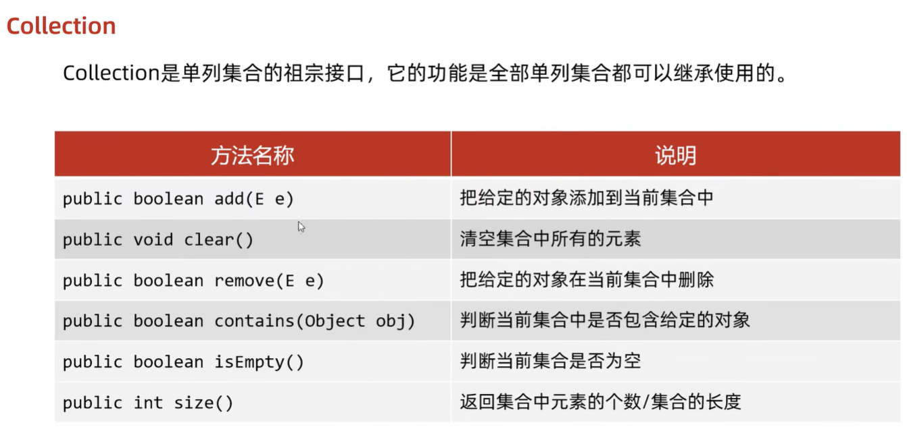

**细节：**

- `add(E e)`:

  - 如果我们要往List系列集合中添加数据，那么方法永远返回true，因为List系列的是允许元素重复的。
  - 如果我们要往Set系列集合中添加数据，如果当前要添加元素不存在，方法返回true，表示添加成功。
    如果当前要添加的元素已经存在，方法返回false，表示添加失败。因为Set系列的集合不允许重复。

- `remove(E e)`:

  - 因为Collection里面定义的是共性的方法，所以此时不能通过==索引==(Set没有)进行删除。只能通过元素的对象进行删除。
  - 方法会有一个布尔类型的返回值，删除成功返回true，删除失败返回false
    如果要删除的元素不存在，就会删除失败。

- `contains(Object obj)`:

  - 底层是依赖==equals==方法进行判断是否存在的。
    如果集合中存储的是自定义对象，也想通过contains方法来判断是否包含，那么在javabean类中，一定要==重写equals方法==。

    

### 1.2 Collection集合的遍历

#### 1.2.1 迭代器遍历

不依赖索引

==iterator对象通过Collecton对象调用iterator()获取==

`hasNext()`:判断==当前位置==是否有元素

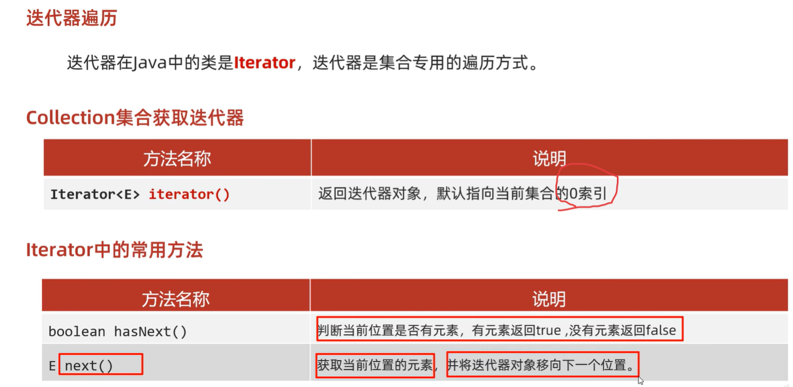

- Collection集合的遍历

  1. `next()`:范围超出则报错 NoSuchElementException
  2. 迭代器遍历完毕，指针不会复位
  3. 循环体中只能用一次next方法，若多次则可能越界
  4. 迭代器遍历时，不能用集合的方法进行==增加或者删除==，否则报错

  ```java
  public class IteratorDemo1 {
      public static void main(String[] args) {
          //创建集合对象
          Collection<String> c = new ArrayList<>();
  
          //添加元素
          c.add("hello");
          c.add("world");
          c.add("java");
          c.add("javaee");
  
          //Iterator<E> iterator()：返回此集合中元素的迭代器，通过集合的iterator()方法得到
          Iterator<String> it = c.iterator();
  
          //用while循环改进元素的判断和获取
          while (it.hasNext()) {
              String s = it.next();
              System.out.println(s);
          }
      }
  }
  ```

- 迭代器中删除的方法-->没有方法进行添加

  `void remove()`: 删除迭代器对象当前指向的元素

  ```java
  Iterator<String> it = list.iterator();
  while(it.hasNext()){
  String s = it.next();
  if("b".equals(s)){
  	//指向谁,那么此时就删除谁.
  	it.remove();
  }
  ```

细节

1. 报错NoSuchElementException       

2. 迭代器遍历完毕，指针不会复位        

3. 循环中只能用一次next方法        

4. 迭代器遍历时，不能用集合的方法进行增加或者删除

#### 1.2.2 增强for

- 介绍

  - 它是JDK5之后出现的,其内部原理是一个Iterator迭代器
  - 实现Iterable接口的类才可以使用迭代器和增强for
  - 简化数组和Collection集合的遍历

- 格式

  ```java
  //1,数据类型一定是集合或者数组中元素的类型
  //2,str仅仅是一个变量名而已,在循环的过程中,依次表示集合或者数组中的每一个元素
  //3,list就是要遍历的集合或者数组
  for(String str : list){//String是集合或数组元素的类型
  	System.out.println(str);
  }
  
  ```


#### 1.2.3 forEach()

通过==集合对象==调用forEach方法，再结合lambda表达式的方式进行遍历

```java
public class A07_CollectionDemo7 {
    public static void main(String[] args) {
       /* 
        lambda表达式遍历：
                default void forEach(Consumer<? super T> action):
        */

        //1.创建集合并添加元素
        Collection<String> coll = new ArrayList<>();
        coll.add("zhangsan");
        coll.add("lisi");
        coll.add("wangwu");
        //2.利用匿名内部类的形式
        //底层原理：
        //循环遍历集合，依次得到每一个元素
        //把得到的每一个元素，传递给下面的accept方法
        //s依次表示集合中的每一个数据
       /* coll.forEach(new Consumer<String>() {
            @Override
            public void accept(String s) {
                System.out.println(s);
            }
        });*/

        //lambda表达式
        coll.forEach(s -> System.out.println(s));
    }
}
```


## 2.List集合

### 2.1List集合的特点

接口

- List集合的特点
  - 存取有序
  - 可以重复
  - 有索引

### 2.2List集合的特有方法

| 方法名                          | 描述                                   |
| ------------------------------- | -------------------------------------- |
| void add(int index,E   element) | 在此集合中的指定位置插入指定的元素     |
| E remove(int   index)           | 删除指定索引处的元素，返回被删除的元素 |
| E set(int index,E   element)    | 修改指定索引处的元素，返回被修改的元素 |
| E get(int   index)              | 返回指定索引处的元素                   |

- `add(int index, E element)`:原本索引上的元素依次往后移

- `remove(int index)`与 `remove(Object o)` :若集合元素为基本数据类型，若要调用`remove(Object o)`,则要把参数装箱

  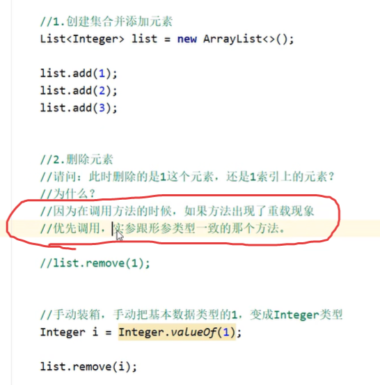

### 2.3List集合的五种遍历方式

1. 迭代器
2. ==列表==迭代器:可以添加元素
3. 增强for
4. Lambda表达式
5. 普通for循环

**ListIterator**:

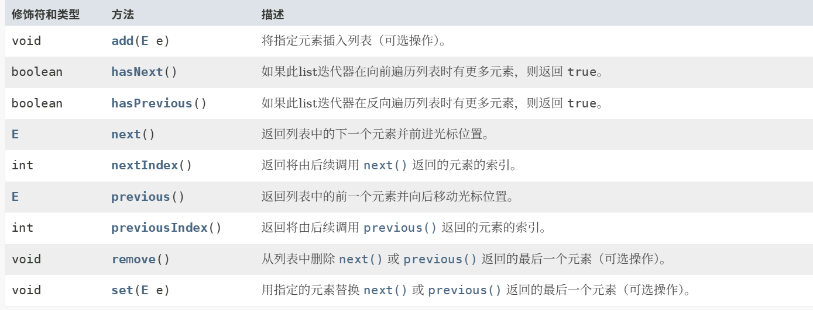

代码示例：

```java
//创建集合并添加元素
List<String> list = new ArrayList<>();
list.add("aaa");
list.add("bbb");
list.add("ccc");

//1.迭代器
Iterator<String> it = list.iterator();
     while(it.hasNext()){
        String str = it.next();
        System.out.println(str);
}


//2.增强for
//下面的变量s，其实就是一个第三方的变量而已。
//在循环的过程中，依次表示集合中的每一个元素
for (String s : list) {
	System.out.println(s);
}

//3.Lambda表达式
//forEach方法的底层其实就是一个循环遍历，依次得到集合中的每一个元素
//并把每一个元素传递给下面的accept方法
//accept方法的形参s，依次表示集合中的每一个元素
list.forEach(s->System.out.println(s) );


//4.普通for循环
//size方法跟get方法还有循环结合的方式，利用索引获取到集合中的每一个元素
for (int i = 0; i < list.size(); i++) {
	//i:依次表示集合中的每一个索引
	String s = list.get(i);
	System.out.println(s);
}

// 5.列表迭代器
//获取一个列表迭代器的对象，里面的指针默认也是指向0索引的

//额外添加了一个方法：在遍历的过程中，可以添加元素
ListIterator<String> it = list.listIterator();
while(it.hasNext()){
    String str = it.next();
    if("bbb".equals(str)){
        //qqq
        it.add("qqq");
    }
}
System.out.println(list);
```


## 4.List集合的实现类

### 4.1 List集合子类

- ArrayList集合-->继承Collection,List的方法

  ​	底层是数组结构实现，查询快、增删慢

- LinkedList集合

  ​	底层是链表结构实现，查询慢、增删快


### 4.2 ArrayList

#### 4.2.1 ArrayList类概述

- 什么是集合

  ​	提供一种存储空间可变的存储模型，存储的数据容量可以发生改变

- ArrayList集合的特点

  ​	长度可以变化，只能存储==引用==数据类型：==基本数据类型-->包装类==

- 泛型的使用:`ArrayList<T>`·

  ​	用于约束集合中存储元素的数据类型

- 输出时不输出地址，而是集合中存储的数据内容,展示时==用[]将数据包裹==

#### 4.2.2 ArrayList的创建

```java
//在jdk7前
ArrayList<String> arrayList = new ArrayList<String>();

//jdk7后
ArrayList<String> arrayList = new ArrayList<>();
```

#### 4.2.3 集合的返回与传参

==返回多个数据==可以用集合完成

==定义的返回类型和参数中的泛型必须为确定类型==

```java
public ArrayList<String> geInfo(ArrayList<String> list){}
```

#### 4.2.4 构造方法

| 方法名             | 说明                 |
| ------------------ | -------------------- |
| public ArrayList() | 创建一个空的集合对象 |

#### 4.2.5 成员方法

全是继承Collection,List的方法

| 方法名                                | 说明                                   |
| ------------------------------------- | -------------------------------------- |
| public boolean add(要添加的元素)      | 将指定的元素追加到此集合的末尾         |
| public boolean remove(要删除的元素)   | 删除指定元素,返回值表示是否删除成功    |
| public E  remove(int index)           | 删除指定索引处的元素，返回被删除的元素 |
| public E   set(int index,E   element) | 修改指定索引处的元素，返回被修改的元素 |
| public E   get(int   index)           | 返回指定索引处的元素                   |
| public int   size()                   | 返回集合中的元素的个数                 |

### 4.2LinkedList集合的特有功能

- ==特有==方法

  眼熟即可，通常用List的方法

  | 方法名                    | 说明                             |
  | ------------------------- | -------------------------------- |
  | public void addFirst(E e) | 在该列表开头插入指定的元素       |
  | public void addLast(E e)  | 将指定的元素追加到此列表的末尾   |
  | public E getFirst()       | 返回此列表中的第一个元素         |
  | public   E getLast()      | 返回此列表中的最后一个元素       |
  | public E removeFirst()    | 从此列表中删除并返回第一个元素   |
  | public   E removeLast()   | 从此列表中删除并返回最后一个元素 |

- 示例代码

  ```java
  public class MyLinkedListDemo4 {
      public static void main(String[] args) {
          LinkedList<String> list = new LinkedList<>();
          list.add("aaa");
          list.add("bbb");
          list.add("ccc");
  //        public void addFirst(E e)	在该列表开头插入指定的元素
          //method1(list);
  
  //        public void addLast(E e)	将指定的元素追加到此列表的末尾
          //method2(list);
  
  //        public E getFirst()		返回此列表中的第一个元素
  //        public E getLast()		返回此列表中的最后一个元素
          //method3(list);
  
  //        public E removeFirst()		从此列表中删除并返回第一个元素
  //        public E removeLast()		从此列表中删除并返回最后一个元素
          //method4(list);
        
      }
  
      private static void method4(LinkedList<String> list) {
          String first = list.removeFirst();
          System.out.println(first);
  
          String last = list.removeLast();
          System.out.println(last);
  
          System.out.println(list);
      }
  
      private static void method3(LinkedList<String> list) {
          String first = list.getFirst();
          String last = list.getLast();
          System.out.println(first);
          System.out.println(last);
      }
  
      private static void method2(LinkedList<String> list) {
          list.addLast("www");
          System.out.println(list);
      }
  
      private static void method1(LinkedList<String> list) {
          list.addFirst("qqq");
          System.out.println(list);
      }
  }
  ```

## 5.List实现类和迭代器源码分析

### 5.1 ArrayList源码分析：

**核心步骤**：

1. 创建ArrayList对象的时候，他在底层先创建了一个长度为0的数组。

   数组名字：elementDate，定义变量size。

   size这个变量有两层含义：
   ①：==元素的个数==，也就是集合的长度
   ②：==下一个元素的存入位置==

2. 添加元素，添加完毕后，size++

**扩容时机一**：

3. 当存满时候，会创建一个新的数组，新数组的长度，是原来的1.5倍，也就是长度为15.再把所有的元素，全拷贝到新数组中。如果继续添加数据，这个长度为15的数组也满了，那么下次还会继续扩容，还是1.5倍。

**扩容时机二**：

4. 一次性添加多个数据，扩容1.5倍不够，怎么办呀？

   如果一次添加多个元素，1.5倍放不下，那么新创建数组的长度以实际为准。

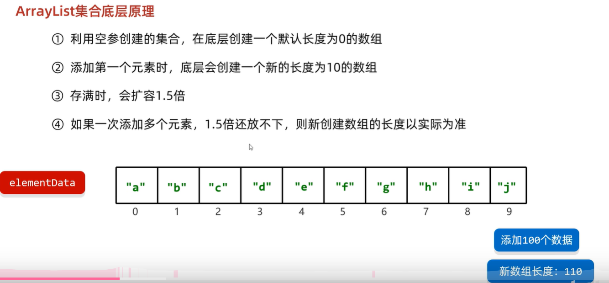

**添加一个元素时的扩容：**


**添加多个元素时的扩容：**


### 5.2 LinkedList源码分析：

底层是双向链表结构

核心步骤如下：

1. 刚开始创建的时候，底层创建了两个变量：一个记录头结点first，一个记录尾结点last，==默认为null==
2. 添加第一个元素时，底层创建一个结点对象，first和last都记录这个结点的地址值-->first,last是首尾节点
3. 添加第二个元素时，底层创建一个结点对象，第一个结点会记录第二个结点的地址值，last会记录新结点的地址值

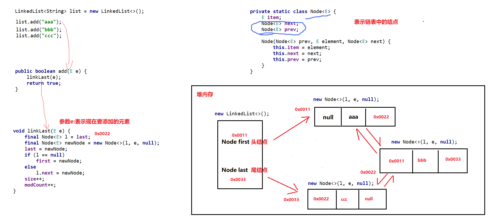

### 5.3 迭代器源码分析：

迭代器遍历相关的三个方法：

* Iterator<E> iterator()  ：获取一个迭代器对象

* boolean hasNext()       ：判断当前指向的位置是否有元素

* E next()                ：获取当前指向的元素并移动指针

cursor光标默认指向索引0


## 6.泛型

### 6.1 泛型概述

泛型是JDK5中引入的特性，它提供了编译时类型安全检测机制

java中的泛型是==伪泛型==，在编译后的class不存在，只在存数据是起“看门员”的作用

**泛型的好处**

1. 把运行时期的问题提前到了编译期间
2. 避免了强制类型转换

**泛型的定义格式**

- <类型>: 指定一种类型的格式.尖括号里面可以任意书写,一般只写一个字母.例如: <E> <T>
- <类型1,类型2…>: 指定多种类型的格式,多种类型之间用逗号隔开.例如: <E,T> <K,V>

**细节**

- 泛型中不能写基本数据类型-->因为集合内部使用Object[]储存数据
- 指定泛型的具体类型后，**传递数据**时，可以传入该类类型或者其==子类==类型
- 如果不写泛型，类型默认是Object

### 6.2 泛型使用

#### 6.2.1 泛型类

可用Object类型存储变量

```java
修饰符（包括final...） class 类名 <T>{
    
}
```

#### 6.2.2 泛型方法

两种方式

- 方法中形参类型不确定时,==不能直接在形参列表中用泛型==，需先定义泛型
  - 方案①：使用类名后面定义的泛型，所有方法都能用
  - 方案②：在方法申明上定义自己的泛型，只有本方法能用

```java
//方案2
修饰符 <T1,T2,...> 返回值 方法名(形参列表) {
}
```

#### 6.2.3 泛型接口

```java
修饰符（包括final...） interface 接口名 <T>{
    
}
```

如何使用

- 方式1：实现类给出具体类型-->创建对象时，不用在用泛型

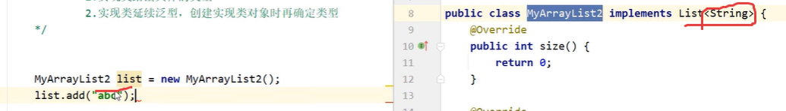

- 方式2：实现类延续泛型，创建对象时再确定

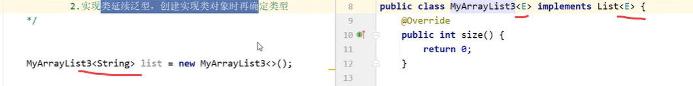

### 6.3 泛型的继承与通配符

#### 6.3.1 泛型的继承

泛型不具备继承性，但数据具有继承性

- 指定泛型的具体类型后，**传递数据**时，可以传入该类类型或者其==子类==类型

- 但定义形参泛型为<A>的集合，就不能**传入**泛型为子类<B>的==集合==。B extends A

#### 6.3.2 通配符

**?** 表示不确定的类型，他可以进行类型的限定

- `? extends E`：表示可以传递E或者E所有的子类类型
- `? super E`：表示可以传递E或者E所有的父类类型

**关键点**：可以限定类型的范围。

在方法形参中可以**直接使用**，==不必在类或方法上定义泛型==

**应用场景**：

1. 如果我们在定义类、方法、接口的时候，如果类型不确定，就可以定义泛型类、泛型方法、泛型接口。
2. 如果类型**不确定**，但是能知道以后只能传递==某个继承体系==中的，就可以泛型的通配符

```java
public double sumOfList(List<? extends Number> list) {
}
```


## 7.数据结构

### 7.1二叉树

+ 二叉树的特点

  + 二叉树中,任意一个节点的度要小于等于2
    + 节点: 在树结构中,每一个元素称之为节点
    + 度: 每一个节点的子节点数量称之为度

+ 二叉树结构图

  

- 二叉树的遍历方式
  - 前序遍历：当前结点，左子结点，右子节点
  - 中序遍历：左子结点，当前结点，右子结点-->若为二叉查找树，则是数据从小到大
  - 后序遍历：左子结点，右子结点，当前结点
  - 层序遍历：从根结点开始一层一层的遍历

### 7.2二叉查找树

+ 二叉查找树的特点

  + 二叉查找树,又称**二叉排序树**或者**二叉搜索树**
  + 每一个节点上最多有两个子节点
  + 左子树上所有节点的值都**小于**根节点的值
  + 右子树上所有节点的值都**大于**根节点的值

+ 二叉查找树结构图

  

+ 二叉查找树添加节点规则,从==根结点==开始-->查找规则也一样

  + 小的存左边
  + 大的存右边
  + ==一样的不存==

+ 弊端：可能导致左右子树高度差过高，导致**查找效率低**

+ 中序遍历永远升序

### 7.3平衡二叉树

高度平衡的==二叉查找树==，查找、插入遵循二叉查找树的规则

+ 平衡二叉树的特点

  + 任意结点左右子树的高度差不超过1
  + 任意节点的左右两个子树都是一颗平衡二叉树

+ 平衡二叉树旋转

  + 旋转触发时机

    + 当添加一个节点之后,该树不再是一颗平衡二叉树

  + 左旋

    + 就是将根节点的右侧往左拉,原先的右子节点变成新的父节点,并把多余的左子节点出让,给已经**降级的根节点当右子节点**-->==但新的右子结点仍比降级的子结点大，且整个树仍是二叉搜索树==
    + **不平衡的点**：左右两子树高度大于1

    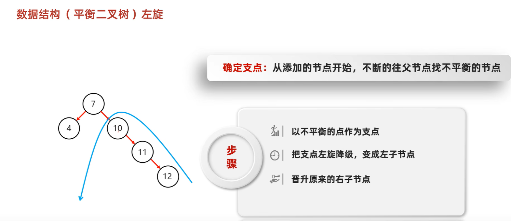

    

    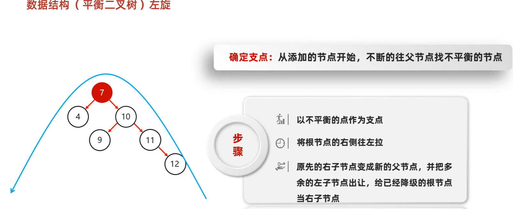

  + 右旋

    + 就是将根节点的左侧往右拉,左子节点变成了新的父节点,并把多余的右子节点出让,给已经降级根节点当左子节点

+ 平衡二叉树和二叉查找树对比结构图

  

+ 平衡二叉树旋转的四种情况

  + 左左

    + 左左: 当根节点左子树的左子树有节点插入,导致二叉树不平衡

    + 如何旋转: 直接对整体进行右旋即可

      

  + 左右

    + 左右: 当根节点左子树的右子树有节点插入,导致二叉树不平衡

    + 如何旋转: 先在左子树对应的节点位置进行左旋,在对整体进行右旋

      

  + 右右

    + 右右: 当根节点右子树的右子树有节点插入,导致二叉树不平衡

    + 如何旋转: 直接对整体进行左旋即可

      

  + 右左

    + 右左:当根节点右子树的左子树有节点插入,导致二叉树不平衡

    + 如何旋转: 先在右子树对应的节点位置进行右旋,在对整体进行左旋

      

+ 弊端：插入结点是旋转次数太多，造成时间浪费

### 7.3红黑树

自平衡的二叉查找树

- 红黑树的特点

  - 平衡二叉B树
  - 每一个节点可以是红或者黑
  - 红黑树==不是高度平衡==的,它的平衡是通过"自己的红黑规则"进行实现的

- 红黑树的红黑规则

  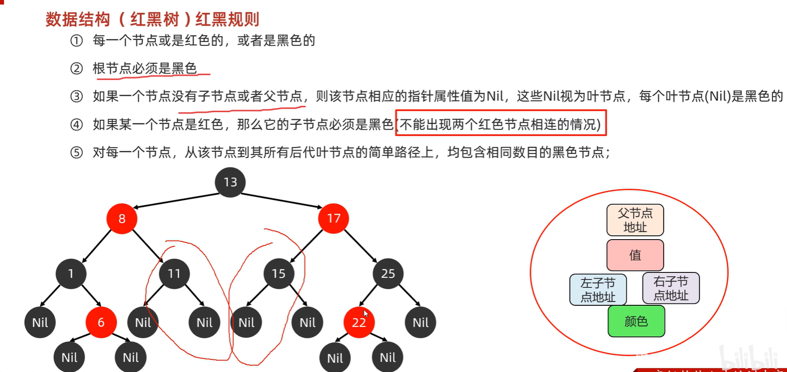

- 红黑树添加节点的默认颜色

  - 添加节点时,默认为==红色==,效率高1

- 红黑树添加节点后如何保持红黑规则

  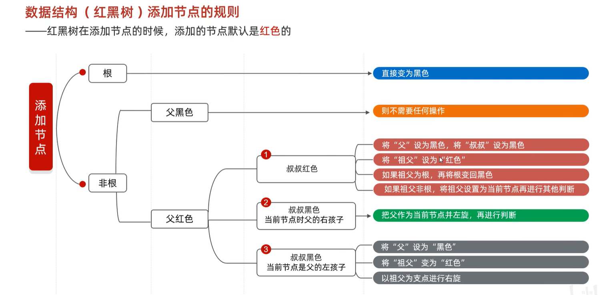

## 8.Set集合

### 8.1Set集合概述和特点

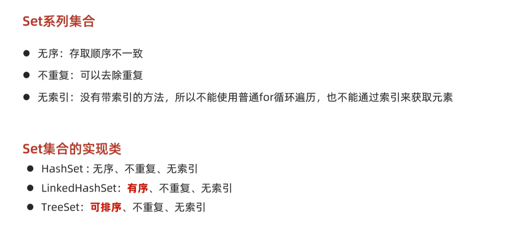

### 8.2Set集合的使用与遍历

==继承Collection的方法==

- `add()`:-->添加失败不会报错
  - 如果当前元素是第一次添加，那么可以添加成功，返回true
  - 如果当前元素是第二次添加，那么添加失败，返回false

**遍历：**

- 迭代器
- 增强for
- Lambda表达式

## 9.TreeSet集合

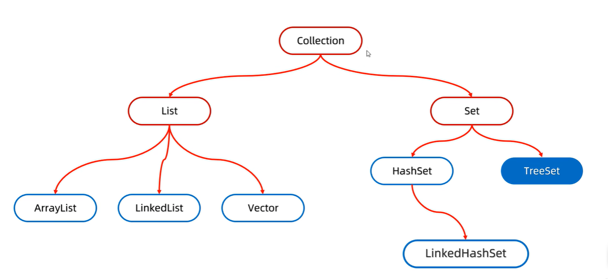

### 9.1TreeSet集合概述和特点

==不用重写`hashCode()`,`equals()`==

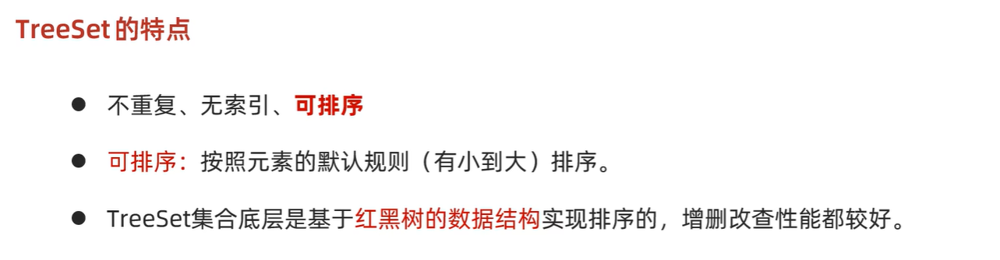

**默认排序规则：**

- 对于数值类型：Integer，Double，默认按照从小到大的顺序进行排序。
- 对于字符、字符串类型：按照字符在ASCII码表中的数字升序进行排序。

### 9.2自定义排序规则

**构造器:**

==默认使用第一种自然排序==

+ `TreeSet()`：根据其元素的自然排序进行排序
+ `TreeSet(Comparator comparator) `：根据指定的比较器进行排序

**两种比较方式：**

+ 自然排序: 自定义类实现`Comparable`接口,重写`compareTo()`,根据返回值进行排序

  
+ 比较器排序: 创建TreeSet对象的时候传递`Comparator`的实现类对象,重写`compare`方法,根据返回值进行排序

  
+ 在使用的时候,==默认使用自然排序==,当自然排序不满足现在的需求时,必须使用比较器排序
+ 当两种方式都存在时，==比较器排序的优先级更高==

**两种方式中关于返回值的规则：**

+ 如果返回值为负数，表示当前存入的元素是较小值，存左边
+ 如果返回值为0，表示当前存入的元素跟集合中元素重复了，不存
+ 如果返回值为正数，表示当前存入的元素是较大值，存右边


## 10.HashSet集合

### 10.1HashSet集合概述和特点

- 底层数据结构是**哈希表**：依赖hashCode方法和equals方法保证元素的唯一
- ==存取无序==
- 不可以存储重复元素
- 没有索引,不能使用普通for循环遍历

### 10.2哈希值

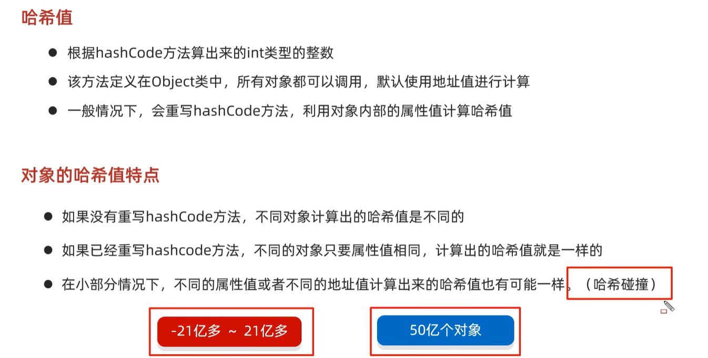

### 10.3哈希表结构

- JDK8以前

  数组 + 链表

- JDK8以后

  - 节点个数少于等于8个

    ​	数组 + 链表

  - 节点个数多于8个

    ​	数组 + 红黑树

**底层原理：**

equals()会依次与==链表==中的元素进行比较，若都不相等，则添加

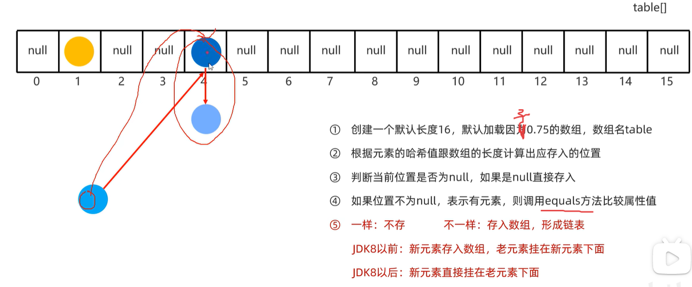

**如何扩容：**

当存储元素个数大于 ==数组长度*0.75== 时，数组会扩容成原先的两倍

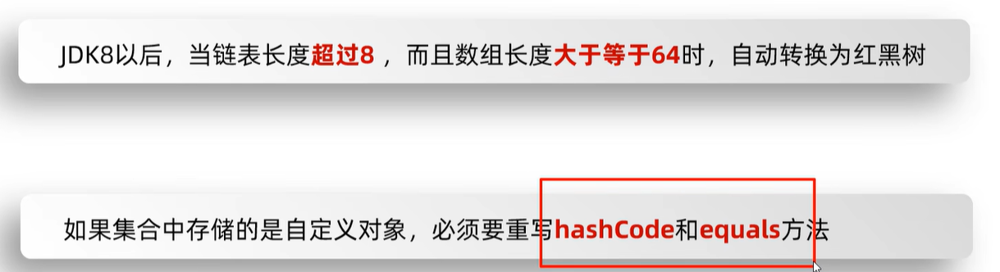

**如何遍历（存取无序）：**

从数组索引0开始，依次往后遍历。若遇到链表，则依次遍历链表中的元素

**如何去重：**

利用`HashCode()` 和 `equals()` 去重-->若存储的是自定义对象，==必须重写==这两个方法

**总结：**

HashSet集合存储自定义类型元素,要想实现元素的==唯一==,要求必须==重写==hashCode方法和equals方法


## 11.LinkedHashSet集合

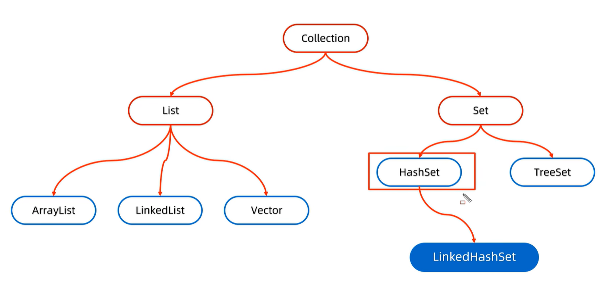

**底层原理：**

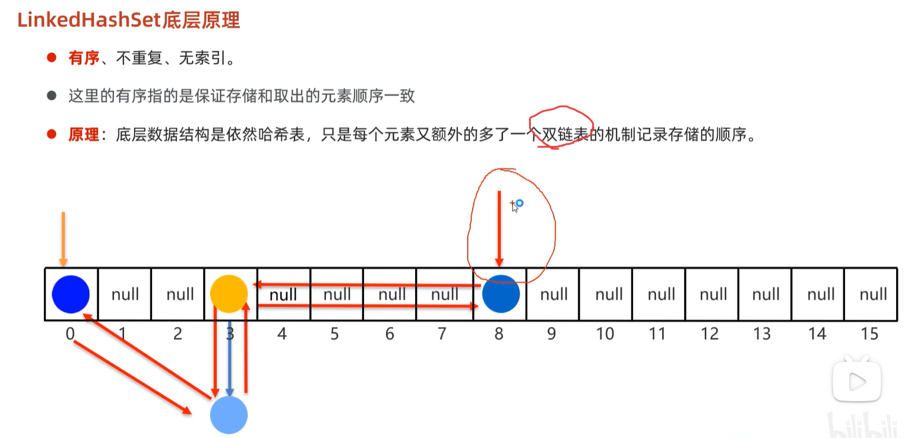

**如何遍历（存取有序）**

从双链表的头结点开始，依次向后遍历


## 12.Collection实现类的选择

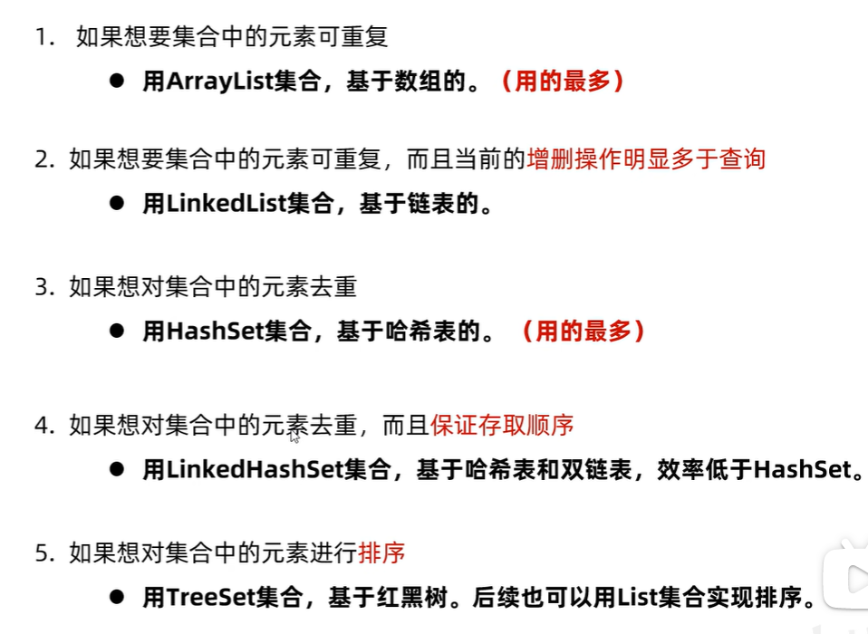
