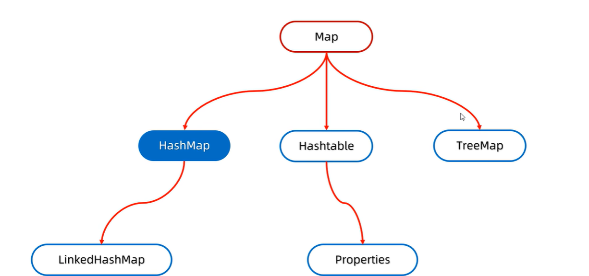
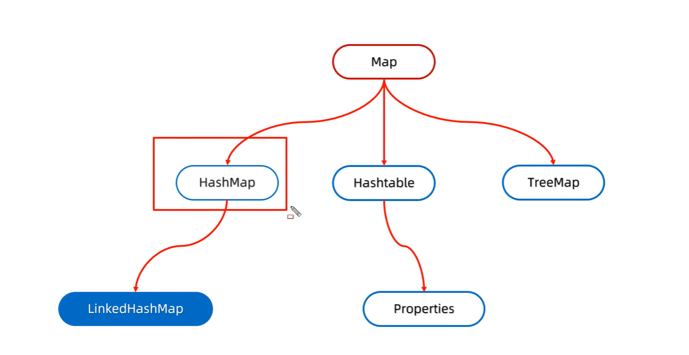
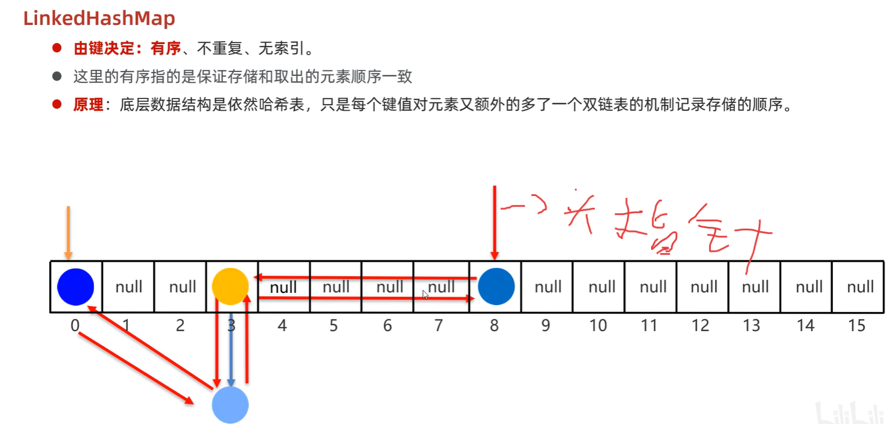
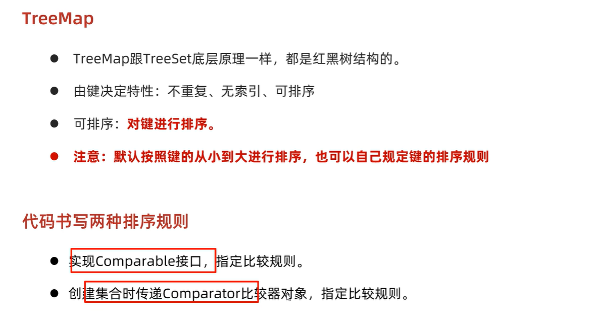
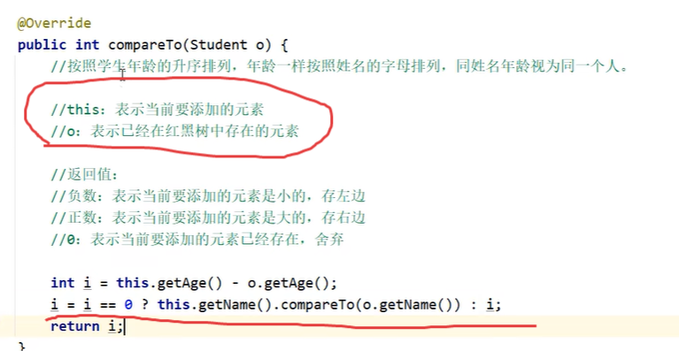
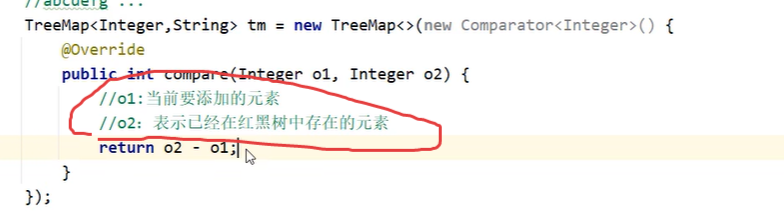
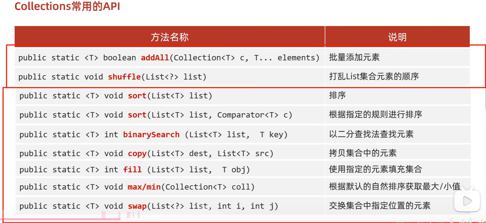

## 1.Map集合


### 1.1Map集合概述和特点

- Map集合概述

  ```java
  interface Map<K,V>  K：键的类型；V：值的类型
  ```

- Map集合的特点

  - 双列集合一次需要存一对数据，分别为键和值
  - 键不能重复，值可以重复
  - 键和值是一一对应的，每一个键只能找到自己对应的值
  - 键 + 值这个整体我们称之为“键值对”或者“键值对对象”，在Java中叫做“Entry对象”

- Map集合的基本使用

  ```java
  public class MapDemo01 {
      public static void main(String[] args) {
          //创建集合对象
          Map<String,String> map = new HashMap<String,String>();
  
          //V put(K key, V value) 将指定的值与该映射中的指定键相关联
          map.put("itheima001","林青霞");
          map.put("itheima002","张曼玉");
          map.put("itheima003","王祖贤");
          map.put("itheima003","柳岩");
  
          //输出集合对象
          System.out.println(map);
      }
  }
  ```

### 1.2Map集合的基本方法

- 方法介绍

  | 方法名                                             | 说明                                               |
  | -------------------------------------------------- | -------------------------------------------------- |
  | V   put(K key,V   value)                           | 添加元素                                           |
  | V   remove(Object key)                             | 根据键删除键值对元素                               |
  | void   clear()                                     | 移除所有的键值对元素                               |
  | boolean containsKey(Object key)                    | 判断集合是否包含指定的键                           |
  | boolean containsValue(Object value)                | 判断集合是否包含指定的值                           |
  | boolean isEmpty()                                  | 判断集合是否为空                                   |
  | int size()                                         | 集合的长度，也就是集合中==键值对==的个数           |
  | default V getOrDefault(Object key, V defaultValue) | ==若键存在，返回值；否则，返回默认值defaultValue== |

  - `put()`：添加/覆盖 
    - 在添加数据的时候，如果键不存在，那么直接把键值对对象添加到map集合当中，方法返回==null== 
    - 在添加数据的时候，如果键是存在的，那么会把原有的键值对对象覆盖，会返回==被覆盖的值==
  - `remove()`:返回所删除键值对的值

- 示例代码

  ```java
  public class MapDemo02 {
      public static void main(String[] args) {
          //创建集合对象
          Map<String,String> map = new HashMap<String,String>();
  
          //V put(K key,V value)：添加元素
          map.put("张无忌","赵敏");
          map.put("郭靖","黄蓉");
          map.put("杨过","小龙女");
  
          //V remove(Object key)：根据键删除键值对元素
  //        System.out.println(map.remove("郭靖"));
  //        System.out.println(map.remove("郭襄"));
  
          //void clear()：移除所有的键值对元素
  //        map.clear();
  
          //boolean containsKey(Object key)：判断集合是否包含指定的键
  //        System.out.println(map.containsKey("郭靖"));
  //        System.out.println(map.containsKey("郭襄"));
  
          //boolean isEmpty()：判断集合是否为空
  //        System.out.println(map.isEmpty());
  
          //int size()：集合的长度，也就是集合中键值对的个数
          System.out.println(map.size());
  
          //输出集合对象
          System.out.println(map);
      }
  }
  ```

### 1.3Map集合的获取方法

| 方法名                           | 说明                     |
| -------------------------------- | ------------------------ |
| V   get(Object key)              | 根据键获取值             |
| ==Set==<K>   keySet()            | 获取所有键的==集合==     |
| Collection<V>   values()         | 获取所有值的集合         |
| Set<Map.Entry<K,V>>   entrySet() | 获取所有键值对对象的集合 |

### 1.4Map集合的遍历

#### 1.4.1 key->value

- 遍历思路

  - 我们刚才存储的元素都是成对出现的，所以我们把Map看成是一个夫妻对的集合
    - 把所有的丈夫给集中起来
    - 遍历丈夫的集合，获取到每一个丈夫
    - 根据丈夫去找对应的妻子

- 步骤分析

  - 获取所有键的集合。用keySet()方法实现
  - 遍历键的集合，获取到每一个键。用增强for实现  
  - 根据键去找值。用get(Object key)方法实现

- 代码实现

  ```java
  public class MapDemo01 {
      public static void main(String[] args) {
          //创建集合对象
          Map<String, String> map = new HashMap<String, String>();
  
          //添加元素
          map.put("张无忌", "赵敏");
          map.put("郭靖", "黄蓉");
          map.put("杨过", "小龙女");
  
          //获取所有键的集合。用keySet()方法实现
          Set<String> keySet = map.keySet();
          //遍历键的集合，获取到每一个键。用增强for实现
          for (String key : keySet) {
              //根据键去找值。用get(Object key)方法实现
              String value = map.get(key);
              System.out.println(key + "," + value);
          }
      }
  }
  ```

#### 1.4.2 键值对遍历

- 遍历思路

  - 我们刚才存储的元素都是成对出现的，所以我们把Map看成是一个夫妻对的集合
    - 获取所有结婚证的集合
    - 遍历结婚证的集合，得到每一个结婚证
    - 根据结婚证获取丈夫和妻子

- 步骤分析

  - 获取所有键值对对象的集合
    - Set<Map.Entry<K,V>> entrySet()：获取所有键值对对象的集合
  - 遍历键值对对象的集合，得到每一个键值对对象
    - 用增强for实现，得到每一个Map.Entry
  - 根据键值对对象获取键和值-- >键值对类 的方法
    - 用==getKey()==得到键
    - 用==getValue()==得到值

- 代码实现

  ```java
  public class MapDemo02 {
      public static void main(String[] args) {
          //创建集合对象
          Map<String, String> map = new HashMap<String, String>();
  
          //添加元素
          map.put("张无忌", "赵敏");
          map.put("郭靖", "黄蓉");
          map.put("杨过", "小龙女");
  
          //获取所有键值对对象的集合
          Set<Map.Entry<String, String>> entrySet = map.entrySet();
          //遍历键值对对象的集合，得到每一个键值对对象
          for (Map.Entry<String, String> me : entrySet) {
              //根据键值对对象获取键和值
              String key = me.getKey();
              String value = me.getValue();
              System.out.println(key + "," + value);
          }
      }
  }
  ```

#### 1.4.3 forEach遍历

底层就是利用键值对进行遍历

```java
public class MapDemo02 {
    public static void main(String[] args) {
        //创建集合对象
        Map<String, String> map = new HashMap<String, String>();

        //添加元素
        map.put("张无忌", "赵敏");
        map.put("郭靖", "黄蓉");
        map.put("杨过", "小龙女");

        //利用lambda进行变量
        map.forEach(new BiConsumer<String, String>){
            @Override
            public void accept(String key, String value){
                System.out.println(key + "=" + value);
            }
        }
        System.out.println("--------------");
        map.forEach((key, value)->System.out.println(key + "=" + value));
        
    }
}
```


## 2.HashMap集合



**特点：**

+ HashMap底层是哈希表结构的
+ 依赖hashCode方法和equals方法保证==键==的唯一
+ 如果==键==要存储的是自定义对象，需要==重写hashCode和equals方法==
+ 无序、不重复、无索引-->Map都没索引

**底层原理：**

与HashMap相同，但只要利用键值对的==键计算哈希值==

当哈希值相等时，会==覆盖==


## 3.LinkedHashMap集合



**特点和底层原理**



## 4.TreeMap集合

**特点**

和TreeSet相同



**排序规则**

比较器优先级更高

1. Compareble接口重写方法



2. 比较器




## 4. 可变参数

在**JDK1.5**之后，如果我们定义一个方法需要接受多个参数，并且多个参数类型一致，我们可以对其简化.

**格式：**

```
修饰符 返回值类型 方法名(参数类型... 形参名){  }
```

**底层：**

​	其实就是一个数组

**好处：**

​	在传递数据的时候，省的我们自己创建数组并添加元素了，JDK底层帮我们自动创建数组并添加元素了

**代码演示:**

```java
  public class ChangeArgs {
    public static void main(String[] args) {
        int sum = getSum(6, 7, 2, 12, 2121);
        System.out.println(sum);
    }
    
    public static int getSum(int... arr) {
   		int sum = 0;
   	     for (int a : arr) {
         sum += a;
        }
   		 return sum;
    }
}
```

**注意：**

​	1.==一个方法只能有一个可变参数==

​	2.如果方法中有多个参数，可变参数要放到==最后==。

**应用场景: Collections**

​	在Collections中也提供了添加一些元素方法：

​	`public static <T> boolean addAll(Collection<T> c, T... elements)  `:往集合中添加一些元素。

**代码演示:**

```java
public class CollectionsDemo {
	public static void main(String[] args) {
      ArrayList<Integer> list = new ArrayList<Integer>();
      //原来写法
      //list.add(12);
      //list.add(14);
      //list.add(15);
      //list.add(1000);
      //采用工具类 完成 往集合中添加元素  
      Collections.addAll(list, 5, 222, 1，2);
      System.out.println(list);
}
```

## 5. Collections类

### 5.1 Collections常用功能



代码演示：

```java
public class CollectionsDemo {
    public static void main(String[] args) {
        ArrayList<Integer> list = new ArrayList<Integer>();
   
        list.add(100);
        list.add(300);
        list.add(200);
        list.add(50);
        //排序方法 
        Collections.sort(list);
        System.out.println(list);
    }
}
结果：
[50,100, 200, 300]
```

我们的集合按照默认的自然顺序进行了排列，如果想要指定顺序那该怎么办呢？

### 5.2 Comparator比较器

创建一个学生类，存储到ArrayList集合中完成指定排序操作。

Student 类

```java
public class Student{
    private String name;
    private int age;
	//构造方法
    //get/set
 	//toString
}
```

测试类：

```java
public class Demo {
    public static void main(String[] args) {
        // 创建四个学生对象 存储到集合中
        ArrayList<Student> list = new ArrayList<Student>();

        list.add(new Student("rose",18));
        list.add(new Student("jack",16));
        list.add(new Student("abc",20));
		Collections.sort(list, new Comparator<Student>() {
  		  @Override
    		public int compare(Student o1, Student o2) {
        	return o1.getAge()-o2.getAge();//以学生的年龄升序
   		 }
		});


        for (Student student : list) {
            System.out.println(student);
        }
    }
}
Student{name='jack', age=16}
Student{name='rose', age=18}
Student{name='abc', age=20}
```

## 6. Properties双列集合

无泛型，键与值都是Object类型


- 输出:`void store(Writer/OutputStream out, String comment)`
  - 将properties集合中的数据储存到配置文件
  - comment为注释信息
- 输入：`void load(Reader/InputStream in)`
  - 将配置文件中的数据读取到properties集合中

## 7. 综合练习

### 练习1：随机点名器

需求：班级里有N个学生，实现随机点名器

代码实现：

```java
public class Test1 {
    public static void main(String[] args) {
        /* 班级里有N个学生，学生属性:姓名，年龄，性别。
        实现随机点名器。*/


        //1.定义集合
        ArrayList<String> list = new ArrayList<>();
        //2.添加数据
        Collections.addAll(list,"范闲","范建","范统","杜子腾","杜琦燕","宋合泛","侯笼藤","朱益群","朱穆朗玛峰","袁明媛");
        //3.随机点名
        /* Random r = new Random();
        int index = r.nextInt(list.size());
        String name = list.get(index);
        System.out.println(name);*/

        //打乱
        Collections.shuffle(list);

        String name = list.get(0);
        System.out.println(name);


    }
}
```

### 练习2：带概率的随机

需求：

​	班级里有N个学生

​	要求在随机的时候，70%的概率随机到男生，30%的概率随机到女生

代码实现：

```java
public class Test2 {
    public static void main(String[] args) {
        /* 班级里有N个学生
        要求：
        70%的概率随机到男生
        30%的概率随机到女生

        "范闲","范建","范统","杜子腾","宋合泛","侯笼藤","朱益群","朱穆朗玛峰",
        "杜琦燕","袁明媛","李猜","田蜜蜜",
        */
        //1.创建集合
        ArrayList<Integer> list = new ArrayList<>();
        //2.添加数据
        Collections.addAll(list,1,1,1,1,1,1,1);
        Collections.addAll(list,0,0,0);
        //3.打乱集合中的数据
        Collections.shuffle(list);
        //4.从list集合中随机抽取0或者1
        Random r = new Random();
        int index = r.nextInt(list.size());
        int number = list.get(index);
        System.out.println(number);
        //5.创建两个集合分别存储男生和女生的名字
        ArrayList<String> boyList = new ArrayList<>();
        ArrayList<String> girlList = new ArrayList<>();

        Collections.addAll(boyList,"范闲","范建","范统","杜子腾","宋合泛","侯笼藤","朱益群","朱穆朗玛峰");
        Collections.addAll(girlList,"杜琦燕","袁明媛","李猜","田蜜蜜");

        //6.判断此时是从boyList里面抽取还是从girlList里面抽取
        if(number == 1){
            //boyList
            int boyIndex = r.nextInt(boyList.size());
            String name = boyList.get(boyIndex);
            System.out.println(name);
        }else{
            //girlList
            int girlIndex = r.nextInt(girlList.size());
            String name = girlList.get(girlIndex);
            System.out.println(name);
        }


    }
}
```

### 练习3：随机不重复

需求：

​	班级里有N个学生，被点到的学生不会再被点到。但是如果班级中所有的学生都点完了， 需要重新开启第二轮点名。

代码实现：

```java
public class Test3 {
    public static void main(String[] args) {
       /* 班级里有5个学生
        要求：
        被点到的学生不会再被点到。
        但是如果班级中所有的学生都点完了，需要重新开启第二轮点名。*/


        //1.定义集合
        ArrayList<String> list1 = new ArrayList<>();
        //2.添加数据
        Collections.addAll(list1, "范闲", "范建", "范统", "杜子腾", "杜琦燕", "宋合泛", "侯笼藤", "朱益群", "朱穆朗玛峰", "袁明媛");
        //创建一个临时的集合，用来存已经被点到学生的名字
        ArrayList<String> list2 = new ArrayList<>();
        //外循环：表示轮数
        for (int i = 1; i <= 10; i++) {
            System.out.println("=========第" + i + "轮点名开始了======================");
            //3.获取集合的长度
            int count = list1.size();
            //4.随机点名
            Random r = new Random();
            //内循环：每一轮中随机循环抽取的过程
            for (int j = 0; j < count; j++) {
                int index = r.nextInt(list1.size());
                String name = list1.remove(index);
                list2.add(name);
                System.out.println(name);
            }
            //此时表示一轮点名结束
            //list1 空了 list2 10个学生的名字
            list1.addAll(list2);
            list2.clear();

        }
    }
}
```

### 练习4：集合的嵌套

需求：

​	定义一个Map集合，键用表示省份名称province，值表示市city，但是市会有多个。

添加完毕后，遍历结果格式如下：

​	江苏省 = 南京市，扬州市，苏州市，无锡市，常州市

  	湖北省 = 武汉市，孝感市，十堰市，宜昌市，鄂州市
  	
  	河北省 = 石家庄市，唐山市，邢台市，保定市，张家口市

代码实现：

```java
public class Test4 {
    public static void main(String[] args) {
        /* 需求
        定义一个Map集合，键用表示省份名称province，值表示市city，但是市会有多个。
        添加完毕后，遍历结果格式如下：
                江苏省 = 南京市，扬州市，苏州市，无锡市，常州市
                湖北省 = 武汉市，孝感市，十堰市，宜昌市，鄂州市
                河北省 = 石家庄市，唐山市，邢台市，保定市，张家口市*/


        //1.创建Map集合
        HashMap<String, ArrayList<String>> hm = new HashMap<>();

        //2.创建单列集合存储市
        ArrayList<String> city1 = new ArrayList<>();
        city1.add("南京市");
        city1.add("扬州市");
        city1.add("苏州市");
        city1.add("无锡市");
        city1.add("常州市");

        ArrayList<String> city2 = new ArrayList<>();
        city2.add("武汉市");
        city2.add("孝感市");
        city2.add("十堰市");
        city2.add("宜昌市");
        city2.add("鄂州市");

        ArrayList<String> city3 = new ArrayList<>();
        city3.add("石家庄市");
        city3.add("唐山市");
        city3.add("邢台市");
        city3.add("保定市");
        city3.add("张家口市");

        //3.把省份和多个市添加到map集合
        hm.put("江苏省",city1);
        hm.put("湖北省",city2);
        hm.put("河北省",city3);

        Set<Map.Entry<String, ArrayList<String>>> entries = hm.entrySet();
        for (Map.Entry<String, ArrayList<String>> entry : entries) {
            //entry依次表示每一个键值对对象
            String key = entry.getKey();
            ArrayList<String> value = entry.getValue();
            StringJoiner sj = new StringJoiner(", ","","");
            for (String city : value) {
                sj.add(city);
            }
            System.out.println(key + " = " + sj);

        }
    }
}
```

## 8. 斗地主发牌

### 8.1 案例介绍

按照斗地主的规则，完成洗牌发牌的动作。
具体规则：

使用54张牌打乱顺序,三个玩家参与游戏，三人交替摸牌，每人17张牌，最后三张留作底牌。

### 8.2 案例分析

- 准备牌：

  牌可以设计为一个ArrayList<String>,每个字符串为一张牌。
  每张牌由花色数字两部分组成，我们可以使用花色集合与数字集合嵌套迭代完成每张牌的组装。
  牌由Collections类的shuffle方法进行随机排序。

- 发牌

  将每个人以及底牌设计为ArrayList<String>,将最后3张牌直接存放于底牌，剩余牌通过对3取模依次发牌。

- 看牌

  直接打印每个集合。

### 8.3 代码实现

```java
public class App {
    public static void main(String[] args) {
      /*
        完成控制台版的三步：
          准备牌
          洗牌
          发牌
       */
        //从程序的主入口开启斗地主游戏
        new PokerGame();
    }
}

public class PokerGame {
    //牌盒
    //♥3 ♣3
    static ArrayList<String> list = new ArrayList<>();

    //静态代码块
    //特点：随着类的加载而在加载的，而且只执行一次。
    static {
        //准备牌
        // "♦", "♣", "♥", "♠"
        // "3", "4", "5", "6", "7", "8", "9", "10", "J", "Q", "K", "A", "2"
        String[] color = {"♦", "♣", "♥", "♠" };
        String[] number = {"3", "4", "5", "6", "7", "8", "9", "10", "J", "Q", "K", "A", "2"};

        for (String c : color) {
            //c依次表示每一种花色
            for (String n : number) {
                //n 依次表示每一个数字
                list.add(c + n);
            }
        }
        list.add("小王");
        list.add("大王");
    }

    public PokerGame(){
        //洗牌
        Collections.shuffle(list);

        //发牌
        ArrayList<String> lord = new ArrayList<>();
        ArrayList<String> player1 = new ArrayList<>();
        ArrayList<String> player2 = new ArrayList<>();
        ArrayList<String> player3 = new ArrayList<>();

        //遍历牌盒得到每一张牌
        for (int i = 0; i < list.size(); i++) {
            //i：索引
            String poker = list.get(i);
            if(i <= 2){
                lord.add(poker);
                continue;
            }

            //给三个玩家轮流发牌
            if(i % 3 == 0){
                player1.add(poker);
            }else if(i % 3 == 1){
                player2.add(poker);
            }else{
                player3.add(poker);
            }
        }
        //看牌
        lookPoker("底牌",lord);
        lookPoker("钢脑壳",player1);
        lookPoker("大帅比",player2);
        lookPoker("蛋筒",player3);

    }

    /*
    * 参数一：玩家的名字
    * 参数二：每位玩家的牌
    * */
    public void lookPoker(String name, ArrayList<String> list){
        System.out.print(name + ": ");
        for (String poker : list) {
            System.out.print(poker + " ");
        }
        System.out.println();
    }
}
```

### 8.4 排序（第一种排序方式）

```java
public class App {
    public static void main(String[] args) {
      /*
        完成控制台版的四步：
          准备牌
          洗牌
          发牌
          排序

       */

		//从程序的主入口开启斗地主游戏
        new PokerGame();
    }
}


public class PokerGame {
    //牌盒 Map
    //此时我们只要把牌跟序号产生对应关系就可以了，不需要按照序号进行排序，所以只要HashMap就可以了
    static HashMap<Integer, String> hm = new HashMap<>();
    static ArrayList<Integer> list = new ArrayList<>();

    static {
        String[] color = {"♦", "♣", "♥", "♠"};
        String[] number = {"3", "4", "5", "6", "7", "8", "9", "10", "J", "Q", "K", "A", "2"};

        //序号
        int serialNumber = 1;
        //细节
        for (String n : number) {
            //依次表示每一个数字
            for (String c : color) {
                //依次表示每一个花色
                hm.put(serialNumber, c + n);
                list.add(serialNumber);
                serialNumber++;
            }
        }

        hm.put(serialNumber, "小王");
        list.add(serialNumber);
        serialNumber++;
        hm.put(serialNumber, "大王");
        list.add(serialNumber);

    }

    public PokerGame() {
        //洗牌
        Collections.shuffle(list);

        //发牌
        TreeSet<Integer> lord = new TreeSet<>();
        TreeSet<Integer> player1 = new TreeSet<>();
        TreeSet<Integer> player2 = new TreeSet<>();
        TreeSet<Integer> player3 = new TreeSet<>();

        for (int i = 0; i < list.size(); i++) {
            //i :依次表示集合中的每一个索引
            //list.get(i)元素：牌的序号
            int serialNumber = list.get(i);

            if(i <= 2){
                lord.add(serialNumber);
                continue;
            }

            if(i % 3 == 0){
                player1.add(serialNumber);
            }else if(i % 3 == 1){
                player2.add(serialNumber);
            }else{
                player3.add(serialNumber);
            }
        }


        //看牌
        lookPoker("底牌",lord);
        lookPoker("钢脑壳",player1);
        lookPoker("大帅比",player2);
        lookPoker("蛋筒",player3);

    }

    /*
    * 参数一：玩家的名字
    * 参数二：牌的序号
    * */
    public void lookPoker(String name, TreeSet<Integer> ts){
        System.out.print(name + ": ");
        //遍历TreeSet集合得到每一个序号，再拿着序号到Map集合中去找真正的牌
        for (int serialNumber : ts) {
            String poker = hm.get(serialNumber);
            System.out.print(poker + " ");
        }
        System.out.println();
    }
}
```

### 8.5 排序（第二种排序方式）

```java
public class App {
    public static void main(String[] args) {
        new PokerGame();
    }
}


public class PokerGame {
    //牌盒
    static ArrayList<String> list = new ArrayList<>();

    //创建一个集合，用来添加牌的价值
    static HashMap<String, Integer> hm = new HashMap<>();

    static {
        //准备牌
        String[] color = {"♦", "♣", "♥", "♠"};
        String[] number = {"3", "4", "5", "6", "7", "8", "9", "10", "J", "Q", "K", "A", "2"};

        for (String c : color) {
            for (String n : number) {
                list.add(c + n);
            }
        }
        list.add(" 小王");
        list.add(" 大王");


        //指定牌的价值
        //牌上的数字到Map集合中判断是否存在
        //存在，获取价值
        //不存在，本身的数字就是价值
        hm.put("J", 11);
        hm.put("Q", 12);
        hm.put("K", 13);
        hm.put("A", 14);
        hm.put("2", 15);
        hm.put(" 小王", 50);//要有空格，使其可以截取倒完整的大王、小王
        hm.put(" 大王", 100);


    }

    public PokerGame() {
        //洗牌
        Collections.shuffle(list);

        //发牌
        ArrayList<String> lord = new ArrayList<>();
        ArrayList<String> player1 = new ArrayList<>();
        ArrayList<String> player2 = new ArrayList<>();
        ArrayList<String> player3 = new ArrayList<>();

        for (int i = 0; i < list.size(); i++) {
            String poker = list.get(i);
            //发底牌
            if (i <= 2) {
                lord.add(poker);
                continue;
            }

            //给三个玩家轮流发牌
            if (i % 3 == 0) {
                player1.add(poker);
            } else if (i % 3 == 1) {
                player2.add(poker);
            } else {
                player3.add(poker);
            }
        }


        //排序
        order(lord);
        order(player1);
        order(player2);
        order(player3);


        //看牌
        lookPoker("底牌",lord);
        lookPoker("钢脑壳",player1);
        lookPoker("大帅比",player2);
        lookPoker("蛋筒",player3);
    }


    /*
     * 参数一：玩家的名字
     * 参数二：每位玩家的牌
     * */
    public void lookPoker(String name, ArrayList<String> list){
        System.out.print(name + ": ");
        for (String poker : list) {
            System.out.print(poker + " ");
        }
        System.out.println();

    }


    //利用牌的价值进行排序
    //参数：集合
    //♥5 ♥3 ♥6 ♥7 ♥9
    public void order(ArrayList<String> list){
        Collections.sort(list, new Comparator<String>() {
            //Array.sort （插入排序 + 二分查找）
            @Override
            public int compare(String o1, String o2) {
                //o1：表示当前要插入到有序序列中的牌
                //o2：表示已经在有序序列中存在的牌

                //负数：o1小 插入到前面
                //正数：o1大 插入到后面
                //0：o1的数字跟o2的数字是一样的，需要按照花色再次排序

                //1.计算o1的花色和价值   大王
                String color1 = o1.substring(0, 1);
                int value1 = getValue(o1);

                //2.计算o2的花色和价值
                String color2 = o2.substring(0, 1);
                int value2 = getValue(o2);

                //3.比较o1和o2的价值    ♥3  ♠3
                int i = value1 - value2;
                return i == 0 ? color1.compareTo(color2) : i;

            }
        });
    }

    //计算牌的价值
    //参数：牌
    //返回值：价值
    public int getValue(String poker){//♥3
        //获取牌上的数字
        String number = poker.substring(1);//把这里截取出来的结果，让这个结果再Map集合中存在 “ 大王”
        //拿着数字到map集合中判断是否存在
        if(hm.containsKey(number)){
            //存在，获取价值
            return hm.get(number);
        }else{
            //不存在，类型转换
            return Integer.parseInt(number);
        }
    }
}
```

