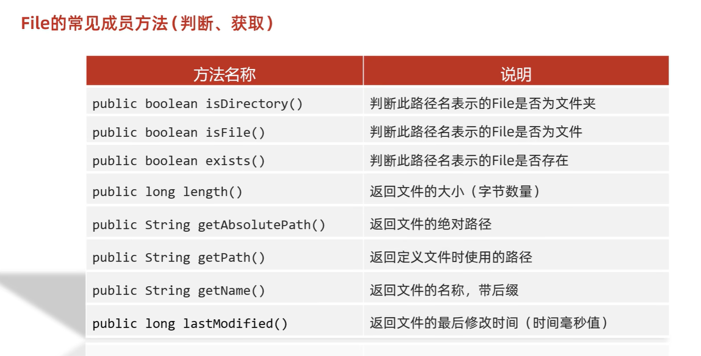
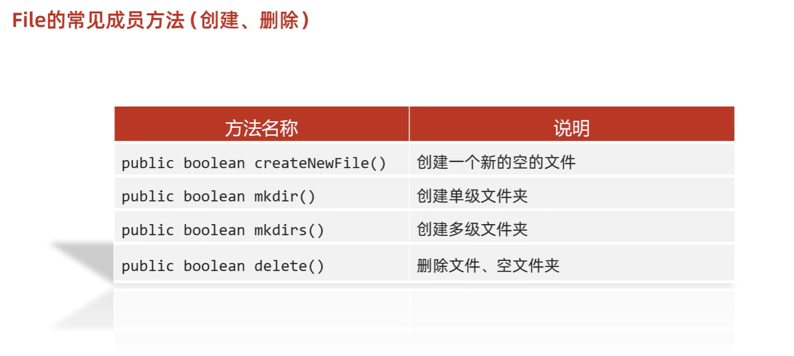
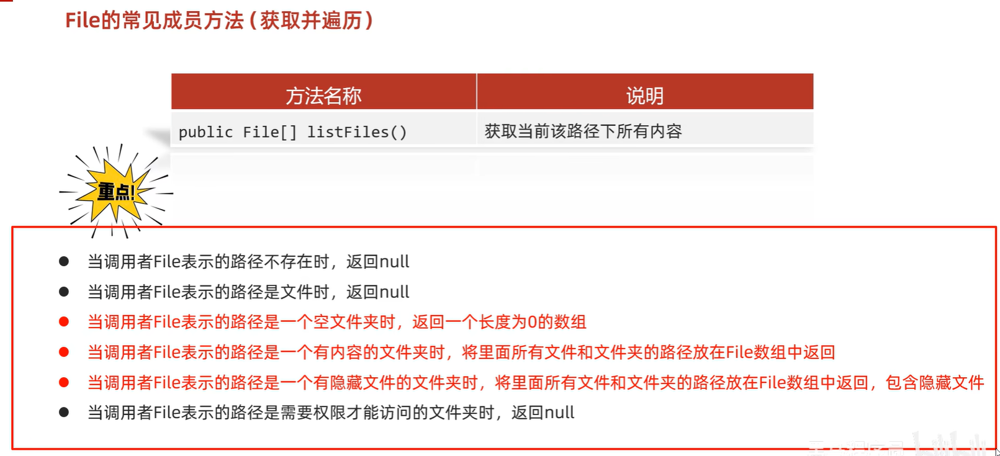
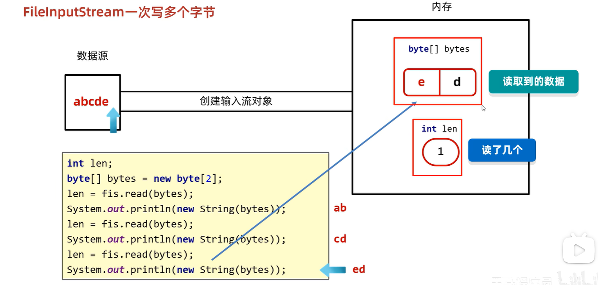
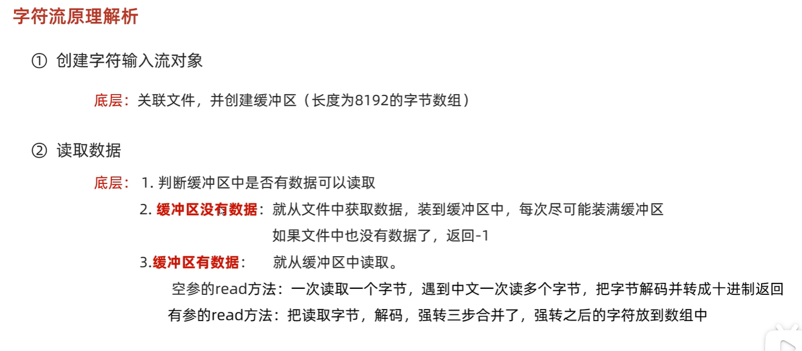
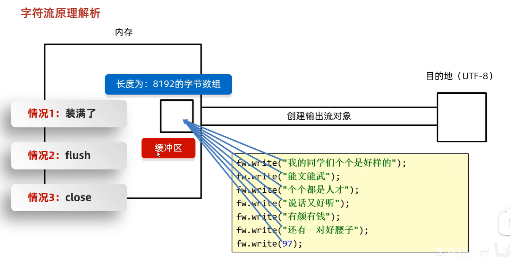
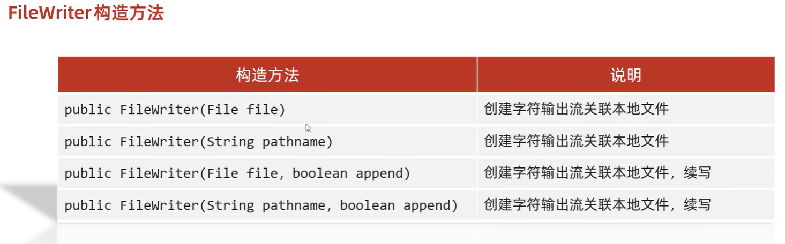
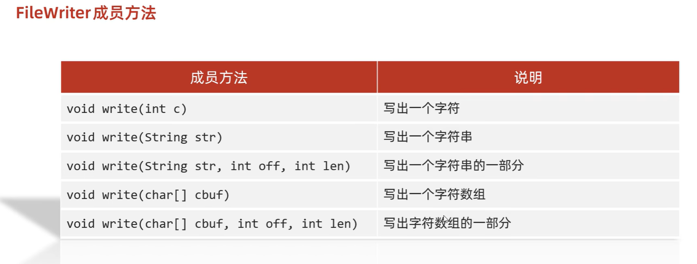
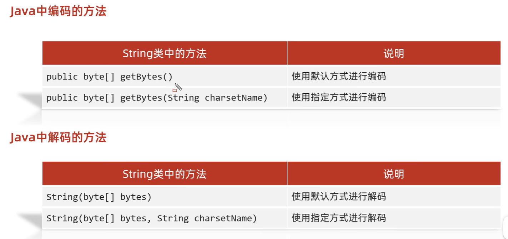

# 1. File类

## 1.1 概述

`java.io.File` 类是文件和目录路径名的抽象表示，主要用于文件和目录的创建、查找和删除等操作。

## 1.2 构造方法

- `public File(String pathname) ` ：通过将给定的**路径名字符串**转换为抽象路径名来创建新的 File实例。  
- `public File(String parent, String child) ` ：从**父路径名字符串和子路径名字符串**创建新的 File实例。
- `public File(File parent, String child)` ：从**父抽象路径名和子路径名字符串**创建新的 File实例。  
- 构造举例，代码如下：

```java
// 文件路径名
String pathname = "D:\\aaa.txt";
File file1 = new File(pathname); 

// 文件路径名
String pathname2 = "D:\\aaa\\bbb.txt";
File file2 = new File(pathname2); 

// 通过父路径和子路径字符串
 String parent = "d:\\aaa";
 String child = "bbb.txt";
 File file3 = new File(parent, child);

// 通过父级File对象和子路径字符串
File parentDir = new File("d:\\aaa");
String child = "bbb.txt";
File file4 = new File(parentDir, child);
```

> 小贴士：
>
> 1. 一个File对象代表硬盘中实际存在的一个文件或者目录。
> 2. ==无论该路径下是否存在文件或者目录，都不影响File对象的创建。==

## 1.3 常用方法

### 判断与获取



- `public long length()`  ：返回由此File表示的文件的长度。

  - 只能获取文件的大小，不能获取文件夹的大小。

  - 单位为字节 

### 创建与删除



- `public boolean createNewFile()` ：当且仅当具有该名称的文件尚不存在时，创建一个新的空文件。

  - 如果当前路径表示的文件是不存在的，则创建成功，方法返回 `true`

    如果当前路径表示的文件是存在的，则创建失败，方法返回 `false`

  - 如果父级路径是不存在的，那么方法会有异常 `IOException`

  - `CreateNewFile` 方法创建的一定是文件，如果路径中不包含后缀名，则创建一个没有后缀的文件

- `public boolean delete()` ：删除由此File表示的文件或目录。

  - 如果此File表示目录，则目录必须为空才能删除。  
  - 直接删除，不走回收站

- `public boolean mkdir()` ：创建由此File表示的目录。-->通常用mkdirs

  - 如果当前路径表示的文件是存在的，则创建失败，方法返回 `false`
  - 只能创建单级文件夹，不能创建多级文件夹

- `public boolean mkdirs()` ：创建由此File表示的==目录==，包括任何必需但不存在的父目录。

  - 单级、多级文件夹都可创建

### 遍历与获取


- `public File[] listFiles()` ：返回一个File数组，表示该File==目录==中的所有的子文件或目录。  




### 绝对路径和相对路径

- **绝对路径**：从盘符开始的路径，这是一个完整的路径。
- **相对路径**：相对于==项目目录==的路径，这是一个便捷的路径，开发中经常使用。

```java
public class FilePath {
    public static void main(String[] args) {
      	// D盘下的bbb.java文件
        File f = new File("D:\\bbb.java");
        System.out.println(f.getAbsolutePath());
      	
		// 项目下的bbb.java文件
        File f2 = new File("bbb.java");
        System.out.println(f2.getAbsolutePath());
    }
}
输出结果：
D:\bbb.java
D:\idea_project_test4\bbb.java
```


## 1.4 综合练习

### 练习1：创建文件夹

​	在当前模块下的aaa文件夹中创建一个a.txt文件

代码实现：

```java
public class Test1 {
    public static void main(String[] args) throws IOException {
        //需求：在当前模块下的aaa文件夹中创建一个a.txt文件

        //1.创建a.txt的父级路径
        File file = new File("myfile\\aaa");
        //2.创建父级路径
        //如果aaa是存在的，那么此时创建失败的。
        //如果aaa是不存在的，那么此时创建成功的。
        file.mkdirs();
        //3.拼接父级路径和子级路径
        File src = new File(file,"a.txt");
        boolean b = src.createNewFile();
        if(b){
            System.out.println("创建成功");
        }else{
            System.out.println("创建失败");
        }
    }
}
```

### 练习2：查找文件（不考虑子文件夹）

​	定义一个方法找某一个文件夹中，是否有以avi结尾的电影（暂时不需要考虑子文件夹）

代码示例：

```java
public class Test2 {
    public static void main(String[] args) {
        /*需求：
             定义一个方法找某一个文件夹中，是否有以avi结尾的电影。
	        （暂时不需要考虑子文件夹）
        */

        File file = new File("D:\\aaa\\bbb");
        boolean b = haveAVI(file);
        System.out.println(b);
    }
    /*
    * 作用：用来找某一个文件夹中，是否有以avi结尾的电影
    * 形参：要查找的文件夹
    * 返回值：查找的结果  存在true  不存在false
    * */
    public static boolean haveAVI(File file){// D:\\aaa
        //1.进入aaa文件夹，而且要获取里面所有的内容
        File[] files = file.listFiles();
        //2.遍历数组获取里面的每一个元素
        for (File f : files) {
            //f：依次表示aaa文件夹里面每一个文件或者文件夹的路径
            if(f.isFile() && f.getName().endsWith(".avi")){
                return true;
            }
        }
        //3.如果循环结束之后还没有找到，直接返回false
        return false;
    }
}
```

### 练习3：（考虑子文件夹）

​	找到电脑中所有以avi结尾的电影。（需要考虑子文件夹）

代码示例：

```java
public class Test3 {
    public static void main(String[] args) {
        /* 需求：
        找到电脑中所有以avi结尾的电影。（需要考虑子文件夹）


        套路：
            1，进入文件夹
            2，遍历数组
            3，判断
            4，判断

        */

        findAVI();

    }

    public static void findAVI(){
        //获取本地所有的盘符
        File[] arr = File.listRoots();
        for (File f : arr) {
            findAVI(f);
        }
    }

    public static void findAVI(File src){//"C:\\
        //1.进入文件夹src
        File[] files = src.listFiles();
        //2.遍历数组,依次得到src里面每一个文件或者文件夹
        if(files != null){
            for (File file : files) {
                if(file.isFile()){
                    //3，判断，如果是文件，就可以执行题目的业务逻辑
                    String name = file.getName();
                    if(name.endsWith(".avi")){
                        System.out.println(file);
                    }
                }else{
                    //4，判断，如果是文件夹，就可以递归
                    //细节：再次调用本方法的时候，参数一定要是src的次一级路径
                    findAVI(file);
                }
            }
        }
    }
}
```

### 练习4：删除多级文件夹

需求： 如果我们要删除一个有内容的文件夹
	   1.先删除文件夹里面所有的内容
           2.再删除自己

代码示例：

```java
public class Test4 {
    public static void main(String[] args) {
        /*
           删除一个多级文件夹
           如果我们要删除一个有内容的文件夹
           1.先删除文件夹里面所有的内容
           2.再删除自己
        */

        File file = new File("D:\\aaa\\src");
        delete(file);

    }

    /*
    * 作用：删除src文件夹
    * 参数：要删除的文件夹
    * */
    public static void delete(File src){
        //1.先删除文件夹里面所有的内容
        //进入src
        File[] files = src.listFiles();
        //遍历
        for (File file : files) {
            //判断,如果是文件，删除
            if(file.isFile()){
                file.delete();
            }else {
                //判断,如果是文件夹，就递归
                delete(file);
            }
        }
        //2.再删除自己
        src.delete();
    }
}
```

### 练习5：统计大小

​	需求：统计一个文件夹的总大小

代码示例：

```java
public class Test5 {
    public static void main(String[] args) {
       /*需求：
            统计一个文件夹的总大小
      */


        File file = new File("D:\\aaa\\src");

        long len = getLen(file);
        System.out.println(len);//4919189
    }

    /*
    * 作用：
    *       统计一个文件夹的总大小
    * 参数：
    *       表示要统计的那个文件夹
    * 返回值：
    *       统计之后的结果
    *
    * 文件夹的总大小：
    *       说白了，文件夹里面所有文件的大小
    * */
    public static long getLen(File src){
        //1.定义变量进行累加
        long len = 0;
        //2.进入src文件夹
        File[] files = src.listFiles();
        //3.遍历数组
        for (File file : files) {
            //4.判断
            if(file.isFile()){
                //我们就把当前文件的大小累加到len当中
                len = len + file.length();
            }else{
                //判断，如果是文件夹就递归
                len = len + getLen(file);
            }
        }
        return len;
    }
}
```

### 练习6：统计文件个数

  需求：统计一个文件夹中每种文件的个数并打印。（考虑子文件夹）
            打印格式如下：
            txt:3个
            doc:4个
            jpg:6个

代码示例：

```java
public class Test6 {
    public static void main(String[] args) throws IOException {
        /*
            需求：统计一个文件夹中每种文件的个数并打印。（考虑子文件夹）
            打印格式如下：
            txt:3个
            doc:4个
            jpg:6个
        */
        File file = new File("D:\\aaa\\src");
        HashMap<String, Integer> hm = getCount(file);
        System.out.println(hm);
    }

    /*
    * 作用：
    *       统计一个文件夹中每种文件的个数
    * 参数：
    *       要统计的那个文件夹
    * 返回值：
    *       用来统计map集合
    *       键：后缀名 值：次数
    *
    *       a.txt
    *       a.a.txt
    *       aaa（不需要统计的）
    *
    *
    * */
    public static HashMap<String,Integer> getCount(File src){
        //1.定义集合用来统计
        HashMap<String,Integer> hm = new HashMap<>();
        //2.进入src文件夹
        File[] files = src.listFiles();
        //3.遍历数组
        for (File file : files) {
            //4.判断，如果是文件，统计
            if(file.isFile()){
                //a.txt
                String name = file.getName();
                String[] arr = name.split("\\.");
                if(arr.length >= 2){
                    String endName = arr[arr.length - 1];
                    if(hm.containsKey(endName)){
                        //存在
                        int count = hm.get(endName);
                        count++;
                        hm.put(endName,count);
                    }else{
                        //不存在
                        hm.put(endName,1);
                    }
                }
            }else{
                //5.判断，如果是文件夹，递归
                //sonMap里面是子文件中每一种文件的个数
                HashMap<String, Integer> sonMap = getCount(file);
                //hm:  txt=1  jpg=2  doc=3
                //sonMap: txt=3 jpg=1
                //遍历sonMap把里面的值累加到hm当中
                Set<Map.Entry<String, Integer>> entries = sonMap.entrySet();
                for (Map.Entry<String, Integer> entry : entries) {
                    String key = entry.getKey();
                    int value = entry.getValue();
                    if(hm.containsKey(key)){
                        //存在
                        int count = hm.get(key);
                        count = count + value;
                        hm.put(key,count);
                    }else{
                        //不存在
                        hm.put(key,value);
                    }
                }
            }
        }
        return hm;
    }
}
```


# 2. IO概述

Java中I/O操作主要是指使用`java.io`包下的内容，进行输入、输出操作。**输入**也叫做**读取**数据，**输出**也叫做作**写出**数据。

## 2.1 IO的分类

根据数据的流向分为：**输入流**和**输出流**。

* **输入流** ：把数据从`其他设备`上读取到`内存`中的流。 
* **输出流** ：把数据从`内存` 中写出到`其他设备`上的流。

根据数据的类型分为：**字节流**和**字符流**。

* **字节流** ：以字节为单位，读写数据的流。
  * 可以操作所有类型的文件
  * ==无缓冲区==
* **字符流** ：以字符为单位，读写数据的流。
  * 只能操作纯文本文件
  * ==有缓冲区==

## 2.2 顶级父类

抽象类

|            |           **输入流**            |              输出流              |
| :--------: | :-----------------------------: | :------------------------------: |
| **字节流** | 字节输入流<br />**InputStream** | 字节输出流<br />**OutputStream** |
| **字符流** |   字符输入流<br />**Reader**    |    字符输出流<br />**Writer**    |

# 3. 字节流

没有缓冲区

## 3.1 字节输出流【OutputStream】

- close方法，当完成流的操作时，必须调用此方法，释放系统资源。

|                                                 |                                                              |
| ----------------------------------------------- | ------------------------------------------------------------ |
| `public void close()`                           | 关闭此输出流并释放与此流相关联的任何系统资源。               |
| `public void flush() `                          | 刷新此输出流并强制任何缓冲的输出字节被写出。                 |
| `public abstract void write(int b)`             | 将指定的字节输出流。                                         |
| `public void write(byte[] b)`                   | 将 b.length个字节从指定的字节数组写入此输出流。              |
| `public void write(byte[] b, int off, int len)` | 从指定的字节数组写入 len==字节==，从偏移量 off（索引）开始输出到此输出流。 |

## 3.2 FileOutputStream类

### 构造方法

* `public FileOutputStream(File file)`：创建文件输出流以写入由指定的 File对象表示的文件。 
* `public FileOutputStream(String name)`： 创建文件输出流以指定的名称写入文件。  

**细节**

1. 当你创建一个流对象时，必须传入一个File对象或String文件路径。

2. 该路径下，如果没有这个文件，会创建该文件，但要保证==父级路径存在==

3. 如果有这个文件，会==清空==这个文件的数据。


### 写出字节数据

write()的参数是整数，实际写到本地文件的是整数在ASSCII上对应的==字符==

| `void write(int b)`                 | 一次可以写一个字节数据           |
| ----------------------------------- | -------------------------------- |
| `void write(byte[] b)`              | 一次可以写一个字节数组数据       |
| `write(byte[] b, int off, int len)` | 一次可以写一个字节数组的部分数据 |

1. **写出字节**：`write(int b)` 方法，每次可以写出一个字节数据，代码使用演示：

- 虽然参数为int类型四个字节，但是只会保留一个字节的信息写出。

- 流操作完毕后，必须释放系统资源，调用==close==方法，千万记得。

```java
public class FOSWrite {
    public static void main(String[] args) throws IOException {
        // 使用文件名称创建流对象
        FileOutputStream fos = new FileOutputStream("fos.txt");     
      	// 写出字节数组数据
      	fos.write(97);
      	// 关闭资源
        fos.close();
    }
}
```

2. **写出字节数组**：`write(byte[] b)`，每次可以写出数组中的数据，代码使用演示：

```java
public class FOSWrite {
    public static void main(String[] args) throws IOException {
        // 使用文件名称创建流对象
        FileOutputStream fos = new FileOutputStream("fos.txt");     
      	// 字符串转换为字节数组
      	byte[] b = "黑马程序员".getBytes();
      	// 写出字节数组数据
      	fos.write(b);
      	// 关闭资源
        fos.close();
    }
}
输出结果：
黑马程序员
```

3. `write(byte[] b, int off, int len)` ,每次写出从off索引开始，len个字节

```java
public class FOSWrite {
    public static void main(String[] args) throws IOException {
        // 使用文件名称创建流对象
        FileOutputStream fos = new FileOutputStream("fos.txt");     
      	// 字符串转换为字节数组
      	byte[] b = "abcde".getBytes();
		// 写出从索引2开始，2个字节。索引2是c，两个字节，也就是cd。
        fos.write(b,2,2);
      	// 关闭资源
        fos.close();
    }
}
输出结果：
cd
```

### 数据追加续写

经过以上的演示，每次程序运行，创建输出流对象，都会清空目标文件中的数据。如何保留目标文件中数据，还能继续添加新数据呢？

- `public FileOutputStream(File file, boolean append)`： 创建文件输出流以写入由指定的 File对象表示的文件。  
- `public FileOutputStream(String name, boolean append)`： 创建文件输出流以指定的名称写入文件。  

这两个构造方法，参数中都需要传入一个boolean类型的值，`true` 表示==追加数据==，`false` 表示清空原有数据。

```java
public class FOSWrite {
    public static void main(String[] args) throws IOException {
        // 使用文件名称创建流对象
        FileOutputStream fos = new FileOutputStream("fos.txt"，true);     
      	// 字符串转换为字节数组
      	byte[] b = "abcde".getBytes();
		// 写出从索引2开始，2个字节。索引2是c，两个字节，也就是cd。
        fos.write(b);
      	// 关闭资源
        fos.close();
    }
}
文件操作前：cd
文件操作后：cdabcde
```

### 写出换行

* 回车符`\r`和换行符`\n` ：
  * 回车符：回到一行的开头（return）。
  * 换行符：下一行（newline）。
* 系统中的换行：
  * Windows系统里，每行结尾是 `回车+换行` ，即`\r\n`；-->java中可以写'\r'或‘\n’都行，会自动补全
  * Unix系统里，每行结尾只有 `换行` ，即`\n`；
  * Mac系统里，每行结尾是 `回车` ，即`\r`。从 Mac OS X开始与Linux统一。

代码使用演示：

```java
public class FOSWrite {
    public static void main(String[] args) throws IOException {
        // 使用文件名称创建流对象
        FileOutputStream fos = new FileOutputStream("fos.txt");  
      	// 定义字节数组
      	byte[] words = {97,98,99,100,101};
      	// 遍历数组
        for (int i = 0; i < words.length; i++) {
          	// 写出一个字节
            fos.write(words[i]);
          	// 写出一个换行, 换行符号转成数组写出
            fos.write("\r\n".getBytes());
        }
      	// 关闭资源
        fos.close();
    }
}

输出结果：
a
b
c
d
e
```

## 3.3 字节输入流【InputStream】

- `public void close()` ：关闭此输入流并释放与此流相关联的任何系统资源。    
- `public abstract int read()`： 从输入流读取数据的下一个字节。 
- `public int read(byte[] b)`： 从输入流中读取一些字节数，并将它们存储到字节数组 b中 。

## 3.4 FileInputStream类

### 构造方法

* `FileInputStream(File file)`： 通过打开与实际文件的连接来创建一个 FileInputStream ，该文件由文件系统中的 File对象 file命名。 
* `FileInputStream(String name)`： 通过打开与实际文件的连接来创建一个 FileInputStream ，该文件由文件系统中的路径名 name命名。  

**细节**

- 当你创建一个流对象时，必须传入一个文件路径。

  该路径下，如果没有该文件,会抛出`FileNotFoundException` ，==不会创建文件==

### 读取字节数据

|                      |                                                              |
| :------------------- | ------------------------------------------------------------ |
| `int read()`         | 读取一个字节的数据，提升为int类型，读取到文件末尾，返回`-1`  |
| `int read(byte[] b)` | 每次读取b的长度个字节==到数组中==，返回读取到的==有效字节个数==，读取到末尾(读不到有效数据时)时，==返回`-1`== |

1. **读取字节**：`read`方法，每次可以读取一个字节的数据，提升为int类型，读取到文件末尾，返回`-1`

- 虽然读取了==一个字节==，但是会==自动提升为int==类型。-->强转
- 流操作完毕后，必须释放系统资源，调用close方法，千万记得。
- 返回-1时，不能强转

循环改进读取方式，代码使用演示：

```java
public class FISRead {
    public static void main(String[] args) throws IOException{
      	// 使用文件名称创建流对象
       	FileInputStream fis = new FileInputStream("read.txt");
      	// 定义变量，保存数据
        int b ；
        // 循环读取
        while ((b = fis.read())!=-1) {
            System.out.println((char)b);
        }
		// 关闭资源
        fis.close();
    }
}
输出结果：
a
b
c
d
e
```

2. **使用字节数组读取**：`read(byte[] b)`，每次读取b的长度个字节到数组中，返回读取到的有效字节个数，读取到末尾时，返回`-1` 

- ==读到的实际字节可能包含-1，使用时：`fout.write(b,0,length)`==
- 建议数组长度为1024的整数倍，如1024 * 1024 * 5
- **读不到有效数据时，返回-1**


**==读取的字节存在覆盖现象==**

解决方法：`new String(b，0，len);//  len 每次读取的有效字节个数`



错误写法

```java
public class FISRead {
    public static void main(String[] args) throws IOException{
      	// 使用文件名称创建流对象.
       	FileInputStream fis = new FileInputStream("read.txt"); // 文件中为abcde
      	// 定义变量，作为有效个数
        int len ；
        // 定义字节数组，作为装字节数据的容器   
        byte[] b = new byte[2];
        // 循环读取
        while (( len= fis.read(b))!=-1) {
           	// 每次读取后,把数组变成字符串打印
            System.out.println(new String(b));
        }
		// 关闭资源
        fis.close();
    }
}

输出结果：
ab
cd
ed
```

错误数据`d`，是由于最后一次读取时，只读取一个字节`e`，数组中，上次读取的数据没有被完全替换，所以要==通过`len` ，获取有效的字节==，代码使用演示：

```java
public class FISRead {
    public static void main(String[] args) throws IOException{
      	// 使用文件名称创建流对象.
       	FileInputStream fis = new FileInputStream("read.txt"); // 文件中为abcde
      	// 定义变量，作为有效个数
        int len ；
        // 定义字节数组，作为装字节数据的容器   
        byte[] b = new byte[2];
        // 循环读取
        while (( len= fis.read(b))!=-1) {
           	// 每次读取后,把数组的有效字节部分，变成字符串打印
            System.out.println(new String(b，0，len));//  len 每次读取的有效字节个数
        }
		// 关闭资源
        fis.close();
    }
}

输出结果：
ab
cd
e
```


## 3.5 字节流练习：图片复制

==流的关闭原则：先开后关，后开先关。==

```java
public class Copy {
    public static void main(String[] args) throws IOException {
        // 1.创建流对象
        // 1.1 指定数据源
        FileInputStream fis = new FileInputStream("D:\\test.jpg");
        // 1.2 指定目的地
        FileOutputStream fos = new FileOutputStream("test_copy.jpg");

        // 2.读写数据
        // 2.1 定义数组
        byte[] b = new byte[1024];
        // 2.2 定义长度
        int len;
        // 2.3 循环读取
        while ((len = fis.read(b))!=-1) {
            // 2.4 写出数据
            fos.write(b, 0 , len);
        }

        // 3.关闭资源
        fos.close();
        fis.close();
    }
}
```


# 4. 字符流

- 字符流的底层是字节流，默认一个字节一个字节的读取
- 如果遇到中文就会一次读多个，GBK一次读两个字节，UTF-8一次读三个字节
- 有缓冲区，字节流没有

## 4.1 字符输入流【Reader】

- `public void close()` ：关闭此流并释放与此流相关联的任何系统资源。    
- `public int read()`： 从输入流读取一个==字符==。 
- `public int read(char[] cbuf)`： 从输入流中读取一些字符，并将它们存储到字符数组 cbuf中 。

**原理**



## 4.2 FileReader类  

`java.io.FileReader `类是读取字符文件的便利类。构造时使用系统默认的字符编码和默认字节缓冲区。

- 字符编码：Windows系统的中文编码默认是GBK编码表，idea中UTF-8

- 字节缓冲区：一个字节数组，用来临时存储字节数据。

### 构造方法

- `FileReader(File file)`： 创建一个新的 FileReader ，给定要读取的File对象。   
- `FileReader(String fileName)`： 创建一个新的 FileReader ，给定要读取的文件的名称。  

当你创建一个流对象时，必须传入一个文件路径。类似于FileInputStream 。

### 读取字符数据

|                         |                                                              |
| :---------------------- | ------------------------------------------------------------ |
| `int read()`            | 读取一个字符的数据，提升为int类型，读取到文件末尾，返回`-1`  |
| `int read(char[] cbuf)` | 每次读取b个长度的字符==到数组中==，返回读取到的==有效字符个数==，读取到末尾(读不到有效数据时)时，==返回`-1`== |

1. **读取字符**：`read`方法，每次可以读取一个字符的数据，提升为==int==类型，读取到文件末尾，返回`-1`，循环读取

- 输出要强转char
- 底层：
  - 默认一个字节一个字节的读取，如果遇到中文就会一次读多个
  - 读取后，进行解码并转成十进制返回。这个十进制是字符集的数据

```java
public class FRRead {
    public static void main(String[] args) throws IOException {
      	// 使用文件名称创建流对象
       	FileReader fr = new FileReader("read.txt");
      	// 定义变量，保存数据
        int b ；
        // 循环读取
        while ((b = fr.read())!=-1) {
            System.out.println((char)b);
        }
		// 关闭资源
        fr.close();
    }
}
输出结果：
黑
马
程
序
员
```

2. **使用字符数组读取**：`read(char[] cbuf)`，每次读取b的长度个字符到数组中，返回读取到的有效字符个数，读取到末尾时，返回`-1` 

- 直接读到char,不用强转

```java
public class FRRead {
    public static void main(String[] args) throws IOException {
      	// 使用文件名称创建流对象
       	FileReader fr = new FileReader("read.txt");
      	// 定义变量，保存有效字符个数
        int len ；
        // 定义字符数组，作为装字符数据的容器
         char[] cbuf = new char[2];
        // 循环读取
        while ((len = fr.read(cbuf))!=-1) {
            System.out.println(new String(cbuf));
        }
		// 关闭资源
        fr.close();
    }
}
输出结果：
黑马
程序
员序
```

获取有效的字符改进，代码使用演示：

```java
public class FISRead {
    public static void main(String[] args) throws IOException {
      	// 使用文件名称创建流对象
       	FileReader fr = new FileReader("read.txt");
      	// 定义变量，保存有效字符个数
        int len ；
        // 定义字符数组，作为装字符数据的容器
        char[] cbuf = new char[2];
        // 循环读取
        while ((len = fr.read(cbuf))!=-1) {
            System.out.println(new String(cbuf,0,len));
        }
    	// 关闭资源
        fr.close();
    }
}

输出结果：
黑马
程序
员
```

## 4.3 字符输出流【Writer】

- `void write(int c)` 写入单个字符。
- `void write(char[] cbuf) `写入字符数组。 
- `abstract  void write(char[] cbuf, int off, int len) `写入字符数组的某一部分,off数组的开始索引,len写的字符个数。 
- `void write(String str) `写入字符串。 
- `void write(String str, int off, int len)` 写入字符串的某一部分,off字符串的开始索引,len写的字符个数。
- `void flush() `刷新该流的缓冲。  
- `void close()` 关闭此流，但要先刷新它。 

**原理**



## 4.4 FileWriter类

`java.io.FileWriter `类是写出字符到文件的便利类。构造时使用系统默认的字符编码和默认字节缓冲区。

### 构造方法



### 基本写出数据



### 关闭和刷新

因为内置缓冲区的原因，如果不关闭输出流，无法写出字符到文件中。但是关闭的流对象，是无法继续写出数据的。如果我们既想写出数据，又想继续使用流，就需要`flush` 方法了。

* `flush` ：刷新缓冲区，流对象可以继续使用。
* `close `:先刷新缓冲区，然后通知系统释放资源。流对象不可以再被使用了。

### 续写和换行

操作类似于FileOutputStream。

```java
public class FWWrite {
    public static void main(String[] args) throws IOException {
        // 使用文件名称创建流对象，可以续写数据
        FileWriter fw = new FileWriter("fw.txt"，true);     
      	// 写出字符串
        fw.write("黑马");
      	// 写出换行
      	fw.write("\r\n");
      	// 写出字符串
  		fw.write("程序员");
      	// 关闭资源
        fw.close();
    }
}
输出结果:
黑马
程序员
```

# 5. IO异常的处理

### JDK7前处理

之前的入门练习，我们一直把异常抛出，而实际开发中并不能这样处理，建议使用`try...catch...finally` 代码块，处理异常部分，代码使用演示：

```java  
public class HandleException1 {
    public static void main(String[] args) {
      	// 声明变量
        FileWriter fw = null;
        try {
            //创建流对象
            fw = new FileWriter("fw.txt");
            // 写出数据
            fw.write("黑马程序员"); //黑马程序员
        } catch (IOException e) {
            e.printStackTrace();
        } finally {
            try {
                if (fw != null) {
                    fw.close();
                }
            } catch (IOException e) {
                e.printStackTrace();
            }
        }
    }
}
```

### JDK7的处理(扩展知识点了解内容)

还可以使用JDK7优化后的`try-with-resource` 语句，该语句确保了==每个资源在语句结束时关闭==。

所谓的资源（resource）是指在程序完成后，必须关闭的对象。

- 只有实现了AutoCloseable接口的类，才能在try的括号中创建对象

格式：

```java
try (创建流对象语句，如果多个,使用';'隔开) {
	// 读写数据
} catch (IOException e) {
	e.printStackTrace();
}
```

代码使用演示：

```java
public class HandleException2 {
    public static void main(String[] args) {
      	// 创建流对象
        try ( FileWriter fw = new FileWriter("fw.txt"); ) {
            // 写出数据
            fw.write("黑马程序员"); //黑马程序员
        } catch (IOException e) {
            e.printStackTrace();
        }
    }
}
```

### JDK9的改进(扩展知识点了解内容)

JDK9中`try-with-resource` 的改进，对于**引入对象**的方式，支持的更加简洁。

被引入的对象，同样可以==自动关闭==，无需手动close，我们来了解一下格式。

改进前格式：

```java
// 被final修饰的对象
final Resource resource1 = new Resource("resource1");
// 普通对象
Resource resource2 = new Resource("resource2");
// 引入方式：创建新的变量保存
try (Resource r1 = resource1;
     Resource r2 = resource2) {
     // 使用对象
}
```

改进后格式：

```java
// 被final修饰的对象
final Resource resource1 = new Resource("resource1");
// 普通对象
Resource resource2 = new Resource("resource2");

// 引入方式：直接引入
try (resource1; resource2) {
     // 使用对象
}
```

改进后，代码使用演示：

```java
public class TryDemo {
    public static void main(String[] args) throws IOException {
       	// 创建流对象
        final  FileReader fr  = new FileReader("in.txt");
        FileWriter fw = new FileWriter("out.txt");
       	// 引入到try中
        try (fr; fw) {
          	// 定义变量
            int b;
          	// 读取数据
          	while ((b = fr.read())!=-1) {
            	// 写出数据
            	fw.write(b);
          	}
        } catch (IOException e) {
            e.printStackTrace();
        }
    }
}
```

# 6. 字符集


### GBK

- 兼容ASCIl，英文以0开头（英文实际是7比特，前面补0）
- 汉字二进制以1开头
- 简体中文版windows,默认GBK


### Unicode

**utf-8**:Unicode字符集的一种编码方式

- 汉字二进制以1开头


### 如何避免乱码

1. 不用字节流读取文本文件，可以拷贝
2. 编码解码用同一个码表，同一种编码方式

### 编码与解码

- idea默认UTF-8 , eclipse默认GBK
- 解码的方法是String的构造器



# 7. 综合练习

## 练习1：拷贝文件夹

```java
public class Test01 {
    public static void main(String[] args) throws IOException {
        //拷贝一个文件夹，考虑子文件夹

        //1.创建对象表示数据源
        File src = new File("D:\\aaa\\src");
        //2.创建对象表示目的地
        File dest = new File("D:\\aaa\\dest");

        //3.调用方法开始拷贝
        copydir(src,dest);


    }

    /*
    * 作用：拷贝文件夹
    * 参数一：数据源
    * 参数二：目的地
    *
    * */
    private static void copydir(File src, File dest) throws IOException {
        dest.mkdirs();
        //递归
        //1.进入数据源
        File[] files = src.listFiles();
        //2.遍历数组
        for (File file : files) {
            if(file.isFile()){
                //3.判断文件，拷贝
                FileInputStream fis = new FileInputStream(file);
                FileOutputStream fos = new FileOutputStream(new File(dest,file.getName()));
                byte[] bytes = new byte[1024];
                int len;
                while((len = fis.read(bytes)) != -1){
                    fos.write(bytes,0,len);
                }
                fos.close();
                fis.close();
            }else {
                //4.判断文件夹，递归
                copydir(file, new File(dest,file.getName()));
            }
        }
    }
}

```

## 练习2：文件加密

不用再写解密逻辑，==只要将加密文件再次加密拷贝到新文件即可==：A->B(加密)，B->C（解密）

```java
public class Test02 {
    public static void main(String[] args) throws IOException {
        /*
            为了保证文件的安全性，就需要对原始文件进行加密存储，再使用的时候再对其进行解密处理。
            加密原理：
                对原始文件中的每一个字节数据进行更改，然后将更改以后的数据存储到新的文件中。
            解密原理：
                读取加密之后的文件，按照加密的规则反向操作，变成原始文件。

             ^ : 异或
                 两边相同：false
                 两边不同：true

                 0：false
                 1：true

               100:1100100
               10: 1010

               1100100
             ^ 0001010
             __________
               1101110
             ^ 0001010
             __________
               1100100

        */
    }

    public static void encryptionAndReduction(File src, File dest) throws IOException {
        FileInputStream fis = new FileInputStream(src);
        FileOutputStream fos = new FileOutputStream(dest);
        int b;
        while ((b = fis.read()) != -1) {
            fos.write(b ^ 2);
        }
        //4.释放资源
        fos.close();
        fis.close();
    }


}

```

## 练习3：数字排序

文本文件中有以下的数据：
                2-1-9-4-7-8
 将文件中的数据进行排序，变成以下的数据：
                1-2-4-7-8-9

实现方式一：

```java
public class Test03 {
    public static void main(String[] args) throws IOException {
        /*
            文本文件中有以下的数据：
                2-1-9-4-7-8
            将文件中的数据进行排序，变成以下的数据：
                1-2-4-7-8-9
        */


        //1.读取数据
        FileReader fr = new FileReader("myio\\a.txt");
        StringBuilder sb = new StringBuilder();
        int ch;
        while((ch = fr.read()) != -1){
            sb.append((char)ch);
        }
        fr.close();
        System.out.println(sb);
        //2.排序
        String str = sb.toString();
        String[] arrStr = str.split("-");//2-1-9-4-7-8

        ArrayList<Integer> list = new ArrayList<>();
        for (String s : arrStr) {
            int i = Integer.parseInt(s);
            list.add(i);
        }
        Collections.sort(list);
        System.out.println(list);
        //3.写出
        FileWriter fw = new FileWriter("myio\\a.txt");
        for (int i = 0; i < list.size(); i++) {
            if(i == list.size() - 1){
                fw.write(list.get(i) + "");
            }else{
                fw.write(list.get(i) + "-");
            }
        }
        fw.close();
    }
}
```

实现方式二：

```java
public class Test04 {
    public static void main(String[] args) throws IOException {
        /*
            文本文件中有以下的数据：
                2-1-9-4-7-8
            将文件中的数据进行排序，变成以下的数据：
                1-2-4-7-8-9

           细节1：
                文件中的数据不要换行

            细节2:
                bom头
        */
        //1.读取数据
        FileReader fr = new FileReader("myio\\a.txt");
        StringBuilder sb = new StringBuilder();
        int ch;
        while((ch = fr.read()) != -1){
            sb.append((char)ch);
        }
        fr.close();
        System.out.println(sb);
        //2.排序
        Integer[] arr = Arrays.stream(sb.toString()
                                      .split("-"))
            .map(Integer::parseInt)
            .sorted()
            .toArray(Integer[]::new);
        //3.写出
        FileWriter fw = new FileWriter("myio\\a.txt");
        String s = Arrays.toString(arr).replace(", ","-");
        String result = s.substring(1, s.length() - 1);
        fw.write(result);
        fw.close();
    }
}
```


