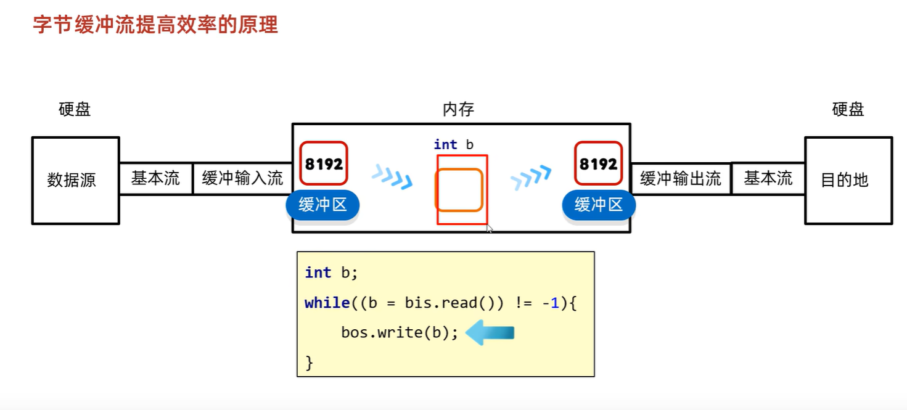
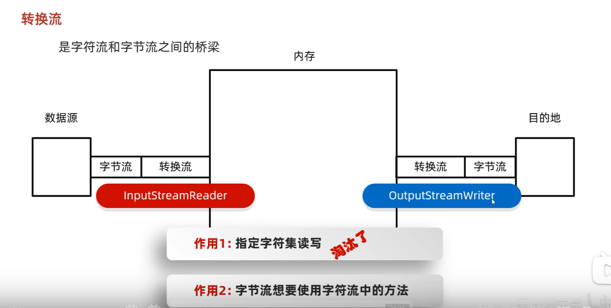
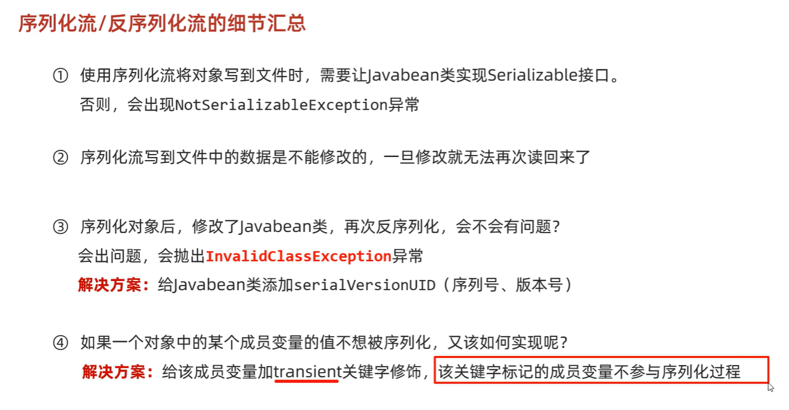
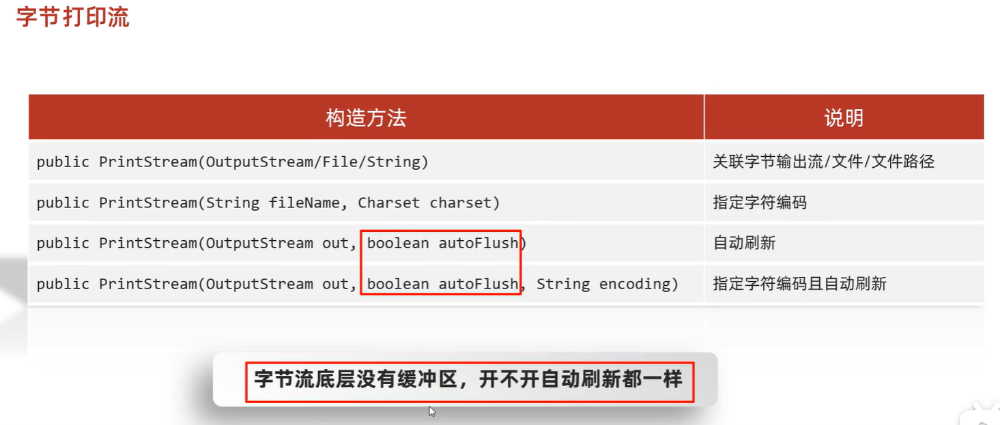
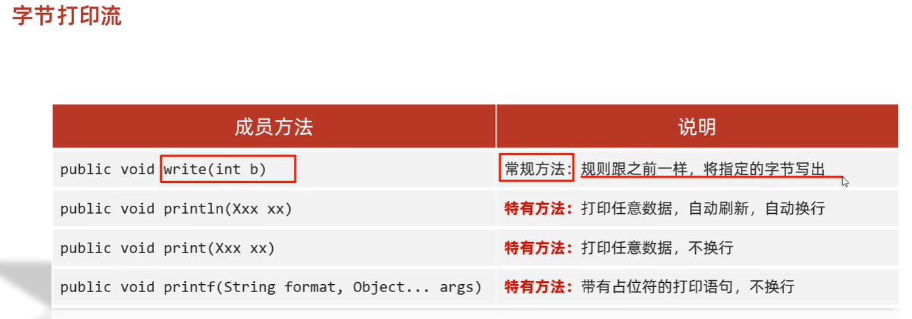
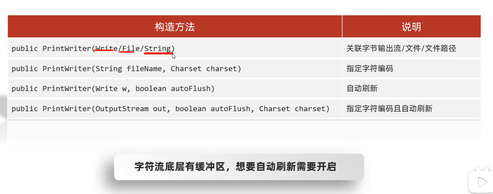
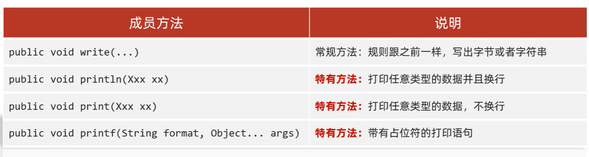
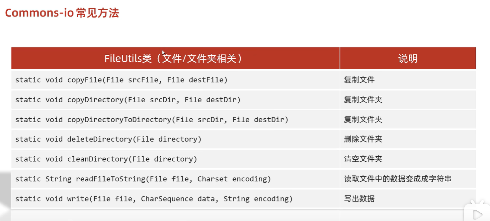
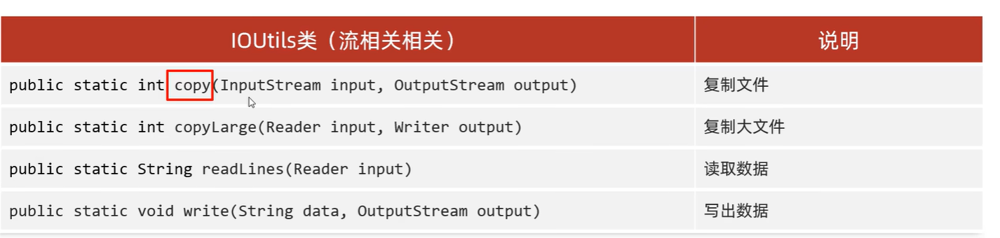
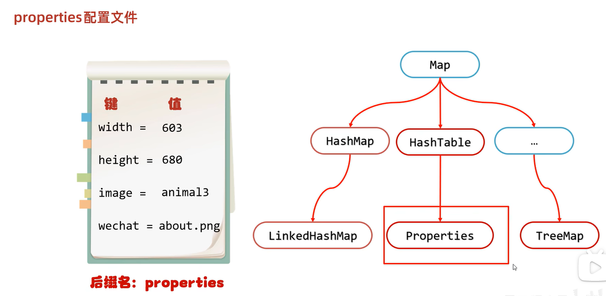

# 1. 缓冲流

昨天学习了基本的一些流，作为IO流的入门，今天我们要见识一些更强大的流。比如能够高效读写的缓冲流，能够转换编码的转换流，能够持久化存储对象的序列化流等等。这些功能更为强大的流，都是在基本的流对象基础之上创建而来的，就像穿上铠甲的武士一样，相当于是对基本流对象的一种增强。

## 1.1 概述

缓冲流,也叫高效流，是对4个基本的`FileXxx` 流的增强，所以也是4个流，按照数据类型分类：

* **字节缓冲流**：`BufferedInputStream`，`BufferedOutputStream` 
* **字符缓冲流**：`BufferedReader`，`BufferedWriter`

缓冲流的基本原理，是在创建流对象时，会创建一个内置的默认大小（8196）的缓冲区数组，通过缓冲区读写，减少系统IO次数，从而提高读写的效率。

## 1.2 字节缓冲流

### 构造方法

* `public BufferedInputStream(InputStream in)` ：创建一个 新的缓冲输入流。 
* `public BufferedOutputStream(OutputStream out)`： 创建一个新的缓冲输出流。

构造举例，代码如下：

```java
// 创建字节缓冲输入流
BufferedInputStream bis = new BufferedInputStream(new FileInputStream("bis.txt"));
// 创建字节缓冲输出流
BufferedOutputStream bos = new BufferedOutputStream(new FileOutputStream("bos.txt"));
```

### 关闭方法

- `close()`

  只用关闭缓冲流，缓冲流底层会关闭基本流

### 底层原理




## 1.3 字符缓冲流

### 构造方法

* `public BufferedReader(Reader in)` ：创建一个 新的缓冲输入流。 
* `public BufferedWriter(Writer out)`： 创建一个新的缓冲输出流。

构造举例，代码如下：

```java
// 创建字符缓冲输入流
BufferedReader br = new BufferedReader(new FileReader("br.txt"));
// 创建字符缓冲输出流
BufferedWriter bw = new BufferedWriter(new FileWriter("bw.txt"));
```

### 特有方法

字符缓冲流的基本方法与普通字符流调用方式一致，不再阐述，我们来看它们具备的特有方法。

* BufferedReader
  * `public String readLine()`: 读一行数据，如果没有数据可读了，则返回==null==.
    * 一次读一整行，遇到回车换行结束。
    * 但它==不会将回车读入内存==，输出时要手动换行
    * 读指针会自动换行

* BufferedWriter
  * `public void newLine()`: 跨平台的换行。写一行行分隔符,由系统属性定义符号。 


`readLine`方法演示，代码如下：

```java
public class BufferedReaderDemo {
    public static void main(String[] args) throws IOException {
      	 // 创建流对象
        BufferedReader br = new BufferedReader(new FileReader("in.txt"));
		// 定义字符串,保存读取的一行文字
        String line  = null;
      	// 循环读取,读取到最后返回null
        while ((line = br.readLine())!=null) {
            System.out.print(line);
            System.out.println("------");
        }
		// 释放资源
        br.close();
    }
}
```

`newLine`方法演示，代码如下：

  ```java
public class BufferedWriterDemo throws IOException {
    public static void main(String[] args) throws IOException  {
      	// 创建流对象
		BufferedWriter bw = new BufferedWriter(new FileWriter("out.txt"));
      	// 写出数据
        bw.wri0~te("黑马");
      	// 写出换行
        bw.newLine();
        bw.write("程序");
        bw.newLine();
        bw.write("员");
        bw.newLine();
		// 释放资源
        bw.close();
    }
}
输出效果:
黑马
程序
员
  ```


# 2. 转换流



## 2.1 InputStreamReader类  

转换流`java.io.InputStreamReader`，是Reader的子类，是从字节流到字符流的桥梁。它读取字节，并==使用指定的字符集将其解码为字符==。它的字符集可以由名称指定，也可以接受平台的默认字符集。 

==已被淘汰，JDK11后Reader有构造方法可以指定字符集==

### 构造方法

* `InputStreamReader(InputStream in)`: 创建一个使用默认字符集的字符流。 
* `InputStreamReader(InputStream in, String charsetName)`: 创建一个指定字符集的字符流。

构造举例，代码如下： 

```java
InputStreamReader isr = new InputStreamReader(new FileInputStream("in.txt"));
InputStreamReader isr2 = new InputStreamReader(new FileInputStream("in.txt") , "GBK");
```

### 指定编码读取

```java
public class ReaderDemo2 {
    public static void main(String[] args) throws IOException {
      	// 定义文件路径,文件为gbk编码
        String FileName = "E:\\file_gbk.txt";
      	// 创建流对象,默认UTF8编码
        InputStreamReader isr = new InputStreamReader(new FileInputStream(FileName));
      	// 创建流对象,指定GBK编码
        InputStreamReader isr2 = new InputStreamReader(new FileInputStream(FileName) , "GBK");
		// 定义变量,保存字符
        int read;
      	// 使用默认编码字符流读取,乱码
        while ((read = isr.read()) != -1) {
            System.out.print((char)read); // ��Һ�
        }
        isr.close();
      
      	// 使用指定编码字符流读取,正常解析
        while ((read = isr2.read()) != -1) {
            System.out.print((char)read);// 大家好
        }
        isr2.close();
    }
}
```

## 2.2 OutputStreamWriter类

转换流`java.io.OutputStreamWriter` ，是Writer的子类，是从字符流到字节流的桥梁。使用指定的字符集将字符编码为字节。它的字符集可以由名称指定，也可以接受平台的默认字符集。 

==已被淘汰，JDK11后Writer有构造方法可以指定字符集==

### 构造方法

- `OutputStreamWriter(OutputStream in)`: 创建一个使用默认字符集的字符流。 
- `OutputStreamWriter(OutputStream in, String charsetName)`: 创建一个指定字符集的字符流。

构造举例，代码如下： 

```java
OutputStreamWriter isr = new OutputStreamWriter(new FileOutputStream("out.txt"));
OutputStreamWriter isr2 = new OutputStreamWriter(new FileOutputStream("out.txt") , "GBK");
```

### 指定编码写出

```java
public class OutputDemo {
    public static void main(String[] args) throws IOException {
      	// 定义文件路径
        String FileName = "E:\\out.txt";
      	// 创建流对象,默认UTF8编码
        OutputStreamWriter osw = new OutputStreamWriter(new FileOutputStream(FileName));
        // 写出数据
      	osw.write("你好"); // 保存为6个字节
        osw.close();
      	
		// 定义文件路径
		String FileName2 = "E:\\out2.txt";
     	// 创建流对象,指定GBK编码
        OutputStreamWriter osw2 = new OutputStreamWriter(new FileOutputStream(FileName2),"GBK");
        // 写出数据
      	osw2.write("你好");// 保存为4个字节
        osw2.close();
    }
}
```

### 转换流理解图解

**转换流是字节与字符间的桥梁！**

## 2.3 练习：转换文件编码

将GBK编码的文本文件，转换为UTF-8编码的文本文件。

### 案例分析

1. 指定GBK编码的转换流，读取文本文件。
2. 使用UTF-8编码的转换流，写出文本文件。

### 案例实现

```java
public class TransDemo {
   public static void main(String[] args) {      
    	// 1.定义文件路径
     	String srcFile = "file_gbk.txt";
        String destFile = "file_utf8.txt";
		// 2.创建流对象
    	// 2.1 转换输入流,指定GBK编码
        InputStreamReader isr = new InputStreamReader(new FileInputStream(srcFile) , "GBK");
    	// 2.2 转换输出流,默认utf8编码
        OutputStreamWriter osw = new OutputStreamWriter(new FileOutputStream(destFile));
		// 3.读写数据
    	// 3.1 定义数组
        char[] cbuf = new char[1024];
    	// 3.2 定义长度
        int len;
    	// 3.3 循环读取
        while ((len = isr.read(cbuf))!=-1) {
            // 循环写出
          	osw.write(cbuf,0,len);
        }
    	// 4.释放资源
        osw.close();
        isr.close();
  	}
}
```

# 3. 序列化

## 3.1 概述

Java 提供了一种对象**序列化**的机制。用一个字节序列可以表示一个对象，该字节序列包含该`对象的数据`、`对象的类型`和`对象中存储的属性`等信息。字节序列写出到文件之后，相当于文件中**持久保存**了一个对象的信息。 

反之，该字节序列还可以从文件中读取回来，重构对象，对它进行**反序列化**。`对象的数据`、`对象的类型`和`对象中存储的数据`信息，都可以用来在内存中创建对象。看图理解序列化： 

## 3.2 ObjectOutputStream类

`java.io.ObjectOutputStream ` 类，将Java对象的原始数据类型写出到文件,实现对象的持久存储。

### 构造方法

* `public ObjectOutputStream(OutputStream out) `： 创建一个指定OutputStream的ObjectOutputStream。

### 序列化操作

1. 一个对象要想序列化，必须满足两个条件:

* 该类必须==实现`java.io.Serializable ` 接口==，`Serializable` 是一个标记接口，不实现此接口的类将不会使任何状态序列化或反序列化，会抛出`NotSerializableException` 。
* 该类的所有属性必须是可序列化的。如果有一个属性==不需要可序列化的，则该属性必须注明是瞬态的==，使用`transient` 关键字修饰。-->反序列化后值为Null

```java
public class Employee implements java.io.Serializable {
    public String name;
    public String address;
    public transient int age; // transient瞬态修饰成员,不会被序列化
    public void addressCheck() {
      	System.out.println("Address  check : " + name + " -- " + address);
    }
}
```

2.写出对象方法

* `public final void writeObject (Object obj)` : 将指定的对象写出。

==通常将多个对象放入集合，然后序列化写出集合==

```java
public class SerializeDemo{
   	public static void main(String [] args)   {
    	Employee e = new Employee();
    	e.name = "zhangsan";
    	e.address = "beiqinglu";
    	e.age = 20; 
    	try {
      		// 创建序列化流对象
          ObjectOutputStream out = new ObjectOutputStream(new FileOutputStream("employee.txt"));
        	// 写出对象
        	out.writeObject(e);
        	// 释放资源
        	out.close();
        	System.out.println("Serialized data is saved"); // 姓名，地址被序列化，年龄没有被序列化。
        } catch(IOException i)   {
            i.printStackTrace();
        }
   	}
}
输出结果：
Serialized data is saved
```

## 3.3 ObjectInputStream类

ObjectInputStream反序列化流，将之前使用ObjectOutputStream序列化的原始数据恢复为对象。 

### 构造方法

* `public ObjectInputStream(InputStream in) `： 创建一个指定InputStream的ObjectInputStream。

### 反序列化操作1

如果能找到一个对象的class文件，我们可以进行反序列化操作，调用`ObjectInputStream`读取对象的方法：

- `public final Object readObject ()` : 读取一个对象。

**对于JVM可以反序列化对象，它必须是能够找到class文件的类。如果找不到该类的class文件，则抛出一个 `ClassNotFoundException` 异常。**  

```java
public class DeserializeDemo {
   public static void main(String [] args)   {
        Employee e = null;
        try {		
             // 创建反序列化流
             FileInputStream fileIn = new FileInputStream("employee.txt");
             ObjectInputStream in = new ObjectInputStream(fileIn);
             // 读取一个对象
             e = (Employee) in.readObject();
             // 释放资源
             in.close();
             fileIn.close();
        }catch(IOException i) {
             // 捕获其他异常
             i.printStackTrace();
             return;
        }catch(ClassNotFoundException c)  {
        	// 捕获类找不到异常
             System.out.println("Employee class not found");
             c.printStackTrace();
             return;
        }
        // 无异常,直接打印输出
        System.out.println("Name: " + e.name);	// zhangsan
        System.out.println("Address: " + e.address); // beiqinglu
        System.out.println("age: " + e.age); // 0
    }
}
```


### **反序列化操作2**

**另外，当JVM反序列化对象时，能找到class文件，但是class文件在序列化对象之后发生了修改，那么反序列化操作也会失败，抛出一个`InvalidClassException`异常。**发生这个异常的原因如下：

* 该类的序列版本号与从流中读取的类描述符的版本号不匹配 
* 该类包含未知数据类型 
* 该类没有可访问的无参数构造方法 

`Serializable` 接口给需要序列化的类，提供了一个序列版本号。`serialVersionUID` 该版本号的目的在于验证序列化的对象和对应类是否版本匹配。

**解决方法**：

提供一个版本号`private static final long serialVersionUID`

```java
public class Employee implements java.io.Serializable {
     // 加入序列版本号
     private static final long serialVersionUID = 1L;
     public String name;
     public String address;
     // 添加新的属性 ,重新编译, 可以反序列化,该属性赋为默认值.
     public int eid; 

     public void addressCheck() {
         System.out.println("Address  check : " + name + " -- " + address);
     }
}
```

## 3.4 细节汇总



==通常将多个对象放入集合，然后序列化写出集合==

## 3.5 练习：序列化集合

1. 将存有多个自定义对象的集合序列化操作，保存到`list.txt`文件中。
2. 反序列化`list.txt` ，并遍历集合，打印对象信息。

### 案例分析

1. 把若干学生对象 ，保存到集合中。
2. ==把集合序列化。==
3. ==反序列化读取时，只需要读取一次，转换为集合类型。==
4. 遍历集合，可以打印所有的学生信息

### 案例实现

```java
public class SerTest {
	public static void main(String[] args) throws Exception {
		// 创建 学生对象
		Student student = new Student("老王", "laow");
		Student student2 = new Student("老张", "laoz");
		Student student3 = new Student("老李", "laol");

		ArrayList<Student> arrayList = new ArrayList<>();
		arrayList.add(student);
		arrayList.add(student2);
		arrayList.add(student3);
		// 序列化操作
		// serializ(arrayList);
		
		// 反序列化  
		ObjectInputStream ois  = new ObjectInputStream(new FileInputStream("list.txt"));
		// 读取对象,强转为ArrayList类型
		ArrayList<Student> list  = (ArrayList<Student>)ois.readObject();
		
      	for (int i = 0; i < list.size(); i++ ){
          	Student s = list.get(i);
        	System.out.println(s.getName()+"--"+ s.getPwd());
      	}
	}

	private static void serializ(ArrayList<Student> arrayList) throws Exception {
		// 创建 序列化流 
		ObjectOutputStream oos = new ObjectOutputStream(new FileOutputStream("list.txt"));
		// 写出对象
		oos.writeObject(arrayList);
		// 释放资源
		oos.close();
	}
}
```


#  4. 打印流

## 4.1 概述

平时我们在控制台打印输出，是调用`print`方法和`println`方法完成的，这两个方法都来自于`java.io.PrintStream`类，该类能够方便地打印各种数据类型的值，是一种便捷的输出方式。

## 4.2 PrintStream类

### 构造方法



### 常用方法



上述方法是将数据打印到文件中

### 改变打印流向

`System.out`就是`PrintStream`类型的，只不过它的流向是系统规定的，打印在控制台上。-->标准输出流，不能关闭


不过，既然是流对象，我们就可以玩一个"小把戏"，改变它的流向。

```java
public class PrintDemo {
    public static void main(String[] args) throws IOException {
		// 调用系统的打印流,控制台直接输出97
        System.out.println(97);
      
		// 创建打印流,指定文件的名称
        PrintStream ps = new PrintStream("ps.txt");
      	
      	// 设置系统的打印流流向,输出到ps.txt
        System.setOut(ps);
      	// 调用系统的打印流,ps.txt中输出97
        System.out.println(97);
    }
}
```

## 4.3 PrintWriter

### 构造方法



### 常用方法



# 5. 压缩流和解压缩流

java只能识别zip

压缩流：ZipOutputStream

- 将每个文件或文件夹看成ZipEntry对象放到压缩包里

- 负责压缩文件或者文件夹

解压缩流：ZipInputStream

- 将压缩包的zipEntry按照层级拷贝到本地的另一个文件夹中

- 负责把压缩包中的文件和文件夹解压出来

```java
/*
*   解压缩流
*
* */
public class ZipStreamDemo1 {
    public static void main(String[] args) throws IOException {

        //1.创建一个File表示要解压的压缩包
        File src = new File("D:\\aaa.zip");
        //2.创建一个File表示解压的目的地
        File dest = new File("D:\\");

        //调用方法
        unzip(src,dest);

    }

    //定义一个方法用来解压
    public static void unzip(File src,File dest) throws IOException {
        //解压的本质：把压缩包里面的每一个文件或者文件夹读取出来，按照层级拷贝到目的地当中
        //创建一个解压缩流用来读取压缩包中的数据
        ZipInputStream zip = new ZipInputStream(new FileInputStream(src));
        //要先获取到压缩包里面的每一个zipentry对象
        //表示当前在压缩包中获取到的文件或者文件夹
        ZipEntry entry;
        while((entry = zip.getNextEntry()) != null){
            System.out.println(entry);
            if(entry.isDirectory()){
                //文件夹：需要在目的地dest处创建一个同样的文件夹
                File file = new File(dest,entry.toString());
                file.mkdirs();
            }else{
                //文件：需要读取到压缩包中的文件，并把他存放到目的地dest文件夹中（按照层级目录进行存放）
                FileOutputStream fos = new FileOutputStream(new File(dest,entry.toString()));
                int b;
                while((b = zip.read()) != -1){
                    //写到目的地
                    fos.write(b);
                }
                fos.close();
                //表示在压缩包中的一个文件处理完毕了。
                zip.closeEntry();
            }
        }
        zip.close();
    }
}
```

```java
public class ZipStreamDemo2 {
    public static void main(String[] args) throws IOException {
        /*
         *   压缩流
         *      需求：
         *          把D:\\a.txt打包成一个压缩包
         * */
        //1.创建File对象表示要压缩的文件
        File src = new File("D:\\a.txt");
        //2.创建File对象表示压缩包的位置
        File dest = new File("D:\\");
        //3.调用方法用来压缩
        toZip(src,dest);
    }

    /*
    *   作用：压缩
    *   参数一：表示要压缩的文件
    *   参数二：表示压缩包的位置
    * */
    public static void toZip(File src,File dest) throws IOException {
        //1.创建压缩流关联压缩包
        ZipOutputStream zos = new ZipOutputStream(new FileOutputStream(new File(dest,"a.zip")));
        //2.创建ZipEntry对象，表示压缩包里面的每一个文件和文件夹
        //参数：压缩包里面的路径
        ZipEntry entry = new ZipEntry("aaa\\bbb\\a.txt");
        //3.把ZipEntry对象放到压缩包当中
        zos.putNextEntry(entry);
        //4.把src文件中的数据写到压缩包当中
        FileInputStream fis = new FileInputStream(src);
        int b;
        while((b = fis.read()) != -1){
            zos.write(b);
        }
        zos.closeEntry();
        zos.close();
    }
}
```

```java
public class ZipStreamDemo3 {
    public static void main(String[] args) throws IOException {
        /*
         *   压缩流
         *      需求：
         *          把D:\\aaa文件夹压缩成一个压缩包
         * */
        //1.创建File对象表示要压缩的文件夹
        File src = new File("D:\\aaa");
        //2.创建File对象表示压缩包放在哪里（压缩包的父级路径）
        File destParent = src.getParentFile();//D:\\
        //3.创建File对象表示压缩包的路径
        File dest = new File(destParent,src.getName() + ".zip");
        //4.创建压缩流关联压缩包
        ZipOutputStream zos = new ZipOutputStream(new FileOutputStream(dest));
        //5.获取src里面的每一个文件，变成ZipEntry对象，放入到压缩包当中
        toZip(src,zos,src.getName());//aaa
        //6.释放资源
        zos.close();
    }

    /*
    *   作用：获取src里面的每一个文件，变成ZipEntry对象，放入到压缩包当中
    *   参数一：数据源
    *   参数二：压缩流
    *   参数三：压缩包内部的路径
    * */
    public static void toZip(File src,ZipOutputStream zos,String name) throws IOException {
        //1.进入src文件夹
        File[] files = src.listFiles();
        //2.遍历数组
        for (File file : files) {
            if(file.isFile()){
                //3.判断-文件，变成ZipEntry对象，放入到压缩包当中
                ZipEntry entry = new ZipEntry(name + "\\" + file.getName());//aaa\\no1\\a.txt
                zos.putNextEntry(entry);
                //读取文件中的数据，写到压缩包
                FileInputStream fis = new FileInputStream(file);
                int b;
                while((b = fis.read()) != -1){
                    zos.write(b);
                }
                fis.close();
                zos.closeEntry();
            }else{
                //4.判断-文件夹，递归
                toZip(file,zos,name + "\\" + file.getName());
                //     no1            aaa   \\   no1
            }
        }
    }
}
```

# 6. 工具包（Commons-io）

介绍：

​	Commons是apache开源基金组织提供的工具包，里面有很多帮助我们提高开发效率的API

比如：

​	StringUtils   字符串工具类

​	NumberUtils   数字工具类 

​	ArrayUtils   数组工具类  

​	RandomUtils   随机数工具类

​	DateUtils   日期工具类 

​	StopWatch   秒表工具类 

​	ClassUtils   反射工具类  

​	SystemUtils   系统工具类  

​	MapUtils   集合工具类

​	Beanutils   bean工具类

​	Commons-io io的工具类

​	等等.....

其中：Commons-io是apache开源基金组织提供的一组有关IO操作的开源工具包。

作用：提高IO流的开发效率。

使用方式：

1，新建lib文件夹

2，把第三方jar包粘贴到文件夹中

3，右键点击add as a library






# 7. 工具包（hutool）

介绍：

​	Commons是国人开发的开源工具包，里面有很多帮助我们提高开发效率的API

比如：

​	DateUtil  日期时间工具类 

​	TimeInterval  计时器工具类 

​	StrUtil  字符串工具类

​	HexUtil   16进制工具类

​	HashUtil   Hash算法类

​	ObjectUtil  对象工具类

​	ReflectUtil   反射工具类

​	TypeUtil  泛型类型工具类

​	PageUtil  分页工具类

​	NumberUtil  数字工具类

使用方式：

1，新建lib文件夹

2，把第三方jar包粘贴到文件夹中

3，右键点击add as a library

代码示例：

```java
public class Test1 {
    public static void main(String[] args) {
    /*
        FileUtil类:
                file：根据参数创建一个file对象
                touch：根据参数创建文件

                writeLines：把集合中的数据写出到文件中，覆盖模式。
                appendLines：把集合中的数据写出到文件中，续写模式。
                readLines：指定字符编码，把文件中的数据，读到集合中。
                readUtf8Lines：按照UTF-8的形式，把文件中的数据，读到集合中

                copy：拷贝文件或者文件夹
    */


       /* File file1 = FileUtil.file("D:\\", "aaa", "bbb", "a.txt");
        System.out.println(file1);//D:\aaa\bbb\a.txt

        File touch = FileUtil.touch(file1);
        System.out.println(touch);


        ArrayList<String> list = new ArrayList<>();
        list.add("aaa");
        list.add("aaa");
        list.add("aaa");

        File file2 = FileUtil.writeLines(list, "D:\\a.txt", "UTF-8");
        System.out.println(file2);*/

      /*  ArrayList<String> list = new ArrayList<>();
        list.add("aaa");
        list.add("aaa");
        list.add("aaa");
        File file3 = FileUtil.appendLines(list, "D:\\a.txt", "UTF-8");
        System.out.println(file3);*/
        List<String> list = FileUtil.readLines("D:\\a.txt", "UTF-8");
        System.out.println(list);
    }
}
```


# 8. Properties双列集合

无泛型，键与值都是Object类型



- 输出:`void store(Writer/OutputStream out, String comment)`
  - 将properties集合中的数据储存到配置文件
  - comment为注释信息
- 输入：`void load(Reader/InputStream in)`
  - 将配置文件中的数据读取到properties集合中


