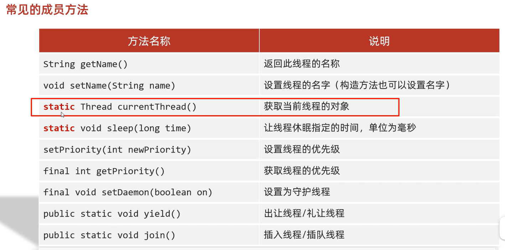
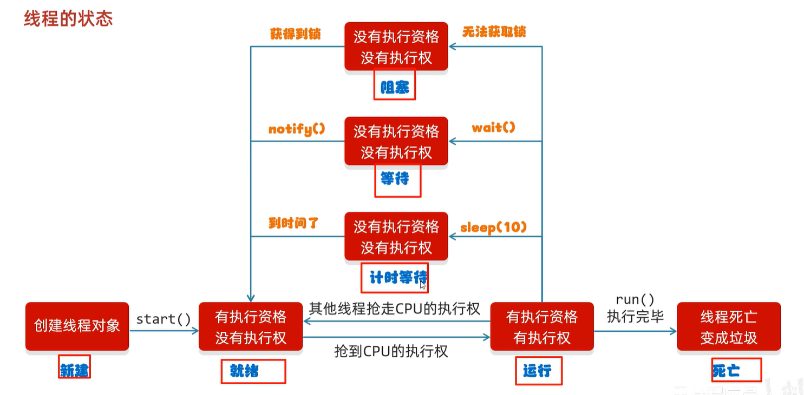
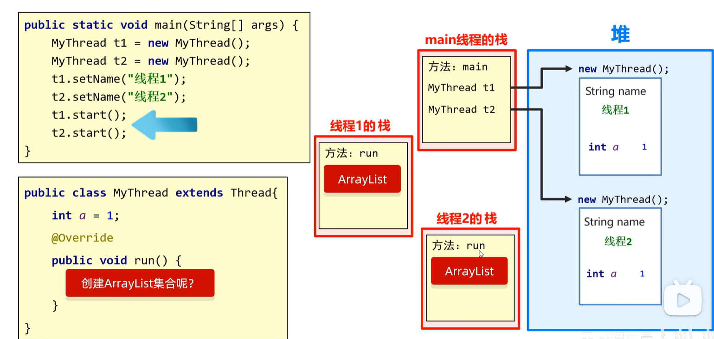
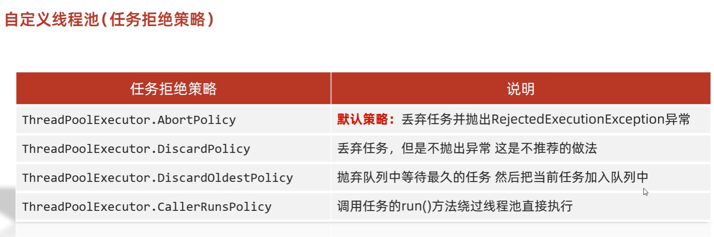
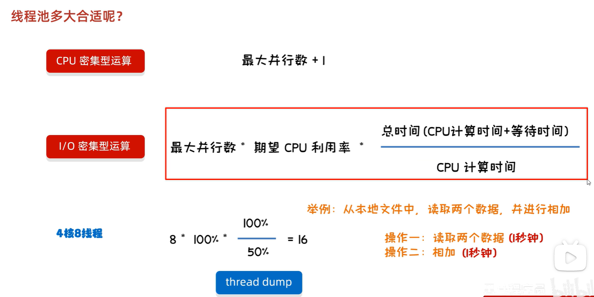

## 1.实现多线程

### 1.1进程和线程

- 进程：是正在运行的程序

  独立性：进程是一个能独立运行的基本单位，同时也是系统分配资源和调度的独立单位
  动态性：进程的实质是程序的一次执行过程，进程是动态产生，动态消亡的
  并发性：任何进程都可以同其他进程一起并发执行

- 线程：是进程中的单个顺序控制流，是一条执行路径

  ​	单线程：一个进程如果只有一条执行路径，则称为单线程程序

  ​	多线程：一个进程如果有多条执行路径，则称为多线程程序


### 1.2实现多线程方式一：继承Thread类

- 方法介绍

  | 方法名       | 说明                                        |
  | ------------ | ------------------------------------------- |
  | void run()   | 在线程开启后，此方法将被调用执行            |
  | void start() | 使此线程开始执行，Java虚拟机会调用run方法() |

- 实现步骤

  - 定义一个类MyThread继承Thread类
  - 在MyThread类中重写run()方法
  - 创建MyThread类的对象
  - 启动线程

- 代码演示

  ```java
  public class MyThread extends Thread {
      @Override
      public void run() {
          for(int i=0; i<100; i++) {
              System.out.println(i);
          }
      }
  }
  public class MyThreadDemo {
      public static void main(String[] args) {
          MyThread my1 = new MyThread();
          MyThread my2 = new MyThread();
          
  //        my1.run();
  //        my2.run();
  
          //void start() 导致此线程开始执行; Java虚拟机调用此线程的run方法
          my1.start();
          my2.start();
      }
  }
  ```

- 两个小问题

  - 为什么要重写run()方法？

    因为run()是用来封装被线程执行的代码

  - run()方法和start()方法的区别？

    run()：封装线程执行的代码，直接调用，相当于普通方法的调用

    start()：启动线程；然后由JVM调用此线程的run()方法

### 1.3实现多线程方式二：实现Runnable接口

- Thread构造方法

  | 方法名                               | 说明                   |
  | ------------------------------------ | ---------------------- |
  | Thread(Runnable target)              | 分配一个新的Thread对象 |
  | Thread(Runnable target, String name) | 分配一个新的Thread对象 |

- 实现步骤

  - 定义一个类MyRunnable实现Runnable接口
  - 在MyRunnable类中重写run()方法
  - 创建MyRunnable类的对象
  - 创建Thread类的对象，把MyRunnable对象作为构造方法的参数
  - 启动线程

- 代码演示

  ==`Tread.currentThread()`可以返回一个Tread线程对象==

  ```java
  public class MyRunnable implements Runnable {
      @Override
      public void run() {
          for(int i=0; i<100; i++) {
              System.out.println(Thread.currentThread().getName()+":"+i);
          }
      }
  }
  public class MyRunnableDemo {
      public static void main(String[] args) {
          //创建MyRunnable类的对象
          MyRunnable my = new MyRunnable();
  
          //创建Thread类的对象，把MyRunnable对象作为构造方法的参数
          //Thread(Runnable target)
  //        Thread t1 = new Thread(my);
  //        Thread t2 = new Thread(my);
          //Thread(Runnable target, String name)
          Thread t1 = new Thread(my,"坦克");
          Thread t2 = new Thread(my,"飞机");
  
          //启动线程
          t1.start();
          t2.start();
      }
  }
  ```

### 1.4实现多线程方式三: 实现Callable接口

+ 方法介绍

  | 方法名                           | 说明                                                       |
  | -------------------------------- | ---------------------------------------------------------- |
  | V call()                         | ==返回多线程运行的结果==，如果无法计算结果，则抛出一个异常 |
  | FutureTask(Callable<V> callable) | 创建一个 FutureTask，一旦运行就执行给定的 Callable         |
  | V get()                          | 如有必要，等待计算完成，然后获取其结果                     |

==Callable的泛型是线程运行结果的类型==

+ 实现步骤

  + 定义一个类MyCallable实现Callable接口
  + 在MyCallable类中重写call()方法-->==返回多线程运行的结果==
  + 创建MyCallable类的对象-->创建线程要运行的参数对象
  + 创建Future的实现类FutureTask对象，把MyCallable对象作为构造方法的参数-->管理多线程运行的结果
  + 创建Thread类的对象，把FutureTask对象作为构造方法的参数-->线程
  + 启动线程
  + 再调用get方法，就可以获取线程结束之后的结果。

+ 代码演示

  ```java
  public class MyCallable implements Callable<String> {
      @Override
      public String call() throws Exception {
          for (int i = 0; i < 100; i++) {
              System.out.println("跟女孩表白" + i);
          }
          //返回值就表示线程运行完毕之后的结果
          return "答应";
      }
  }
  public class Demo {
      public static void main(String[] args) throws ExecutionException, InterruptedException {
          //线程开启之后需要执行里面的call方法
          MyCallable mc = new MyCallable();
  
          //Thread t1 = new Thread(mc);
  
          //可以获取线程执行完毕之后的结果.也可以作为参数传递给Thread对象
          FutureTask<String> ft = new FutureTask<>(mc);
  
          //创建线程对象
          Thread t1 = new Thread(ft);
  
          //String s = ft.get();
          //开启线程
          t1.start();
  
          String s = ft.get();
          System.out.println(s);
      }
  }
  ```

+ 三种实现方式的对比

  + 实现Runnable、Callable接口
    + 好处: 扩展性强，实现该接口的同时还可以继承其他的类
    + 缺点: 编程相对复杂，不能直接使用Thread类中的方法
  + 继承Thread类
    + 好处: 编程比较简单，可以直接使用Thread类中的方法
    + 缺点: 可以扩展性较差，不能再继承其他的类


### 1.5Thread常见方法



- `static Thread currentThread()`
  - 当JVM虚拟机启动之后，会自动的启动多条线程。其中有一条线程就叫做main线程
    他的作用就是去调用main方法，并执行里面的代码
    在以前，我们写的所有的代码，其实都是运行在main线程当中
- `static void sleep(long time)` 
  - 哪条线程执行到这个方法，那么哪条线程就会在这里停留对应的时间
  - 方法的参数：就表示睡眠的时间，单位毫秒
    1 秒 = 1000 毫秒
  - 当时间到了之后，线程会自动的醒来，继续执行下面的其他代码

- `final void setPriority(int newPriority)`: 
  - 线程优先级的范围是：1-10
  - 线程默认优先级是5
- `setDemon()`
  - 当其他的非守护线程执行完毕之后，守护线程会==陆续结束==
  - 守护线程不会执行完毕，会执行一部分

- `yield()`
  - 会==尽可能==的让结果均匀些，但出让后的线程可能再次抢夺cpu

- `join()`
  - 在哪个线程内调用，则将调用该方法的线程插入当前线程之前


### 1.6线程优先级

- 线程调度

  - 两种调度方式

    - 分时调度模型：所有线程轮流使用 CPU 的使用权，平均分配每个线程占用 CPU 的时间片
    - 抢占式调度模型：优先让优先级高的线程使用 CPU，如果线程的优先级相同，那么会随机选择一个，优先级高的线程获取的 CPU 时间片相对多一些

  - Java使用的是==抢占式==调度模型

  - 随机性

    假如计算机只有一个 CPU，那么 CPU 在某一个时刻只能执行一条指令，线程只有得到CPU时间片，也就是使用权，才可以执行指令。所以说多线程程序的执行是有随机性，因为谁抢到CPU的使用权是不一定的

- 优先级相关方法

  | 方法名                                  | 说明                                                         |
  | --------------------------------------- | ------------------------------------------------------------ |
  | final int getPriority()                 | 返回此线程的优先级                                           |
  | final void setPriority(int newPriority) | 更改此线程的优先级线程默认优先级是5；线程优先级的范围是：1-10 |

  ==优先级越高，抢占到cpu的概率越大，但并非绝对==

### 1.7线程的状态



### 1.8线程的内存



## 2.线程同步

### 2.1卖票

- 案例需求

  某电影院目前正在上映国产大片，共有100张票，而它有3个窗口卖票，请设计一个程序模拟该电影院卖票

- 实现步骤

  - 定义一个类SellTicket实现Runnable接口，里面定义一个成员变量：private int tickets = 100;

  - 在SellTicket类中重写run()方法实现卖票，代码步骤如下

  - 判断票数大于0，就卖票，并告知是哪个窗口卖的
  - 卖了票之后，总票数要减1
  - 票卖没了，线程停止
  - 定义一个测试类SellTicketDemo，里面有main方法，代码步骤如下
  - 创建SellTicket类的对象
  - 创建三个Thread类的对象，把SellTicket对象作为构造方法的参数，并给出对应的窗口名称
  - 启动线程

- 代码实现

  ```java
  public class SellTicket implements Runnable {
      private int tickets = 100;
      //在SellTicket类中重写run()方法实现卖票，代码步骤如下
      @Override
      public void run() {
          while (true) {
              if(ticket <= 0){
                      //卖完了
                      break;
                  }else{
                      try {
                          Thread.sleep(100);
                      } catch (InterruptedException e) {
                          e.printStackTrace();
                      }
                      ticket--;
                      System.out.println(Thread.currentThread().getName() + "在卖票,还剩下" + ticket + "张票");
                  }
          }
      }
  }
  public class SellTicketDemo {
      public static void main(String[] args) {
          //创建SellTicket类的对象
          SellTicket st = new SellTicket();
  
          //创建三个Thread类的对象，把SellTicket对象作为构造方法的参数，并给出对应的窗口名称
          Thread t1 = new Thread(st,"窗口1");
          Thread t2 = new Thread(st,"窗口2");
          Thread t3 = new Thread(st,"窗口3");
  
          //启动线程
          t1.start();
          t2.start();
          t3.start();
      }
  }
  ```


### 2.2卖票案例的问题

- 卖票出现了问题

  - 相同的票出现了多次

  - 出现了负数的票

- 问题产生原因

  线程执行的随机性导致的,可能在卖票过程中丢失cpu的执行权,导致出现问题


### 2.3同步代码块解决数据安全问题

- 安全问题出现的条件

  - 是多线程环境

  - 有共享数据

  - 有多条语句操作共享数据

- 如何解决多线程安全问题呢?

  - 基本思想：让程序没有安全问题的环境

- 怎么实现呢?

  - 把多条语句操作共享数据的代码给锁起来，让任意时刻只能有一个线程执行即可

  - Java提供了同步代码块的方式来解决

- 同步代码块格式：

  ```java
  synchronized(任意对象) { 
  	多条语句操作共享数据的代码 
  }
  ```

  - synchronized(任意对象)：就相当于给代码加锁了，任意对象就可以看成是一把锁

  - ==锁对象必须唯一==

- 同步的好处和弊端  

  - 好处：解决了多线程的数据安全问题

  - 弊端：当线程很多时，因为每个线程都会去判断同步上的锁，这是很耗费资源的，无形中会降低程序的运行效率

- 代码演示

  ```java
  public class SellTicket implements Runnable {
      private int tickets = 100;
      private Object obj = new Object();
  
      @Override
      public void run() {
          while (true) {
              synchronized (obj) { // 对可能有安全问题的代码加锁,多个线程必须使用同一把锁
                  //t1进来后，就会把这段代码给锁起来
                  if (tickets > 0) {
                      try {
                          Thread.sleep(100);
                          //t1休息100毫秒
                      } catch (InterruptedException e) {
                          e.printStackTrace();
                      }
                      //窗口1正在出售第100张票
                      System.out.println(Thread.currentThread().getName() + "正在出售第" + tickets + "张票");
                      tickets--; //tickets = 99;
                  }
              }
              //t1出来了，这段代码的锁就被释放了
          }
      }
  }
  
  public class SellTicketDemo {
      public static void main(String[] args) {
          SellTicket st = new SellTicket();
  
          Thread t1 = new Thread(st, "窗口1");
          Thread t2 = new Thread(st, "窗口2");
          Thread t3 = new Thread(st, "窗口3");
  
          t1.start();
          t2.start();
          t3.start();
      }
  }
  ```

### 2.4同步方法解决数据安全问题

- 非静态同步方法

  把synchronized关键字加到方法上

  ```java
  修饰符 synchronized 返回值类型 方法名(方法参数) { 
  	方法体；
  }
  ```

  锁对象：this

- 静态同步方法

  把synchronized关键字加到静态方法上

  ```java
  修饰符 static synchronized 返回值类型 方法名(方法参数) { 
  	方法体；
  }
  ```

  锁对象：类名.class,当前类的字节码文件对象

### 2.5同步套路

- 循环
- 锁
- 判断（共享变量结束时）
- 判断（共享变量未结束时）

### 2.5Lock锁

虽然我们可以理解同步代码块和同步方法的锁对象问题，但是我们并没有直接看到在哪里加上了锁，在哪里释放了锁，为了更清晰的表达如何加锁和释放锁，JDK5以后提供了一个新的锁对象Lock

Lock是接口不能直接实例化，这里采用它的实现类ReentrantLock来实例化

- ReentrantLock构造方法

  | 方法名          | 说明                        |
  | --------------- | --------------------------- |
  | ReentrantLock() | 创建一个ReentrantLock的实例 |

- 加锁解锁方法

  | 方法名        | 说明   |
  | ------------- | ------ |
  | void lock()   | 获得锁 |
  | void unlock() | 释放锁 |

  ==最好用`try-catch-finaly`,`unclock()`放到`finaly`内==

  ==当`finaly`在`while`内，程序在`catch`内跳出循环后，`finaly`内的代码依旧会执行==


```java
  public class Ticket implements Runnable {
      //票的数量
      private int ticket = 100;
      private Object obj = new Object();
      private ReentrantLock lock = new ReentrantLock();

      @Override
      public void run() {
          while (true) {
              //synchronized (obj){//多个线程必须使用同一把锁.
              try {
                  lock.lock();
                  if (ticket <= 0) {
                      //卖完了
                      break;
                  } else {
                      Thread.sleep(100);
                      ticket--;
                      System.out.println(Thread.currentThread().getName() + "在卖票,还剩下" + ticket + "张票");
                  }
              } catch (InterruptedException e) {
                  e.printStackTrace();
              } finally {
                  lock.unlock();
              }
              // }
          }
      }
  }

  public class Demo {
      public static void main(String[] args) {
          Ticket ticket = new Ticket();

          Thread t1 = new Thread(ticket);
          Thread t2 = new Thread(ticket);
          Thread t3 = new Thread(ticket);

          t1.setName("窗口一");
          t2.setName("窗口二");
          t3.setName("窗口三");

          t1.start();
          t2.start();
          t3.start();
      }
  }
```

### 2.6死锁

+ 概述

  线程死锁是指由于两个或者多个线程互相持有对方所需要的资源，导致这些线程处于等待状态，无法前往执行

+ 什么情况下会产生死锁

  1. 资源有限
  2. 同步嵌套

+ 代码演示

  ```java
  public class Demo {
      public static void main(String[] args) {
          Object objA = new Object();
          Object objB = new Object();
  
          new Thread(()->{
              while(true){
                  synchronized (objA){
                      //线程一
                      synchronized (objB){
                          System.out.println("小康同学正在走路");
                      }
                  }
              }
          }).start();
  
          new Thread(()->{
              while(true){
                  synchronized (objB){
                      //线程二
                      synchronized (objA){
                          System.out.println("小薇同学正在走路");
                      }
                  }
              }
          }).start();
      }
  }
  ```

## 3.生产者消费者

### 3.1生产者和消费者模式概述

- 概述

  生产者消费者模式是一个十分经典的多线程协作的模式，弄懂生产者消费者问题能够让我们对多线程编程的理解更加深刻。

  所谓生产者消费者问题，实际上主要是包含了两类线程：

  ​	一类是生产者线程用于生产数据

  ​	一类是消费者线程用于消费数据

  为了解耦生产者和消费者的关系，通常会采用==共享的数据区域==，就像是一个仓库

  生产者生产数据之后直接放置在共享数据区中，并不需要关心消费者的行为

  消费者只需要从共享数据区中去获取数据，并不需要关心生产者的行为

- Object类的等待和唤醒方法

  | 方法名           | 说明                                                         |
  | ---------------- | ------------------------------------------------------------ |
  | void wait()      | 导致当前线程等待，直到另一个线程唤醒，即调用该对象的 notify()方法或 notifyAll()方法 |
  | void notify()    | 唤醒正在等待对象监视器的单个线程                             |
  | void notifyAll() | 唤醒正在等待对象监视器的所有线程                             |

==用锁对象调用这些方法==

### 3.2生产者和消费者案例

- 案例需求

  + 桌子类(Desk)：定义表示包子数量的变量,定义锁对象变量,定义标记桌子上有无包子的变量

  + 生产者类(Cooker)：实现Runnable接口，重写run()方法，设置线程任务

    1.判断是否有包子,决定当前线程是否执行

    2.如果有包子,就进入等待状态,如果没有包子,继续执行,生产包子

    3.生产包子之后,更新桌子上包子状态,唤醒消费者消费包子

  + 消费者类(Foodie)：实现Runnable接口，重写run()方法，设置线程任务

    1.判断是否有包子,决定当前线程是否执行

    2.如果没有包子,就进入等待状态,如果有包子,就消费包子

    3.消费包子后,更新桌子上包子状态,唤醒生产者生产包子

  + 测试类(Demo)：里面有main方法，main方法中的代码步骤如下

    创建生产者线程和消费者线程对象

    分别开启两个线程

- 代码实现

  ```java
  public class Desk {
  
      //定义一个标记
      //true 就表示桌子上有汉堡包的,此时允许吃货执行
      //false 就表示桌子上没有汉堡包的,此时允许厨师执行
      public static boolean flag = false;
  
      //后厨汉堡包的总数量，餐桌一次只能放一个
      public static int count = 10;
  
      //锁对象
      public static final Object lock = new Object();
  }
  
  public class Cooker extends Thread {
  //    生产者步骤：
  //            1，判断桌子上是否有汉堡包
  //    如果有就等待，如果没有才生产。
  //            2，把汉堡包放在桌子上。
  //            3，叫醒等待的消费者开吃。
      @Override
      public void run() {
          while(true){
              synchronized (Desk.lock){
                  if(Desk.count == 0){
                      break;
                  }else{
                      if(!Desk.flag){
                          //生产
                          System.out.println("厨师正在生产汉堡包");
                          Desk.flag = true;
                          Desk.lock.notifyAll();
                      }else{
                          try {
                              Desk.lock.wait();
                          } catch (InterruptedException e) {
                              e.printStackTrace();
                          }
                      }
                  }
              }
          }
      }
  }
  
  public class Foodie extends Thread {
      @Override
      public void run() {
  //        1，判断桌子上是否有汉堡包。
  //        2，如果没有就等待。
  //        3，如果有就开吃
  //        4，吃完之后，桌子上的汉堡包就没有了
  //                叫醒等待的生产者继续生产
  //        汉堡包的总数量减一
  
          //套路:
              //1. while(true)死循环
              //2. synchronized 锁,锁对象要唯一
              //3. 判断,共享数据是否结束. 结束
              //4. 判断,共享数据是否结束. 没有结束
          while(true){
              synchronized (Desk.lock){
                  if(Desk.count == 0){
                      break;
                  }else{
                      if(Desk.flag){
                          //有
                          System.out.println("吃货在吃汉堡包");
                          Desk.flag = false;
                          Desk.lock.notifyAll();
                          Desk.count--;
                      }else{
                          //没有就等待
                          //使用什么对象当做锁,那么就必须用这个对象去调用等待和唤醒的方法.
                          try {
                              Desk.lock.wait();
                          } catch (InterruptedException e) {
                              e.printStackTrace();
                          }
                      }
                  }
              }
          }
  
      }
  }
  
  public class Demo {
      public static void main(String[] args) {
          /*消费者步骤：
          1，判断桌子上是否有汉堡包。
          2，如果没有就等待。
          3，如果有就开吃
          4，吃完之后，桌子上的汉堡包就没有了
                  叫醒等待的生产者继续生产
          汉堡包的总数量减一*/
  
          /*生产者步骤：
          1，判断桌子上是否有汉堡包
          如果有就等待，如果没有才生产。
          2，把汉堡包放在桌子上。
          3，叫醒等待的消费者开吃。*/
  
          Foodie f = new Foodie();
          Cooker c = new Cooker();
  
          f.start();
          c.start();
  
      }
  }
  ```

### 3.3生产者和消费者案例优化

+ 需求

  + 将Desk类中的变量,采用面向对象的方式封装起来
  + 生产者和消费者类中构造方法接收Desk类对象,之后在run方法中进行使用
  + 创建生产者和消费者线程对象,构造方法中传入Desk类对象
  + 开启两个线程

+ 代码实现

  ```java
  public class Desk {
  
      //定义一个标记
      //true 就表示桌子上有汉堡包的,此时允许吃货执行
      //false 就表示桌子上没有汉堡包的,此时允许厨师执行
      //public static boolean flag = false;
      private boolean flag;
  
      //后厨汉堡包的总数量
      //public static int count = 10;
      //以后我们在使用这种必须有默认值的变量
     // private int count = 10;
      private int count;
  
      //锁对象
      //public static final Object lock = new Object();
      private final Object lock = new Object();
  
      public Desk() {
          this(false,10); // 在空参内部调用带参,对成员变量进行赋值,之后就可以直接使用成员变量了
      }
  
      public Desk(boolean flag, int count) {
          this.flag = flag;
          this.count = count;
      }
  
      public boolean isFlag() {
          return flag;
      }
  
      public void setFlag(boolean flag) {
          this.flag = flag;
      }
  
      public int getCount() {
          return count;
      }
  
      public void setCount(int count) {
          this.count = count;
      }
  
      public Object getLock() {
          return lock;
      }
  
      @Override
      public String toString() {
          return "Desk{" +
                  "flag=" + flag +
                  ", count=" + count +
                  ", lock=" + lock +
                  '}';
      }
  }
  
  public class Cooker extends Thread {
  
      private Desk desk;
  
      public Cooker(Desk desk) {
          this.desk = desk;
      }
  //    生产者步骤：
  //            1，判断桌子上是否有汉堡包
  //    如果有就等待，如果没有才生产。
  //            2，把汉堡包放在桌子上。
  //            3，叫醒等待的消费者开吃。
  
      @Override
      public void run() {
          while(true){
              synchronized (desk.getLock()){
                  if(desk.getCount() == 0){
                      break;
                  }else{
                      //System.out.println("验证一下是否执行了");
                      if(!desk.isFlag()){
                          //生产
                          System.out.println("厨师正在生产汉堡包");
                          desk.setFlag(true);
                          desk.getLock().notifyAll();
                      }else{
                          try {
                              desk.getLock().wait();
                          } catch (InterruptedException e) {
                              e.printStackTrace();
                          }
                      }
                  }
              }
          }
      }
  }
  
  public class Foodie extends Thread {
      private Desk desk;
  
      public Foodie(Desk desk) {
          this.desk = desk;
      }
  
      @Override
      public void run() {
  //        1，判断桌子上是否有汉堡包。
  //        2，如果没有就等待。
  //        3，如果有就开吃
  //        4，吃完之后，桌子上的汉堡包就没有了
  //                叫醒等待的生产者继续生产
  //        汉堡包的总数量减一
  
          //套路:
              //1. while(true)死循环
              //2. synchronized 锁,锁对象要唯一
              //3. 判断,共享数据是否结束. 结束
              //4. 判断,共享数据是否结束. 没有结束
          while(true){
              synchronized (desk.getLock()){
                  if(desk.getCount() == 0){
                      break;
                  }else{
                      //System.out.println("验证一下是否执行了");
                      if(desk.isFlag()){
                          //有
                          System.out.println("吃货在吃汉堡包");
                          desk.setFlag(false);
                          desk.getLock().notifyAll();
                          desk.setCount(desk.getCount() - 1);
                      }else{
                          //没有就等待
                          //使用什么对象当做锁,那么就必须用这个对象去调用等待和唤醒的方法.
                          try {
                              desk.getLock().wait();
                          } catch (InterruptedException e) {
                              e.printStackTrace();
                          }
                      }
                  }
              }
          }
  
      }
  }
  
  public class Demo {
      public static void main(String[] args) {
          /*消费者步骤：
          1，判断桌子上是否有汉堡包。
          2，如果没有就等待。
          3，如果有就开吃
          4，吃完之后，桌子上的汉堡包就没有了
                  叫醒等待的生产者继续生产
          汉堡包的总数量减一*/
  
          /*生产者步骤：
          1，判断桌子上是否有汉堡包
          如果有就等待，如果没有才生产。
          2，把汉堡包放在桌子上。
          3，叫醒等待的消费者开吃。*/
  
          Desk desk = new Desk();
  
          Foodie f = new Foodie(desk);
          Cooker c = new Cooker(desk);
  
          f.start();
          c.start();
  
      }
  }
  ```

### 3.4阻塞队列基本使用

+ 阻塞队列继承结构

  


+ 常见`BlockingQueue`:

  `ArrayBlockingQueue:` 底层是数组,有界

  `LinkedBlockingQueue`: 底层是链表,无界.但不是真正的无界,最大为int的最大值

+ `BlockingQueue`的核心方法:

  `put(anObject):` 将参数放入队列,如果放不进去会阻塞

  `take()`: 取出第一个数据,取不到会阻塞

  ==这两个方法内部有锁==

+ 代码示例

  ```java
  public class Demo02 {
      public static void main(String[] args) throws Exception {
          // 创建阻塞队列的对象,容量为 1
          ArrayBlockingQueue<String> arrayBlockingQueue = new ArrayBlockingQueue<>(1);
  
          // 存储元素
          arrayBlockingQueue.put("汉堡包");
  
          // 取元素
          System.out.println(arrayBlockingQueue.take());
          System.out.println(arrayBlockingQueue.take()); // 取不到会阻塞
  
          System.out.println("程序结束了");
      }
  }
  ```

### 3.5阻塞队列实现等待唤醒机制

+ 案例需求

  + 生产者类(Cooker)：实现Runnable接口，重写run()方法，设置线程任务

    1.构造方法中接收一个阻塞队列对象

    2.在run方法中循环向阻塞队列中添加包子

    3.打印添加结果

  + 消费者类(Foodie)：实现Runnable接口，重写run()方法，设置线程任务

    1.构造方法中接收一个阻塞队列对象

    2.在run方法中循环获取阻塞队列中的包子

    3.打印获取结果

  + 测试类(Demo)：里面有main方法，main方法中的代码步骤如下

    创建阻塞队列对象

    创建生产者线程和消费者线程对象,构造方法中传入阻塞队列对象

    分别开启两个线程

+ 代码实现

  ```java
  public class Cooker extends Thread {
  
      private ArrayBlockingQueue<String> bd;
  
      public Cooker(ArrayBlockingQueue<String> bd) {
          this.bd = bd;
      }
  //    生产者步骤：
  //            1，判断桌子上是否有汉堡包
  //    如果有就等待，如果没有才生产。
  //            2，把汉堡包放在桌子上。
  //            3，叫醒等待的消费者开吃。
  
      @Override
      public void run() {
          while (true) {
              try {
                  bd.put("汉堡包");
                  System.out.println("厨师放入一个汉堡包");
              } catch (InterruptedException e) {
                  e.printStackTrace();
              }
          }
      }
  }
  
  public class Foodie extends Thread {
      private ArrayBlockingQueue<String> bd;
  
      public Foodie(ArrayBlockingQueue<String> bd) {
          this.bd = bd;
      }
  
      @Override
      public void run() {
  //        1，判断桌子上是否有汉堡包。
  //        2，如果没有就等待。
  //        3，如果有就开吃
  //        4，吃完之后，桌子上的汉堡包就没有了
  //                叫醒等待的生产者继续生产
  //        汉堡包的总数量减一
  
          //套路:
          //1. while(true)死循环
          //2. synchronized 锁,锁对象要唯一
          //3. 判断,共享数据是否结束. 结束
          //4. 判断,共享数据是否结束. 没有结束
          while (true) {
              try {
                  String take = bd.take();
                  System.out.println("吃货将" + take + "拿出来吃了");
              } catch (InterruptedException e) {
                  e.printStackTrace();
              }
          }
  
      }
  }
  
  public class Demo {
      public static void main(String[] args) {
          ArrayBlockingQueue<String> bd = new ArrayBlockingQueue<>(1);
  
          Foodie f = new Foodie(bd);
          Cooker c = new Cooker(bd);
  
          f.start();
          c.start();
      }
  }
  ```

## 4. 线程池

### 4.1 线程状态介绍

Java中的线程状态被定义在了java.lang.Thread.State枚举类中，State枚举类的源码如下：

| 线程状态      | 具体含义                                                     |
| ------------- | ------------------------------------------------------------ |
| NEW           | 一个尚未启动的线程的状态。也称之为初始状态、开始状态。线程刚被创建，但是并未启动。还没调用start方法。MyThread t = new MyThread()只有线程象，没有线程特征。 |
| RUNNABLE      | 当我们调用线程对象的start方法，那么此时线程对象进入了RUNNABLE状态。那么此时才是真正的在JVM进程中创建了一个线程，线程一经启动并不是立即得到执行，线程的运行与否要听令与CPU的调度，那么我们把这个中间状态称之为可执行状态(RUNNABLE)也就是说它具备执行的资格，但是并没有真正的执行起来而是在等待CPU的度。 |
| BLOCKED       | 当一个线程试图获取一个对象锁，而该对象锁被其他的线程持有，则该线程进入Blocked状态；当该线程持有锁时，该线程将变成Runnable状态。 |
| WAITING       | 一个正在等待的线程的状态。也称之为等待状态。造成线程等待的原因有两种，分别是调用Object.wait()、join()方法。处于等待状态的线程，正在等待其他线程去执行一个特定的操作。例如：因为wait()而等待的线程正在等待另一个线程去调用notify()或notifyAll()；一个因为join()而等待的线程正在等待另一个线程结束。 |
| TIMED_WAITING | 一个在限定时间内等待的线程的状态。也称之为限时等待状态。造成线程限时等待状态的原因有三种，分别是：Thread.sleep(long)，Object.wait(long)、join(long)。 |
| TERMINATED    | 一个完全运行完成的线程的状态。也称之为终止状态、结束状态     |

各个状态的转换，如下图所示：


### 4.2 线程池-基本原理

**概述 :** 

线程池可以看做成一个池子，在该池子中存储很多个线程。

线程池存在的意义：

​	系统创建一个线程的成本是比较高的，因为它涉及到与操作系统交互，当程序中需要创建大量生存期很短暂的线程时，频繁的创建和销毁线程对系统的资源消耗有可能大于业务处理是对系统资源的消耗，这样就有点"舍本逐末"了。针对这一种情况，为了提高性能，我们就可以采用线程池。

线程池在==启动时，会创建大量空闲线程==，当我们向线程池提交任务的时，线程池就会启动一个线程来执行该任务。等待任务执行完毕以后，线程并不会死亡，而是再次返回到线程池中称为空闲状态。等待下一次任务的执行。

**线程池的设计思路 :**

1. 准备一个任务容器
2. 一次性启动多个(2个)消费者线程
3. 刚开始任务容器是空的，所以线程都在wait
4. 直到一个外部线程向这个任务容器中扔了一个"任务"，就会有一个消费者线程被唤醒
5. 这个消费者线程取出"任务"，并且执行这个任务，执行完毕后，继续等待下一次任务的到来


### 4.3 线程池-Executors默认线程池

executor[执行者]，cache[隐藏，高速缓冲器]

概述 : JDK对线程池也进行了相关的实现，在真实企业开发中我们也很少去自定义线程池，而是使用JDK中自带的线程池。

我们可以使用==Executors==中所提供的**静态**方法来创建线程池

- `static ExecutorService newCachedThreadPool()`  : 创建一个默认的线程池
- `static ExecutorService newFixedThreadPool(int nThreads)`:创建一个指定最多线程数量的线程池

**基本方法:**

- `submit(任务)`：提交任务,参数是Runnable的实现类对象...
- `shutdown()`：关闭线程池


**代码实现 :** 

```java
package com.itheima.mythreadpool;


//static ExecutorService newCachedThreadPool()   创建一个默认的线程池
//static newFixedThreadPool(int nThreads)	    创建一个指定最多线程数量的线程池

import java.util.concurrent.ExecutorService;
import java.util.concurrent.Executors;

public class MyThreadPoolDemo {
    public static void main(String[] args) throws InterruptedException {

        //1,创建一个默认的线程池对象.池子中默认是空的.默认最多可以容纳int类型的最大值.
        ExecutorService executorService = Executors.newCachedThreadPool();
        //Executors --- 可以帮助我们创建线程池对象
        //ExecutorService --- 可以帮助我们控制线程池

        executorService.submit(()->{
            System.out.println(Thread.currentThread().getName() + "在执行了");
        });

        //Thread.sleep(2000);

        executorService.submit(()->{
            System.out.println(Thread.currentThread().getName() + "在执行了");
        });

        executorService.shutdown();
    }
}

```


### 4.4 线程池-Executors创建指定上限的线程池

**使用Executors中所提供的静态方法来创建线程池**

`static ExecutorService newFixedThreadPool(int nThreads)` : 创建一个指定最多线程数量的线程池

**代码实现 :** 

```java
package com.itheima.mythreadpool;

//static ExecutorService newFixedThreadPool(int nThreads)
//创建一个指定最多线程数量的线程池

import java.util.concurrent.ExecutorService;
import java.util.concurrent.Executors;
import java.util.concurrent.ThreadPoolExecutor;

public class MyThreadPoolDemo2 {
    public static void main(String[] args) {
        //参数不是初始值而是最大值
        ExecutorService executorService = Executors.newFixedThreadPool(10);

        ThreadPoolExecutor pool = (ThreadPoolExecutor) executorService;
        System.out.println(pool.getPoolSize());//0

        executorService.submit(()->{
            System.out.println(Thread.currentThread().getName() + "在执行了");
        });

        executorService.submit(()->{
            System.out.println(Thread.currentThread().getName() + "在执行了");
        });

        System.out.println(pool.getPoolSize());//2
//        executorService.shutdown();
    }
}

```


### 4.5 自定义线程池-ThreadPoolExecutor

**创建线程池对象 :** 

`ThreadPoolExecutor threadPoolExecutor = new ThreadPoolExecutor(核心线程数量,最大线程数量,空闲线程最大存活时间,任务队列,创建线程工厂,任务的拒绝策略);`

**代码实现 :** 

```java
package com.itheima.mythreadpool;

import java.util.concurrent.ArrayBlockingQueue;
import java.util.concurrent.Executors;
import java.util.concurrent.ThreadPoolExecutor;
import java.util.concurrent.TimeUnit;

public class MyThreadPoolDemo3 {
//    参数一：核心线程数量
//    参数二：最大线程数
//    参数三：空闲线程最大存活时间
//    参数四：时间单位
//    参数五：任务队列
//    参数六：创建线程工厂
//    参数七：任务的拒绝策略
    public static void main(String[] args) {
        ThreadPoolExecutor pool = new ThreadPoolExecutor(2,
                                                         5,
                                                         2,
                                                   TimeUnit.SECONDS,
                                                   new ArrayBlockingQueue<>(10),
                                                   Executors.defaultThreadFactory(),
                                                   new ThreadPoolExecutor.AbortPolicy()
                                                        );
        pool.submit(new MyRunnable());
        pool.submit(new MyRunnable());

        pool.shutdown();
    }
}
```

### 4.6 自定义线程池-参数详解


```java
public ThreadPoolExecutor(int corePoolSize,
                              int maximumPoolSize,
                              long keepAliveTime,
                              TimeUnit unit,
                              BlockingQueue<Runnable> workQueue,
                              ThreadFactory threadFactory,
                              RejectedExecutionHandler handler)
    
corePoolSize：   核心线程的最大值，不能小于0
maximumPoolSize：最大线程数，不能小于等于0，maximumPoolSize >= corePoolSize
keepAliveTime：  空闲线程最大存活时间,不能小于0
unit：           时间单位
workQueue：      任务队列，不能为null
threadFactory：  创建线程工厂,不能为null      
handler：        任务的拒绝策略,不能为null  
```

### 4.7 自定义线程池执行原理


### 4.8 线程池-非默认任务拒绝策略

`RejectedExecutionHandler`是jdk提供的一个任务拒绝策略接口，它下面存在4个子类。



注：明确线程池对多可执行的任务数 = 队列容量 + 最大线程数

### 4.9 线程池容量

`int Runtime.getRuntime.availableProcessors()`：返回java虚拟机可用的处理器数目

cpu时间可以通过工具thread dump获取



## 5. 多线程综合练习

### 练习一：售票

需求：

​	一共有1000张电影票,可以在两个窗口领取,假设每次领取的时间为3000毫秒,

​	请用多线程模拟卖票过程并打印剩余电影票的数量

代码示例：

```java
public class MyThread extends Thread {

    //第一种方式实现多线程，测试类中MyThread会创建多次，所以需要加static
    static int ticket = 1000;

    @Override
    public void run() {
        //1.循环
        while (true) {
            //2.同步代码块
            synchronized (MyThread.class) {
                //3.判断共享数据（已经到末尾）
                if (ticket == 0) {
                    break;
                } else {
                    //4.判断共享数据（没有到末尾）
                    try {
                        Thread.sleep(3000);
                    } catch (InterruptedException e) {
                        e.printStackTrace();
                    }
                    ticket--;
                    System.out.println(getName() + "在卖票，还剩下" + ticket + "张票!!!");
                }
            }
        }
    }
}

public class Test {
    public static void main(String[] args) {
       /*
            一共有1000张电影票,可以在两个窗口领取,假设每次领取的时间为3000毫秒,
            要求:请用多线程模拟卖票过程并打印剩余电影票的数量
        */

        //创建线程对象
        MyThread t1 = new MyThread();
        MyThread t2 = new MyThread();

        //给线程设置名字
        t1.setName("窗口1");
        t2.setName("窗口2");

        //开启线程
        t1.start();
        t2.start();

    }
}

```


### 练习二：赠送礼物

需求：

​	有100份礼品,两人同时发送，当剩下的礼品小于10份的时候则不再送出。

​	利用多线程模拟该过程并将线程的名字和礼物的剩余数量打印出来.

```java
public class MyRunable implements Runnable {

    //第二种方式实现多线程，测试类中MyRunable只创建一次，所以不需要加static
    int count = 100;

    @Override
    public void run() {
        //1.循环
        while (true) {
            //2.同步代码块
            synchronized (MyThread.class) {
                //3.判断共享数据（已经到末尾）
                if (count < 10) {
                    System.out.println("礼物还剩下" + count + "不再赠送");
                    break;
                } else {
                    //4.判断共享数据（没有到末尾）
                    count--;
                    System.out.println(Thread.currentThread().getName() + "在赠送礼物，还剩下" + count + "个礼物!!!");
                }
            }
        }
    }
}


public class Test {
    public static void main(String[] args) {
        /*
            有100份礼品,两人同时发送，当剩下的礼品小于10份的时候则不再送出，
            利用多线程模拟该过程并将线程的名字和礼物的剩余数量打印出来.
        */

        //创建参数对象
        MyRunable mr = new MyRunable();

        //创建线程对象
        Thread t1 = new Thread(mr,"窗口1");
        Thread t2 = new Thread(mr,"窗口2");

        //启动线程
        t1.start();
        t2.start();
    }
}

```


### 练习三：打印数字

需求：

​	同时开启两个线程，共同获取1-100之间的所有数字。

​	将输出所有的奇数。

```java
public class MyRunable implements Runnable {

    //第二种方式实现多线程，测试类中MyRunable只创建一次，所以不需要加static
    int number = 1;

    @Override
    public void run() {
        //1.循环
        while (true) {
            //2.同步代码块
            synchronized (MyThread.class) {
                //3.判断共享数据（已经到末尾）
                if (number > 100) {
                    break;
                } else {
                    //4.判断共享数据（没有到末尾）
                    if(number % 2 == 1){
                        System.out.println(Thread.currentThread().getName() + "打印数字" + number);
                    }
                    number++;
                }
            }
        }
    }
}


public class Test {
    public static void main(String[] args) {
        /*
           同时开启两个线程，共同获取1-100之间的所有数字。
           要求：将输出所有的奇数。
        */


        //创建参数对象
        MyRunable mr = new MyRunable();

        //创建线程对象
        Thread t1 = new Thread(mr,"线程A");
        Thread t2 = new Thread(mr,"线程B");

        //启动线程
        t1.start();
        t2.start();
    }
}
```

### 练习四：抢红包

需求：

​	抢红包也用到了多线程。

​	假设：100块，分成了3个包，现在有5个人去抢。

​	其中，红包是共享数据。

​	5个人是5条线程。

​	打印结果如下：

​		  XXX抢到了XXX元

​		  XXX抢到了XXX元

 		 XXX抢到了XXX元
 	
 		XXX没抢到
 	
 		XXX没抢到

解决方案一：

```java
public class MyThread extends Thread{

    //共享数据
    //100块，分成了3个包
    static double money = 100;
    static int count = 3;

    //最小的中奖金额
    static final double MIN = 0.01;

    @Override
    public void run() {
        //同步代码块
        synchronized (MyThread.class){
            if(count == 0){
                //判断，共享数据是否到了末尾（已经到末尾）
                System.out.println(getName() + "没有抢到红包！");
            }else{
                //判断，共享数据是否到了末尾（没有到末尾）
                //定义一个变量，表示中奖的金额
                double prize = 0;
                if(count == 1){
                    //表示此时是最后一个红包
                    //就无需随机，剩余所有的钱都是中奖金额
                    prize = money;
                }else{
                    //表示第一次，第二次（随机）
                    Random r = new Random();
                    //100 元   3个包
                    //第一个红包：99.98
                    //100 - (3-1) * 0.01
                    double bounds = money - (count - 1) * MIN;
                    prize = r.nextDouble(bounds);
                    if(prize < MIN){
                        prize = MIN;
                    }
                }
                //从money当中，去掉当前中奖的金额
                money = money - prize;
                //红包的个数-1
                count--;
                //本次红包的信息进行打印
                System.out.println(getName() + "抢到了" + prize + "元");
            }
        }
    }
}
public class Test {
    public static void main(String[] args) {
        /*
            微信中的抢红包也用到了多线程。
            假设：100块，分成了3个包，现在有5个人去抢。
            其中，红包是共享数据。
            5个人是5条线程。
            打印结果如下：
            	XXX抢到了XXX元
            	XXX抢到了XXX元
            	XXX抢到了XXX元
            	XXX没抢到
            	XXX没抢到
        */

        //创建线程的对象
        MyThread t1 = new MyThread();
        MyThread t2 = new MyThread();
        MyThread t3 = new MyThread();
        MyThread t4 = new MyThread();
        MyThread t5 = new MyThread();

        //给线程设置名字
        t1.setName("小A");
        t2.setName("小QQ");
        t3.setName("小哈哈");
        t4.setName("小诗诗");
        t5.setName("小丹丹");

        //启动线程
        t1.start();
        t2.start();
        t3.start();
        t4.start();
        t5.start();
    }
}
```

解决方案二：

```java
public class MyThread extends Thread{

    //总金额
    static BigDecimal money = BigDecimal.valueOf(100.0);
    //个数
    static int count = 3;
    //最小抽奖金额
    static final BigDecimal MIN = BigDecimal.valueOf(0.01);

    @Override
    public void run() {
        synchronized (MyThread.class){
            if(count == 0){
                System.out.println(getName() + "没有抢到红包！");
            }else{
                //中奖金额
                BigDecimal prize;
                if(count == 1){
                    prize = money;
                }else{
                    //获取抽奖范围
                    double bounds = money.subtract(BigDecimal.valueOf(count-1).multiply(MIN)).doubleValue();
                    Random r = new Random();
                    //抽奖金额
                    prize = BigDecimal.valueOf(r.nextDouble(bounds));
                }
                //设置抽中红包，小数点保留两位，四舍五入
                prize = prize.setScale(2,RoundingMode.HALF_UP);
                //在总金额中去掉对应的钱
                money = money.subtract(prize);
                //红包少了一个
                count--;
                //输出红包信息
                System.out.println(getName() + "抽中了" + prize + "元");
            }
        }
    }
}

public class Test {
    public static void main(String[] args) {
        /*
            微信中的抢红包也用到了多线程。
            假设：100块，分成了3个包，现在有5个人去抢。
            其中，红包是共享数据。
            5个人是5条线程。
            打印结果如下：
            	XXX抢到了XXX元
            	XXX抢到了XXX元
            	XXX抢到了XXX元
            	XXX没抢到
            	XXX没抢到
        */


        MyThread t1 = new MyThread();
        MyThread t2 = new MyThread();
        MyThread t3 = new MyThread();
        MyThread t4 = new MyThread();
        MyThread t5 = new MyThread();

        t1.setName("小A");
        t2.setName("小QQ");
        t3.setName("小哈哈");
        t4.setName("小诗诗");
        t5.setName("小丹丹");

        t1.start();
        t2.start();
        t3.start();
        t4.start();
        t5.start();
    }
}
```

### 练习五：抽奖箱

需求：

​	有一个抽奖池,该抽奖池中存放了奖励的金额,该抽奖池中的奖项为 {10,5,20,50,100,200,500,800,2,80,300,700}; 

创建两个抽奖箱(线程)设置线程名称分别为“抽奖箱1”，“抽奖箱2” 

随机从抽奖池中获取奖项元素并打印在控制台上,格式如下:

​               每次抽出一个奖项就打印一个(随机)

​		抽奖箱1 又产生了一个 10 元大奖

  		抽奖箱1 又产生了一个 100 元大奖
  	
  		抽奖箱1 又产生了一个 200 元大奖
  	
  		抽奖箱1 又产生了一个 800 元大奖  

​		抽奖箱2 又产生了一个 700 元大奖  

 		 .....

```java
public class MyThread extends Thread {

    ArrayList<Integer> list;

    public MyThread(ArrayList<Integer> list) {
        this.list = list;
    }

    @Override
    public void run() {
        //1.循环
        //2.同步代码块
        //3.判断
        //4.判断

        while (true) {
            synchronized (MyThread.class) {
                if (list.size() == 0) {
                    break;
                } else {
                    //继续抽奖
                    Collections.shuffle(list);
                    int prize = list.remove(0);
                    System.out.println(getName() + "又产生了一个" + prize + "元大奖");
                }
            }
            try {
                Thread.sleep(10);
            } catch (InterruptedException e) {
                e.printStackTrace();
            }

        }
    }
}


public class Test {
    public static void main(String[] args) {
        /*
            有一个抽奖池,该抽奖池中存放了奖励的金额,该抽奖池中的奖项为 {10,5,20,50,100,200,500,800,2,80,300,700};
            创建两个抽奖箱(线程)设置线程名称分别为“抽奖箱1”，“抽奖箱2”
            随机从抽奖池中获取奖项元素并打印在控制台上,格式如下:
                             每次抽出一个奖项就打印一个(随机)
            	抽奖箱1 又产生了一个 10 元大奖
            	抽奖箱1 又产生了一个 100 元大奖
            	抽奖箱1 又产生了一个 200 元大奖
            	抽奖箱1 又产生了一个 800 元大奖
            	抽奖箱2 又产生了一个 700 元大奖
            	.....
        */

        //创建奖池
        ArrayList<Integer> list = new ArrayList<>();
        Collections.addAll(list,10,5,20,50,100,200,500,800,2,80,300,700);

        //创建线程
        MyThread t1 = new MyThread(list);
        MyThread t2 = new MyThread(list);

        //设置名字
        t1.setName("抽奖箱1");
        t2.setName("抽奖箱2");

        //启动线程
        t1.start();
        t2.start();
    }
}
```


### 练习六：多线程统计并求最大值

需求：

​	在上一题基础上继续完成如下需求：

​     每次抽的过程中，不打印，抽完时一次性打印(随机)

​     在此次抽奖过程中，抽奖箱1总共产生了6个奖项。

​              分别为：10,20,100,500,2,300最高奖项为300元，总计额为932元

​     在此次抽奖过程中，抽奖箱2总共产生了6个奖项。

​              分别为：5,50,200,800,80,700最高奖项为800元，总计额为1835元

解决方案一：

```java
public class MyThread extends Thread {

    ArrayList<Integer> list;

    public MyThread(ArrayList<Integer> list) {
        this.list = list;
    }

    //线程一
    static ArrayList<Integer> list1 = new ArrayList<>();
    //线程二
    static ArrayList<Integer> list2 = new ArrayList<>();

    @Override
    public void run() {
        while (true) {
            synchronized (MyThread.class) {
                if (list.size() == 0) {
                    if("抽奖箱1".equals(getName())){
                        System.out.println("抽奖箱1" + list1);
                    }else {
                        System.out.println("抽奖箱2" + list2);
                    }
                    break;
                } else {
                    //继续抽奖
                    Collections.shuffle(list);
                    int prize = list.remove(0);
                    if("抽奖箱1".equals(getName())){
                        list1.add(prize);
                    }else {
                        list2.add(prize);
                    }
                }
            }
            try {
                Thread.sleep(10);
            } catch (InterruptedException e) {
                e.printStackTrace();
            }

        }
    }
}

public class Test {
    public static void main(String[] args) {
        /*
            有一个抽奖池,该抽奖池中存放了奖励的金额,该抽奖池中的奖项为 {10,5,20,50,100,200,500,800,2,80,300,700};
            创建两个抽奖箱(线程)设置线程名称分别为“抽奖箱1”，“抽奖箱2”
            随机从抽奖池中获取奖项元素并打印在控制台上,格式如下:
            每次抽的过程中，不打印，抽完时一次性打印(随机)    在此次抽奖过程中，抽奖箱1总共产生了6个奖项。
                分别为：10,20,100,500,2,300最高奖项为300元，总计额为932元
            在此次抽奖过程中，抽奖箱2总共产生了6个奖项。
                分别为：5,50,200,800,80,700最高奖项为800元，总计额为1835元
        */

        //创建奖池
        ArrayList<Integer> list = new ArrayList<>();
        Collections.addAll(list,10,5,20,50,100,200,500,800,2,80,300,700);

        //创建线程
        MyThread t1 = new MyThread(list);
        MyThread t2 = new MyThread(list);

        //设置名字
        t1.setName("抽奖箱1");
        t2.setName("抽奖箱2");

        //启动线程
        t1.start();
        t2.start();
    }
}

```

解决方案二：

```java
public class MyThread extends Thread {

    ArrayList<Integer> list;

    public MyThread(ArrayList<Integer> list) {
        this.list = list;
    }

    @Override
    public void run() {
        ArrayList<Integer> boxList = new ArrayList<>();//1 //2
        while (true) {
            synchronized (MyThread.class) {
                if (list.size() == 0) {
                    System.out.println(getName() + boxList);
                    break;
                } else {
                    //继续抽奖
                    Collections.shuffle(list);
                    int prize = list.remove(0);
                    boxList.add(prize);
                }
            }
            try {
                Thread.sleep(10);
            } catch (InterruptedException e) {
                e.printStackTrace();
            }

        }
    }
}

public class Test {
    public static void main(String[] args) {
        /*
            有一个抽奖池,该抽奖池中存放了奖励的金额,该抽奖池中的奖项为 {10,5,20,50,100,200,500,800,2,80,300,700};
            创建两个抽奖箱(线程)设置线程名称分别为“抽奖箱1”，“抽奖箱2”
            随机从抽奖池中获取奖项元素并打印在控制台上,格式如下:
            每次抽的过程中，不打印，抽完时一次性打印(随机)    在此次抽奖过程中，抽奖箱1总共产生了6个奖项。
                分别为：10,20,100,500,2,300最高奖项为300元，总计额为932元
            在此次抽奖过程中，抽奖箱2总共产生了6个奖项。
                分别为：5,50,200,800,80,700最高奖项为800元，总计额为1835元
        */

        //创建奖池
        ArrayList<Integer> list = new ArrayList<>();
        Collections.addAll(list,10,5,20,50,100,200,500,800,2,80,300,700);

        //创建线程
        MyThread t1 = new MyThread(list);
        MyThread t2 = new MyThread(list);


        //设置名字
        t1.setName("抽奖箱1");
        t2.setName("抽奖箱2");


        //启动线程
        t1.start();
        t2.start();

    }
}
```


### 练习七：多线程之间的比较 

需求：

​	在上一题基础上继续完成如下需求：

​	在此次抽奖过程中，抽奖箱1总共产生了6个奖项，分别为：10,20,100,500,2,300

  	最高奖项为500元，总计额为932元

​	在此次抽奖过程中，抽奖箱2总共产生了6个奖项，分别为：5,50,200,800,80,700

  	最高奖项为800元，总计额为1835元

​	在此次抽奖过程中,抽奖箱2中产生了最大奖项,该奖项金额为800元

​	以上打印效果只是数据模拟,实际代码运行的效果会有差异

```java
public class MyCallable implements Callable<Integer> {

    ArrayList<Integer> list;

    public MyCallable(ArrayList<Integer> list) {
        this.list = list;
    }

    @Override
    public Integer call() throws Exception {
        ArrayList<Integer> boxList = new ArrayList<>();//1 //2
        while (true) {
            synchronized (MyCallable.class) {
                if (list.size() == 0) {
                    System.out.println(Thread.currentThread().getName() + boxList);
                    break;
                } else {
                    //继续抽奖
                    Collections.shuffle(list);
                    int prize = list.remove(0);
                    boxList.add(prize);
                }
            }
            Thread.sleep(10);
        }
        //把集合中的最大值返回
        if(boxList.size() == 0){
            return null;
        }else{
            return Collections.max(boxList);
        }
    }
}

package com.itheima.test7;

import java.util.ArrayList;
import java.util.Collections;
import java.util.concurrent.ExecutionException;
import java.util.concurrent.FutureTask;

public class Test {
    public static void main(String[] args) throws ExecutionException, InterruptedException {
        /*
            有一个抽奖池,该抽奖池中存放了奖励的金额,该抽奖池中的奖项为 {10,5,20,50,100,200,500,800,2,80,300,700};
            创建两个抽奖箱(线程)设置线程名称分别为    "抽奖箱1", "抽奖箱2"
            随机从抽奖池中获取奖项元素并打印在控制台上,格式如下:

            在此次抽奖过程中，抽奖箱1总共产生了6个奖项，分别为：10,20,100,500,2,300
        	    最高奖项为300元，总计额为932元

            在此次抽奖过程中，抽奖箱2总共产生了6个奖项，分别为：5,50,200,800,80,700
            	最高奖项为800元，总计额为1835元

            在此次抽奖过程中,抽奖箱2中产生了最大奖项,该奖项金额为800元
            核心逻辑：获取线程抽奖的最大值（看成是线程运行的结果）


            以上打印效果只是数据模拟,实际代码运行的效果会有差异
        */

        //创建奖池
        ArrayList<Integer> list = new ArrayList<>();
        Collections.addAll(list,10,5,20,50,100,200,500,800,2,80,300,700);

        //创建多线程要运行的参数对象
        MyCallable mc = new MyCallable(list);

        //创建多线程运行结果的管理者对象
        //线程一
        FutureTask<Integer> ft1 = new FutureTask<>(mc);
        //线程二
        FutureTask<Integer> ft2 = new FutureTask<>(mc);

        //创建线程对象
        Thread t1 = new Thread(ft1);
        Thread t2 = new Thread(ft2);

        //设置名字
        t1.setName("抽奖箱1");
        t2.setName("抽奖箱2");

        //开启线程
        t1.start();
        t2.start();


        Integer max1 = ft1.get();
        Integer max2 = ft2.get();

        System.out.println(max1);
        System.out.println(max2);

        //在此次抽奖过程中,抽奖箱2中产生了最大奖项,该奖项金额为800元
        if(max1 == null){
            System.out.println("在此次抽奖过程中,抽奖箱2中产生了最大奖项,该奖项金额为"+max2+"元");
        }else if(max2 == null){
            System.out.println("在此次抽奖过程中,抽奖箱1中产生了最大奖项,该奖项金额为"+max1+"元");
        }else if(max1 > max2){
            System.out.println("在此次抽奖过程中,抽奖箱1中产生了最大奖项,该奖项金额为"+max1+"元");
        }else if(max1 < max2){
            System.out.println("在此次抽奖过程中,抽奖箱2中产生了最大奖项,该奖项金额为"+max2+"元");
        }else{
            System.out.println("两者的最大奖项是一样的");
        }
    }
}
```

