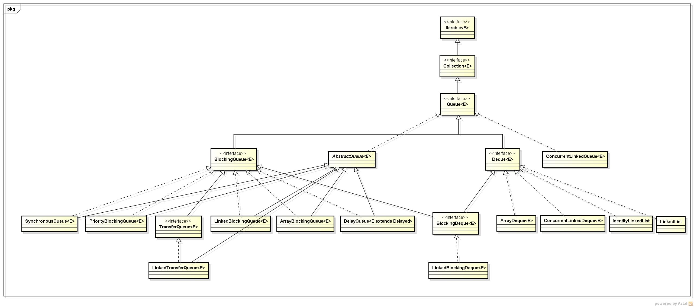

### 队列(queue)简述

队列(queue)是一种常用的**数据结构**，可以将队列看做是一种特殊的线性表，该结构遵循的先进先出原则。Java中，**LinkedList实现了Queue接口**,因为LinkedList进行插入、删除操作效率较高。

在处理元素前用于保存元素的 collection。除了基本的 ==[`Collection`](http://tool.oschina.net/uploads/apidocs/jdk-zh/java/util/Collection.html)== 操作外，队列还提供其他的插入、提取和检查操作。每个方法都存在两种形式：一种抛出异常（操作失败时），另一种返回一个特殊值（`null` 或 `false`，具体取决于操作）。插入操作的后一种形式是用于专门为有容量限制的 `Queue` 实现设计的；在大多数实现中，插入操作不会失败。

 

|          | *抛出异常*                                                   | *返回特殊值*                                                 |
| -------- | ------------------------------------------------------------ | ------------------------------------------------------------ |
| **插入** | [`add(e)`](http://tool.oschina.net/uploads/apidocs/jdk-zh/java/util/Queue.html#add(E)) | [`offer(e)`](http://tool.oschina.net/uploads/apidocs/jdk-zh/java/util/Queue.html#offer(E)) |
| **移除** | [`remove()`](http://tool.oschina.net/uploads/apidocs/jdk-zh/java/util/Queue.html#remove()) | [`poll()`](http://tool.oschina.net/uploads/apidocs/jdk-zh/java/util/Queue.html#poll()) |
| **检查** | [`element()`](http://tool.oschina.net/uploads/apidocs/jdk-zh/java/util/Queue.html#element()) | [`peek()`](http://tool.oschina.net/uploads/apidocs/jdk-zh/java/util/Queue.html#peek()) |

队列通常（但并非一定）以 FIFO（先进先出）的方式排序各个元素。不过优先级队列和 LIFO 队列（或堆栈）例外，前者根据提供的比较器或元素的自然顺序对元素进行排序，后者按 LIFO（后进先出）的方式对元素进行排序。无论使用哪种排序方式，队列的*头* 都是调用 [`remove()`](http://tool.oschina.net/uploads/apidocs/jdk-zh/java/util/Queue.html#remove()) 或 [`poll()`](http://tool.oschina.net/uploads/apidocs/jdk-zh/java/util/Queue.html#poll()) 所移除的元素。在 FIFO 队列中，所有的新元素都插入队列的*末尾*。其他种类的队列可能使用不同的元素放置规则。每个 `Queue` 实现必须指定其顺序属性。

`Queue` 接口并未定义*阻塞队列的方法*，而这在并发编程中是很常见的。[`BlockingQueue`](http://tool.oschina.net/uploads/apidocs/jdk-zh/java/util/concurrent/BlockingQueue.html) 接口定义了那些等待元素出现或等待队列中有可用空间的方法，这些方法扩展了此接口。

`Queue` 实现通常不允许插入 `null` 元素，尽管某些实现（如 [`LinkedList`](http://tool.oschina.net/uploads/apidocs/jdk-zh/java/util/LinkedList.html)）并不禁止插入 `null`。即使在允许 null 的实现中，也不应该将 `null` 插入到 `Queue` 中，因为 `null` 也用作 `poll` 方法的一个特殊返回值，表明队列不包含元素。

`Queue` 实现通常未定义 `equals` 和 `hashCode` 方法的基于元素的版本，而是从 `Object` 类继承了基于身份的版本，因为对于具有相同元素但有不同排序属性的队列而言，基于元素的相等性并非总是定义良好的。

 

### Queue常用方法：

1. `boolean add(E e);`将指定的元素插入此队列（如果立即可行且不会违反容量限制），在成功时返回 `true`，如果当前没有可用的空间，则抛出 `IllegalStateException`。
2. `boolean offer(E e);`将指定的元素插入此队列（如果立即可行且不会违反容量限制），当使用有容量限制的队列时，此方法通常要优于 [`add(E)`](http://tool.oschina.net/uploads/apidocs/jdk-zh/java/util/Queue.html#add(E))，后者可能无法插入元素，而只是抛出一个异常。
3. `E remove();`获取并移除此队列的头。
4. `E poll();`获取并移除此队列的头，如果此队列为空，则返回 `null`。
5. `E element();`获取，但是不移除此队列的==头==。
6. `E peek();`获取但不移除此队列的==头==；如果此队列为空，则返回 `null`。

### 双端队列（Deque）简述

双向队列(Deque),是Queue的一个子==接口==，双向队列是指该队列两端的元素既能入队(offer)也能出队(poll),如果将Deque限制为只能从一端入队和出队，则可实现栈的数据结构。对于栈而言，有入栈(push)和出栈(pop)，遵循先进后出原则。-->==实现类LinkedList==

一个线性 collection，支持在两端插入和移除元素。名称 *deque* 是“double ended queue（双端队列）”的缩写，通常读为“deck”。大多数 `Deque` 实现对于它们能够包含的元素数没有固定限制，但此接口既支持有容量限制的双端队列，也支持没有固定大小限制的双端队列。

此接口定义在双端队列两端访问元素的方法。提供插入、移除和检查元素的方法。每种方法都存在两种形式：一种形式在操作失败时抛出异常，另一种形式返回一个特殊值（`null` 或 `false`，具体取决于操作）。插入操作的后一种形式是专为使用有容量限制的 `Deque` 实现设计的；在大多数实现中，插入操作不能失败。

下表总结了上述 12 种方法：

 

|          | **第一个元素（头部）**                                       | **最后一个元素（尾部）**                                     |
| -------- | ------------------------------------------------------------ | ------------------------------------------------------------ |
|          | *抛出异常*                                                   | *特殊值*                                                     |
| **插入** | [`addFirst(e)`](http://tool.oschina.net/uploads/apidocs/jdk-zh/java/util/Deque.html#addFirst(E)) | [`offerFirst(e)`](http://tool.oschina.net/uploads/apidocs/jdk-zh/java/util/Deque.html#offerFirst(E)) |
| **移除** | [`removeFirst()`](http://tool.oschina.net/uploads/apidocs/jdk-zh/java/util/Deque.html#removeFirst()) | [`pollFirst()`](http://tool.oschina.net/uploads/apidocs/jdk-zh/java/util/Deque.html#pollFirst()) |
| **检查** | [`getFirst()`](http://tool.oschina.net/uploads/apidocs/jdk-zh/java/util/Deque.html#getFirst()) | [`peekFirst()`](http://tool.oschina.net/uploads/apidocs/jdk-zh/java/util/Deque.html#peekFirst()) |

此接口扩展了 [`Queue`](http://tool.oschina.net/uploads/apidocs/jdk-zh/java/util/Queue.html) 接口。在将双端队列用作队列时，将得到 FIFO（先进先出）行为。将元素添加到双端队列的末尾，从双端队列的开头移除元素。从 `Queue` 接口继承的方法完全等效于 `Deque` 方法，如下表所示：

此接口扩展了 [`Queue`](http://tool.oschina.net/uploads/apidocs/jdk-zh/java/util/Queue.html) 接口。在将双端队列用作队列时，将得到 FIFO（先进先出）行为。将元素添加到双端队列的末尾，从双端队列的开头移除元素。从 `Queue` 接口继承的方法完全等效于 `Deque` 方法，如下表所示：

 

| **`Queue` 方法**                                             | **等效 `Deque` 方法**                                        |
| ------------------------------------------------------------ | ------------------------------------------------------------ |
| [`add(e)`](http://tool.oschina.net/uploads/apidocs/jdk-zh/java/util/Queue.html#add(E)) | [`addLast(e)`](http://tool.oschina.net/uploads/apidocs/jdk-zh/java/util/Deque.html#addLast(E)) |
| [`offer(e)`](http://tool.oschina.net/uploads/apidocs/jdk-zh/java/util/Queue.html#offer(E)) | [`offerLast(e)`](http://tool.oschina.net/uploads/apidocs/jdk-zh/java/util/Deque.html#offerLast(E)) |
| [`remove()`](http://tool.oschina.net/uploads/apidocs/jdk-zh/java/util/Queue.html#remove()) | [`removeFirst()`](http://tool.oschina.net/uploads/apidocs/jdk-zh/java/util/Deque.html#removeFirst()) |
| [`poll()`](http://tool.oschina.net/uploads/apidocs/jdk-zh/java/util/Queue.html#poll()) | [`pollFirst()`](http://tool.oschina.net/uploads/apidocs/jdk-zh/java/util/Deque.html#pollFirst()) |
| [`element()`](http://tool.oschina.net/uploads/apidocs/jdk-zh/java/util/Queue.html#element()) | [`getFirst()`](http://tool.oschina.net/uploads/apidocs/jdk-zh/java/util/Deque.html#getFirst()) |
| [`peek()`](http://tool.oschina.net/uploads/apidocs/jdk-zh/java/util/Queue.html#peek()) | [`peekFirst()`](http://tool.oschina.net/uploads/apidocs/jdk-zh/java/util/Deque.html#peek()) |

双端队列也可用作 LIFO（后进先出）堆栈。应==优先使用此接口而不是遗留 [`Stack`](http://tool.oschina.net/uploads/apidocs/jdk-zh/java/util/Stack.html) 类==。在将双端队列用作堆栈时，元素被推入双端队列的开头并从双端队列开头弹出。堆栈方法完全等效于 `Deque` 方法，如下表所示：

 

| **堆栈方法**                                                 | **等效 `Deque` 方法**                                        |
| ------------------------------------------------------------ | ------------------------------------------------------------ |
| [`push(e)`](http://tool.oschina.net/uploads/apidocs/jdk-zh/java/util/Deque.html#push(E)) | [`addFirst(e)`](http://tool.oschina.net/uploads/apidocs/jdk-zh/java/util/Deque.html#addFirst(E)) |
| [`pop()`](http://tool.oschina.net/uploads/apidocs/jdk-zh/java/util/Deque.html#pop()) | [`removeFirst()`](http://tool.oschina.net/uploads/apidocs/jdk-zh/java/util/Deque.html#removeFirst()) |
| [`peek()`](http://tool.oschina.net/uploads/apidocs/jdk-zh/java/util/Deque.html#peek()) | [`peekFirst()`](http://tool.oschina.net/uploads/apidocs/jdk-zh/java/util/Deque.html#peekFirst()) |

注意，在将双端队列用作队列或堆栈时，[`peek`](http://tool.oschina.net/uploads/apidocs/jdk-zh/java/util/Deque.html#peek()) 方法同样正常工作；无论哪种情况下，都从双端队列的开头抽取元素。

此接口提供了两种移除内部元素的方法：[`removeFirstOccurrence`](http://tool.oschina.net/uploads/apidocs/jdk-zh/java/util/Deque.html#removeFirstOccurrence(java.lang.Object)) 和 [`removeLastOccurrence`](http://tool.oschina.net/uploads/apidocs/jdk-zh/java/util/Deque.html#removeLastOccurrence(java.lang.Object))。

与 [`List`](http://tool.oschina.net/uploads/apidocs/jdk-zh/java/util/List.html) 接口不同，此接口不支持通过索引访问元素。

虽然 `Deque` 实现没有严格要求禁止插入 null 元素，但建议最好这样做。建议任何事实上允许 null 元素的 `Deque` 实现用户最好*不* 要利用插入 null 的功能。这是因为各种方法会将 `null` 用作特殊的返回值来指示双端队列为空。

### ==队列的调用==

queue和deque都是借口，而linkedList实现了这两个接口，所以创建方式为`Deque deque = new LinkedList<>()`==？==