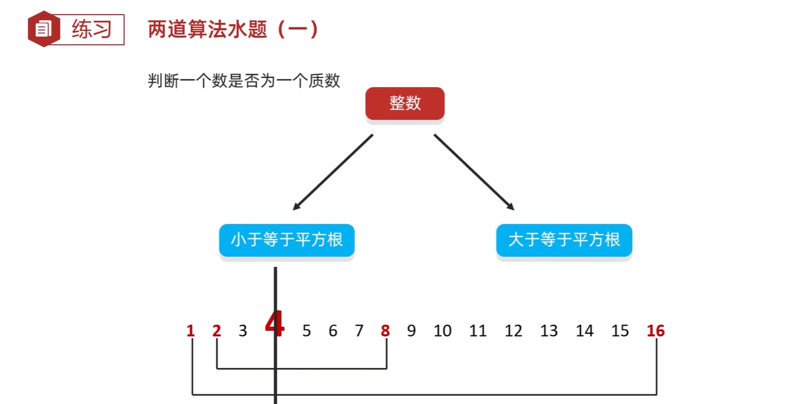
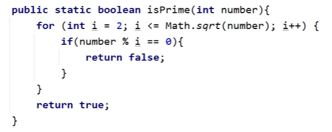
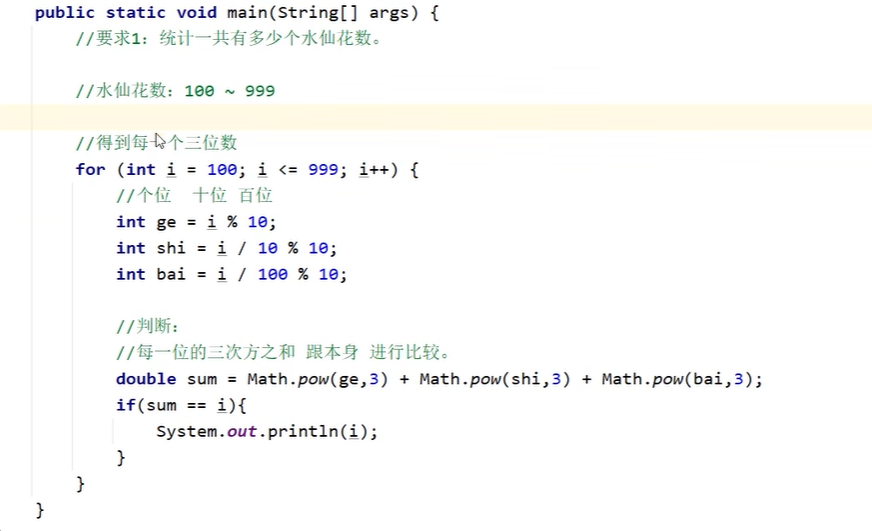
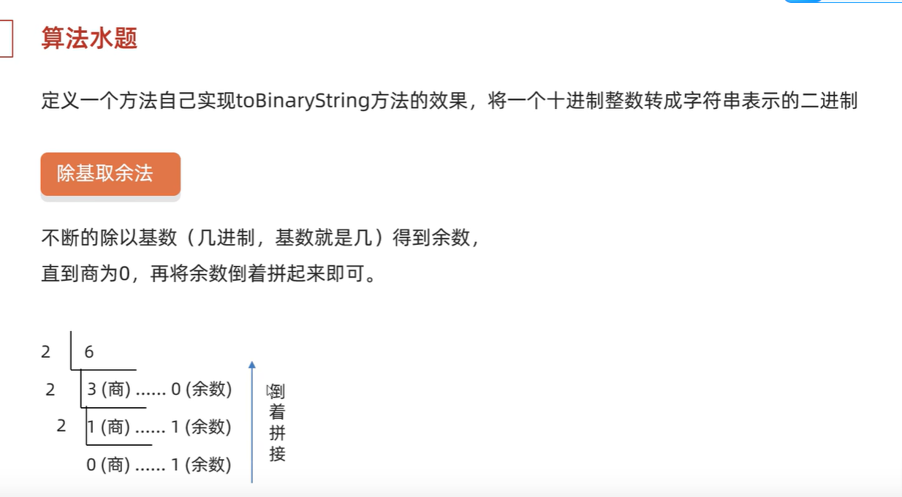
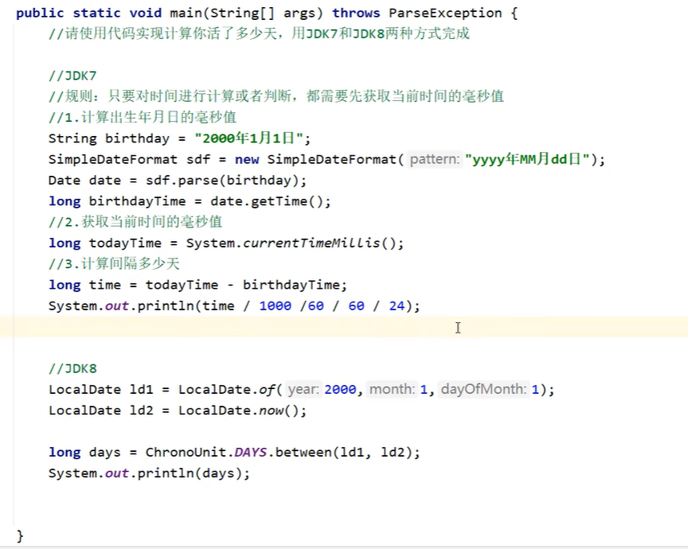
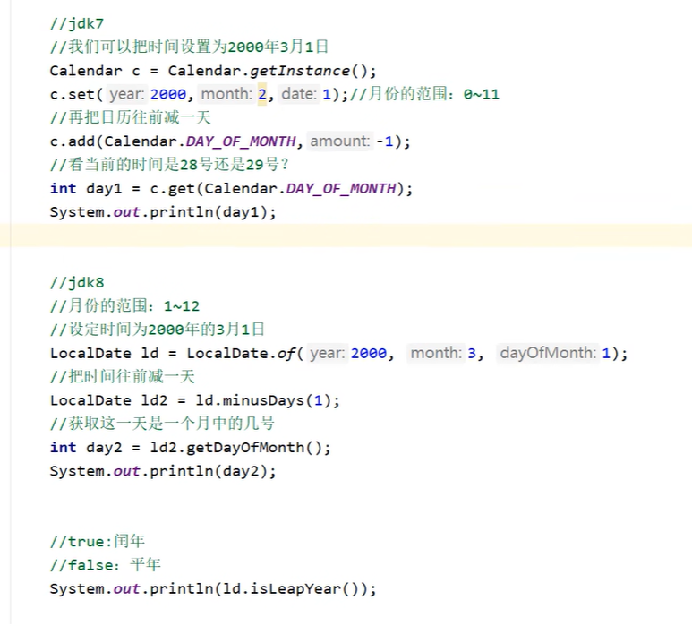
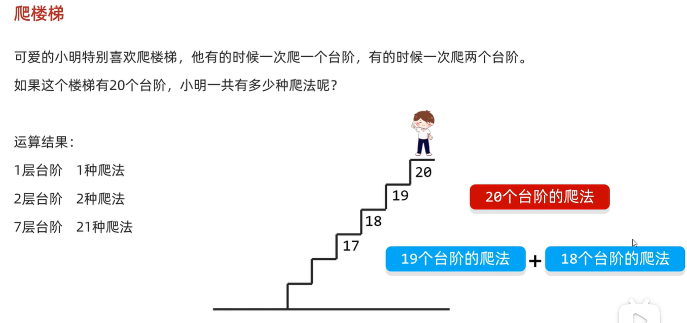
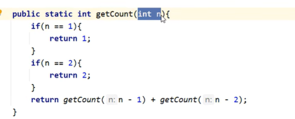

## Math算法题

### 1. 判断一个数是否为质数

x*y = z : x,y一定有一个小于z的算术平方根，因此我们**只要判断在z的算术平方根之前的整数是否可以被整除就可**

### 2. 判断自幂数

自幂数，一个n位自然数等于自身各个数位上数字的n次幂之和

水仙花数：3位的自幂数

## StringBuilder,包装类

### 1 转换二进制

**题解**：

- 提前排除不符合条件的
- 倒着排序： `insert(0,变量)`

## 时间类

#### 题目1

分别用jdk7,jdk8计算你活了多少天

#### 题目2

判断是平年还是闰年

- jdk7: 3月1日减一天，或1月1日减一天
- jdk8
  - 3月1日减一天
  - `isLeapYear()`判断

## 动态规划

题解

