# Linux概述

## 主流操作系统

不同领域的主流操作系统，主要分为以下这么几类： 桌面操作系统、服务器操作系统、移动设备操作系统、嵌入式操作系统。接下来，这几个领域中，代表性的操作系统是那些?

**1). 桌面操作系统**

| 操作系统 | 特点                                   |
| -------- | -------------------------------------- |
| Windows  | 用户数量最多                           |
| MacOS    | 操作体验好，办公人士首选               |
| Linux    | 用户数量少(桌面操作系统,Linux使用较少) |

**2).** **服务器操作系统**

| 操作系统       | 特点                       |
| -------------- | -------------------------- |
| Unix           | 安全、稳定、付费           |
| Linux          | 安全、稳定、免费、占有率高 |
| Windows Server | 付费、占有率低             |

**3). 移动设备操作系统**

| 操作系统  | 特点                                                         |
| --------- | ------------------------------------------------------------ |
| Android   | 基于 Linux 、开源，主要用于智能手机、平板电脑和智能电视      |
| IOS       | 苹果公司开发、不开源，用于苹果公司的产品，例如：iPhone、 iPad |
| HarmonyOS | 华为公司开发、开源，目前用于华为公司的产品                   |

## Linux系统版本

Linux系统的版本分为两种，分别是： 内核版 和 发行版。

**1). 内核版**

- 由Linus Torvalds及其团队开发、维护
- 免费、开源
- 负责控制硬件

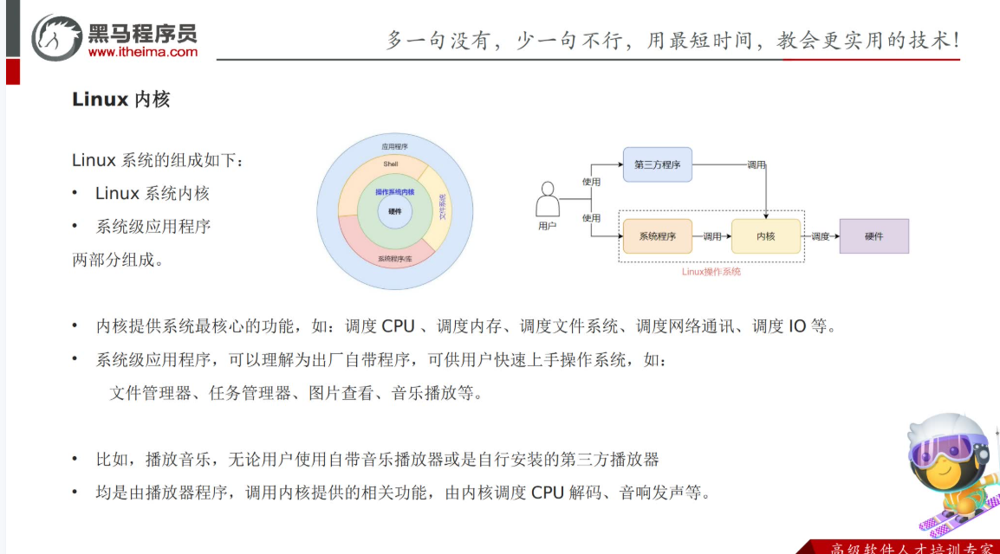

**2). 发行版**

- 基于Linux内核版进行扩展
- 由各个Linux厂商开发、维护
- 有收费版本和免费版本

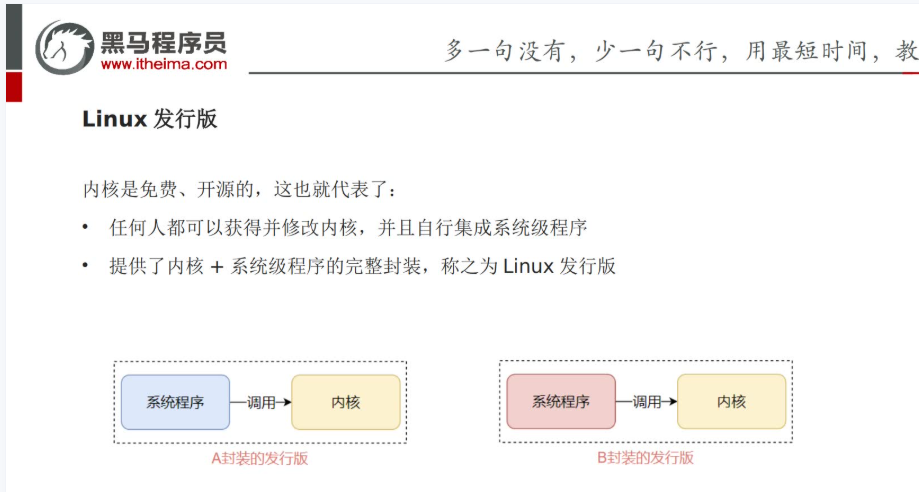

我们使用Linux操作系统，实际上选择的是Linux的发行版本。在linux系统中，有各种各样的发行版本，具体如下： 


除了上述罗列出来的发行版，还有很多Linux发行版，这里，我们就不再一一列举了。

## 虚拟机快照

在虚拟机关机时，制作快照

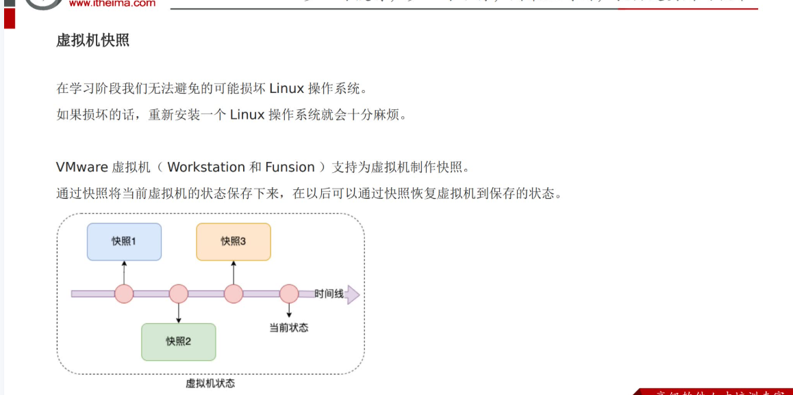

# Linux基础命令

## Linux的目录结构


- `/`，根目录是最顶级的目录了
- Linux只有一个顶级目录：`/`
- 路径描述的层次关系同样适用`/`来表示
- /home/itheima/a.txt，表示根目录下的home文件夹内有itheima文件夹，内有a.txt


## HOME目录、路径形式和特殊路径符

### HOME目录

每一个用户在Linux系统中都有自己的专属==工作目录==，称之为HOME目录。

- 普通用户的HOME目录，默认在：`/home/用户名`

- root用户的HOME目录，在：`/root`

FinalShell登陆终端后，==默认的工作目录就是用户的HOME目录==


### 相对路径、绝对路径

- 相对路径，==非==`/`开头的称之为相对路径

  相对路径表示以`当前目录`作为起点，去描述路径，如`test/a.txt`，表示当前工作目录内的test文件夹内的a.txt文件

- 绝对路径，==以==`/`开头的称之为绝对路径

  绝对路径从`根`开始描述路径


### 特殊路径符

- `.`，表示当前，比如./a.txt，表示当前文件夹内的`a.txt`文件
- `..`，表示上级目录，比如`../`表示上级目录，`../../`表示上级的上级目录
- `~`，表示用户的HOME目录，比如`cd ~`，即可切回用户HOME目录


## 目录操作命令

### ls命令

功能：列出文件夹信息

语法：`ls [-l -h -a] [参数]`

- 参数：被查看的文件夹，不提供参数，表示查看当前工作目录
- -l，以列表形式查看-->`ll`
- -h，配合-l，以更加人性化的方式显示文件大小
- -a，显示==隐藏文件==


#### 隐藏文件、文件夹

在Linux中以`.`开头的，均是隐藏的。

默认不显示出来，需要`-a`选项才可查看到。


### ==pwd==命令

功能：展示当前工作目录

语法：`pwd`


### cd命令

功能：切换工作目录

语法：`cd [目标目录]`

参数：目标目录，要切换去的地方，不提供默认切换到`当前登录用户HOME目录`

`~`：表示用户的home目录

`.`：表示目前所在的目录

`..`：表示目前目录位置的上级目录

`-`：表示上次所在目录


### mkdir

功能：创建文件夹

语法：`mkdir [-p] 参数`

- 参数：被创建文件夹的路径
- 选项：-p(parent)，可选，表示创建前置路径


### rm命令

功能：删除文件、文件夹

语法：`rm [-r -f] 参数...参数`

- 参数：支持多个，每一个表示被删除的，空格进行分隔
- 选项：-r，删除文件夹使用
- 选项：-f，强制删除，不会给出确认提示，一般root用户会用到

> rm命令很危险，一定要注意，特别是切换到root用户的时候。


## 文件操作命令

### ==touch==命令

功能：创建文件

语法：`touch 参数`

- 参数：被创建的文件路径


### cat命令

功能：查看文件内容

语法：`cat 参数`

- 参数：被查看的文件路径
- `-n`:number,由1开始对所有输出的行数编号


### more命令

功能：查看文件，可以支持翻页查看

语法：`more 参数`

- 参数：被查看的文件路径
- 在查看过程中：
  - 空格键：向下滚动一屏，翻页
  - 回车键：向下滚动一行
  - `b` ：返回上一瓶
  - `q`：退出查看


### head命令

功能：查看文件头部内容

语法：`head [-n] 参数`

- 参数：被查看的文件
- 选项：-n，查看的行数


### tail命令

功能：查看文件尾部内容

语法：`tail [-f] 参数`

- 参数：被查看的文件
- 选项：-f，持续跟踪文件修改


### wc命令

功能：统计文件的行数、单词数量等

语法：`wc [-c -m -l -w] 文件路径`

- 选项，-c，统计bytes数量
- 选项，-m，统计字符数量
- 选项，-l，统计行数
- 选项，-w，统计单词数量
- 参数，文件路径，被统计的文件，可作为内容输入端口

 默认输出结果格式：`行数 单词数 字节数 文件名`

> 参数文件路径，可作为管道符的输入


## 拷贝移动命令

### cp命令

功能：复制文件、文件夹

语法：`cp [-r] 参数1 参数2`

- 参数1，被复制的
- 参数2，要复制去的地方
- 选项：
  - `-r`(recursion)：如果**复制的是目录需要使用此选项**，此时将复制该目录下所有的子目录和文件-->复制文件夹使用


示例：

- cp a.txt b.txt，复制当前目录下a.txt为b.txt
- cp a.txt test/，复制当前目录a.txt到test文件夹内
- cp -r test test2，复制文件夹test到当前文件夹内为test2存在


### mv命令

功能：为文件或目录改名、或将文件或目录移动到其它位置

语法：`mv 参数1 参数2`

- 参数1：被移动的
- 参数2：要移动去的地方，参数2如果不存在，则会进行改名
- ==如果第二个参数dest是一个已存在的目录,将执行移动操作,其他情况都是改名==


## 查找命令

### which命令

功能：查找特定命令的可执行文件路径

语法：`which 参数`

- 参数：被查看的命令
- 例子：`which mysql`


### find命令

功能：搜索文件

语法：按文件名搜索：`find dirName -option fileName`

- dirName：搜索的起始路径

- filename：搜索的关键字，支持通配符*， 比如：`*`test表示搜索任意以test结尾的文件

- 举例:

  - `find . -name "*.java"`

    在当前目录及其子目录下查找.java结尾文件

  - `find /itcast -name "*.java"`   

    在/itcast目录及其子目录下查找.java结尾的文件


### grep命令

功能：从文件中通过==关键字==过滤命令行

语法：`grep [-n] 关键字 文件名`

- 选项：

  - -i: 检索的关键字忽略(ignore)大小写
  - -n: 显示关键字所在的这一行的行号
  - -A: 输出关键字所在行及之后(After)的几行记录 (如:-A5 表示输出关键字所在行之后的5行记录)
  - -B: 输出关键字所在行及之前(Before)的几行记录 (如:-B5 表示输出关键字所在行之前的5行记录)

- 关键字：表示过滤的关键字，带有空格或其它特殊符号，建议==使用`””`将关键字包围起来==

> 参数文件路径，可以作为==管道符的输入==


## echo命令

功能：在命令行输出指定的内容

语法：`echo 参数`

- 参数：被输出的内容


## 特殊符号

### 管道符|

写法：`|`

功能：将符号左边的结果，作为符号右边的输入

示例：

`cat a.txt | grep itheima`，将cat a.txt的结果，作为grep命令的输入，用来过滤`itheima`关键字

可以支持嵌套：

`cat a.txt | grep itheima | grep itcast`


### `反引号

功能：被两个反引号包围的内容，会作为命令执行

示例：

- echo \`pwd\`，会输出当前工作目录


### 重定向符

功能：将符号左边的结果，输出到右边指定的文件中去

- `>`，表示将左侧命令的结果，==覆盖==写入符号右侧指定的文件中
- `>>`，表示将左侧命令的结果，==追加==写入符号右侧指定的文件中


## vi编辑器

文本编辑的命令，主要包含两个: `vi` 和 `vim`，两个命令的用法类似，我们课程中主要讲解vim的使用。

### vi & vim介绍

- 作用: vi命令是Linux系统提供的一个文本编辑工具，可以对文件内容进行编辑，类似于Windows中的记事本
- 语法: vi fileName
- 说明:
  - 1). vim是从vi发展来的一个功能更加强大的文本编辑工具，编辑文件时可以对文本内容进行着色，方便我们对文件进行编辑处理，所以实际工作中vim更加常用。
  - 2). 要使用vim命令，需要我们自己完成安装。可以使用下面的命令来完成安装：`yum install vim`

### vim安装

命令： `yum install vim`


安装过程中，会有确认提示，此时输入 y，然后回车，继续安装：


### vim使用

- 作用: 对文件内容进行编辑，vim其实就是一个文本编辑器

- 语法: vim fileName

- 说明:

  - 1). 在使用vim命令编辑文件时，如果指定的文件存在则直接打开此文件。如果指定的文件不存在则新建文件。
  - 2). vim在进行文本编辑时共分为三种模式，分别是 命令模式（Command mode），插入模式（Insert mode）和底行模式（Last line mode）。这三种模式之间可以相互切换。我们在使用vim时一定要注意我们当前所处的是哪种模式。

- 三种模式:

  - 命令模式

    - A. 命令模式下可以查看文件内容、移动光标（上下左右箭头、gg、G)

    - B. 通过vim命令打开文件后，默认进入命令模式

    - C. 另外两种模式需要首先进入命令模式，才能进入彼此

    | **命令模式****指令** | **含义**                                   |
    | -------------------- | ------------------------------------------ |
    | **gg**               | 定位到文本内容的第一行                     |
    | **G**                | 定位到文本内容的最后一行                   |
    | **dd**               | 删除光标所在行的数据                       |
    | **ndd**              | 删除当前光标所在行及之后的n行数据          |
    | **u**                | 撤销操作                                   |
    | **i 或 a 或 o**      | 进入插入模式(进入后光标所处的位置不同而已) |
    | /关键字              | ==在整个文件中查找关键字==                 |

  - 插入模式

    - A. 插入模式下可以对文件内容进行编辑
    - B. 在命令模式下按下[i,a,o]任意一个，可以进入插入模式。进入插入模式后，下方会出现【insert】字样
    - C. 在插入模式下按下ESC键，回到命令模式

- 底行模式

  - A. 底行模式下可以通过命令对文件内容进行查找、显示行号、退出等操作

  - B. 在命令模式下按下[:,/]任意一个，可以进入底行模式

  - C. 通过/方式进入底行模式后，可以对文件内容进行查找

  - D. 通过:方式进入底行模式后，可以输入wq（保存并退出）、q!（不保存退出）、set nu（显示行号）

  - | **底行模式****指令** | **含义**                             |
    | -------------------- | ------------------------------------ |
    | **:wq**              | 保存并退出                           |
    | **:q!**              | 不保存退出                           |
    | **:set** **nu**      | 显示行号                             |
    | **:set nonu**        | 取消行号显示                         |
    | **:n**               | 定位到第n行，如 :10 就是定位到第10行 |


## 命令的选项

我们学习的一系列Linux命令，它们所拥有的选项都是非常多的。

比如，简单的ls命令就有：-a -A -b -c -C -d -D -f -F -g -G -h -H -i -I -k -l -L -m -n -N -o -p -q -Q -r-R -s -S -t -T -u -U -v -w -x -X -1等选项，可以发现选项是极其多的。

课程中， 并不会将全部的选项都进行讲解，否则，一个ls命令就可能讲解2小时之久。

课程中，会对常见的选项进行讲解， 足够满足绝大多数的学习、工作场景。


### 查看命令的帮助

可以通过：`命令 --help`查看命令的帮助手册


### 查看命令的详细手册

可以通过：`man 命令`查看某命令的详细手册


# 用户权限

## root用户

### su,exit

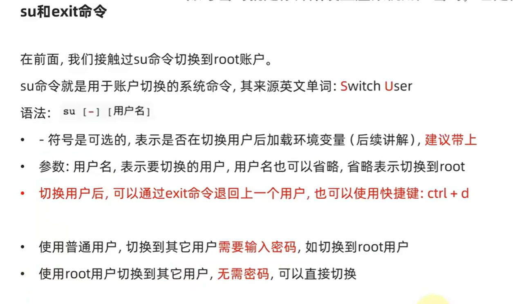

### sudo

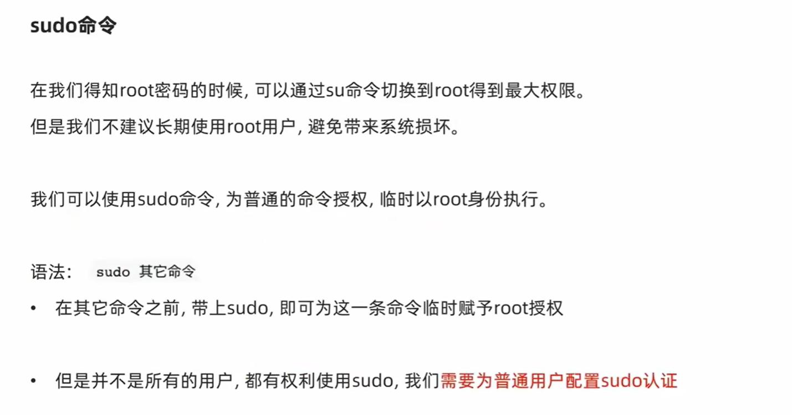

#### 为普通用户配置sudo认证

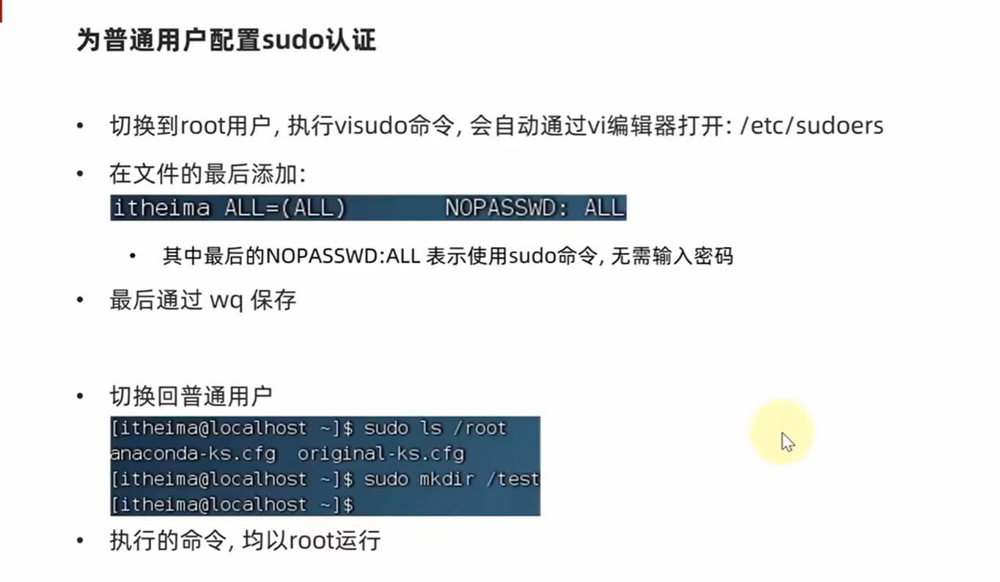

## 用户、用户组管理

### 用户组管理

- 创建用户组

  `groupadd 用户组名`

- 删除用户组

  `groupdel 用户组名`


### 用户管理

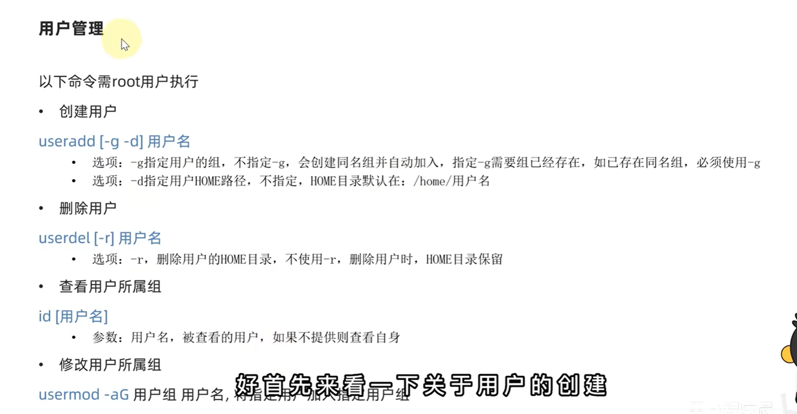


### getent passwd

作用：查看当前系统有哪些用户


### getent group

作用：查看系统全部的用户组


## 查看权限控制

通过 `ll` 查看

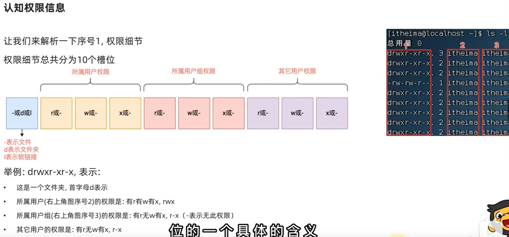


## 修改权限控制

### chmod

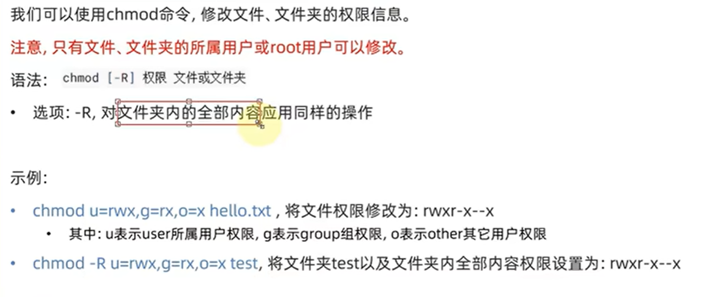


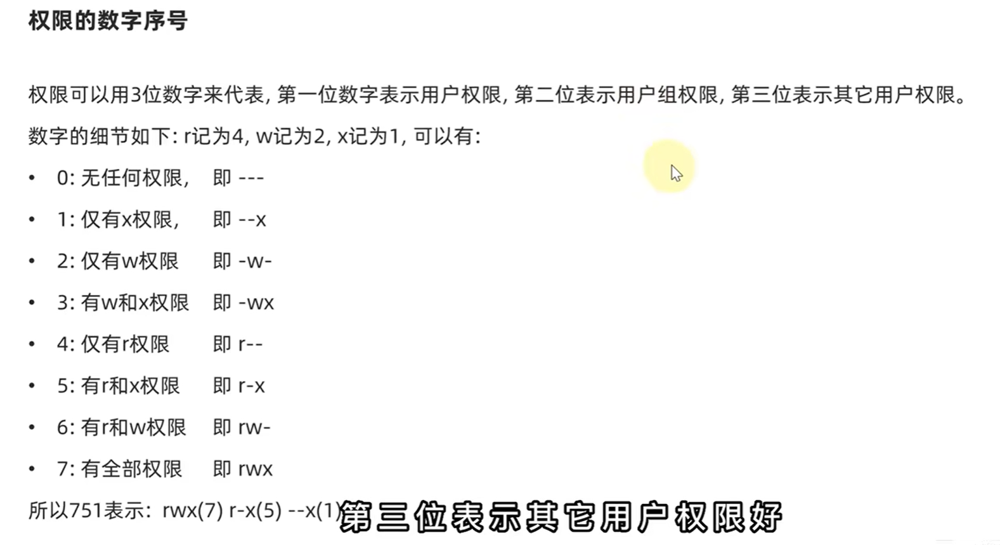


### chown

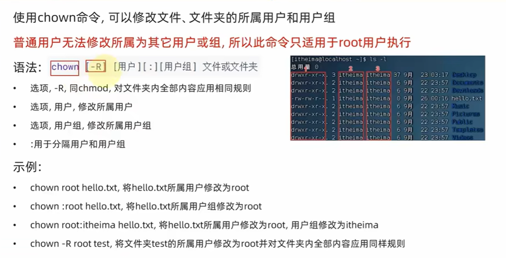

# Linux常用操作

## 软件安装

在Linux系统中，安装软件的方式主要有四种，这四种安装方式的特点如下：

在Linux系统中，安装软件的方式主要有四种，这四种安装方式的特点如下：


- CentOS系统使用：
  - yum [install remove search] [-y] 软件名称
    - install 安装
    - remove 卸载
    - search 搜索
    - -y，自动确认
- Ubuntu系统使用
  - apt [install remove search] [-y] 软件名称
    - install 安装
    - remove 卸载
    - search 搜索
    - -y，自动确认

> yum 和 apt 均需要root权限


## systemctl

功能：控制系统服务的启动关闭等

语法：`systemctl start | stop | restart | disable | enable | status 服务名`

- start，启动
- stop，停止
- status，查看状态
- disable，关闭开机自启
- enable，开启开机自启
- restart，重启


## 软链接

功能：创建文件、文件夹软链接（快捷方式）

语法：`ln -s 参数1 参数2`

- 参数1：被链接的
- 参数2：要链接去的地方（快捷方式的名称和存放位置）


## 时间

### 日期

语法：`date [-d] [+格式化字符串]`

- -d 按照给定的字符串显示日期，一般用于日期计算

- 格式化字符串：通过特定的字符串标记，来控制显示的日期格式
  - %Y   年%y   年份后两位数字 (00..99)
  - %m   月份 (01..12)
  - %d   日 (01..31)
  - %H   小时 (00..23)
  - %M   分钟 (00..59)
  - %S   秒 (00..60)
  - %s   自 1970-01-01 00:00:00 UTC 到现在的秒数


示例：

- 按照2022-01-01的格式显示日期

  

- 按照2022-01-01 10:00:00的格式显示日期

  

- -d选项日期计算

  

  - 支持的时间标记为：

    


### 时区

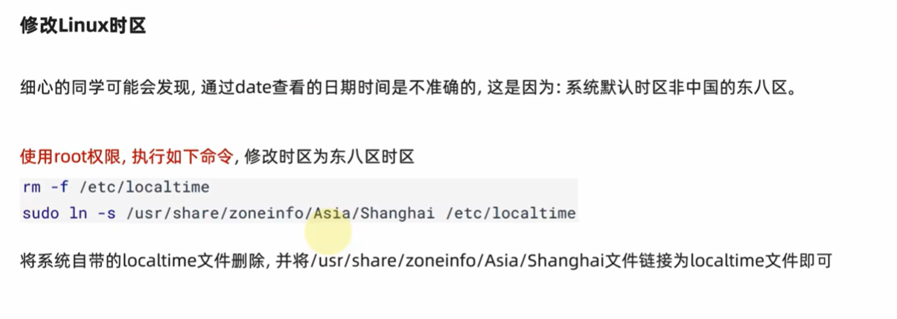


### ntp

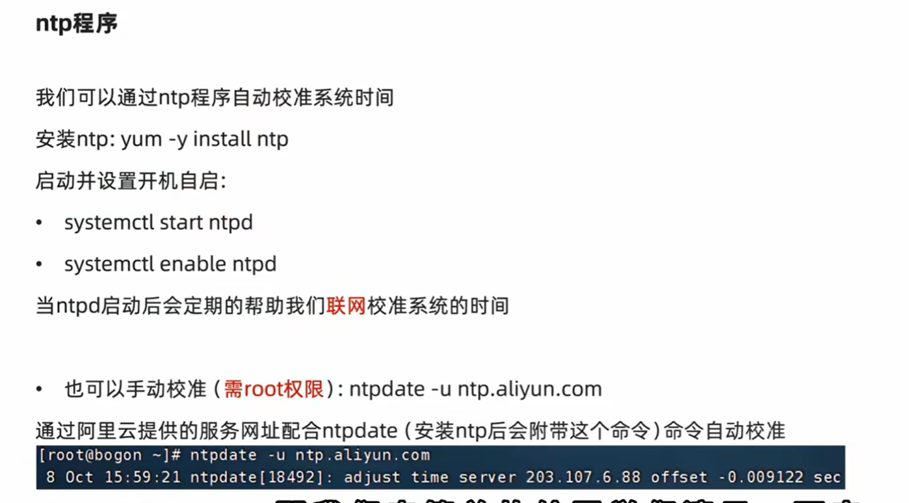


## ip,主机名

### ip地址

格式：a.b.c.d

- abcd为0~255的数字

特殊IP：

- 127.0.0.1，表示本机
- 0.0.0.0
  - 可以表示本机
  - 也可以表示任意IP（看使用场景）

查看ip：`ip addr`


### 主机名

每一台电脑除了ip外，也可以有一个名字，称为主机名

功能：Linux系统的名称

查看：`hostname`

设置：`hostnamectl set-hostname 主机名`


### 域名解析

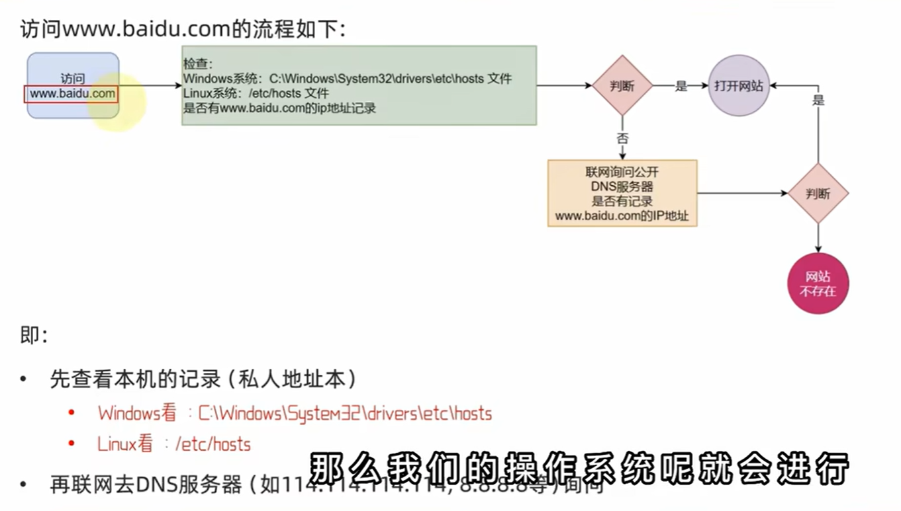


### 配置VMware固定IP

1. 修改VMware网络，参阅PPT，图太多

2. 设置Linux内部固定IP

   修改文件：`/etc/sysconfig/network-scripts/ifcfg-ens33`

   示例文件内容：

   ```shell
   TYPE="Ethernet"
   PROXY_METHOD="none"
   BROWSER_ONLY="no"
   BOOTPROTO="static"			# 改为static，固定IP
   DEFROUTE="yes"
   IPV4_FAILURE_FATAL="no"
   IPV6INIT="yes"
   IPV6_AUTOCONF="yes"
   IPV6_DEFROUTE="yes"
   IPV6_FAILURE_FATAL="no"
   IPV6_ADDR_GEN_MODE="stable-privacy"
   NAME="ens33"
   UUID="1b0011cb-0d2e-4eaa-8a11-af7d50ebc876"
   DEVICE="ens33"
   ONBOOT="yes"
   IPADDR="192.168.88.131"		# IP地址，自己设置，要匹配网络范围
   NETMASK="255.255.255.0"		# 子网掩码，固定写法255.255.255.0
   GATEWAY="192.168.88.2"		# 网关，要和VMware中配置的一致
   DNS1="192.168.88.2"			# DNS1服务器，和网关一致即可
   ```


## 网络传输

### ping命令

测试网络是否联通

语法：`ping [-c num] 参数`


### wget命令


### curl命令

==curl也可以用来下载文件==


示例：


### 端口

#### nmap命令


#### netstat命令

安装：`yum -y install net-tools`

功能：查看端口占用

用法：`netstat -anp | grep xxx`


## 进程管理

### ps命令

功能：查看进程信息

语法：`ps -ef`，查看全部进程信息，可以搭配grep做过滤：`ps -ef | grep xxx`

选项：

- -e,显示出所有的进程
- -f,以完全格式化的形式展示所有信息


### kill命令


## 主机状态监控

### top命令

功能：查看主机运行状态，默认5秒刷新一次

语法：`top`，查看基础信息

基础信息：

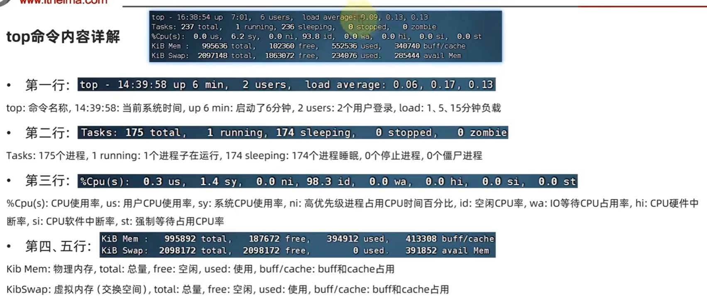

进程部分：

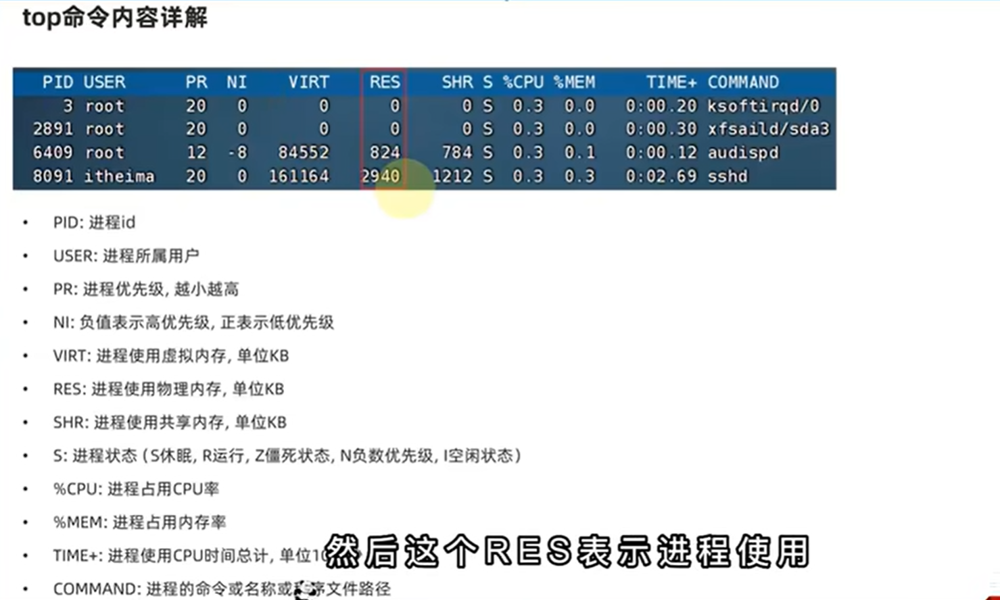


### df命令

查看磁盘占用


### iostat命令

查看CPU、磁盘的相关信息


### sar命令

查看网络统计


## 环境变量

### env命令

查看系统全部的环境变量

语法：`env`


### 环境变量设置

- 临时设置：export 变量名=变量值
- 永久设置：
  - 针对当前用户，设置用户HOME目录内：`~/bashrc`文件
  - 针对所有用户，设置`/etc/profile`
  - 设置之后，通过`source 配置文件`，使其立即生效


### PATH变量

记录了执行程序的搜索路径

可以将自定义路径加入PATH内，实现自定义命令在任意地方均可执行的效果


### $符号

作用：可以取出指定的环境变量的值

语法：`$变量名`

示例：

- `echo $PATH`，输出PATH环境变量的值

- `echo ${PATH}ABC`，输出PATH环境变量的值以及ABC

如果变量名和其它内容混淆在一起，可以使用${}-->表示将查出的变量与后边的字符串==拼接==


## 上传、下载

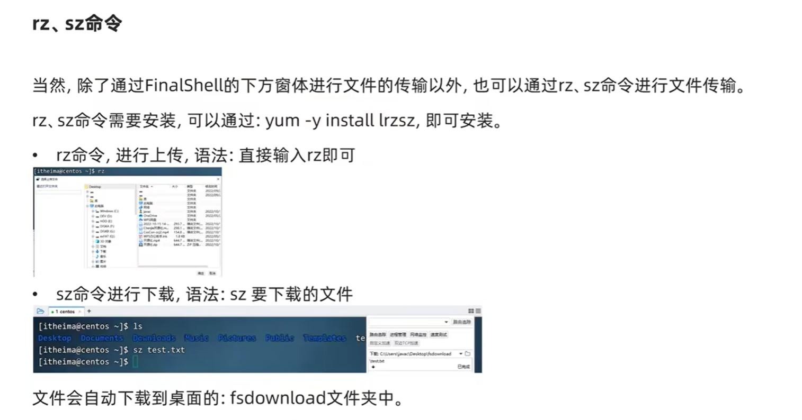


## 压缩解压

- 作用: 对文件进行打包、解包、压缩、解压
- 语法: `tar [-zcxvf] fileName [files]`
  - 包文件后缀为.tar表示只是完成了打包，并没有压缩
  - 包文件后缀为.tar.gz表示打包的同时还进行了压缩
- 说明:
  - -z: z代表gzip，通过gzip命令处理文件，gzip可以对文件==压缩或解压==
  - -c: c代表create，即创建新的包文件
  - -x: x代表extract，实现从包文件中还原文件（-c与-x互斥）
  - -v: v代表verbose，显示命令的执行过程
  - -f: f代表file，用于指定包文件的名称
- 举例:
  - 打包
    - tar -cvf hello.tar ./*
      将当前目录下所有文件打包，打包后的文件名为hello.tar
    - tar -zcvf hello.tar.gz ./*
      将当前目录下所有文件打包并压缩，打包后的文件名为hello.tar.gz
  - 解包
    - tar -xvf hello.tar
      将hello.tar文件解包，解包后的文件放在当前目录
    - tar -zxvf hello.tar.gz
      将hello.tar.gz文件解压，解压后的文件放在当前目录
    - tar -zxvf hello.tar.gz -C /usr/local
      将hello.tar.gz文件解压，解压后的文件放在/usr/local目录


