# 1 操作系统引论

## 1.1 操作系统的概念、功能和目标

作为用户和计算机硬件之间的接口

* 提供的功能

  * 命令接口（联机命令接口|脱机命令接口）

  * 程序接口

  * GUI（图形用户界面win|ios|andrio）

* 目标
  * 方便用户使用

## 1.2 操作系统的特征

**并发|并行**

并发：多个事件交替发生（宏观同时发生、微观交替进行）
并行：多个事件同时发生

**共享**

两种资源共享方式

* 互斥共享方式：一个时间段内只允许一个进程访问该资源，如打印机
* 同时共享方式：允许一个时间段内由多个进程==并发==对它们进行访问

**虚拟**

概念：把一个物理上的实体变为若干个逻辑上的对应物

* 空分复用技术
* 时分复用技术

**异步**

概念：在多道程序环境下，允许多个程序并发执行，但由于资源有限，进程的执行不是一贯到底的，而是走走停停的，以不可预知的速度向前推进。只有系统拥有并发性，才有可能导致异步性。

## 1.3 操作系统的发展与分类

**OS的发展与分类**

* 手工操作阶段
  * 纸带机（用户独占全机、人机速度矛盾）
* 批处理阶段
  *  单道批处理系统（外围机--磁带--内存）
  *  多道批处理系统（操作系统开始出现）
* 分时操作系统
  * 轮流处理作业
  * 不能处理紧急任务
* 实时操作系统
  * 优先处理紧急任务
  * 硬实时系统：必须在严格的时间内完成处理
  * 软实时系统：可以偶尔犯错
* 网络操作系统
* 分布式操作系统
* 个人计算机操作系统

## 1.4 操作系统的运行机制与体系结构

OS**的运行机制和体系结构**

程序运行的过程其实是 cpu 执行一条条机器指令（代码**编译**后变成机器指令）的过程-->命令行使用的是**命令**

* **运行机制**
  
  * 两种指令
    * 特权指令：只允许**操作系统==内核==，即管理者**，来使用
    * 非特权指令：应用程序来使用
    
  * 两种==cpu==处理器状态
    
    * 内核态（root）：==cpu使用权属于操作系统==
    * 用户态
    
  * 两种程序
    * 内核程序(运行在内核态 )
    * 应用程序
    
    
    
    
    
    
    
    **内核态与用户态的切换**
    
    ==内核态：cpu使用权属于操作系统==
    
    

## 1.5 中断和异常

* **中断的作用**

  中断是实现“用户态—>核心态”的==唯一==途径

* **中断的分类**

  * 异常（内中断）：与当前执行的指令有关，中断信号来源于cpu**内部**
    
    cpu在执行指令时会检查是否有异常发生
    
    * 陷阱（trap）：陷入指令会引发一个内部中断信号-->程序故意引发
    * 故障（fault）
    * 中止（abort）
    
  * 中断（外中断）：与当前执行的指令无关，中断信号来源于cpu**外部**

    ==每个**指令周期末尾**，cpu都会检查是否有外中断信号需要处理==

    例子：时钟部件发送中断信号切换cpu执行的应用程序

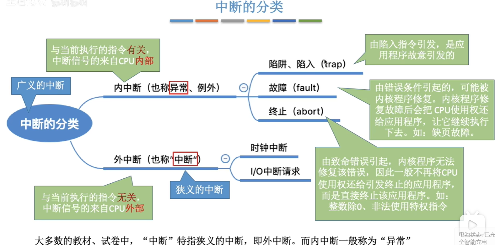


* **中断的处理过程**

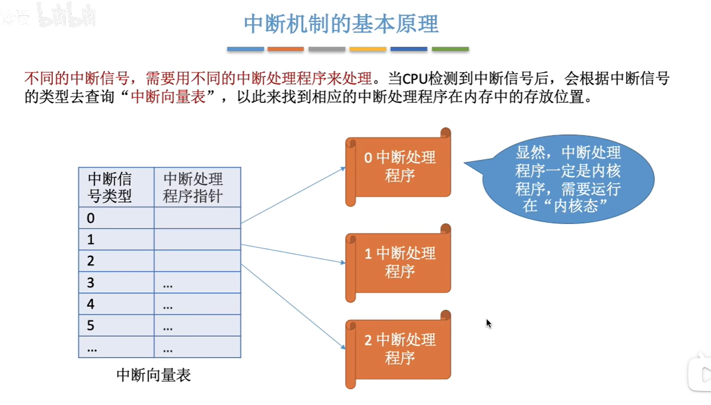

## 1.6 系统调用（程序接口）

**概念**：系统调用时操作系统提供给应用程序使用的接口，应用程序通过系统调用请求操作系统的服务。

==是指应用程序请求操作系统的服务，而不是内核，内核只是操作系统的一部分==


**系统调用和库函数的区别**：

* 系统调用是操作系统向上层提供的接口
* 有的库函数是对系统调用的进一步封装
* 当今编写的应用程序大多是通过高级语言提供的库函数间接地进行系统调用

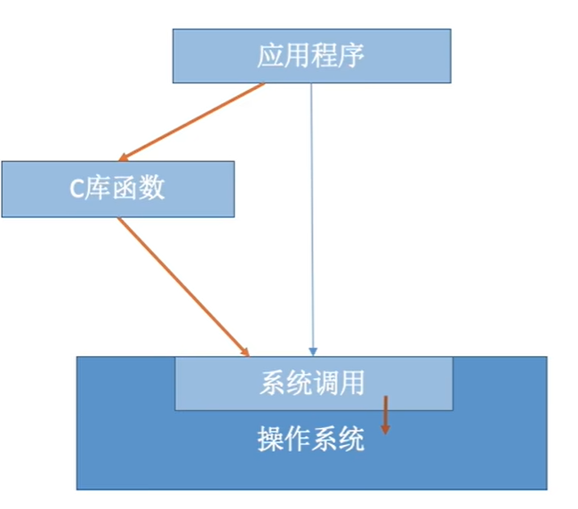

**什么功能要用的系统调用**：所有与共享资源有关的操作，如打印机


**系统调用过程**


## 1.7 操作系统的体系结构

**操作系统内核**:最核心，最接近硬件的部分

* 时钟管理（实现计时功能）
* 中断处理
* 原语（程序运行具有原子性，不可中断）
* 对系统资源进行管理的功能
  * 进程管理
  * 存储器管理
  * 设备管理

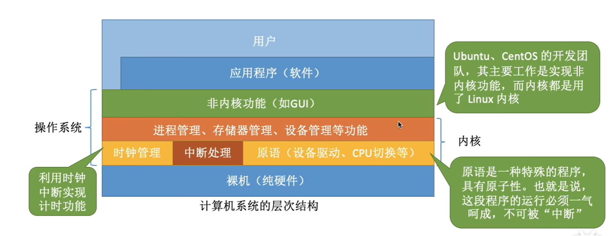


**操作系统的体系结构**

* 大内核（将操作系统的主要功能模块都作为系统内核，运行在核心态）
* 微内核（只把最基本的功能保留在内核）


例子：

==系统调用是指应用程序请求操作系统的服务，而不是内核，内核只是操作系统的一部分==


**操作系统有多种体系结构：**


## 1.8 操作系统引导

内存是存储系统运行时的缓存临时数据

磁盘和硬盘：存储文件


## 1.9 虚拟机


**对比：**

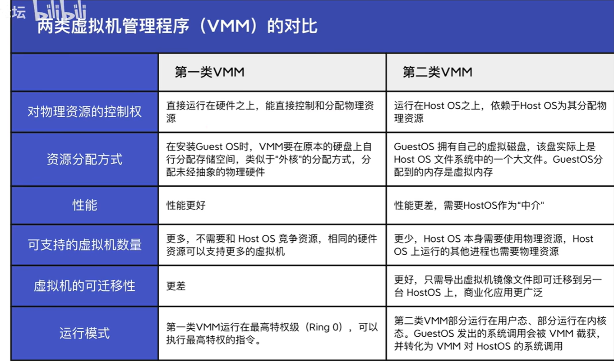

# 2 进程和线程

## 2.1 进程的控制与描述

### 2.1_1 进程的定义、组成、组织方式、特征

**程序**：**静态**的，是一个存放在磁盘中的可执行文件，即一系列指令集合

**进程**：**动态**的，是程序的一次执行过程-->==当作业调度到**内存**后，会建立对应的进程==

进程是系统进行资源分配和调度的独立单位

引入线程后，进程不再是**接收调度**的基本单位，但仍是获取资源的基本单位

**组成**：

- **PCB(Process Control Block)**：==进程存在唯一的标志==

当进程被创建时，**操作系统**会为该进程分配一个唯一的、不重复的PID，即进程ID-->==PCB被**操作系统**的内核管理==

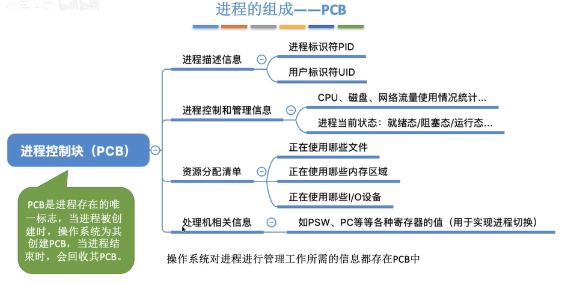

- 程序段：包含程序运行过程中,程序编译后在内存中产生一系列的指令
- 数据段：包含程序运行过程中产生的各种数据


==进程的结构：==


**特征**：

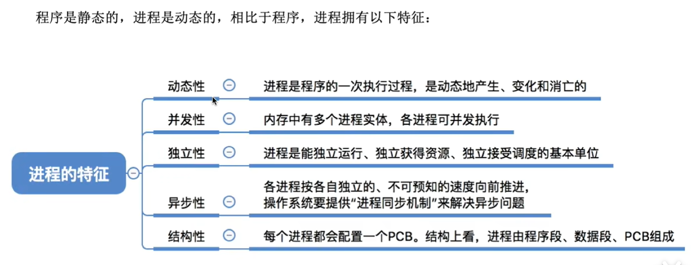

### 2.1_2 进程的状态与转换

**状态**：前三种为基本状态

1. 运行状态：占有CPU，并在CPU上运行，单核只能一个进程（双核两个）（CPU√，其它资源√）

2. 就绪状态：已经具备运行条件，但是没有空闲的CPU，暂时不能运行（CPUX，其它资源√）

3. 阻塞状态：等待某个事件的发生，暂时不能运行（CPUX，其它资源X）-->若本身正在cpu运行，则下cpu

4. 创建状态：创建PCB，程序段，数据段

5. 终止状态：回收内存，程序段，数据段，撤销PCB-->当终止进程的工作完成后，该进程彻底消失


**进程状态间的转换：**


**组织方式**：

- 链接方式，指针指向不同的==**PCB**队列==


- 索引方式：索引表


### 2.1_3 进程控制

**什么是进程控制？**

答：实现各种进程状态转换。

**如何实现进程控制？**

答：==用“原语”实现==。-->原语的执行具有原子性


**如何实现原语的原子性**：


<strong>进程控制相关的原语：</strong>

- 进程的创建：


- 进程的终止：

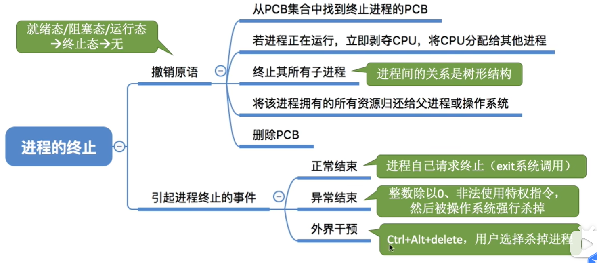

- 进程的阻塞与唤醒：

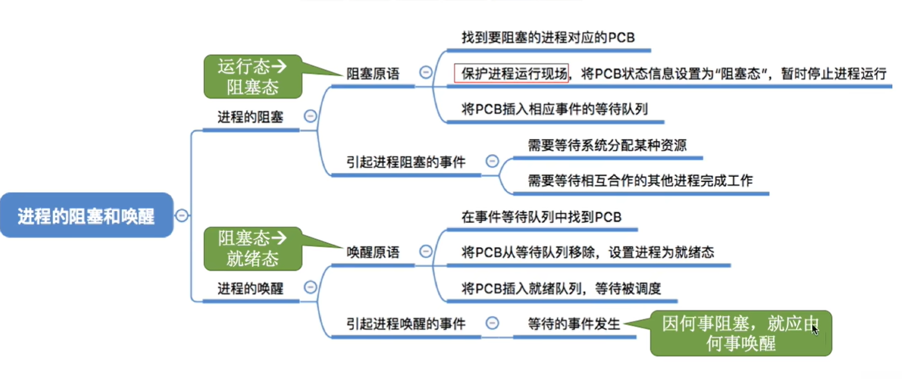

5、进程的切换


**总结：原语做的事情**

1. 更新PCD中的信息

2. 将PCD插入合适的队列

3. 分配/回收资源

**什么叫运行环境信息**：cpu会设置很多寄存器存放程序运行过程中所需的某些数据


### 2.1_4 进程通信

1. **共享存储**

   设置一个共享==内存==区域，并映射到进程的虚拟地址空间

   **互斥**地访问共享空间-->==由进程自己实现互斥==

   - 基于数据结构的共享：固定分配（低级）

   - 基于存储区的共享：划分存储区（高级）


2. **消息传递**

进程间的数据交换以**格式化的信息**（Message）为单位。进程通过操作系统提供的“**发送消息/接收消息**”两个**原语**进行数据交换

- 消息：消息头、消息体

- 直接通信方式

  P调用发送原语-->内核将消息直接挂载到接收进程Q的消息队列里-->Q调用接收原语

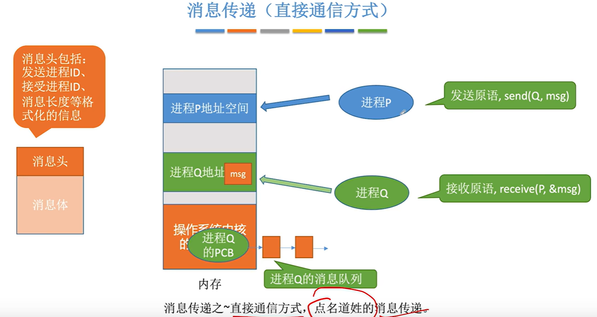

- 间接通信方式（间接利用信箱发送消息）

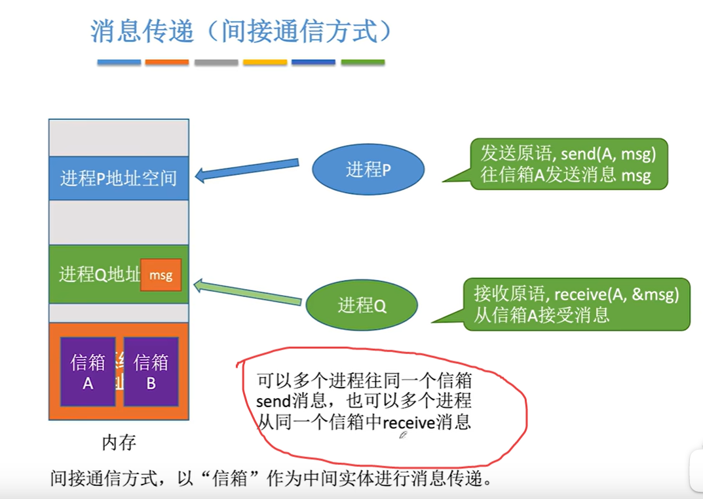

3. **管道通信**（pipe）：单向通信

管道可以理解为**循环队列**（特殊的共享文件），数据流先进先出


半双工通信：某一时间段内只能实现单向的传输

**写进程往管道写数据，即使管道没写满，只要管道没空，读进程就可以从管道读数据；**

**读进程从管道读数据，即使管道没读空，只要管道没满，写进程就可以往管道写数据。**

### 2.1_5 信号

信号(signal):用于通知进程某个特定事件已经发生。进程收到一个信号后，对该信号进行处理

**知识点：**


每个位向量对应一个信号，每种类型的信号只能接受一次，后到达的会丢弃

不同进程间允许发送的信号类型是有限制的，例：只有父进程可以杀死子进程，其他不行

每个信号都有默认处理，但**进程**可以**自定义**


**检测是否有待处理信号**：将blocked按位取反后与pending按位与，值为1的为待处理信号（被屏蔽的信号忽略，不处理）

**处理时间：**


**处理方法：**

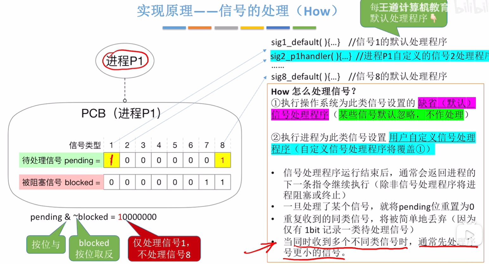


**信号与异常的关系：**


### 2.1_6 线程概念和多线程模型

**线程**：线程是一个基本的CPU执行单元，也是程序执行流的最小单位，进一步提高了系统的并发度

**引入线程后的变化**：

==进程是资源分配的基本单位，线程是调度的基本单位==

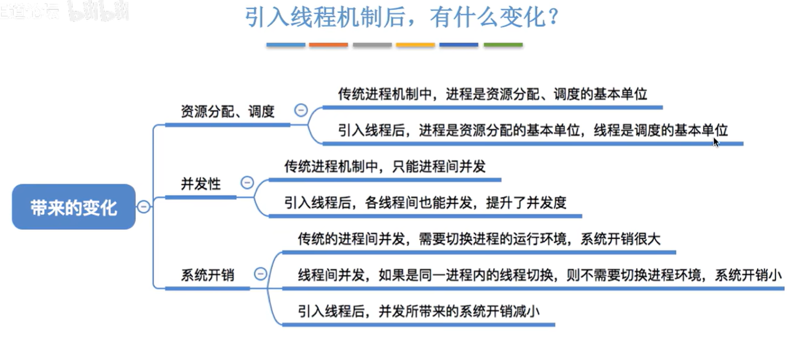

1. **线程的属性**

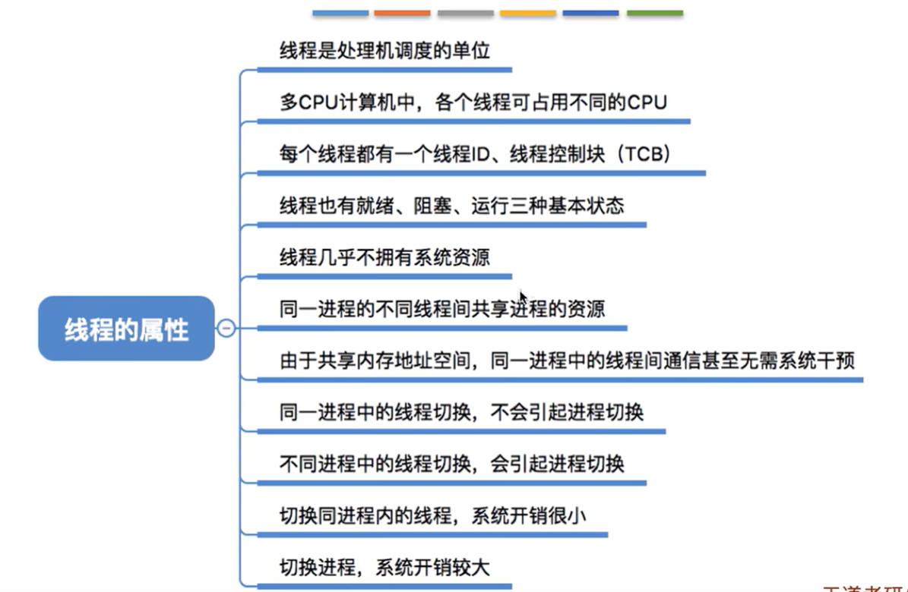

2. **线程的实现方式**-->==进程储存在操作系统中==

- 用户级线程（ULT）：

线程的管理和切换由应用管理

从用户的视角看能看到的线程，操作系统只能看到进程     

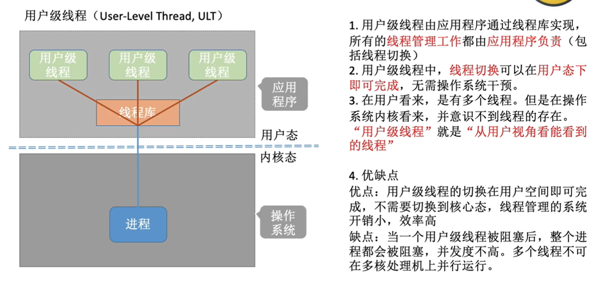                                                                                                                     

- 内核级线程（KLT）：

KLT虽然由操作系统内核管理，但程序运行时cpu处于用户态，线程切换必须在内核态


**内核级线程才是处理机分配的单位**


3.  多线程模型

- 多对一模型


- 一对一模型


- 多对多模型

分配是动态的，当哪个用户级线程占用资源高时，操作系统会将与它占用同一内核级线程的另一个用户级线程分配到其他内核级线程


### 2.1_7 线程的组织与控制

1. **线程的状态与转换**


2. **线程的组织与控制**

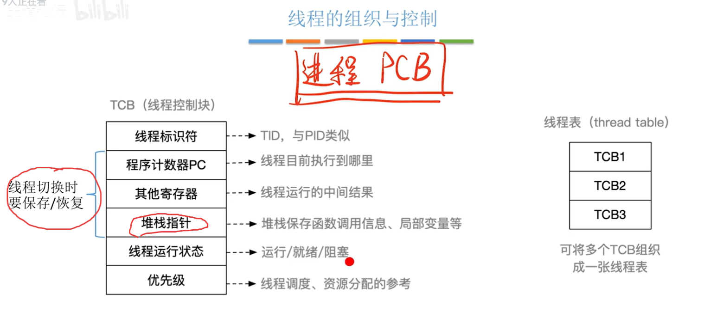

## 2.2 处理机调度

### 2.2_1 处理机调度的概念、层次

1. 基本概念

通常进程数量大于处理机数量，所以要按照一定的算法选择一个进程，并将处理机分配给它运行，以实现进程的并发执行

2. 三个层次

- 高级调度（**==作业调度==**）-->作业：一个具体的任务

辅助外存与内存之间的调度，作业调入时会建立相应的PCB，作业调出时才撤销PCB，调入可由操作系统决定，调出由作业运行结束才调出

- 中级调度（**==内存调度==**）

将暂时不用的进程放到外存（PCB不外放），提高内存利用率和系统吞吐量，进程状态为**挂起状态**，形成挂起**队列**

- 低级调度（**==进程调度==**）

按照某种规则，从就绪队列中选择一个进程为其分配处理机

3. **三层调度的联系、对比**

   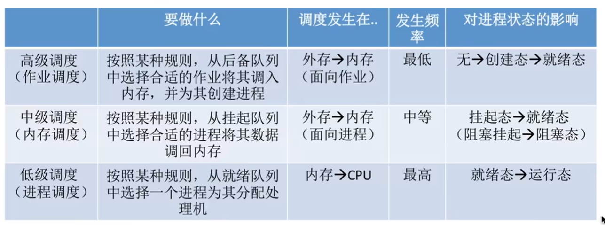

4. **进程的“挂起态”与七状态模型**

挂起态存放在外存，运行态在cpu,其他在内存


### 2.2_2 ==进程==调度的时机、切换与过程、调度方式

1. **时机**


**临界资源**：一个时段段内只允许一个进程使用的资源。各进程互斥地访问临界资源

**临界区**：访问临界资源的那段代码

**内核程序临界区**一般是用来访问某种内核数据结构的，比如进程的就绪队列（由就绪进程的pcb组成）


2. **切换与过程**

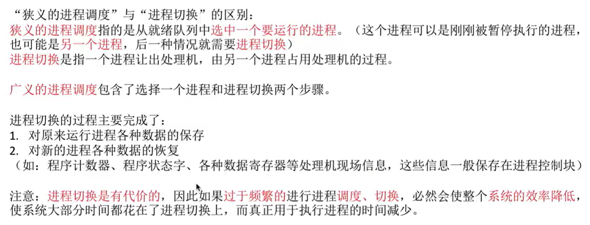

3. **方式**

- 非剥夺调度方式（非抢占式）

- 剥夺调度方式（抢占式）

  

### 2.2_3 调度器和闲逛进程

1. **调度程序/调度器**


2. **调度程序的对象**

   

3. **闲逛进程**：当没有其他就绪进程时，运行闲逛进程

   1. 优先级最低
   2. 可以是0地址指令，占一个完整的指令周期（指令周期末尾例行检查中断）
   3. 能耗低

### 2.2_3 调度算法的评价指标

1. **CPU利用率**

CPU利用率=CPU忙碌的时间/总时间

2. **系统吞吐量**

系统吞吐量=总共完成了多少道作业/总共花了多少时间-->单位时间内完成作业的数量

3. **周转时间**

* 周转时间（提交作业到完成作业花费的时间）、平均周转时间


* 带权周转时间、平均带权周转时间

带权周转时间越小越好

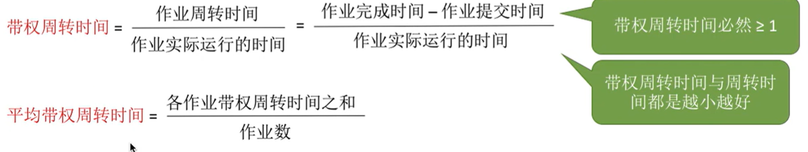

4. **等待时间**：进程或作业等待处理机状态时间的和

进程：等待被服务的时间之和

作业：==建立进程后的等待时间+作业在外存后备队列中等待的时间==

==当作业调度到**内存**后，会建立对应的进程==

5. **响应时间**：从用户提交请求到首次产生响应所用的时间

### 2.2_4 FCFS、SJF、HRRN调度算法（适合早期的批处理系统）

1、**先来先服务**（FCFS）

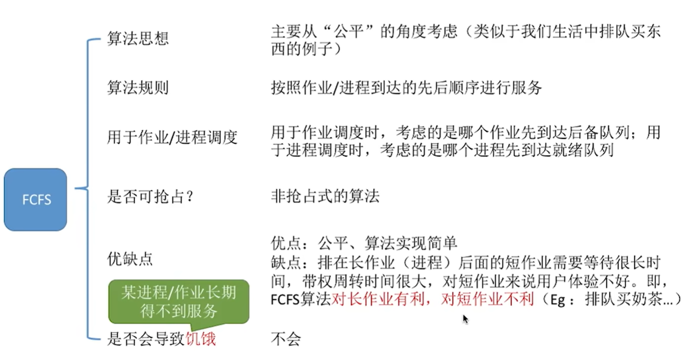

**例题**：

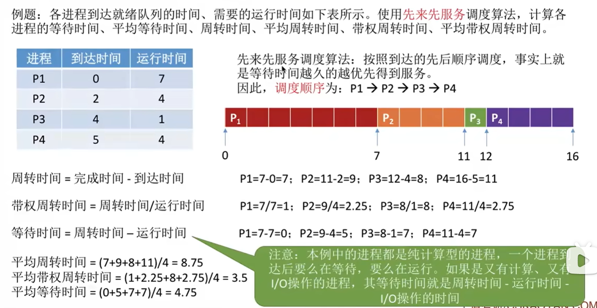

2、**短作业优先**（SJF，shortest job first）：最短（服务时间最短）的作业优先得到服务

==时间相同，先到达的先被服务==


- **非抢占式**（SJF）：选择当前**已到达**且**运行时间最短**的作业/进程先进入运行态


- **抢占式**（SRTN）：有新作业进入就绪队列或有作业完成了，考察队列中的最小需要时间的作业


**细节**：

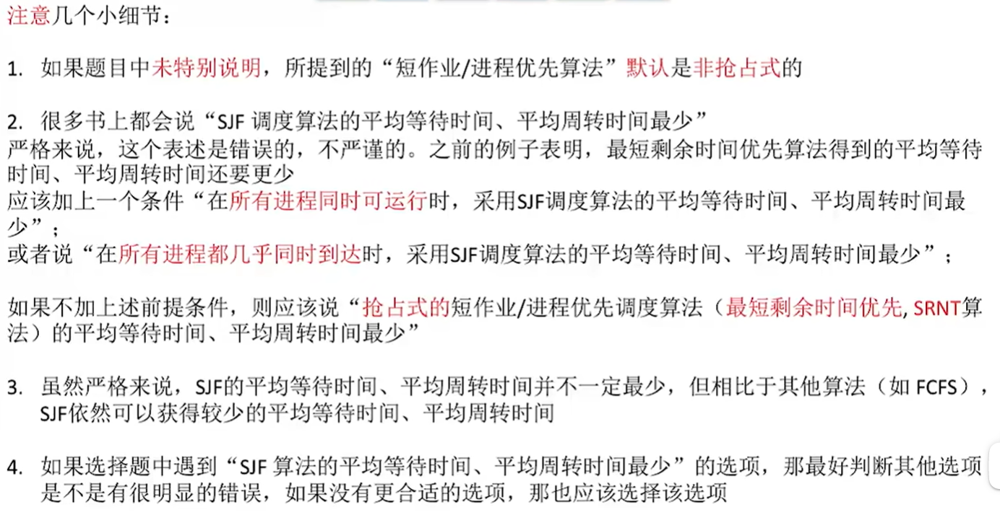

3. **高响应比优先**（HRRN）


**例题：**


### 2.2_5 时间片轮转、优先级调度、多级反馈队列（适合交互式系统）

1. **时间片轮转算法**（RR）


**例题：**

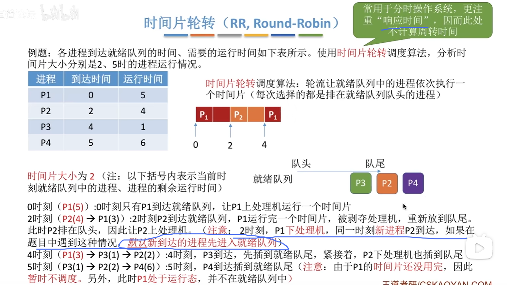

**时间片设置**：


2. **优先级调度算法**

优先级相同时，先处理先到达的进程

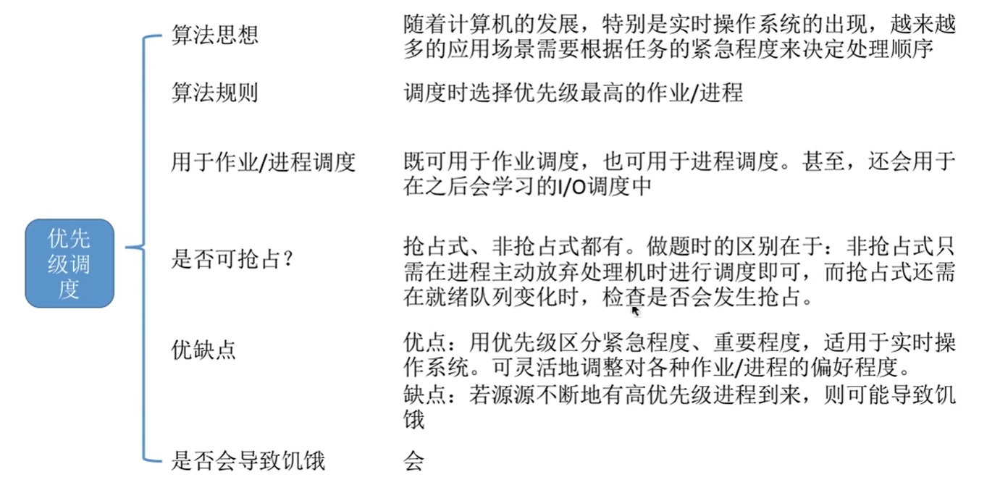

- **非抢占式**


- **抢占式**


- **优先级**


3. **多级反馈队列调度算法**


**例题：**

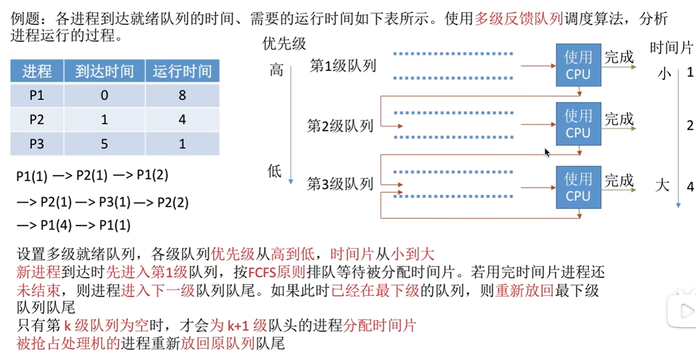


### 2.2_6 多级队列调度算法


### 2.2_7 多处理机调度

多处理机调度中，应追求的目标：

**负载均衡**：尽可能让每个CPU都同等忙碌

**处理机亲和性**：尽量让一个进程调度到同一个CPU上运行，以发挥CPU中缓存的作用（Cache）

- 公共就绪队列


- 私有就绪队列

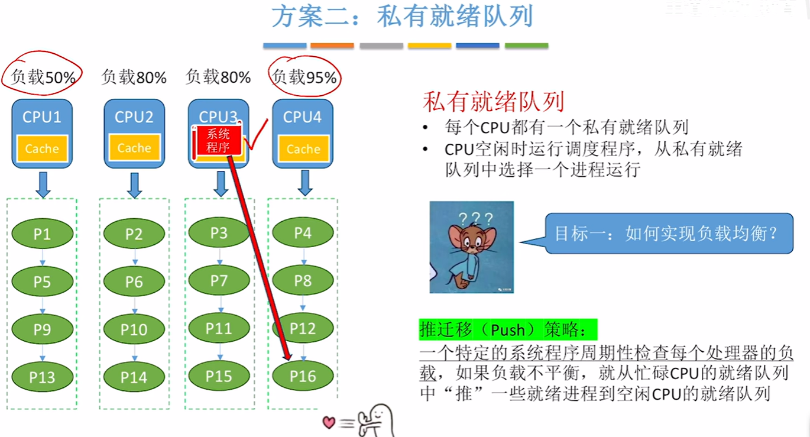

**如何实现负载均衡？**

推迁移、拉迁移（看下图）

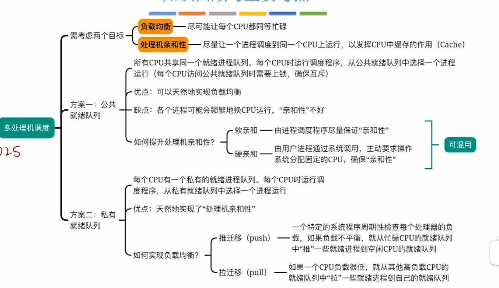

## 2.3 进程同步

### 2.3_1 进程同步、进程互斥

1、进程同步

同步，即直接制约关系，是指为了完成某种任务而建立的两个或多个进程，这些进程因为需要在某些位置上协调他们的工作**次序**而产生的制约关系。进程间的直接制约关系就是源于它们之间的相互合作。-->克服异步性

2、进程互斥

把一个时间段内只允许一个进程使用的资源称为临界资源。

对临界资源的**互斥**访问，可以在逻辑上分为四个部分：
```cpp
do{
    entry section;     //进入区     对访问的资源检查，若可进入，则设置正在访问临界资源的标志（上锁）
    critical section;  //临界区(段) 访问临界资源的那部分代码
    exit section;      //退出区     负责解锁
    remainder section; //剩余区     其它处理
} while(true)
```

**进入区和退出区**：负责实现互斥的代码块


**遵守的原则：**


让权等待：进程长时间停在进入区，释放进程

### 2.3_2 进程互斥的软件实现方法

1. **单标志法**

两个进程在访问完临界区后会把使用临界区的权限教给另一个进程。也就是说**每个进程进入临界区的权限只能被另一个进程赋予**


- 当满足while()的条件时，会一直循环，进程无法继续推进，相当于等待
- **违背空闲让进原则**：若一个进程一直不访问临界资源，则另一个也不能访问

2. **双标志先检查** 

算法思想:设置一个bool数组flag[]来标记自己是否想要进入临界区的意愿

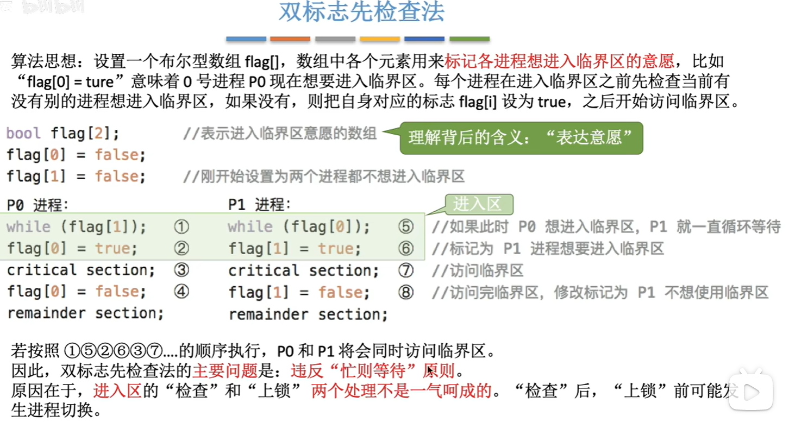

- 由于进程是并发进行的，可能会违背**忙则等待**的原则

3. **双标志后检查**

算法思想:设置一个bool数组flag[]来标记自己是否想要进入临界区的意愿,不过是先上锁后检查


- 由于进程是并发进行的，可能会两个同时上锁，都进不去，违反**空闲让进**和**有限等待**原则

4. Peterson 算法

主动让对方先使用处理器

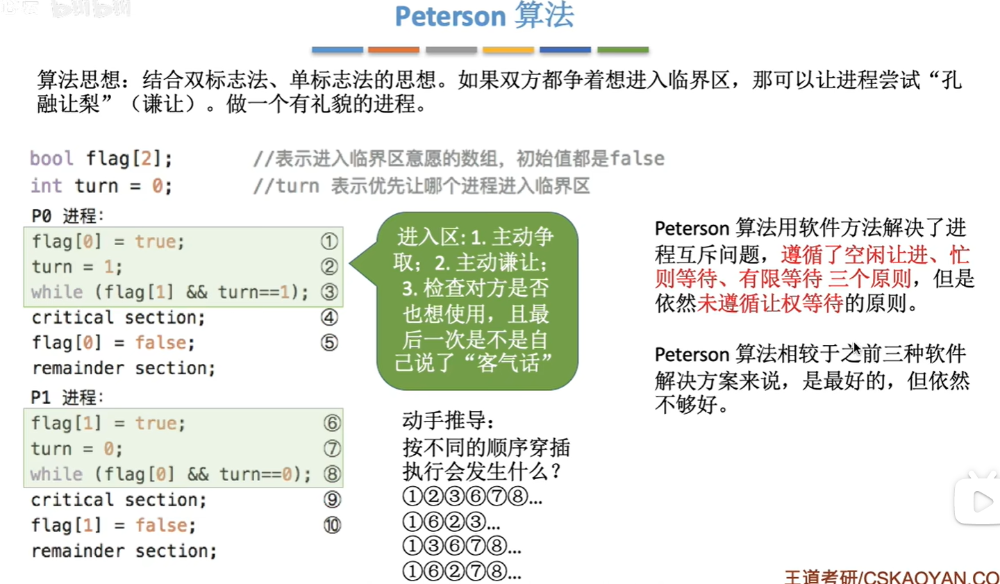

- 遵循空闲让进、忙则等待、有限等待三个原则

- 但是未遵循让权等待的原则-->前几个也没遵循该原则

### 2.3_3 进程互斥的硬件实现方法

1. **中断屏蔽方法**

源

- 不适用于多处理机，因为多个处理机可能同时访问临界资源，此时它们都处于关中断状态

2. **TestAndSetLock （TSL指令）**

TSL是用硬件实现的，上锁、检查一气呵成

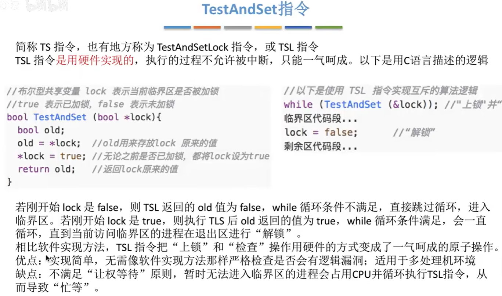

- 不满足让权等待，会盲等

3. **swap指令**

别称：Exchange指令、XCHG指令

Swap指令是用硬件实现的


- 逻辑与TSL指令相同

- 不能让权等待

### 2.3_4 锁


**特性：**

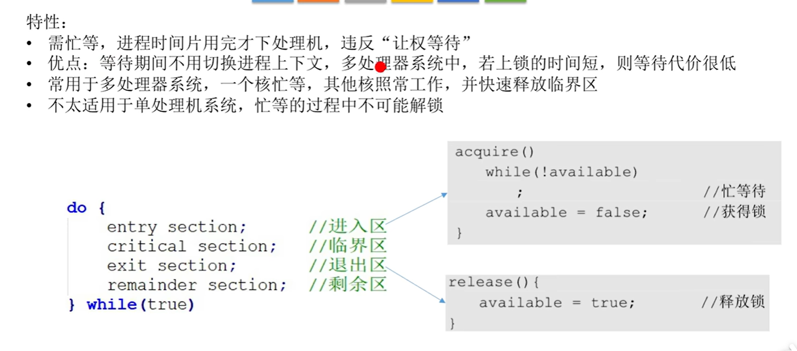

### 2.3_5 信号量机制

信号量：

信号量是一种变量，表示系统中某种资源的数量

一对原语：wait（S）原语和signal（V）原语，分别简称P（S）、V（S）-->S代表信号量

1. **整形信号量**

用一个整数表示系统资源的变量，用来表示系统中某种资源的数量


- 不满足让权等待，可能会出现盲等

2. **记录型信号量**

记录型数据结构表示的信号量-->**semaphore**

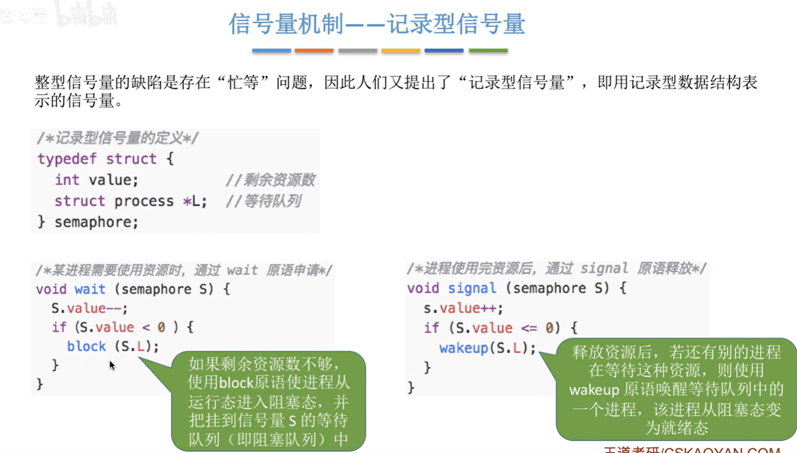

- 遵循让权等待

**==若考试中出现P(S)和V(S),除非特别说明，否则默认S为记录型信号量==**

### 2.3_6 用信号量机制实现进程互斥、同步、前驱关系

1. **实现进程互斥**

设置互斥信号量mutex，==初值为1==

对不同的临界资源需要设置不同的互斥信号量

PV必须成对出现


2. **实现进程同步**

保证一前一后的操作顺序


- 设置同步信号量S，==初始为**0**==

- **在“前操作”之后执行V（S）**

- **在“后操作”之后执行（V）**
- **==重要的不是S.value的数量，而是p1唤醒了p2==**-->若p2先执行，由于阻塞前已经执行过P(S)操作，重新唤醒后从代码4开始执行


3. **实现进程的前驱关系**

1、要为每一对前驱关系各设置一个同步变量

2、在“前操作”之后对相应的同步变量执行V操作

3、在“后操作”之前对相应的同步变量执行P操作


### 2.3_7 生产者-消费者问题


**逻辑：**

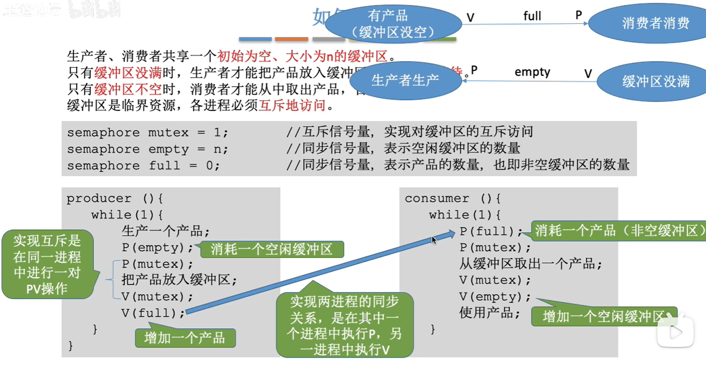

- 这里实际上是实现进程的==前驱/同步==，两个进程间设置一个同步信号量-->具体设置成什么，要看P操作要申请什么资源

- ==互斥信号量初值为1==，==同步信号量要看对应的资源**初始值**==是多少-->要看==初始值！！！==
- P、V操作的顺序不能变，实现互斥的P一定要在实现同步的P之后-->V操作可以变

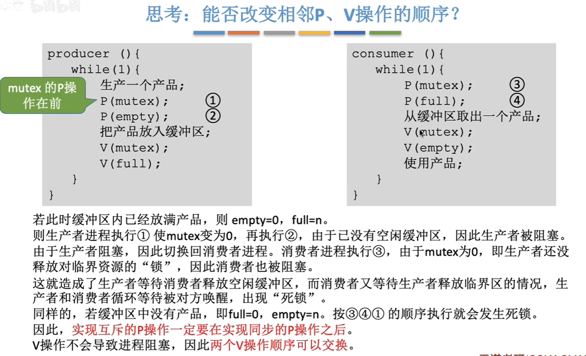


**考点分析：**


### 2.3_8 多生产者-多消费者模型

不同 生产者/消费者 所 生产/消费 的资源种类不同


- 同步信号量apple,orange,plate为资源初始值

- 在生产-消费者问题中，如果缓冲区大小为==1==，那么有可能==不需要设置互斥信号量==就可以实现互斥访问缓冲区


**考点：**


### 2.3_9 吸烟者问题

解决“可以让生产多个产品的单生产者”问题提供一个思路；

若一个生产者要生产多种产品（或者说会引发多种前驱事件），那么各个V操作应该放在各自对应的“事件”发生之后的位置


### 2.3_10 读者-写者问题

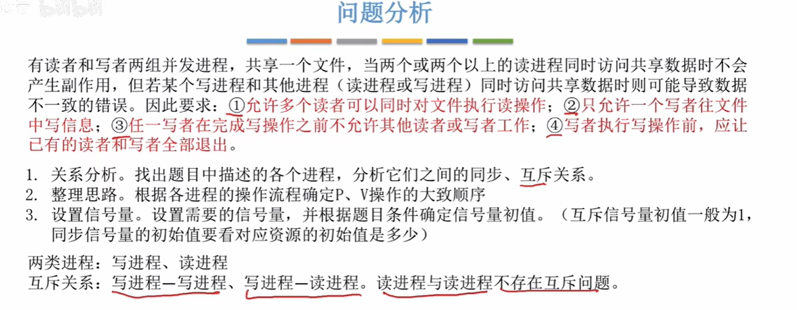

**逻辑: **

下图已解决死锁问题

死锁的原因是因为两个读者同时访问 `if(count == 0)` ,故在前增加互斥访问P(mutex)


**优化：**

解决了写优先

原本是读的时候不能写，现在是写了之后也不能读


### 2.3_11 哲学家进餐问题

五个人，必须拿左右的筷子才能吃饭

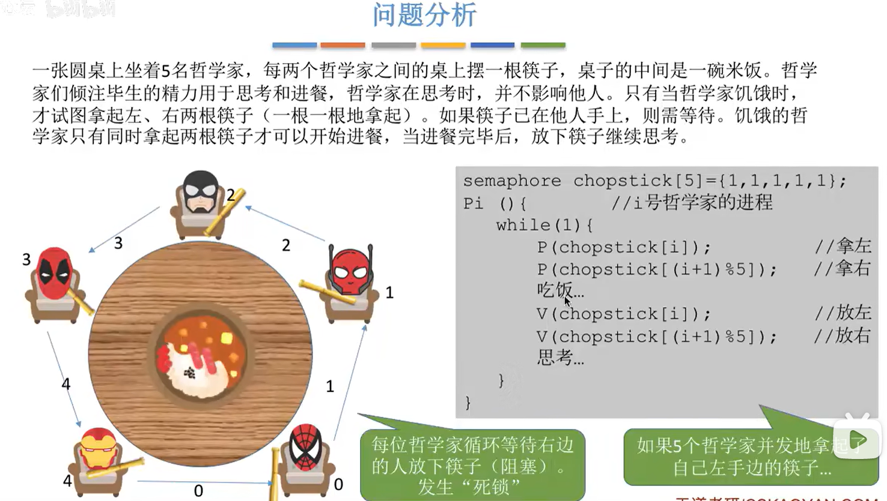

- 会发生死锁

避免死锁发生

解决方案：

1. 可以对哲学家进程施加一些限制条件，比如最多允许四个哲学家同时进餐，这样可以保证至少有一个哲学家是可以拿到左右两只筷子的。

2. 要求奇数号哲学家先拿左边的筷子，然后再拿右边的筷子，而偶数号哲学家刚好相反。用这种方法可以保证如果相邻的两个奇偶号哲学家都想吃饭，那么只会有其中一个可以拿起第一只筷子，另一个会直接阻塞。这就避免了占有一只后再等待另一只的情况。

3. 仅当一个哲学家左右两只筷子都可用时才允许他抓起筷子。

**逻辑：**-->实现了哪个？

如果第二个人拿不到自己所需的一只筷子时，会阻塞，等待当前进程完成


### 2.3_12 管程

1. **为什么要引入管程**

- PV操作容易出错、困难
- 用来实现互斥

2. **管程的定义和基本特征**

管程是一种特殊的软件模块，由这些部分**组成**：

* 局部于管程的共享数据结构说明
* 对该数据结构进程操作的一组过程（即函数）
* 对局部于管程的共享数据设置初始值的语句
* 管程有一个名字

**基本特征**：

* 局部于管程数据结构只能被局部于管程的过程所访问
* 一个进程只有通过调用管程内的过程才能进入管程访问共享数据
* ==每次仅允许一个进程在管程内执行某个内部过程==-->每一次只有一个进程访问共享数据结构，即==互斥==

心得：相当于C++的类，管程是数据放在private中，函数放在public中

拓展1：用管程解决生产者消费者问题

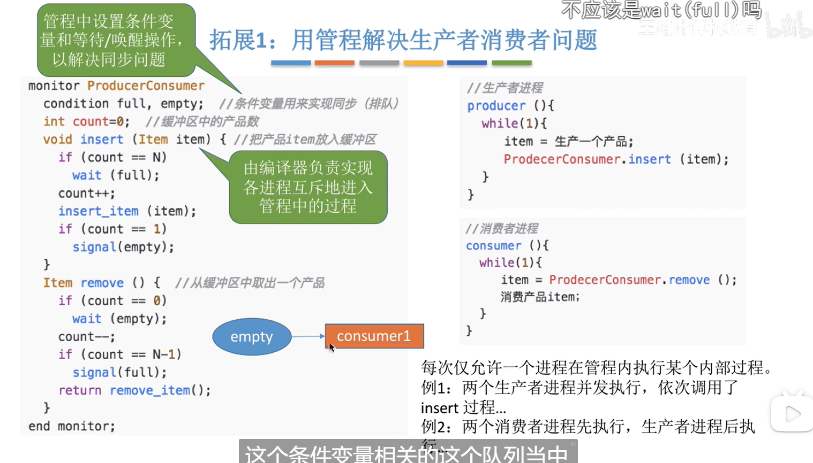

- full,empty是条件变量，不是信号量。进行wait/signal操作相当于在full和empty中插入/释放就绪队列
- 各进程互斥的访问管程中的==过程==


拓展2：Java中类似于管程的机制

java中用synchronized来描述一个函数,这个函数同一时间只能被一个线程调用

## 2.4 死锁

### 2.4_1 死锁的概念

1、什么是死锁

各进程互相等待对方手里的资源，导致各进程都阻塞，无法向前推进的现象。

2、进程死锁、饥饿、死循环的区别

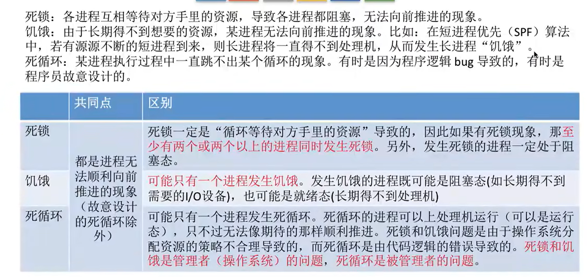

3、死锁产生的必要条件


4、什么时候会发生死锁

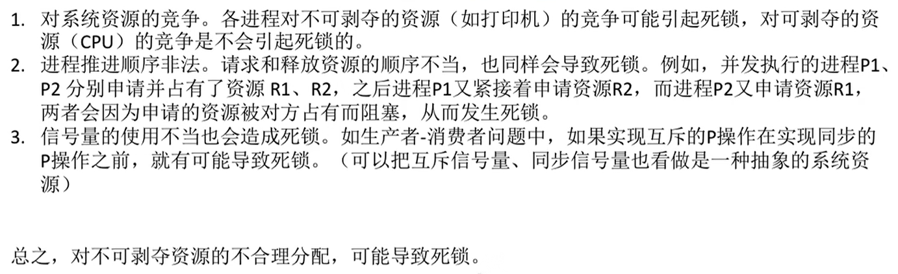

5、死锁的处理策略

* 预防死锁。破坏死锁产生的四个必要条件中的一个或几个。
* 避免死锁。用某种方法防止系统进入不安全状态，从而避免死锁（银行家算法）
* 死锁的检测和解除。允许死锁的发生，不过操作系统会负责检测出死锁的发生，然后采取某种措施解除死锁。

### 2.4_2 死锁的处理策略——预防死锁

静态策略：预防死锁
* 破坏互斥条件（有些不能破坏）
		把互斥的资源改造为共享资源
* 破坏不剥夺条件（复杂，造成之前工作失效，降低系统开销，会全部放弃、导致饥饿）
		方案1：当请求得不到满足的时候，立即释放手里的资源
		方案2：由系统介入，强行帮助剥夺
* 破坏请求和保持条件（资源利用率极低，可能会导致某些进程饥饿）
		采用静态分配方法，即进程在运行前一次申请完所需的所有资源，如果申请不到，不投入运行。一旦投入运行后，这些资源就一直归它所有
* 破坏循环等待条件


**知识点：**

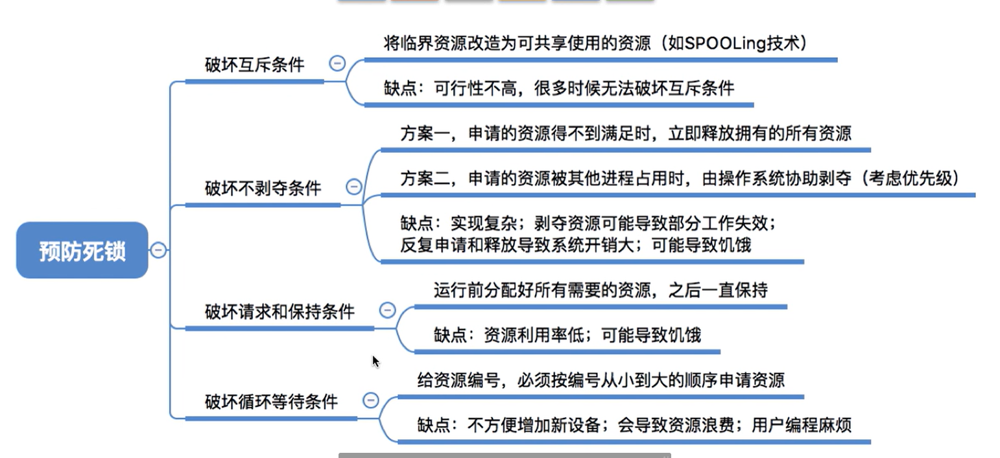

### 2.4_3 死锁的处理策略——避免死锁

动态检测：避免死锁

* 什么是安全序列、不安全状态、死锁的联系

  需要多种资源时，可以用多维向量表示资源数

  

* 如何避免系统进入不安全状态——银行家算法

  初始分配完成后，优先全部分配给最少的，并且拿回资源


### 2.4_4 死锁的处理策略——检测和解除

死锁的检测

1. 用某种数据结构来保存资源的请求和分配信息

   

2. 提供一种算法，利用上述信息来检测系统是否已进入死锁状态

- 请求边分配资源：判断资源剩余数量时，要减去分配边
- 死锁定理：若资源分配图不可完全简化，说明发生了死锁


死锁的解除

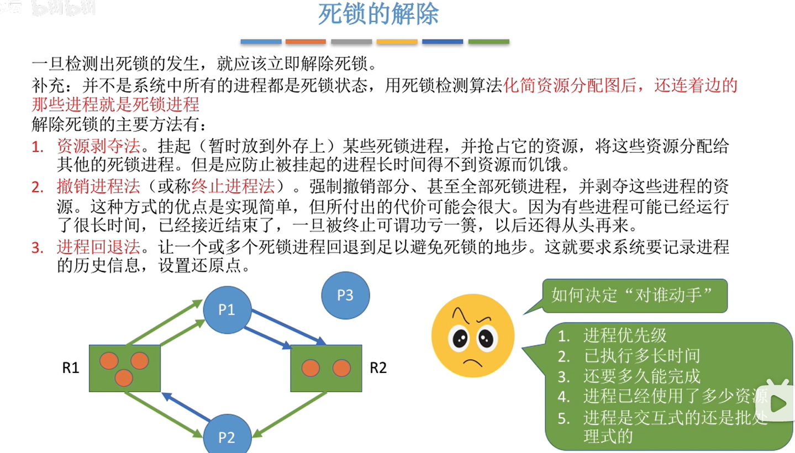

# 3 存储器与虚拟存储器

## 3.1 存储器管理

### 3.1_1 内存的基础知识

1. 什么是内存

- B 字节, b 比特（一个二进制位）-->1B = 8b
- 2<sup>10</sup> = 1K（千），2<sup>20</sup> = 1M（百万，兆），2<sup>30</sup> = 1G（十亿，千兆）


2. 进程运行的基本原理

- 指令的工作原理：操作码+若干参数-->逻辑地址vs绝对地址

- **从写程序到程序运行**：编辑-编译-链接-装入


- **三种链接方式**：静态链接、装入时动态链接、运行时动态链接

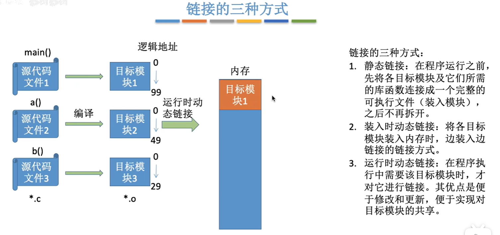

- **三种装入方式**

绝对装入（在编译的时候就知道程序放在内存的哪个位置）-->单道批


静态重定位（装入时将逻辑地址转表为物理地址）-->多道批

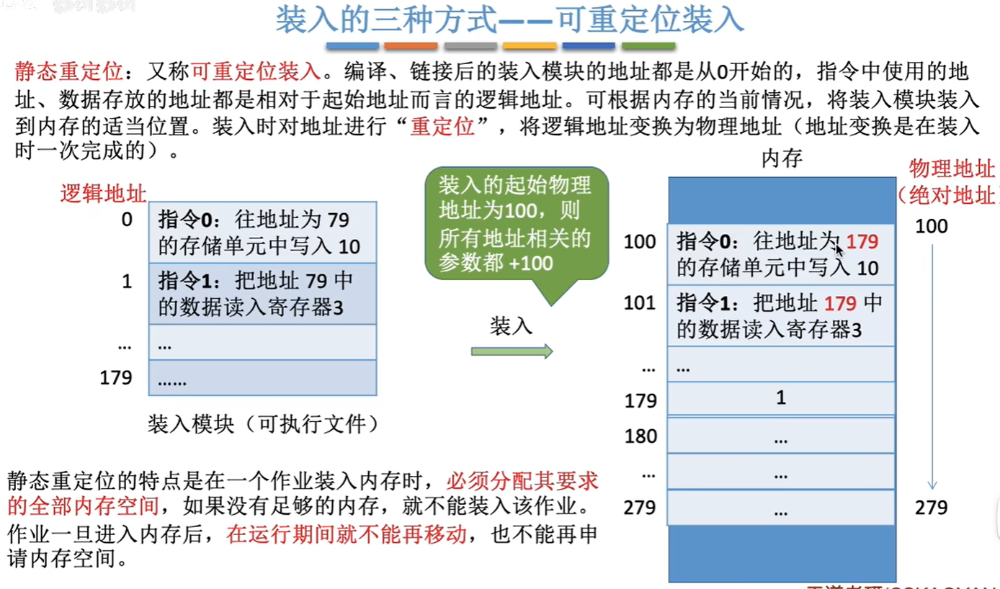

动态重定位（把地址转化推迟到程序真正要执行时才进行）-->现代操作系统

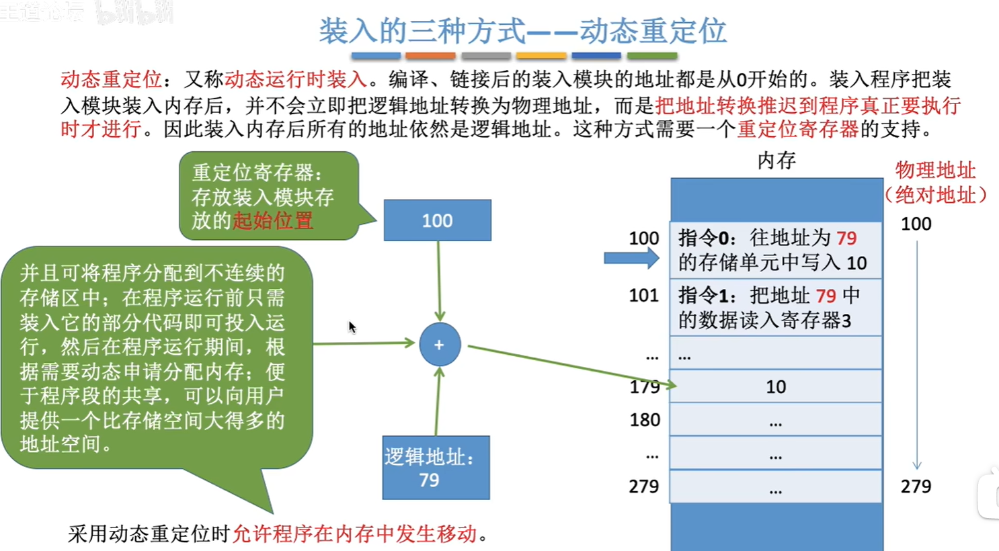

### 3.1_2 内存管理的概念


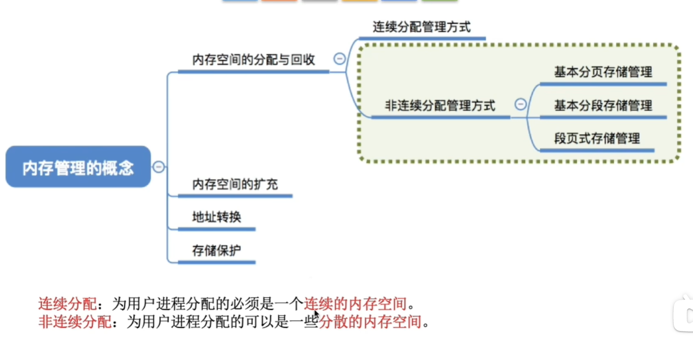

**内存保护**

* 设置上下限寄存器
* 采用重定位寄存器（基址寄存器）和界地址寄存器（限长寄存器）


### 3.1_3 进程的内存映像


### 3.1_3 覆盖与交换

**内存空间的扩充**

**覆盖：**==在同一个程序或进程中==

**交换：** ==在不同的进程或作业之间==

- 覆盖技术：将程序分为多个段，内存分为”固定区“和”覆盖区“，需要常驻的放在”固定区“，==调入后就不再调出==，不常用的段放在”覆盖区“，需要用到时==调入内存，用不到时调出内存==

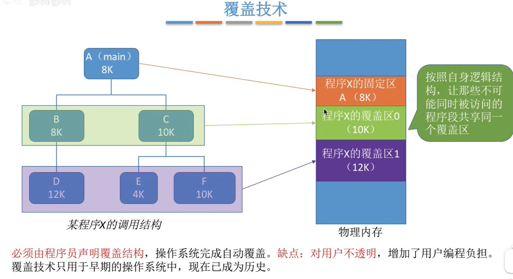

- 交换技术：内存空间紧张时，系统将内存中某些==进程==暂时换出外存，把外存中某些已具备运行条件的进程换入内存（PCB会常驻内存，不会被换出）-->内存调度


- 虚拟存储技术（之后讲）

### 3.1_4 连续分配管理方式

内部碎片：分配给某进程的内存区域中，如果有些部分没有用上

外部碎片：是指内存中的某些空闲分区由于太小而难以利用（如果有外部碎片，可以采用紧凑技术）

- **单一连续分配**：内存被分配为系统区和用户区，系统区在低地址，用户区是一个用户独享


- **固定分区分配**：将用户区分割为若干固定分区给各道程序，分割策略有==分区大小相等==和==分区大小不相等==，可以建议一个分区说明表来管理各个分区-->==无外部碎片==，有内部碎片

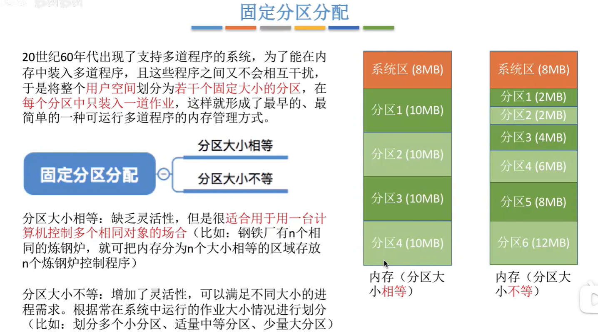

管理方式：


- **动态分区分配**：可变分区分配，不会预先划分内存分区，而是在进程装入内存时，根据进程的大小动态地建立分区，并使分区的大小正好适合进程的需要。-->没内部碎片，但有外部碎片（如果有外部碎片，可以采用紧凑技术）

**数据结构**：空闲分区表/链

数据结构中的分区数据是可变的-->相邻则合并，被占用则更改信息或删除

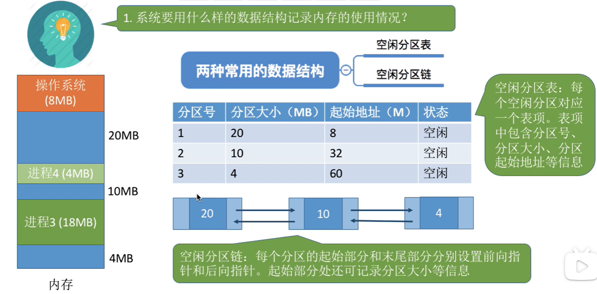

### 3.1_5 动态分区分配算法

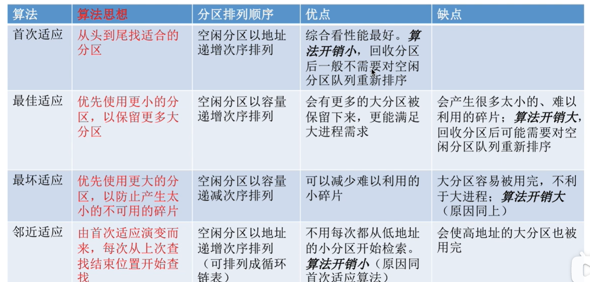

1. **首次适应算法**（First Fit)

**算法思想**：每次从低地址开始查找，找到第一个能满足大小的空闲分区

2. **最佳适应算法**(Best Fit)

**算法思想**：为了保证“大进程”到来时能有连续的大片区域，可以尽可能留下大片的空闲区，优先使用更小的空闲区。

**实现**:空闲分区按==容量==**递增次序**链接。每次分配内存时**顺序查找**空闲分区链/表，找到大小能满足要求的第一个空闲分区-->找到后要更新空闲分区表/链，要根据新的容量大小重新排序

**缺点**：会留下小碎片（外部碎片）

3. **最坏适应算法**(Worst Fit)

**算法思想**：和最佳适应算法相反，按==容量==递减次序排列，每次尽可能用大的分区

**缺点**：每次都选最大的分区进行分配，虽然可以让分配后留下的空闲区更大，更可用，但是这种方式会导致较大的连续空闲区被迅速用完。如果之后有“大进程”到达，就没有内存分区可用了。

4. **邻近适应算法**(Next Fit)

**算法思想**：每次从上次查找结束的位置开始检索，空闲分区以**==地址==递增**的顺序排列-->更新后不用重新排列

**缺点**：大空间容易被用完-->与最坏适应算法相同

###  3.1_6 基本分页存储管理的基本概念


**分页存储基本概念**：

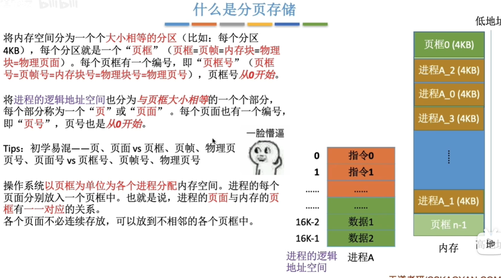

**==页表==项占多大字节：**

页表记录了页面与实际存放点内存块之间的映射关系

一个进程对应一张页表，进程的每一页对应一个页表项，每个页表项由页号和块号组成


将内存分为**大小相等**的小分区“页框”，将用户的进程空间也分为大小相等的一个个区域，以页框的基本单位分配给每个进程片-->页和页框的大小相等

内存块的**起始**地址 = 块号*内存块大小

==页表存储的是页表项(3B)，不是页面，两者占用内存不一样==


**如何实现地址的转换**：

连续存放：物理地址=进程的起始位置+偏移量（逻辑地址）

离散存放：页面物理地址=页面的起始位置（即页表项的块号*页面大小） + 页内偏移量（逻辑地址）-->由于是分页存储，所以一般不需要页表的起始地址，只需要页的块号即可


**如何确定一个逻辑地址对应的页号、页内偏移量：**

- 页面大小不是2的整数幂


- 页面大小为2的整数幂

如果每个页面大小为2<sup>K</sup>B，用二进制数表示**逻辑地址**，则**末尾K位**即为页内偏移量，其余部分就是**块号**。

红色部分为块号，黑色部分为页内偏移量

**物理地址** = 物理块号 + 页内偏移量 <-- 前面可以通过逻辑地址求出物理块号和页内偏移量


**逻辑地址结构：**

**逻辑地址** = 页号 + 页内偏移量 ， 逻辑地址的位数与物理地址相同


==页面大小为2<sup>k</sup>,则页内地址用k位表示，剩余的( 逻辑地址总位数-k )位为页号==

### 3.1_7 基本地址变换机构

在**基本分页存储管理方式**中用于实现逻辑地址到物理地址转换的一组硬件机构

页表寄存器（PTR）：存放页表在内存中的起始地址F和页表长度M。进程未执行时，页表的起始地址和页表的长度放在进程控制块（PCB）中，当进程被调度时，==操作系统==内核会把它们从PCB放到页表寄存器中。-->**==操作系统调用页表访问内存==**

页表长度：页表中的页表项数量

页表项长度：每个页表项占多大的存储空间

页面大小：一个页面占多大的存储地址

**逻辑地址->物理地址的过程：**


过程：


**例题：**


**拓展**


### 3.1_8 具有快表的地址变换机构

1. **什么是快表**（TLB）

快表：又称联想寄存器（TLB），是一种访问速度比内存快很多的高速缓冲存储器，用来存放==cpu当前访问==的若干页表项的副本(在内存中不代表访问)，以加速地址变换的过程。与此对应，内存中的页表常称为慢表。-->TLB**不是内存**

2. **局部性原理**


3. **引入快表后，地址的变换过程**
   - 先查快表，再查慢表
   - 同时查快表和慢表


4. 有无快表的区别


### 3.1_9 两级页表

1. 单级页表存在什么问题？如何解决？

- 所有页表项必须连续存放，页表过大时需要很多个连续的页框

- 在一段时间内并非所有页面都用得到，因此没必要让整个页表常驻内存

==页面大小为2<sup>k</sup>,则页内地址用k位表示，剩余的( 逻辑地址总位数-k )位为页号==


2、两级页表的原理、逻辑地址结构

**原理：**


==**逻辑地址结构**：一级页号+二级页号+页内偏移量==

原本的页号有2<sup>20</sup>,现在为2<sup>10</sup> （一级页表的长度，即二级页表的数目）* 2<sup>10</sup> (每个二级页表的长度)


3、如何实现地址变换？

按照地址结构将逻辑地址拆分成三部分

- 从PCB中读出页目录表始址，根据一级页号查页目录表，找到下一级页表在内存中的存放位置

- 根据二级页号查表，找到最终想访问的内存块号

- 结合页内偏移量得到物理地址


4、两级页表问题需要注意的几个细节

多级页表中，各级页表的大小==不能超过一个页面==。若两级页表不够，可以分更多级

多级页表的访问次数（假设没有快表结构）——N级页表访问一个逻辑地址需要**N+1**次访存

### 3.1_10 基本分段存储管理方式

1. 什么是分段？

进程的地址空间：按照程序自身的逻辑关系划分为若干个段，每段有段名，每段从0开始编址


**==逻辑地址:段号+段内地址==**

段号的位数决定了每个进程最多可以分几个段

段内地址位数决定了每个段的最大长度是多少


2. 什么是段表

**每个段的段长不同，但段表项的长度相同**


3. 如何实现地址变换


4. 分段、分页管理的对比

让各进程的段表项指向同一个内存单元即可实现共享


### 3.1_11 段页式的管理方式

1、分页、分段管理方式最大的优缺点

分页：利用率高，碎片少，不方便进行信息共享和保护

分段：方便信息共享和保护，如果段长大，容易产生外部碎片

2、分段+分页的结合——段页式管理方式


**逻辑地址**


==地址结构是二维的==：段号、页内偏移量

3. 段表、页表

页表长度：页表所含页表项的个数

先访问段表，得到所要段的页表的存放块号；再访问页表，得到页的内存块号；最后访问页

==每个段表项的长度相等，段号是隐含的==


4. 如何实现地址变换


## 3.2 虚拟存储器

### 3.2_1 虚拟内存的基本概念

1. 传统存储管理方式的特征、缺点


2. 局部性原理

* 时间局部性
* 空间局部性
* 高速缓存技术


3. 虚拟内存的定义和特征


4. 如何实现虚拟内存技术

非连续分配


### 3.2_2 请求分页管理方式

1. 页表机制

==逻辑地址结构相同，只是修改了页表项==


2. 缺页中断机构

属于内中断中的故障，可被修复


3. 地址变换机构


**过程**


### 3.2_3 页面置换算法

1. 最佳置换算法（OPT,optimal）

每次选择淘汰的页面是以后永不使用或者在最长时间内不再被访问的页面，这样可以保证最低的缺页率。

无法实现：实际上不知道后面的序列


2. 先进先出置换算法（FIFO）

每次选择淘汰的页面是最早进入内存的页面

Belady异常，当分配的内存块增大时，缺页次数反而增加


3. 最近最久未使用置换算法（LRU，least recently usesd）

每次淘汰最近最久未使用的页面

性能好，最接近最佳置换算法


4. 时钟置换算法（最近未用算法，CLOCK）

简单的：最多经历两轮扫描，初始为1，扫一下为0，再扫一下被踢

访问从队头开始


5. 改进型的时钟置换算法

优先淘汰没有被修改过的，因为没有修改过的不用进行IO操作00->01（改）->00->01


 ### 3.2_4 页面分配策略

1. 驻留集

指请求分页存储管理中给进程分配的物理块的集合

2. 页面分配、置换策略


**细节**


3. 调入页面的时机

预调页策略：一次调用若干个相邻页面，运行前调入

请求调页策略：运行时缺页再调入


4. 从何处调页

对换区：快，采用连续分配方式

文件区：慢，采用离散分配方式


5. 抖动（颠簸）现象

抖动：刚刚换出的页面又要换入内存，刚刚换入的页面又要换出外存-->物理块不够

6. 工作集

指在某段时间间隔里，进程实际访问页面的集合

窗口尺寸为当前访问的页面M  与  M之前的（窗口尺寸-1）个页面


# 4 文件管理和磁盘调度

## 4.1 文件管理

### 4.1_1 初识文件管理


1. 文件的属性


2. 文件内部的数据如何组织？


3. 文件之间如何组织？


4. 操作系统向上提供的功能


5. 文件的物理存储与管理


6. 操作系统提供的其他文件管理功能

- 文件共享：使多个用户共享使用一个文件
- 文件保护：保证不同的用户对文件有不同的操作权限

### 4.1_2 文件的逻辑结构

1. 无结构文件

文件由一系列二进制文件流组成

2. 有结构文件（记录式文件）


- 顺序文件：文件中的记录一个接一个顺序排列，定长或变长，可以顺序存储或者链式存储


**是否能够实现==随机存取==和==快速检索某个关键字==所对应的记录存放的位置:**

只有顺序存储的定长记录可以实现随机存取，其顺序结构可以快速检索关键字


- **索引文件**：索引表本身是定长的顺序文件


- **索引顺序文件**

**检索效率分析：**


**多级索引表嵌套查找**


### 4.1_3 文件目录

1. 文件控制块（FCB）

搜索、创建文件、删除文件、显示目录、修改目录


2. 目录结构

* 单级目录结构


* 两级目录结构

​		主文件目录（MFD）+用户文件目录（UFD）


* 多级目录结构（树形目录结构）

当代操作系统采用方法、不便于文件共享


* 无环图目录结构

  可以共享
  
  
  
  
  
  

3. 索引节点

压缩文件名和信息


### 4.1_4 文件的物理结构（文件分配方式）

1. 文件块、磁盘块

很多操作系统中，磁盘块的大小和页块与内存块的大小相同


2. 文件分配


- **连续分配**

连续分配方式要求每个文件在磁盘上占有一组==连续==的块

优点：支持顺序访问和直接访问（即随机访问）；连续分配的文件在顺序访问时速度最快（磁头）  
缺点：不方便文件拓展；存储空间利用率低，会产生磁盘碎片（多个小物理块区无法被使用）


- **链接分配**

  链接分配采取==离散分配==的方式，可以为文件分配离散的磁盘块。

  * **隐式分配**：采用链接分配方式的文件，只支持顺序访问，不支持随机访问，方便拓展

  

  **总结：**

  

  * **显示分配**：文件分配表显式记录下一块物理块的位置，方便拓展，支持随机访问，文件表会占内存空间

  

  **逻辑块号-->物理块号**

  

  **总结：**

  

- **索引分配**


**逻辑块-->物理块**


**当索引表过大，一个磁盘块放不下时**

==磁盘块和文件块的大小相同==

(1) 链接方案


(2) 多层索引

采用k层索引结构，且==顶级索引表未调入内存==时，访问同一个数据块只需要**k+1**次读磁盘操作                                             


(3) 混合索引


**重点**


### 4.1_5 文件存储空间管理

1、存储空间的划分与初始化


2、几种管理方法

* 空闲表法：同内存管理的动态分区分配类似
  * 怎么分配磁盘块:**为一个文件==分配连续==的存储空间**
  * 如何决定为文件分配那个区间
  * 如何回收磁盘块


* 空闲链表法（空闲盘块链、空闲盘区链）


(1) 空闲盘块链

适用于==离散分配==的物理结构


(2) 空闲盘区链

==连续分配和离散分配==都适用


* 位示图法

==连续分配和离散分配==都适用


**细节**


* 成组链接法：文件卷的目录区中专门用一个磁盘块作为超级块，当系统启动时需要将超级内存块读入内存。并且保证内存与外存中的超级块数据一致。

**如何分配**

需要的空闲块小于第一个分组的块数时：


需要的空闲块等于第一个分组的块数时：


**如何回收**


### 4.1_6 文件的基本操作


1. 创建文件（create）


2. 删除文件(delete)


3. 读文件(read)


4. 写文件(write)


5. 打开文件(open)


**文件表的种类**

系统的打开文件表代表当前所有打开文件的信息


6. 关闭文件(close)


### 4.1_7 文件共享

1. 基于索引结点的共享方式（硬链接）

直接指向文件的索引节点


2. 基于符号链的共享方式（软链接）

相当于win的快捷方式

**总结**


### 4.1_8 文件保护

1. 口令保护


2. 加密保护

保密性强，不需要在系统中存储“密码”

编码/译码，需要花费一定时间


3. 访问控制
   在每个文件的FCB中增加一个访问控制表（ACL），该表记录了各个用户可以对该文件执行哪些操作


### 4.1_9 文件系统的层次结构


**例子**


### 4.1_10 虚拟文件系统

1. 普通文件系统


2. 虚拟文件系统


**特性：**

- 向上层用户进程提供统一标准的系统调用接口，屏蔽底层具体文件系统的实现差异。
- VFS要求下层的文件系统必须实现某些规定的函数功能，如：open/read/write。 一个新的文件系统想要在某操作系统上被使用，就必须满足该操作系统VFS的要求。

**vnode**


**函数功能指针：**


3. 文件系统挂载


## 4.2 磁盘调度

### 4.2_1 磁盘的结构

1. 磁盘、磁道、扇区的概念

扇区到底是整块还是单个磁道？


2. 如何在磁盘中读写数据


3. 盘面柱面的概念、磁盘的物理地址


4. 磁盘的分类

- 按磁头是否可以移动划分


- 按盘片是否可以更换：可换盘磁盘、固定盘磁盘

### 4.2_2 磁盘调度算法

​	1、一次磁盘读/写操作需要的时间

* 寻找时间
* 延迟时间
* 传输时间

==只有寻找时间可以优化==


2、磁盘调度算法


* 先来先服务（FCFS）


* 最短寻找时间优先（SSTF）

优先处理最近的磁道，可能会产生饥饿现象


* 扫描算法（SCAN）-->==若无特殊说明，SCAN为LOOK==	

只有磁头移动到最外侧磁道的时候才能往内移动，移动到最内侧磁道的时候才能往外移动


- LOOK调度算法

如果在磁头移动方向上已经没有别的请求，就可以立即改变磁头移动方向


* 循环扫描算法（C-SCAN）-->==若无特殊说明，C-SCAN为C-LOOK==

返回时直接快速移动至起始端而不处理任何请求


- C-LOOK，如果在磁头移动方向上已经没有别的请求，就可以立即改变磁头移动方向


### 4.2_3 减小磁盘延迟时间的方法

1、寻找时间（寻道时间）：启动磁臂、移动磁头所花的时间

2、延迟时间：将目标扇区转到磁头下面所化的时间

磁头读取一块内容后，需要一小段的时间处理

采用交替编号策略

柱面号在盘面号之前，可以减少磁头移动消耗的时间

错位命名

3、传输时间：读/写 数据花费的时间

### 4.2_4 磁盘的管理

1、磁盘初始化

低级格式化/物理分区

2、引导块

ROM不可修改，ROM中只存放很小的“自举装入程序”

3、坏块的管理

在FAT表上标明（坏块对操作系统不透明）

# 5 输入输出系统

## 5.1 I/O系统

### 5.1_1 I-O设备的概念和分类

1、什么是I-O设备

输入/输出

2、按使用特性分类

- 人机交互的外部设备

- 存储设备

- 网络通信设备

3、按传输速率分类

低速设备、中速设备、高速设备

4、按信息交换的单位分类

块设备、字符设备

### 5.1_2 I-O控制器

1. 功能：


**细节：**


**内存映射IO VS 寄存器独立编制**


### 5.1_3 I-O控制方式


1、程序直接控制方式


轮询：完成一次读/写操作的流程


2、中断驱动方式

每次只会读写一个字，大量的数据会多次中断


**细节**


3、DMA方式：直接存储器存取


**DMA控制器**

实际上传输的是字节-->和为块


**流程与细节**


4、通道控制方式

可以读写一组块


==一个通道可以控制多个io控制器，而一个io控制器可以控制多个设备==


**细节**


### 5.1_4 I-O软件层次结构


1、用户层软件

实现与用户交互的接口，向上提供方便易用的库函数


2、设备独立性软件（设备无关性软件）

- 向上层提供统一的调用接口（read/write）

- 设备的保护：访问权限

- 差错处理：对设备产生的错误进行处理

- 设备的分配与回收

- 数据缓冲区管理：通过缓冲技术屏蔽设备之间数据交换单位大小和传输速度的差异

- 建立逻辑设备名到物理设备名的映射关系；根据设备类型选择调用相应的驱动程序-->通过逻辑设备表实现


3、设备驱动程序（比如打印机驱动）

设置设备寄存器、检查设备状态


4、中断处理程序

进行中断处理


5、硬件

执行IO操作，有机械部件、电子部件组成

### 5.1_5 I-O核心子系统


### 5.1_6 假脱机技术

1、什么是脱机技术，脱机技术可以解决什么问题

脱离主机的控制进行输入/输出控制


SPPOLing系统：必须要有多道程序并发进行

2、假脱机技术的实现原理

* 输入井和输出井
* 输入进程和输出进程
* 输入缓冲区和输出缓冲区

输入井、输出井


输入/输出进程


输入/输出缓冲区


3、共享打印机的原理分析

SPOOLing 技术可以把一台物理设备虚拟成逻辑上的多台设备，可将独占式设备改造成共享设备。

- 独占式设备：只允许各个进程串行使用设备
- 共享设备：允许多个进程“同时”使用的设备


### 5.1_7 设备的分配与回收

1、设备分配时应考虑的因素

- 设备的固有属性：独占设备、共享设备、虚拟设备

- 设备分配算法

- 设备分配中的安全：为进程分配一个设备后就将进程阻塞，本次IO完成后才将进程唤醒


2、静态分配与动态分配

静态分配：进程运行前为其分配全部所需资源、运行结束后归还资源-->预防死锁：破坏了请求和保持

动态分配：运行中动态分配

3、设备分配管理中的数据结构


- 系统设备表SDT，表目：（设备类型、设备标识符、DCT、驱动程序入口）


- 设备控制表DCT（设备类型、设备标识符、设备状态、指向控制器表的指针、重复执行次数或事件、设备队列的队首指针）


- 控制器控制表COCT（控制器标识符、控制器状态、指向通道表的指针设备队列的队首指针、控制器队列的队尾指针）


- 通道控制表CHCT（通道标识符、通道状态、与通道连接的控制器表首址、通道队列的队首指针、通道队列的队尾指针）


4、设备分配的步骤

根据进程请求的==物理设备名==——>设备控制表——>控制器控制表——>通道


5、设备分配步骤的改进方法

建立逻辑设备名和设备的映射


**逻辑设备表**


### 5.1_8 缓冲区管理

1、什么时缓冲区？有什么作用？


**作用**


2、单缓冲

在内存中分配一块缓冲区


**例题**

处理一块时间=max（C,T)+M


3、双缓冲

在内存中分配两块缓冲区

处理一块时间=max(T,C+M)


4、循环缓冲


5、缓冲池

由系统中共用的缓冲区组成。这些缓冲区可以分为：空缓冲队列、装满输入数据的缓冲队列、装满输出数据的缓冲队列


6、使用单/双缓冲在通信时的区别

若两个相互通信的机器设置单缓冲区，则同一时刻只可以实现==单向==的数据传输

若两个相互通信的机器设置双缓冲区，则同一时刻可以实现==双向==的数据传输


