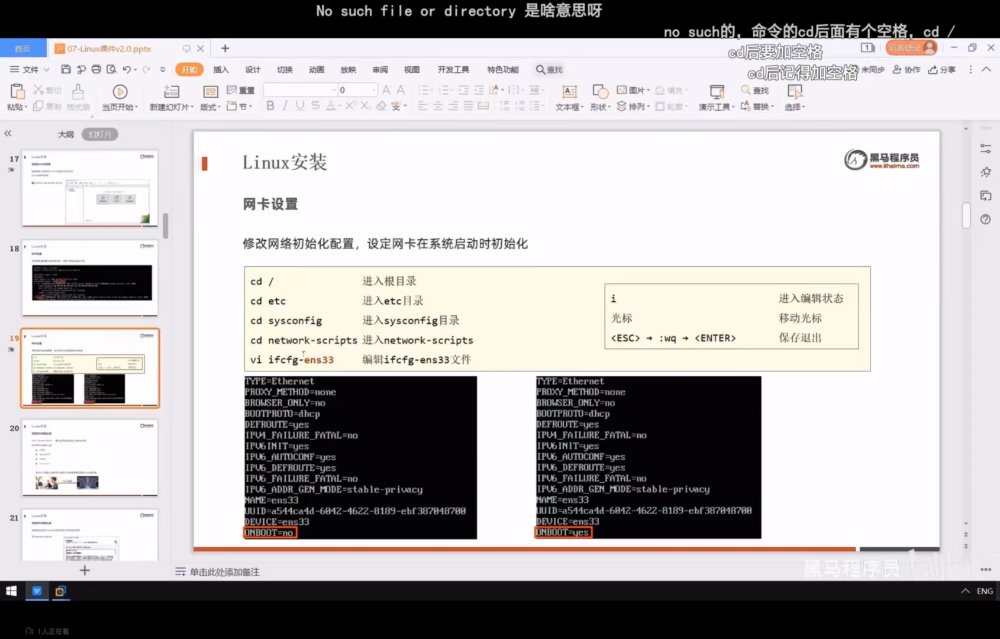
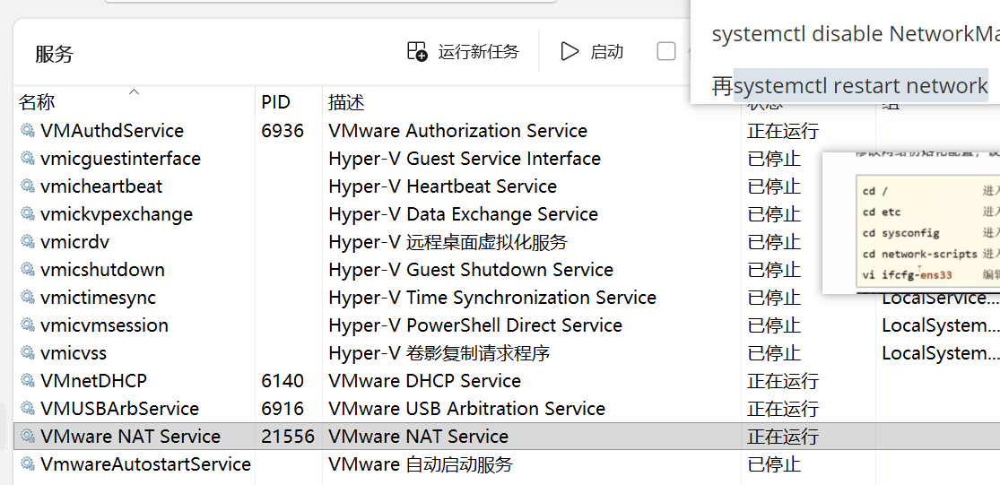

虚拟机打开网络 ens33

**centOS7的NetworkManager存在冲突，它适用于桌面版而不适用于虚拟机**

所以输入以下命令：

systemctl stop NetworkManager.service

systemctl disable NetworkManager.service

再systemctl restart network

如果不行，启动网络服务

asdf
